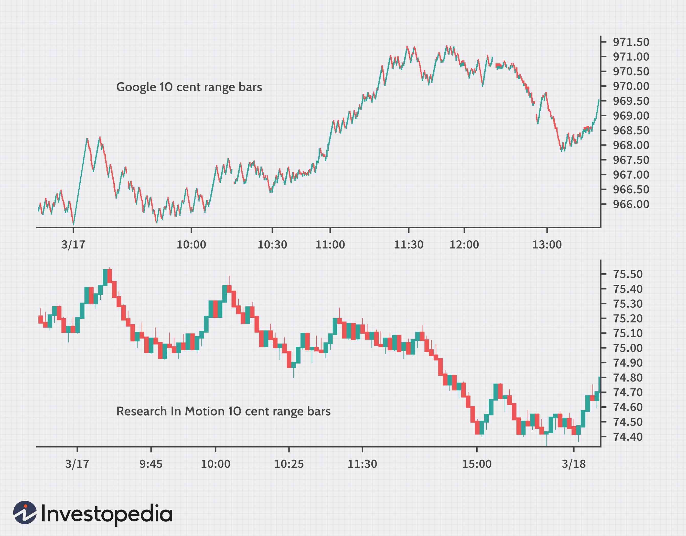

In the rapidly-evolving world of financial markets, innovative tools for analysis and trading are continuously being developed to aid traders in making more informed decisions. Among these tools, range bar charts have emerged as a valuable resource, offering traders a unique perspective on market movements and dynamics. Unlike traditional time-based charts, which may obscure critical market signals with temporal noise, range bar charts are constructed based on price changes alone, allowing traders to focus solely on price movement. This can result in clearer insights that enhance both market analysis and algorithmic trading strategies. 

Range bar charts provide unique benefits in understanding market trends and volatility, as they are formed by plotting bars whenever a specified price range is met, rather than at uniform time intervals. This feature of range bars helps traders filter out irrelevant noise caused by time-based factors, offering a streamlined view of price behavior. As a result, market participants can better discern crucial levels of support and resistance and identify potential trend reversals and continuations.



This article aims to provide a comprehensive overview of range bar charts, exploring their utility in financial market analysis and integration into algorithmic trading systems. By focusing on practical applications and strategies, the article will serve as an informative guide to both seasoned traders and those new to financial markets, looking to leverage the advantages of range bar charts for successful trading outcomes.

## Table of Contents

## Understanding Range Bar Charts

Range bar charts were pioneered by the Brazilian trader Vicente Nicolellis in the mid-1990s as a novel way to visualize financial data. Unlike traditional charting methods that rely on fixed time intervals—such as minute, hour, or day charts—range bars are constructed based on specific price movement criteria. This means a new bar forms only when the price moves a specified range, providing a view centered on price activity rather than the passage of time.

This method yields significant advantages by allowing traders to focus directly on price volatility. Temporal factors and the noise they introduce to market analysis are minimized, which can lead to clearer insights. The concept of range bars can be better understood with a simple example: if the predetermined range is set at $10, a new bar will only appear on the chart each time the asset's price movement—upwards or downwards—reaches a total change of $10. This results in more bars being formed during periods of high volatility and fewer during stable periods.

Nicolellis developed range bar charts to provide traders with a more accurate depiction of price action, which is particularly useful in fast-moving and volatile markets. By focusing exclusively on price changes, range bars help traders better identify market dynamics like trends and reversals that may not be as apparent in time-based charts.

The mathematical and algorithmic basis of range bar charts involves monitoring the cumulative price movement and plotting a new bar only when the specified range is reached. This method can be implemented in Python through a simple pseudocode:

```python
def generate_range_bars(price_data, range_size):
    range_bars = []
    current_bar = {'open': price_data[0], 'low': price_data[0], 'high': price_data[0], 'close': None}

    for price in price_data:
        if abs(price - current_bar['open']) >= range_size:
            current_bar['close'] = price
            range_bars.append(current_bar)
            current_bar = {'open': price, 'low': price, 'high': price, 'close': None}
        else:
            current_bar['low'] = min(current_bar['low'], price)
            current_bar['high'] = max(current_bar['high'], price)

    return range_bars
```

This algorithm processes sequential price data, updating the open, high, low, and close values for each bar to reflect the specified range movement, leading to the creation of new bars under these defined conditions. By using range bar charts, traders can effectively align their analysis and strategies with pure price movements, enhancing their ability to interpret market trends.

## Benefits of Range Bar Charts in Market Analysis

Range bar charts, distinguished by their construction based solely on price movement rather than fixed time intervals, provide traders with a refined tool for market analysis. One of the primary advantages of range bar charts is their capacity to highlight price trends and potential reversals more effectively than traditional time-based charts. This is primarily because range bars eliminate time-related noise and allow traders to focus purely on price action, presenting a clearer picture of underlying market dynamics.

A critical benefit of range bar charts lies in their ability to offer enhanced insights into support and resistance levels. Since range bars are formed solely on price changes, they represent actual shifts in market sentiment, making it easier to identify key levels where price may reverse or consolidate. These levels are crucial for traders aiming to make informed decisions about entry and [exit](/wiki/exit-strategy) points based on the most relevant market data.

Moreover, range bar charts have the flexibility to adapt to changing market conditions. During periods of high [volatility](/wiki/volatility-trading-strategies), the frequency of bar formation increases, providing more detailed information about rapid price movements. Conversely, during calm market conditions, fewer bars are formed, indicating stability or a lack of significant price action. This adaptability allows traders to maintain a consistent analytical approach regardless of market volatility, ensuring their strategies remain relevant and effective.

These characteristics make range bar charts an invaluable asset for traders looking to enhance their market analysis. By focusing exclusively on price movements, traders can streamline their analytical processes, reduce the impact of temporal noise, and better identify genuine market opportunities. As a tool, range bar charts enable a more nuanced understanding of market behavior, which can be particularly advantageous in optimizing trading performance across diverse market conditions.

## Integrating Range Bar Charts in Algorithmic Trading

Algorithmic trading, a domain where precision and adaptability are paramount, benefits significantly from the integration of range bar charts. These charts, which focus on price movements rather than fixed time periods, allow trading algorithms to respond more dynamically to market conditions, thus enhancing strategy robustness.

In the architecture of an [algorithmic trading](/wiki/algorithmic-trading) system, range bar charts can serve as a foundation for the identification of trade setups or triggers. This is typically achieved by configuring algorithms to monitor specific price range movements defined by the range bars. By doing so, traders can systematize their strategies to initiate trades when the price moves a certain amount, independent of the time taken for such a move. This is especially beneficial in markets where price action is more significant than the passage of time.

For example, consider an algorithm designed to execute buy orders when the price of an asset exceeds its previous high by a specified range, $\Delta P$, as identified by the range bar. This logic can be encapsulated in a simple Python pseudocode as follows:

```python
previous_high = None

def check_for_buy_signal(current_price, previous_high, delta_p):
    if previous_high is not None and current_price > previous_high + delta_p:
        execute_buy_order(current_price)

def execute_buy_order(price):
    # Logic to execute a buy order at the given price
    print(f"Buy order executed at {price}")

# Using a stream of price data
for current_price in stream_of_price_data:
    check_for_buy_signal(current_price, previous_high, delta_p)
    if previous_high is None or current_price > previous_high:
        previous_high = current_price
```

The adaptability inherent in range bar charts is crucial for the development of robust trading strategies. Algorithms that utilize these charts can capitalize not only on prevailing trends but also on potential reversals. By concentrating on discrete price intervals, trading systems can maintain consistent operation across varying volatility levels, offering stability and reliability in execution.

Furthermore, the independence from time intervals enhances the responsiveness of algorithms. This responsiveness is vital for traders seeking to exploit market inefficiencies or brief price fluctuations. Importantly, algorithms must be designed to adapt continuously to changing market conditions while maintaining their strategic objectives.

By building trading algorithms around range bar charts, traders can harness a methodological advantage that emphasizes movement over time. This shift in focus, away from time-based constraints, allows for strategies that are not only more aligned with raw market behavior but also more effective in their execution and profitability potential.

## Interpreting Volatility with Range Bar Charts

Range bar charts offer a distinct advantage in interpreting market volatility by focusing on the frequency of bar formation. Unlike traditional time-based charts, which generate bars at fixed intervals, range bar charts produce new bars only when price movements exceed a defined range. This characteristic allows range bar charts to reflect market volatility more sensitively and accurately.

When bars are printed rapidly on a range bar chart, it signifies an increase in market volatility. Such rapid bar formation suggests that prices are moving quickly, creating potential trading opportunities as the market experiences significant price changes. This dynamic representation can help traders identify and exploit short-term price movements and volatility-driven strategies.

Conversely, a slowdown in the formation of bars on a range bar chart signals reduced volatility. This typically indicates that the market is entering a consolidation phase, where price movements are minimal. Traders can anticipate potential breakouts following these consolidation periods, as periods of low volatility often precede significant price moves.

To effectively use range bar charts for volatility assessment, traders should understand the implications of bar frequency changes. Rapid bar formations and the density of bars can be quantified to compute volatility measures, helping traders refine their trading strategies. This sensitivity to actual price changes, not constrained by time-based intervals, makes range bar charts a valuable tool for analyzing market conditions and informing decision-making in volatile environments.

## Challenges and Considerations

Range bar charts, while advantageous, present certain challenges that necessitate careful consideration. One of the primary considerations is the selection of the appropriate range for the bars. This parameter is crucial because it affects how much price movement is needed to form a new bar, thus influencing the granularity of the price action being represented. If the range is set too narrowly, the chart might become overly sensitive, resulting in excessive noise. Conversely, if the range is too wide, significant price movements might be overlooked, potentially missing important signals.

To choose an optimal range, traders should consider the typical volatility of the trading instrument. A practical approach could involve analyzing historical price data to determine an average price movement over a fixed period. Using this data, traders can identify a range that balances detail with clarity. For instance, in Python, one might calculate the average true range (ATR) of an instrument over a set number of periods and use this as a benchmark for setting the range:

```python
import pandas as pd

def calculate_atr(prices, period=14):
    highs = prices['High']
    lows = prices['Low']
    closes = prices['Close']

    high_low = highs - lows
    high_close_prev = (highs - closes.shift()).abs()
    low_close_prev = (lows - closes.shift()).abs()

    tr = high_low.combine(high_close_prev, max).combine(low_close_prev, max)

    atr = tr.rolling(window=period).mean()
    return atr

# Example usage with a DataFrame 'df' containing historical price data
atr_value = calculate_atr(df)
```

Beyond range selection, traders must also consider how range bar charts integrate with their existing analytical tools and techniques. Compatibility with indicators, trendlines, and other charting tools is essential. Some traditional indicators, designed for time-dependent data, may offer different insights when applied to range bars. Traders should verify the reliability and relevance of these tools in the context of range bar charts.

Despite these challenges, when configured correctly, range bar charts can enhance trading strategies by providing clearer signals free from time-based noise. Properly tuned, they permit traders to capitalize on meaningful price changes while filtering out extraneous market information, leading to potentially more robust trading performance.

## Conclusion

Range bar charts provide a distinct approach to market analysis by concentrating exclusively on price movement. This emphasis allows traders to sidestep the distractions posed by time-based fluctuations, offering a clearer view of price dynamics. For both discretionary and algorithmic traders, range bars serve as a crucial tool, enhancing the analytical process by focusing on pure price action. These charts facilitate more precise and agile responses to market changes, a feature that becomes increasingly pivotal as traders integrate advanced technologies into their strategies. The adaptability of range bars is particularly beneficial in unpredictable and volatile market conditions, where traditional time-based charts might obscure critical price signals due to temporal noise.

By filtering out this noise, range bar charts enable traders to focus on the essential market signals, leading to improved decision-making processes. As a result, traders can develop more effective trading strategies that are responsive to both trends and reversals. The clarity provided by range bars ensures that traders are better positioned to anticipate market movements, thereby increasing the likelihood of successful trading outcomes. Whether used in isolation or alongside other analytical tools, range bar charts have the potential to enhance a trader's performance across a variety of market conditions. This makes them an invaluable component for traders looking to refine their approach and achieve greater success in financial markets.

## References & Further Reading

[1]: Nicolellis, V. (1994). ["Range Bar Trading: Technical Analysis Beyond Time"](https://www.scribd.com/document/507312714/Range-Bars).

[2]: Sierra, J. (2010). ["Trading with Range Bars."](https://www.investopedia.com/articles/trading/10/range-bar-charts-different-view.asp)

[3]: Aronson, D. (2006). ["Evidence-Based Technical Analysis: Applying the Scientific Method and Statistical Inference to Trading Signals."](https://www.amazon.com/Evidence-Based-Technical-Analysis-Scientific-Statistical/dp/0470008741)

[4]: Lopez de Prado, M. (2018). ["Advances in Financial Machine Learning."](https://books.google.com/books/about/Advances_in_Financial_Machine_Learning.html?id=oU9KDwAAQBAJ)

[5]: Jansen, S. (2018). ["Machine Learning for Algorithmic Trading."](https://searchworks.stanford.edu/view/13246850)

[6]: Chan, E. P. (2008). ["Quantitative Trading: How to Build Your Own Algorithmic Trading Business."](https://github.com/ftvision/quant_trading_echan_book)