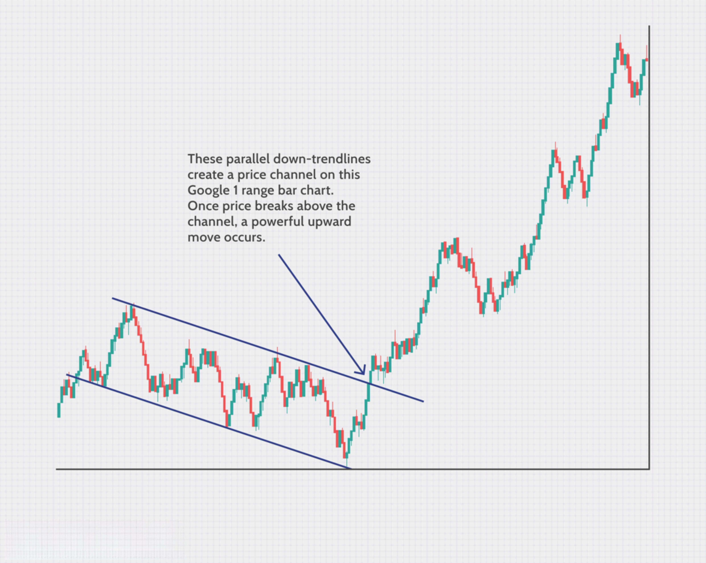

In algorithmic trading, choosing the appropriate chart type is a critical factor that can significantly influence trading outcomes. Traditional time-based charts, such as candlestick and bar charts, have long dominated the trading landscape. However, range bars present a compelling alternative that traders should consider. Unlike conventional charts, range bars are constructed based on price movement rather than time. This approach provides a fresh perspective on market activity, allowing traders to focus solely on the fluctuations in price action.

Range bars differ fundamentally from traditional chart types by eliminating the element of time in chart creation. In traditional charts, price information is plotted at regular time intervals, creating bars or candles at predefined time points regardless of price movement. For instance, a daily candlestick chart would create a new candle each day, even if there was minimal price change. Range bars, on the other hand, generate a new bar only when price moves by a predetermined amount set by the trader. This characteristic can filter out insignificant price movements and provide a clearer view of significant price action.



In the ensuing discussion, we will explore the characteristics of range bars, their historical origin, and strategies to effectively use them in algorithmic trading. Range bars offer unique advantages for traders aiming to capitalize on price trends and market momentum. By focusing exclusively on price dynamics, traders can leverage range bars to better identify trading opportunities and enhance their trading strategies.

## Table of Contents

## What are Range Bars?

Range bars are a type of chart that emphasizes price fluctuations over time intervals. Unlike traditional time-based charts, a new range bar is introduced only when the price changes by a predetermined amount. This threshold is set by the trader, which allows the chart to automatically adjust to market volatility. As such, range bars are particularly adept at filtering out market noise, presenting a cleaner visualization of significant price actions.

This unique approach of ignoring time-based intervals results in a chart that solely relies on price action. Each bar equals a specific range of price movement, providing traders with a streamlined view of the market. This characteristic simplifies the identification of trends and potential trading opportunities, as it highlights significant price movements while discounting minor fluctuations. For example, if a trader sets a range bar size to 10 points, a new bar will form each time the price moves 10 points, regardless of the time it takes to reach that movement.

The independence from time allows for a clearer focus on market dynamics, helping traders to better discern market conditions and potential entry and exit points. This can be particularly advantageous for strategies that rely heavily on price action, such as trend following or breakout trading, where understanding the direction and strength of price movements can greatly affect trading outcomes. By reducing noise and emphasizing relevant price changes, range bars can help traders more effectively analyze market trends and make informed decisions.

## Origin and History of Range Bars

Range bars were conceptualized and developed by Vicente Nicolellis, a Brazilian trader, during the 1990s. Nicolellis's motivation for creating range bars arose from the challenges he faced in trading under volatile market conditions. Traditional time-based charts often muddled the clarity of price movements, incorporating distracting elements that could lead traders away from the core patterns of price action and [momentum](/wiki/momentum).

The defining characteristic of range bars is their reliance solely on price movements to form new bars, unlike conventional charts that are dependent on time intervals. This approach was a significant departure from standard charting methods and aimed to provide a clearer picture of market trends by eliminating the noise associated with time-based fluctuations. By focusing exclusively on price action, traders can concentrate on the directional trends and momentum that matter most in trading decisions.

Nicolellis's innovation was particularly influential because it addressed a common issue faced by traders: the distortion caused by time elements in identifying genuine market trends. By removing the temporal component, range bars allowed for a purer analysis of price movements, facilitating more informed and strategic trading decisions. This method quickly gained traction among traders who sought an alternative way to understand market dynamics, particularly in environments characterized by significant [volatility](/wiki/volatility-trading-strategies).

## Trading Strategies Using Range Bars

Range bars present a unique charting option for developing trading strategies by focusing exclusively on price movements. This approach allows traders to refine their strategies by eliminating irrelevant market noise that is often present in time-based charts. Three prevalent strategies that traders use with range bars are [trend following](/wiki/trend-following), momentum trading, and [breakout](/wiki/breakout-trading) trading.

**1. Trend Following**

Trend following with range bars simplifies the process of identifying and analyzing persistent trends. Range bars inherently filter out minor price fluctuations, which allows traders to more easily recognize the underlying trend direction. This method is highly effective for traders who employ moving averages or trendlines. For example, a moving average crossover strategy can be enhanced by using range bars; since minor fluctuations are filtered, the crossover signals generated tend to represent more significant market movements. Using Python, the following code snippet demonstrates a simple moving average crossover strategy using range bars:

```python
import pandas as pd
import matplotlib.pyplot as plt

def moving_average_crossover(data, short_window, long_window):
    data['Short_MA'] = data['Close'].rolling(window=short_window).mean()
    data['Long_MA'] = data['Close'].rolling(window=long_window).mean()

    signals = pd.DataFrame(index=data.index)
    signals['Signal'] = 0.0
    signals['Signal'] = np.where(data['Short_MA'] > data['Long_MA'], 1.0, 0.0)
    signals['Position'] = signals['Signal'].diff()

    return signals

# Assuming 'range_bar_data' is a DataFrame of range bars
signals = moving_average_crossover(range_bar_data, short_window=5, long_window=20)

# Visualize the signals
plt.figure(figsize=(10,5))
plt.plot(range_bar_data['Close'], label='Price')
plt.plot(signals['Short_MA'], label='Short Moving Average')
plt.plot(signals['Long_MA'], label='Long Moving Average')
plt.legend(loc='best')
plt.show()
```

**2. Momentum Trading**

In momentum trading, swing traders utilize range bars to identify significant support and resistance levels. This approach is particularly efficient for timing entries and exits on pullbacks. Range bars highlight key levels by forming distinct patterns at these price levels, allowing traders to make informed decisions. The absence of time as a [factor](/wiki/factor-investing) results in clearer signals for momentum shifts, which are crucial for swing trading strategies.

**3. Breakout Trading**

Range bars are excellent for breakout trading strategies. They simplify price patterns and help eliminate false breakouts, which are often misleading in time-based charts. When price breaks above a designated range, it often signifies a strong momentum shift. Traders can utilize range bars to set more accurate stop-loss and take-profit levels, minimizing false signals. For instance, if a range bar breaks above a predefined resistance level, a trader might enter a long position, expecting a continuation of the upward trend.

In conclusion, the utilization of range bars across these trading strategies enables traders to focus on essential price movements and trend dynamics, improving the strategic execution of trades. Their ability to filter market noise and highlight significant price actions make range bars a critical tool for [algorithmic trading](/wiki/algorithmic-trading).

## How to Read Range Bar Charts

Reading a range bar chart requires an understanding of its unique construction, where each bar is defined by a specific price movement rather than time intervals. This approach allows for a clearer representation of price action and helps in simplifying the identification of trends and support/resistance levels, which are crucial for developing effective trading strategies.

In range bar charts, every bar is formed once the price has moved a specified amount, which is pre-defined by the trader. For instance, if the trader sets a range size of $10, a new bar is formed each time the price moves $10 up or down from the closing price of the last bar. This method of charting highlights genuine price movements without the influence of time, providing clarity by filtering out market noise.

Key levels of support and resistance are more easily identifiable using range bar charts. Since these levels are based solely on price movements, traders can spot where prices consistently struggle to move beyond a certain point (resistance) or fail to drop below a certain point (support). Identifying these levels can inform trading decisions, such as entering or exiting positions, setting stop losses, or determining potential breakout points.

Analyzing bullish or bearish bars within range bar charts can indicate potential shifts in market momentum. A bullish bar forms when the price closes significantly higher than its opening, while a bearish bar forms when the closing price is substantially lower than the opening. Recognizing these patterns allows algorithmic traders to discern market sentiment and adjust strategies accordingly. For example, a series of consecutive bullish bars might signal an uptrend, prompting traders to consider long positions.

Algorithmic strategy development benefits greatly from the clarity provided by range bars. Since the focus is on price movement, algorithms can be designed to react to precise shifts in price, optimizing entry and [exit](/wiki/exit-strategy) points. Code can be implemented to monitor changes efficiently. Here's a simple Python code snippet illustrating how to identify a bullish or bearish range bar:

```python
def identify_range_bar(open_price, close_price):
    """Identify if the bar is bullish or bearish."""
    if close_price > open_price:
        return "Bullish"
    elif close_price < open_price:
        return "Bearish"
    else:
        return "Neutral"

# Example usage
open_price = 100
close_price = 110
bar_type = identify_range_bar(open_price, close_price)
print(f"The range bar is {bar_type}.")
```

In conclusion, range bar charts offer a streamlined method for interpreting price action, focusing solely on market dynamics. By removing time from the equation, traders can better discern key trends and price levels, enhancing the precision of their trading strategies.

## Range Bars vs. Traditional Chart Types

Traditional chart types, such as candlestick and bar charts, are predominantly based on time intervals. This means that a candlestick, for example, forms at fixed durations, such as one minute, one hour, or one day, regardless of how much price movement occurs within that time. This time-based approach provides a continuous stream of data, useful for capturing market rhythms but potentially cluttered with noise during periods of low volatility.

Range bars, in contrast, completely detach from the dimension of time and focus solely on price movement. A new range bar is formed only after the price moves by a specified amount, as set by the trader, which can help in filtering out insignificant price movements and highlighting substantial market shifts. This characteristic results in a clearer depiction of price dynamics, particularly advantageous during volatile market periods when frequent noise can obscure meaningful trends.

For example, in traditional candlestick charts, a period of low activity can lead to multiple bars that indicate little to no price fluctuation, cluttering the chart with no actionable data. Range bars, however, would remain stagnant during such periods, as no new bar would form without significant price movement. Thus, they inherently reduce noise and concentrate on critical price changes, providing traders with a refined view of genuine price action.

When comparing the two types, traders must consider their strategy objectives. Range bars offer a cleaner and possibly more intuitive illustration of market trends, which can lead to more accurate identification of support and resistance levels. This can be especially beneficial for strategies centered around trend following and breakout tactics.

Ultimately, the choice of chart type should align with the trader's goals. If a trader seeks to capture every market rhythm, traditional time-based charts may be more suitable. On the other hand, for those who aim to eliminate noise and focus on key movements, range bars might be the optimal choice. The decision hinges on whether the precision of price action or the comprehensive coverage of time-based data better serves a trader's strategy, particularly during highly volatile market conditions where range bars may offer more clarity.

## Pros and Cons of Using Range Bars

Range bars present clear advantages to traders by filtering out minor price fluctuations and helping to focus on significant trends. This focus on price movement instead of time-based intervals simplifies the identification of trends and key levels of support and resistance. As each bar represents a specified price range, traders can customize range sizes to align with individual trading strategies and varying market conditions. This customization allows for more precise trading strategies that can adapt to a range of market environments, from calm to highly volatile periods.

The flexibility of adjusting the range size provides an opportunity to tailor trading approaches to current market conditions. For instance, wider range bars might be more useful in volatile markets to reduce noise, while narrower ones could be beneficial during stable periods to capture smaller price movements.

However, one challenge traders face is determining the optimal range size for specific market conditions. An inappropriate range size can either result in excessive noise, if too small, or a loss of valuable market information, if too large. Selecting the correct range size often involves a trial-and-error approach or rigorous [backtesting](/wiki/backtesting) to identify the most effective configuration for a particular trading strategy.

Another limitation is that not all trading platforms support range bar charts natively. While some platforms integrate range bars into their offerings, others might require additional plugins or custom indicators. This lack of universal support can limit accessibility for traders who prefer certain platforms or who might not have the technical expertise to implement range bars on unsupported systems. 

Overall, while range bars offer enhanced clarity in trend analysis, traders must carefully consider the challenges and limitations associated with their use to fully leverage their potential in algorithmic trading.

## Example of a Range Bar Trading Strategy

In a practical application of range bar trading, let's consider a scenario where a trader has identified a strong resistance level on a financial instrument's chart. The resistance level is a price point that the asset has had difficulty surpassing previously, indicating potential selling pressure. 

As the price approaches this resistance level, the trader notices the formation of a bearish range bar. A bearish range bar suggests that the selling pressure has overcome buying interest within the predetermined price range, signaling a possible reversal or continuation of a downtrend. Upon this observation, the trader may decide to initiate a short position, anticipating a price decline.

To manage risk and optimize the trade, the trader then employs a strategy of trailing stop losses using subsequent range bars. Trailing stop losses involve adjusting the stop-loss order as the trade becomes profitable, locking in gains while allowing the position to benefit from further price movements in the trader's favor. 

By monitoring the formation of successive bearish range bars, the trader can dynamically adjust the stop-loss level, maintaining it slightly above recent highs suggested by newly formed bearish bars. This method not only protects profits but also provides flexibility in reacting to market changes.

For instance, consider the following pseudo-code for trailing stop-loss adjustment in Python:

```python
# Pseudo-code for trailing stop-loss using range bars
def update_trailing_stop(current_price, entry_price, range_size, stop_loss_level):
    # Set the initial stop-loss level above the entry price for a short position
    if current_price < entry_price - range_size:
        new_stop_loss = current_price + range_size

        # Update stop-loss if the new stop-loss is lower than the previous one
        if new_stop_loss < stop_loss_level:
            stop_loss_level = new_stop_loss

    return stop_loss_level

# Example usage
entry_price = 150.00
current_price = 148.00
range_size = 0.5
initial_stop_loss = 150.5

# Update stop-loss
stop_loss = update_trailing_stop(current_price, entry_price, range_size, initial_stop_loss)
```

In implementing such strategies, traders benefit from the clarity that range bars provide on price movements, enabling more precise entries, exits, and risk management compared to traditional time-based charts.

## Backtesting Range Bar Strategies

Backtesting range bar strategies requires a systematic approach to ensure accuracy and efficacy in trading models. First, selecting an appropriate trading platform that supports range bars is essential. Platforms like Amibroker can offer sophisticated visualization tools, though they necessitate access to specialized range bar data. 

Defining the correct range size is crucial and should reflect the market's volatility. A common approach is to analyze historical price movement and volatility levels to determine a reasonable range size. For example, one could calculate the average true range (ATR) over a specified period and use it as a benchmark for setting the range bar size.

```python
import numpy as np
import pandas as pd

def calculate_atr(df, period=14):
    df['H-L'] = df['High'] - df['Low']
    df['H-C'] = np.abs(df['High'] - df['Close'].shift(1))
    df['L-C'] = np.abs(df['Low'] - df['Close'].shift(1))
    tr = df[['H-L', 'H-C', 'L-C']].max(axis=1)
    atr = tr.rolling(window=period).mean()
    return atr

# Example usage:
# df is a DataFrame containing 'High', 'Low', and 'Close' price data
atr_value = calculate_atr(df)
desired_range_size = atr_value.iloc[-1]
```

Once a range size is set, backtesting involves comparing performances between strategies using range bars versus those based on traditional time-dependent charts. This comparison can highlight how well the range bar strategy captures price movements and reacts to market conditions relative to time-based strategies.

Moreover, backtesting should consider large datasets over extended periods to account for various market conditions. Metrics such as profit factor, maximum drawdown, and Sharpe ratio should be analyzed to evaluate the robustness of range bar strategies.

Finally, practitioners must ensure they obtain accurate range bar data, either through direct market data feeds that support range calculation or through manual data modification, to ensure reliability in backtesting exercises.

## Conclusion

Range bars provide an innovative trading approach that transcends the limitations imposed by time-based charting methods, offering a focus solely on price movement. This particular characteristic allows traders to gain a more refined perspective on market dynamics. By decoupling charts from time, range bars enable traders to concentrate on significant price changes, thus simplifying trend analysis and enhancing trade clarity. This attribute can be especially advantageous for algorithmic traders who seek to refine their strategies and improve their decision-making processes.

Incorporating range bars as a component of one's trading strategy can be an effective way to better manage market volatility. During volatile periods, traditional charts can clutter trading insights with superfluous data, but range bars filter these fluctuations, presenting only the substantial moves that matter. This simplification helps in deciphering the underlying trends more clearly, which can be critical for successful trading outcomes.

To optimize returns in a volatile market landscape, traders should consider integrating range bars into their trading arsenal. By doing so, they can focus more on meaningful price actions, thereby optimizing their entry and exit strategies. The integration of range bars allows for a tailored approach, enabling traders to adjust their strategies based on specific market conditions, ultimately leading to more informed and successful trading decisions.

## References & Further Reading

[1]: Nicolellis, V. (2004). ["Explorando o Mercado Com Gann"](https://pt.wikipedia.org/wiki/Miguel_Nicolelis). Paradoxia.

[2]: Chande, T. S. (2014). ["Beyond Technical Analysis: How to Develop and Implement a Winning Trading System"](https://www.amazon.com/Beyond-Technical-Analysis-Develop-Implement/dp/0471415677) by Tushar S. Chande. Wiley.

[3]: Aronson, D. (2007). ["Evidence-Based Technical Analysis: Applying the Scientific Method and Statistical Inference to Trading Signals"](https://www.amazon.com/Evidence-Based-Technical-Analysis-Scientific-Statistical/dp/0470008741). Wiley.

[4]: Kludt, J., & Wegener, G. (2009). ["Neue Wege in der Technischen Analyse: Range-Renko-Kagi"](https://geo.libretexts.org/Bookshelves/Geology/Geology_(Lumen)/05%3A_Plate_Tectonics/5.04%3A_Reading-_Wegener_and_the_Continental_Drift_Hypothesis). FinanzBuch Verlag.

[5]: Prado, M. L. de. (2018). ["Advances in Financial Machine Learning"](https://www.amazon.com/Advances-Financial-Machine-Learning-Marcos/dp/1119482089). Wiley.

[6]: Jansen, S. (2020). ["Machine Learning for Algorithmic Trading"](https://github.com/stefan-jansen/machine-learning-for-trading). Packt Publishing.

[7]: Chan, E. P. (2009). ["Quantitative Trading: How to Build Your Own Algorithmic Trading Business"](https://github.com/ftvision/quant_trading_echan_book). Wiley.