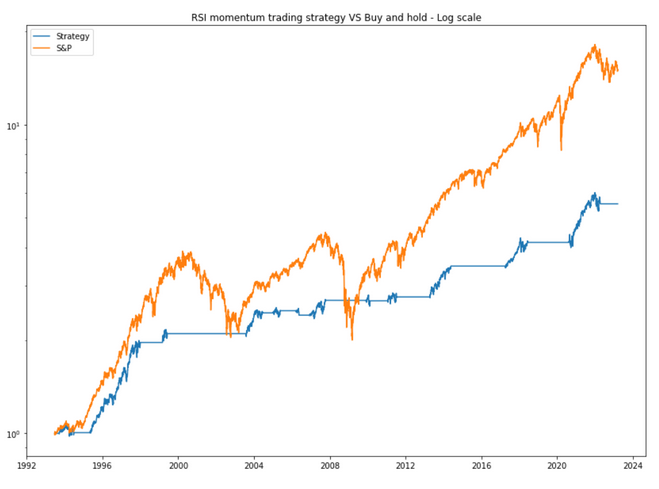

Understanding the dynamics of financial markets is crucial for successful trading. Among various market conditions, the range-bound market presents unique opportunities and challenges, especially in algorithmic trading. In financial markets, a range-bound condition occurs when a security's price oscillates within a certain range, defined by levels of support and resistance. This type of market environment contrasts with trending markets, where prices move in a distinct upward or downward trajectory. In a range-bound setting, traders can repeatedly exploit the fluctuations by buying at the support level and selling at the resistance level.

Algorithmic trading, which utilizes automated computational systems to execute trades based on pre-established criteria, is particularly suited to tackle the conditions of a range-bound market. This is due to its ability to quickly and effectively respond to the recurring price movements typical of such markets. The algorithms can be designed to consistently identify price points at the upper and lower boundaries of the range, facilitating precise and timely trade executions without the delays typically associated with human decision-making.



This article aims to equip traders with insights and strategies to effectively navigate range-bound markets, thereby optimizing their decision-making processes and improving trading performance. By exploring the mechanics of range-bound trading and its integration with algorithmic trading, we provide a comprehensive overview of strategies and tools that can enhance profitability. 

Algorithmic trading, known for its speed and precision, offers both advantages and complexities when applied to range-bound conditions. While it can successfully capitalize on predictable price movements within a confined range, the challenge lies in the need for algorithms to dynamically adapt to market fluctuations and potential breakout scenarios. Therefore, a substantial part of the discussion will focus on identifying appropriate strategies and technical indicators, such as moving averages and relative strength index (RSI), that are vital for developing robust range-bound trading algorithms.

Finally, the objective is to further traders' understanding of range-bound market dynamics in the context of algorithmic trading. By illustrating effective strategies and tools, this article intends to help traders maximize profitability through systematic and automated approaches.

## Table of Contents

## What is a Range-Bound Market?

A range-bound market is distinguished by the movement of a security's price between two defined levels, known as support and resistance. This trading environment is devoid of a definitive upward or downward trend, instead featuring oscillating price actions within a confined space. Such conditions provide traders with opportunities to profit repeatedly by purchasing securities at their lower levels (support) and selling them when they reach their higher levels (resistance).

Support refers to a price level where a downtrend can be expected to pause due to a concentration of demand or buying interest. Resistance, on the other hand, is a price level where an uptrend can be expected to pause due to a concentration of supply or selling interest. These levels are pivotal in defining the boundaries of a range-bound market.

Range-bound markets often arise during periods of indecision among market participants or can represent a temporary pause in an existing trend. This can occur when the forces of supply and demand are evenly matched, preventing the price from breaking out into a new trend. Identifying these levels of support and resistance is crucial for traders aiming to capitalize on a range-bound market. Traders need to accurately interpret these levels to execute trades that align with anticipated price reversals. This involves technical analysis methods to determine these levels reliably and thereby ensure more precise entry and [exit](/wiki/exit-strategy) points for trades.

Understanding the mechanics of a range-bound market condition allows for the development of strategies to exploit the cyclical nature of price movements. By recognizing potential support and resistance zones, traders can effectively implement strategies that involve buying near the support level and selling near the resistance level, capitalizing on the recurrent price patterns inherent in range-bound markets.

## Algorithmic Trading and Range-Bound Markets

Algorithmic trading involves the use of automated systems to execute trades based on pre-set rules and strategies. These systems are particularly effective in range-bound markets, where price movements often follow predictable patterns. Range-bound markets are characterized by a security's price moving between established levels of support and resistance. This cyclical activity allows automated systems to exploit price fluctuations by executing trades with precision.

Automated algorithms have the advantage of speed and efficiency, allowing them to swiftly detect price touches at support and resistance levels and respond accordingly. By removing the delay inherent in human decision-making, they can capitalize on these opportunities before market conditions change. This speed is vital in maximizing the risk-to-reward ratio, which is a critical component of successful trading.

The design of range-bound strategies in [algorithmic trading](/wiki/algorithmic-trading) centers on precise entry and exit points. Algorithms can be programmed to execute trades when prices approach defined thresholds, a process which can be illustrated through a simple conditional logic structure:

```python
def range_bound_strategy(price, support_level, resistance_level):
    if price <= support_level:
        execute_buy_order()
    elif price >= resistance_level:
        execute_sell_order()
```

However, to sustain profitability, algorithms must also be adept at identifying and reacting to [breakout](/wiki/breakout-trading) conditions. Breakouts occur when price breaches support or resistance levels, indicating a potential end to the range-bound phase. Failure to recognize breakouts can lead to significant losses, as previously reliable trading signals become obsolete.

The integration of technical indicators, such as the Relative Strength Index (RSI) or moving averages, further enhances the decision-making ability of these algorithms. These indicators provide additional layers of confirmation and reduce the likelihood of false signals. For instance, combining RSI with moving averages can help an algorithm validate entry and exit points, adjusting its strategy based on market [momentum](/wiki/momentum).

An algorithm's success in range-bound markets often hinges on the fine-tuning of its parameters to optimize indicator usage and entry/exit timing. Through a combination of precise programming, indicator integration, and continuous market analysis, algorithmic trading can effectively capitalize on the opportunities presented by range-bound conditions.

## Designing Range-Bound Strategies for Algo Trading

When designing strategies for algorithmic trading in range-bound markets, the primary objective is to harness the predictable fluctuations between support and resistance levels. This approach enables traders to profit from repeated and more defined price movements.

A widely adopted method in range-bound markets is mean reversion. This strategy relies on the assumption that prices will revert to their mean or average over time, particularly when they reach extreme highs or lows within the range. By anticipating these price reversals, traders can position themselves to buy when prices are near support levels and sell when they are at resistance levels. To enhance the accuracy of these predictions, traders often employ technical indicators.

Bollinger Bands, for instance, are instrumental in identifying potential reversal points. They consist of a middle band (usually a simple moving average) and two outer bands, which are typically set at standard deviations away from the midline. When the price touches or breaches the outer bands, it may indicate that the market is oversold or overbought, signaling a potential reversal. Similarly, the Relative Strength Index (RSI) provides insights into the market's momentum, indicating when an asset is overbought or oversold through its scale of 0 to 100.

Another key indicator is the moving average, which can be used to smooth out price data by creating a continuously updated average price. Simple Moving Averages (SMA) or Exponential Moving Averages (EMA) help in identifying support and resistance levels, as well as potential reversal zones by highlighting the average direction of the price.

In addition to these strategies, setting stop-loss and take-profit orders plays an essential role in risk management. A stop-loss order ensures that a trading position is closed if the price moves against the anticipated direction, preventing substantial losses from unexpected breakouts. Conversely, a take-profit order indicates a predetermined price level at which a trade should be closed to secure gains. Automated trading systems can execute these orders precisely, maintaining discipline and minimizing emotional interference in trading decisions.

Before deploying any strategy, thorough [backtesting](/wiki/backtesting) is crucial to ensure its effectiveness across different market conditions and timeframes. Backtesting involves applying the trading strategy to historical data to evaluate its performance, allowing traders to refine algorithm parameters. This process helps traders to adjust their models in response to varying market dynamics and ensures that their strategies are robust and adaptive.

The integration of these well-defined strategies with precise technical indicators and robust testing can lead to more effective range-bound trading strategies, maximizing profit potential while minimizing risks. The focus remains on systematic analysis and strategic refinement, leveraging technology to execute strategies with precision and efficiency.

## Challenges and Risk Management

Algorithmic trading in range-bound markets, while potentially profitable, presents several challenges that necessitate careful risk management. A prominent issue is the occurrence of false breakouts. These are temporary breaches of support or resistance levels which can be misleading. Traders may interpret these moves as the beginning of a trend, triggering trades that may quickly reverse, resulting in unnecessary losses. To mitigate such risks, traders often employ algorithms with sophisticated filters that discern genuine breakouts from false ones by incorporating additional confirmation indicators or criteria.

Liquidity problems can also affect algorithmic trading strategies, particularly when dealing with instruments that have lower trading volumes. Insufficient [liquidity](/wiki/liquidity-risk-premium) might lead to slippage, where the executed trade price differs from the expected price, potentially eroding profits. To address this, traders might implement liquidity-adjusted metrics within their algorithms that [factor](/wiki/factor-investing) in current market depth and trading [volume](/wiki/volume-trading-strategy), optimizing execution strategies to minimize slippage and avoid adverse price movements.

The competitive nature of modern financial markets is intensified by the proliferation of high-frequency trading ([HFT](/wiki/high-frequency-trading-strategies)) algorithms. These systems, driven by rapid execution speeds and advanced computational models, create a fiercely competitive trading environment. To stay competitive, continuous refinement and optimization of algorithmic trading systems are essential. This may involve using state-of-the-art technology for faster data processing, employing [machine learning](/wiki/machine-learning) techniques to improve predictive accuracy, or updating algorithms based on evolving market conditions.

Robust risk management is crucial in navigating the challenges posed by range-bound markets. Well-calibrated stop-loss measures are indispensable, providing a safety mechanism that protects trades from severe losses due to unexpected market movements. Furthermore, implementing dynamic position sizing can help manage risk exposure effectively. Dynamic sizing adjusts the number of traded units based on [volatility](/wiki/volatility-trading-strategies) or capital allocation parameters, ensuring that no single trade disproportionately impacts the portfolio.

A practical implementation of dynamic position sizing in Python might look like this:

```python
def dynamic_position_size(account_balance, risk_per_trade, stop_loss_distance, price):
    risk_amount = account_balance * risk_per_trade
    position_size = risk_amount / stop_loss_distance
    units = position_size / price
    return units

# Example usage:
account_balance = 100000  # Account balance in USD
risk_per_trade = 0.01     # Risk 1% of the account per trade
stop_loss_distance = 2.0   # Stop loss distance in USD
price = 100               # Current price of the security in USD

units = dynamic_position_size(account_balance, risk_per_trade, stop_loss_distance, price)
print(f"Trade {units:.2f} units to manage risk effectively.")
```

In this example, the function calculates the number of units to trade based on the account balance, risk tolerance per trade, stop-loss distance, and security price. This approach ensures that the trader's risk remains constant across different trades, aligning with comprehensive risk management strategies.

Overall, addressing these challenges and implementing effective risk management techniques are critical for success in algorithmic trading, particularly within range-bound market contexts.

## Conclusion

Range-bound markets offer traders numerous opportunities through specific strategies and diligent risk analysis. Understanding their mechanics is crucial, allowing traders to design automated strategies that capitalize on price oscillations within established support and resistance levels. This understanding facilitates the development of precise algorithmic systems which can effectively engage with these market phases.

By integrating diverse technical indicators and backtesting strategies, traders can improve the accuracy and agility of algorithmic trading systems. Indicators such as Bollinger Bands, Moving Averages, and the Relative Strength Index (RSI) enhance the decision-making process by highlighting potential buy and sell signals. These strategies benefit from a systematic approach, where rigorous backtesting across different timeframes and market conditions verifies their effectiveness and aids in refining algorithm parameters.

Ultimately, successful trading in range-bound markets demands a combination of technical knowledge, proactive planning, and robust risk management. Technical acumen allows traders to leverage market mechanics, while strategic foresight anticipates shifts that could impact trading outcomes. Risk management frameworks—such as calibrated stop-loss measures and adaptive position sizing—are essential to protect against the inherent uncertainties of market fluctuations.

Traders must continuously optimize and refine their algorithms to maintain a competitive advantage in range-bound trading environments. This involves staying updated with market developments and technological advancements, ensuring algorithms remain relevant and effective. Through ongoing adaptation and refinement, traders can sustainably profit from range-bound markets, turning market fluctuations into structured trading opportunities.

## References & Further Reading

[1]: Bergstra, J., Bardenet, R., Bengio, Y., & Kégl, B. (2011). ["Algorithms for Hyper-Parameter Optimization."](https://papers.nips.cc/paper/4443-algorithms-for-hyper-parameter-optimization) Advances in Neural Information Processing Systems 24.

[2]: ["Advances in Financial Machine Learning"](https://www.amazon.com/Advances-Financial-Machine-Learning-Marcos/dp/1119482089) by Marcos Lopez de Prado

[3]: ["Evidence-Based Technical Analysis: Applying the Scientific Method and Statistical Inference to Trading Signals"](https://www.amazon.com/Evidence-Based-Technical-Analysis-Scientific-Statistical/dp/0470008741) by David Aronson

[4]: ["Machine Learning for Algorithmic Trading"](https://github.com/stefan-jansen/machine-learning-for-trading) by Stefan Jansen

[5]: ["Quantitative Trading: How to Build Your Own Algorithmic Trading Business"](https://books.google.com/books/about/Quantitative_Trading.html?id=j70yEAAAQBAJ) by Ernest P. Chan