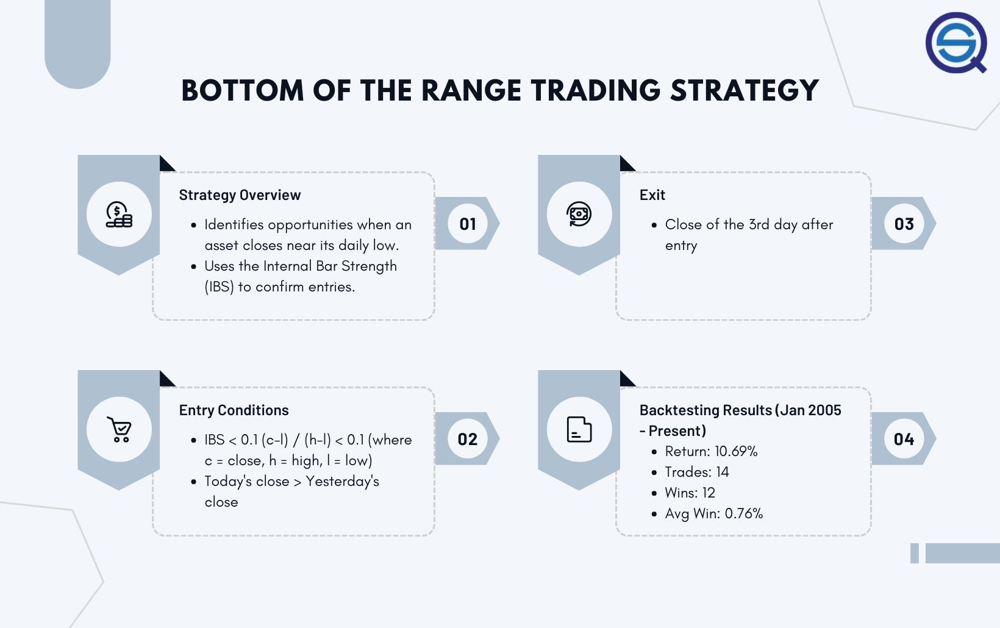

## Table of Contents

## What is range-bound trading?

Range-bound trading is a strategy where traders buy and sell a financial asset within a specific price range. This means that the price of the asset moves between a high point and a low point, but doesn't go beyond these limits for a certain period. Traders look for these patterns because they can predict when the price will go up or down and make profits by buying low and selling high within this range.

To use range-bound trading, traders first identify the upper and lower limits of the price range. They do this by looking at past price data and using technical analysis tools. Once they know the range, they can buy the asset when its price is near the bottom of the range and sell it when it's near the top. This method works well in markets that are not trending strongly in one direction, making it a popular choice for many traders.

## How can you identify a range-bound market?

To identify a range-bound market, you need to look at how the price of an asset moves over time. A range-bound market happens when the price stays between two levels, a high and a low, without moving past them for a while. You can spot this by drawing lines on a price chart: one line at the highest price the asset reaches and another at the lowest price. If the price keeps bouncing between these two lines, you've found a range-bound market.

Another way to identify a range-bound market is by using technical indicators like the Relative Strength Index (RSI) or Bollinger Bands. These tools help show if the market is moving sideways instead of up or down. For example, if the RSI stays between 30 and 70 without going to extremes, it might mean the market is range-bound. Bollinger Bands can also help; if the price stays within the upper and lower bands without breaking out, it's another sign of a range-bound market.

## What are the basic tools needed for backtesting range-bound trading strategies?

To backtest range-bound trading strategies, you need a few basic tools. The first tool is historical price data for the asset you want to trade. This data helps you see how the price moved in the past, so you can test if your strategy would have worked. You can get this data from financial websites or trading platforms. The second tool is a backtesting software or platform. This software lets you run your trading rules on past data to see how well they would have done. Some popular backtesting platforms are MetaTrader, TradingView, and Amibroker.

Another important tool is a programming language or scripting tool. Many backtesting platforms use languages like Python, MQL4, or Easy Language to write the rules for your strategy. You don't need to be a coding expert, but knowing the basics can help you set up your tests correctly. Lastly, you'll need some way to analyze the results of your backtests. This could be as simple as a spreadsheet where you can track your strategy's performance, or more advanced tools that give you detailed statistics and charts.

These tools together help you see if your range-bound trading strategy could make money in real trading. By testing your ideas on past data, you can find out what works and what doesn't before you risk any real money. This way, you can improve your strategy and feel more confident when you start trading for real.

## What are some common range-bound trading strategies?

One common range-bound trading strategy is called the "Support and Resistance" strategy. In this strategy, traders watch for the price of an asset to move between two levels: a support level, where the price stops falling, and a resistance level, where the price stops rising. Traders buy the asset when it hits the support level, expecting the price to go up again, and they sell it when it reaches the resistance level, expecting it to go down. This way, they can make money by trading within the range.

Another strategy is the "Bollinger Bands" strategy. Bollinger Bands are lines drawn on a price chart that show the high and low points of the price over time. Traders use these bands to find the range where the price moves. When the price touches the lower band, it might be a good time to buy, and when it touches the upper band, it might be a good time to sell. This strategy helps traders know when to enter and exit trades within the range.

A third strategy is the "Oscillator" strategy, which uses tools like the Relative Strength Index (RSI) or the Stochastic Oscillator. These tools measure how fast the price is moving and help traders see if the price is overbought or oversold. If the oscillator shows the price is oversold, traders might buy, expecting the price to rise back up. If it shows the price is overbought, traders might sell, expecting the price to fall back down. This helps traders make decisions based on the price movements within the range.

## How do you set up a backtest for a range-bound trading strategy?

To set up a backtest for a range-bound trading strategy, you first need to gather historical price data for the asset you want to trade. You can find this data on financial websites or trading platforms. Once you have the data, you'll need to use a backtesting software or platform like MetaTrader, TradingView, or Amibroker. These platforms let you run your trading rules on past data to see how well they would have done. You'll also need a basic understanding of a programming language like Python or MQL4 to write the rules for your strategy. This lets you tell the software exactly what to do, like buying when the price hits a support level and selling when it reaches a resistance level.

After setting up your strategy in the backtesting software, you run the test on the historical data. The software will show you how your strategy would have performed in the past, giving you results like how much money you could have made or lost, and how often your trades were successful. You'll also need a way to analyze these results, which could be a simple spreadsheet or more advanced tools that give you detailed statistics and charts. By looking at these results, you can see if your range-bound trading strategy works well and make any needed changes before you start trading with real money.

## What metrics should you use to evaluate the performance of a range-bound trading strategy?

When you want to see how well your range-bound trading strategy works, you should look at a few important numbers. One key number is the profit and loss (P&L). This tells you how much money you could have made or lost if you used your strategy in the past. Another important number is the win rate, which shows how often your trades made money. A high win rate means your strategy often picks winning trades. You should also check the risk-reward ratio, which compares how much you could lose on a trade to how much you could gain. A good risk-reward ratio means you could make more money than you risk losing.

Another set of numbers to look at is the drawdown, which shows the biggest drop in your account's value during the backtest. A smaller drawdown means your strategy is less risky. You should also look at the Sharpe ratio, which measures how much return you get for the risk you take. A higher Sharpe ratio means your strategy gives good returns without too much risk. Lastly, consider the average trade duration, which tells you how long you need to hold onto your trades. A shorter average trade duration can mean quicker profits, but it might also mean more work. By looking at all these numbers, you can get a good idea of how well your range-bound trading strategy might work in real trading.

## How can you adjust a range-bound strategy to different market conditions?

To adjust a range-bound strategy to different market conditions, you need to keep an eye on how the market is moving. If the market starts to trend up or down instead of moving sideways, you might need to change your strategy. For example, if the price starts breaking out above the resistance level or falling below the support level, it could mean the market is no longer range-bound. In this case, you could switch to a trend-following strategy, where you buy when the price goes up and sell when it goes down. You can also use indicators like the Average Directional Index (ADX) to see if the market is starting to trend. If the ADX shows a strong trend, it might be time to stop using your range-bound strategy.

Another way to adjust your range-bound strategy is by changing the levels you use for support and resistance. Markets change over time, so the old levels might not work anymore. You can look at new price data to find new support and resistance levels. If the price range gets bigger or smaller, you should adjust your buying and selling points to match. Also, you can use shorter or longer time frames to see if the market is still range-bound. For example, if the daily chart shows a range but the hourly chart shows a trend, you might want to use the hourly chart for your trades. By keeping your strategy flexible and watching the market closely, you can make sure it works well no matter how the market changes.

## What are the risks associated with range-bound trading and how can they be mitigated?

Range-bound trading can be risky because the price might suddenly break out of the range. If you're expecting the price to stay between support and resistance levels, but it goes above the resistance or below the support, you could lose money. Another risk is that the market might start trending, making your range-bound strategy less effective. Also, false signals can happen when the price seems to hit a support or resistance level, but then quickly moves the other way, causing you to make a bad trade.

To lower these risks, you can use stop-loss orders to limit how much money you can lose on a trade. If the price moves out of the range, a stop-loss order will close your trade automatically to stop you from losing too much. You can also keep an eye on the market to see if it starts to trend. If you notice the market changing, you can switch to a different trading strategy that works better for trending markets. Lastly, using more than one technical indicator can help you avoid false signals. If different indicators all point to the same thing, you can feel more confident about your trade.

## How can you use historical data to refine range-bound trading strategies?

You can use historical data to make your range-bound trading strategies better by looking at past price movements. When you study the old data, you can see patterns and find out what worked and what didn't. For example, you might notice that the price often stays between certain levels for a long time. By seeing this, you can set your support and resistance levels more accurately. You can also use the data to test different entry and exit points within the range. This way, you can find the best times to buy and sell to make more money.

Another way to use historical data is by backtesting your strategy. This means you run your trading rules on past data to see how they would have worked. If your strategy didn't make money in the past, you can change it until it does better. You might find that you need to adjust your stop-loss levels or change how long you hold onto your trades. By trying different things with the old data, you can make your strategy stronger and more likely to work well when you start trading for real.

## What advanced statistical methods can enhance the backtesting of range-bound trading strategies?

To make your backtesting of range-bound trading strategies better, you can use something called Monte Carlo simulations. This method helps you see how your strategy might work in many different situations. It does this by running your strategy lots of times with small changes to the historical data. This way, you can see if your strategy is strong enough to handle different market conditions. Monte Carlo simulations can show you how often your strategy might lose money and how big those losses could be. This helps you understand the risks better and make your strategy safer.

Another advanced method is called walk-forward optimization. This technique tests your strategy on past data, but it does it in steps. First, it uses some old data to find the best settings for your strategy. Then, it checks how well those settings work on newer data. This process keeps going, always using the most recent data to make your strategy better. Walk-forward optimization helps make sure your strategy can adapt to new market conditions. By using these advanced methods, you can make your range-bound trading strategy more reliable and ready for real trading.

## How do you compare the effectiveness of different range-bound trading strategies?

To compare the effectiveness of different range-bound trading strategies, you need to look at how well each one did in the past. You do this by backtesting each strategy on historical data. This means you run the rules of each strategy on old price data to see how much money they would have made or lost. You should look at numbers like the profit and loss (P&L), the win rate (how often the strategy made money), and the risk-reward ratio (how much you could gain compared to what you could lose). By comparing these numbers for each strategy, you can see which one did the best and which one might be the safest to use in real trading.

Another way to compare range-bound trading strategies is by looking at how they handle different market conditions. You can use advanced methods like Monte Carlo simulations to see how each strategy might work in many different situations. This helps you understand how reliable each strategy is and how it might perform if the market changes. You can also use walk-forward optimization to see how each strategy adapts to new data over time. By looking at all these things, you can pick the strategy that not only made the most money in the past but also seems like it will keep working well in the future.

## What are the latest research findings on optimizing range-bound trading strategies?

Recent research on optimizing range-bound trading strategies has focused on using machine learning and artificial intelligence to improve how these strategies work. Researchers have found that using algorithms like neural networks can help predict when the price will hit support or resistance levels more accurately. These smart systems look at a lot of data, like past price movements and trading volumes, to find patterns that humans might miss. By using machine learning, traders can set up their strategies to adapt to changing market conditions better, which means they can make more money and lose less.

Another finding from recent studies is the importance of incorporating more advanced risk management techniques into range-bound trading strategies. Researchers have shown that using methods like dynamic stop-loss orders, which change based on how the market is moving, can help traders avoid big losses when the price suddenly breaks out of the range. Also, using something called portfolio optimization can help traders balance their trades better, so they don't put all their money into one strategy. By combining these new ideas with traditional range-bound trading, traders can make their strategies more effective and safer.

## References & Further Reading

[1]: Bergstra, J., Bardenet, R., Bengio, Y., & Kégl, B. (2011). ["Algorithms for Hyper-Parameter Optimization."](https://papers.nips.cc/paper/4443-algorithms-for-hyper-parameter-optimization) Advances in Neural Information Processing Systems 24.

[2]: ["Advances in Financial Machine Learning"](https://www.amazon.com/Advances-Financial-Machine-Learning-Marcos/dp/1119482089) by Marcos Lopez de Prado

[3]: ["Evidence-Based Technical Analysis: Applying the Scientific Method and Statistical Inference to Trading Signals"](https://www.amazon.com/Evidence-Based-Technical-Analysis-Scientific-Statistical/dp/0470008741) by David Aronson

[4]: ["Machine Learning for Algorithmic Trading"](https://github.com/stefan-jansen/machine-learning-for-trading) by Stefan Jansen

[5]: ["Quantitative Trading: How to Build Your Own Algorithmic Trading Business"](https://books.google.com/books/about/Quantitative_Trading.html?id=j70yEAAAQBAJ) by Ernest P. Chan