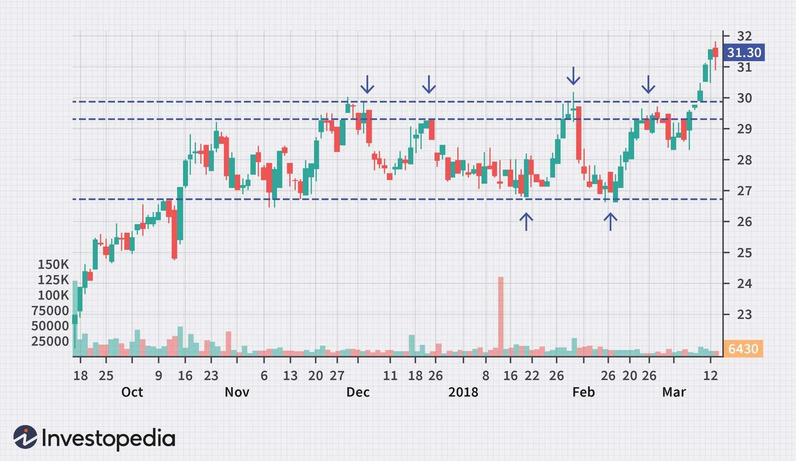

In the world of financial markets, range-bound trading represents a frequent scenario where a security's price oscillates between established support and resistance levels. These levels are critical to defining the boundaries within which prices tend to fluctuate during periods of market equilibrium. Understanding this phenomenon is crucial for traders aiming to enhance profitability, particularly through algorithmic trading, which brings a level of precision and speed unmatched by manual trading.

Algorithmic trading, or algo trading, leverages advanced algorithms to make split-second decisions based on pre-set criteria, significantly improving the efficiency of executing trades within a range-bound market. These algorithms are programmed to recognize predefined indicators or patterns, such as the relative strength index (RSI) or moving averages, enabling them to precisely time trades at optimal points within the range. As a result, algorithmic trading can capitalize on the repetitive oscillations typical of a range-bound market, where prices tend not to stray beyond identified support and resistance barriers.



By understanding the dynamics of range-bound markets, traders can optimize their strategies for enhanced profitability. Identifying periods during which a market is range-bound versus trending is fundamental in adjusting strategies accordingly. Algorithmic trading allows for this adaptability, utilizing coded systems that automatically adjust strategic approaches based on current market conditions.

The objective of this article is to provide a comprehensive guide to capturing opportunities in range-bound conditions using algorithms. We'll examine key strategies, explore the integration of technical indicators, and discuss how traders can mitigate risks while maximizing potential gains in these scenarios. Through informed application of algorithmic trading, traders can unlock the full potential of range-bound markets, capitalizing on price volatility within a fixed range to achieve more consistent results.

## Table of Contents

## What is Range-Bound Trading?

Range-bound trading is a strategy employed in financial markets where a security's price oscillates between established support and resistance levels. Support is typically defined as the price level where a downtrend can be expected to pause due to a concentration of demand, while resistance is the price point at which a price rise is expected to halt due to a sell-off. In essence, support acts as a "floor" for the price, whereas resistance acts as a "ceiling".

The identification of range-bound conditions is foundational for traders seeking to apply this strategy. Market participants often use historical price data to determine these horizontal boundaries, employing technical analysis tools such as trend lines, moving averages, and oscillators (e.g., the Relative Strength Index). A range-bound market can be effectively characterized by horizontal or slightly sloped lines representing these support and resistance levels, contrasting sharply with the clear upward or downward trends that define trending markets.

The advantages of range-bound trading include the potential for consistent profits through buy-low and sell-high strategies within the established range, regardless of the overall market direction. Since price moves are typically limited within a range-bound market, traders can apply oscillating strategies to earn profit repeatedly by capitalizing on the predictability of price movements.

However, range-bound trading is not without its limitations. One significant challenge is accurately identifying when a market is truly range-bound, as it can sometimes appear so only temporarily. Furthermore, false breakouts—where the price temporarily moves beyond support or resistance levels only to return within the range—can lead to trading losses. Traders must also be cautious of changing market conditions; a market can shift from range-bound to trending, which necessitates a change in trading strategy to avoid significant losses.

Overall, understanding and accurately predicting range-bound conditions can provide traders with robust opportunities to exploit price stability through strategic buying and selling. However, success in this area requires vigilance and a clear understanding of the market's structural dynamics.

## Designing Range-Bound Strategies for Algo Trading

Algorithmic trading, or 'algo trading,' involves using automated systems to execute trades based on predefined strategies. This approach is particularly advantageous in range-bound markets due to the predictable price oscillations that are characteristic of such conditions. The ability of algorithms to swiftly process and act upon vast amounts of data enables traders to exploit these oscillations efficiently.

To develop algorithms that capitalize on range-bound conditions, it is essential to integrate technical indicators such as the Relative Strength Index (RSI) and moving averages. These indicators help to identify the support and resistance levels critical to understanding range-bound markets. The RSI, for instance, is a [momentum](/wiki/momentum) oscillator that measures the speed and change of price movements. It is useful in identifying overbought or oversold conditions within a range, thereby providing signals for potential entry and [exit](/wiki/exit-strategy) points. A typical RSI trading rule might be to enter a buy position when the RSI falls below 30, indicating an oversold condition, and to exit the position when the RSI returns above 50.

Moving averages, on the other hand, help smooth out price data to identify the direction of the trend and potential support and resistance levels. Simple Moving Averages (SMA) or Exponential Moving Averages (EMA) can be used to generate trading signals by observing crossovers. For example, in a range-bound strategy, a trader might use a crossover strategy where a short-term moving average crossing above a long-term moving average suggests a buying opportunity, while the opposite crossing indicates a selling opportunity.

Here is a simple Python example of an algorithmic strategy using the RSI and moving averages:

```python
import pandas as pd
import numpy as np

def calculate_rsi(data, window=14):
    delta = data.diff()
    gain = (delta.where(delta > 0, 0)).rolling(window=window).mean()
    loss = (-delta.where(delta < 0, 0)).rolling(window=window).mean()
    rs = gain / loss
    rsi = 100 - (100 / (1 + rs))
    return rsi

def simple_moving_average(data, window):
    return data.rolling(window=window).mean()

def range_bound_strategy(data):
    data['RSI'] = calculate_rsi(data['Close'])
    data['SMA_short'] = simple_moving_average(data['Close'], 20)
    data['SMA_long'] = simple_moving_average(data['Close'], 50)

    buy_signals = []
    sell_signals = []

    for i in range(1, len(data)):
        if data['RSI'].iloc[i] < 30 and data['SMA_short'].iloc[i] > data['SMA_long'].iloc[i]:
            buy_signals.append(data['Close'].iloc[i])
            sell_signals.append(np.nan)
        elif data['RSI'].iloc[i] > 70 and data['SMA_short'].iloc[i] < data['SMA_long'].iloc[i]:
            buy_signals.append(np.nan)
            sell_signals.append(data['Close'].iloc[i])
        else:
            buy_signals.append(np.nan)
            sell_signals.append(np.nan)

    data['Buy_Signal'] = buy_signals
    data['Sell_Signal'] = sell_signals
    return data

```

This simple structure illustrates how algorithms can be designed to execute trades in range-bound markets, enhancing the risk-to-reward ratio. By continuously analyzing the market and adjusting to new data, such algorithms provide a systematic method to exploit the predictable nature of range-bound price movements. This predictable nature allows for better planning and risk management, thereby potentially increasing profitability.

## Challenges and Risk Management

Range-bound trading offers lucrative opportunities; however, it presents several specific challenges that traders must navigate to maximize profitability. Notably, false breakouts and [liquidity](/wiki/liquidity-risk-premium) issues are two primary concerns that can significantly impact the success of trading strategies in range-bound markets. Understanding these challenges and implementing robust risk management techniques are essential for traders.

False breakouts occur when the price of a security appears to move beyond established support or resistance levels but then quickly reverses direction. These events can lead to premature trade entries or exits, resulting in potential losses. To mitigate such risks, traders may employ strategies like confirming breakouts with additional indicators. For example, using the Relative Strength Index (RSI) to gauge overbought or oversold conditions can help validate whether a [breakout](/wiki/breakout-trading) is likely to sustain.

Liquidity issues in range-bound markets refer to the difficulty in executing large trades without affecting the price significantly. Low liquidity can result in increased slippage, where trades are executed at less favorable prices than anticipated. To manage liquidity risks, traders should assess the market depth, which indicates the [volume](/wiki/volume-trading-strategy) of pending buy and sell orders at different price levels. Analyzing market depth helps in understanding the potential impact of executing large trades. 

Effective risk management is crucial for enduring success in range-bound trading. Stop-loss orders are fundamental tools to protect against excessive losses. These orders automatically close a trade when the price reaches a predetermined level, limiting the potential downside. Traders should set stop-loss levels below support or above resistance levels, allowing room for normal price fluctuations while protecting against significant adverse moves.

Dynamic position sizing is another vital aspect of risk management. By adjusting the size of positions based on market conditions, traders can optimize their risk-to-reward ratio. A commonly used method for dynamic position sizing is the Kelly Criterion, which calculates the optimal size of a trade based on the probability of success and the expected payout.

```python
def kelly_criterion(probability_of_success, reward_risk_ratio):
    return (probability_of_success * (reward_risk_ratio + 1) - 1) / reward_risk_ratio

# Example usage
prob_success = 0.6  # 60% probability of a successful trade
reward_risk = 2  # Expected reward is twice the risk
optimal_fraction = kelly_criterion(prob_success, reward_risk)
print(f"Optimal fraction of capital to use per trade: {optimal_fraction:.2f}")
```

Incorporating volume analysis strengthens range-bound strategies by providing insights into the intensity of buying and selling pressure at various price levels. High volume at support or resistance levels may indicate stronger barriers, thus giving traders clues about potential reversals or continuations. Volume analysis can be further refined with indicators such as the Volume Weighted Average Price (VWAP), assisting traders in identifying significant price levels influenced by volume activity.

In conclusion, while range-bound trading presents unique challenges, traders can enhance their strategies by addressing false breakouts and liquidity issues with meticulous risk management techniques. Applying stop-loss orders, dynamic position sizing, and utilizing market depth and volume analysis not only mitigate risks but also optimize trading performance in range-bound markets.

## Conclusion

Range-bound markets present distinct opportunities for traders, particularly when approached with [algorithmic trading](/wiki/algorithmic-trading) techniques. Algorithmic trading, known for its precision and speed, is well-suited to exploiting the oscillating price patterns typical of range-bound conditions. By leveraging algorithms, traders can automate the process of buying low at support levels and selling high at resistance levels, optimizing their chances for profitable trades.

To effectively harness these opportunities, traders need a comprehensive understanding of market dynamics. This involves recognizing the conditions that define range-bound markets—where prices fluctuate between well-established support and resistance levels. Technical indicators, such as the Relative Strength Index (RSI) and moving averages, serve as essential tools in identifying these levels and spotting potential trading opportunities. For instance, incorporating an RSI-based algorithm can help traders pinpoint overbought and oversold conditions within a range, triggering buy or sell signals appropriately.

Refinement of algorithms and strategies is crucial for success. Market conditions are not static; they evolve, requiring traders to adapt their strategies continuously. A proactive approach to strategy development includes [backtesting](/wiki/backtesting) algorithms with historical data to gauge performance and make necessary adjustments. For instance, using Python's libraries like Pandas for data manipulation and Backtrader for backtesting can streamline this process, allowing for efficient analysis and refinement. Here is a basic example of how one might set up an RSI-based strategy using Python:

```python
import backtrader as bt

class RSIStrategy(bt.Strategy):
    params = (('rsi_period', 14), ('buy_limit', 30), ('sell_limit', 70))

    def __init__(self):
        self.rsi = bt.indicators.RSI(self.data.close, period=self.params.rsi_period)

    def next(self):
        if self.rsi < self.params.buy_limit:
            self.buy(size=10)  # Example size
        elif self.rsi > self.params.sell_limit:
            self.sell(size=10)  # Example size

cerebro = bt.Cerebro()
cerebro.addstrategy(RSIStrategy)
data = bt.feeds.YahooFinanceData(dataname='AAPL', fromdate=datetime(2022, 1, 1), todate=datetime(2022, 12, 31))
cerebro.adddata(data)

cerebro.run()
```

This code sets up a simple RSI-based strategy to buy when the RSI is below 30 and sell when it is above 70. While simplistic, it underscores the iterative nature of developing customizable strategies. 

Maximizing profitability in range-bound markets through algorithmic trading requires ongoing refinement. Traders need to stay informed about market changes and continuously optimize their algorithms to ensure they remain effective. By combining a thorough understanding of market conditions with the strategic application of algorithmic tools, traders can significantly enhance their trading outcomes.

## References & Further Reading

- For readers eager to deepen their understanding of range-bound trading and algorithmic trading, several foundational texts and academic works provide rich insights.

- "Advances in Financial Machine Learning" by Marcos Lopez de Prado is indispensable for exploring the intersection of financial markets and machine learning. The book discusses sophisticated strategies for developing machine learning frameworks to navigate varying market conditions, including range-bound scenarios. Lopez de Prado investigates into the applications of machine learning algorithms in finance, offering practical techniques that can enhance the profitability and efficiency of trading strategies.

- "Quantitative Trading: How to Build Your Own Algorithmic Trading Business" by Ernest P. Chan serves as a practical guide for traders interested in creating and managing algorithmic trading operations. Chan provides a step-by-step approach to develop trading strategies, emphasizing the importance of backtesting, optimization, and risk management. By bridging theoretical concepts with real-world applications, this book is invaluable for those embarking on algorithmic trading ventures.

- Academic papers such as "Technical Analysis in the Foreign Exchange Market" by Cheol-Ho Park and Scott H. Irwin offer empirical insights into the effectiveness of technical indicators commonly employed in range-bound trading strategies. This paper analyzes the predictive power of technical analysis tools, assisting traders in identifying optimal entry and exit points within trading ranges.

- For those interested in the quantitative aspects of trading, "Algorithmic and High-Frequency Trading" by Álvaro Cartea, Sebastian Jaimungal, and José Penalva provides a comprehensive examination of the mathematical models and strategies underlying algorithmic and high-frequency trading. The book's rigorous approach to market microstructure and trading dynamics is suitable for professionals seeking to enhance their quantitative trading systems.

- In addition to books, numerous online resources and articles detail algorithmic trading methodologies and advancements in trading technologies. Websites like QuantInsti and Investopedia offer articles, webinars, and courses tailored to various levels of expertise, covering a wide array of topics relevant to range-bound and algorithmic trading.

- These resources collectively offer a wealth of knowledge for traders aiming to refine their strategies and leverage the potential of algorithmic trading in range-bound markets. The continual evolution of market dynamics necessitates ongoing learning and adaptation, and these works provide a solid foundation for navigating the complexities of financial trading.

