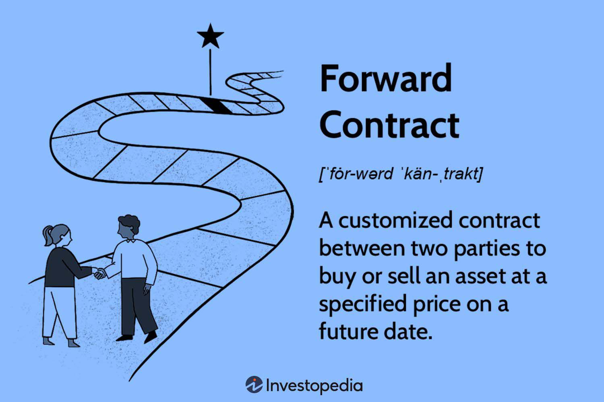

Financial derivatives are integral components of modern financial markets, offering a diverse range of instruments designed to manage risk and increase returns. These financial contracts derive their value from underlying assets such as currencies, commodities, or equities, making them versatile tools for both hedging and speculation. Among the array of derivatives available, range forward contracts are particularly prominent due to their efficacy in managing currency exchange risks. 

A range forward contract is a hybrid financial instrument particularly used in currency markets. It provides protection against adverse currency movements while allowing some upside potential if exchange rates move favorably. This dual benefit is crucial for entities involved in international trade, where currency volatility can significantly impact financial outcomes. The strategic implementation of range forward contracts helps stabilize cash flows and minimize financial uncertainties associated with fluctuating exchange rates.



This article aims to explore the role of financial derivatives in risk management, with a particular focus on range forward contracts. By dissecting the mechanics, benefits, and applications of these contracts, we aim to provide a comprehensive understanding of how they are used to optimize trading strategies. Furthermore, the integration of algorithmic trading in the deployment of range forward contracts will be highlighted. Algorithmic trading, involving the use of computer programs to automate trading decisions, enhances the precision and efficiency of executing these derivative contracts. It allows for real-time decision-making and minimizes human errors, thus optimizing trading strategies in the ever-evolving global markets. 

By examining the intersection of range forward contracts and algorithmic trading, we aim to provide insights into how these financial tools can be leveraged to effectively manage risks and capitalize on market opportunities. Understanding these interactions is essential for market participants seeking to navigate the complexities of global financial systems.

## Table of Contents

## Understanding Financial Derivatives and Risk Management

Financial derivatives are contracts that derive their value from an underlying asset, which could be currencies, stocks, commodities, or indices. These instruments provide a means to hedge against financial risks or to speculate on market direction. The utility of derivatives stems from their ability to transfer risk from those who wish to avoid it to those willing to assume it for potential profit.

To understand the function of derivatives, consider their two primary applications: hedging and speculation. Hedging aims to reduce or eliminate the risk of adverse price movements. For example, a multinational company with revenues in various currencies might use currency derivatives to protect against fluctuations in foreign exchange rates, thereby stabilizing their projected cash flow.

Derivatives like range forward contracts are particularly important in risk management, offering businesses a structured method to mitigate exposure to market [volatility](/wiki/volatility-trading-strategies). A range forward contract, for instance, allows a company to lock in exchange rate boundaries that guarantee a minimum and maximum acceptable rate for a future date. This setup ensures protection from unfavorable rate movements while allowing some participation in favorable market shifts.

Let's consider a scenario where a U.S.-based company expects to receive €1 million in six months. Without a hedge, if the euro depreciates against the dollar, the company receives less in USD terms. By entering a range forward contract, the company can define the limits within which the exchange rate can fluctuate, ensuring that the USD amount they receive will fall within a predefined range. This method is advantageous as it often involves zero net premium, making it cost-effective compared to options strategies.

Risk management through derivatives must consider the potential for counterparty risk, where the other party in the contract might default. As derivative contracts can be complex, it's vital to employ robust strategies and understand the terms and conditions thoroughly.

In summary, financial derivatives serve as an integral tool for hedging risks and speculating on market movements. Range forward contracts are examples of derivatives tailored to stabilize financial outcomes, especially for entities exposed to the vagaries of exchange rates, providing a balanced mix of risk mitigation and opportunity capture.

## What is a Range Forward Contract?

A range forward contract is a financial instrument utilized to hedge against the uncertainties of currency exchange rate fluctuations while maintaining the possibility for advantageous outcomes. This type of contract is particularly advantageous for businesses operating in international markets, as it allows them to manage the risk associated with unpredictable currency movements, which can significantly impact cash flows.

These contracts work by defining a specific range or band of exchange rates—often referred to as the "knock-in" and "knock-out" levels—within which the exchange rate is effectively fixed for the contract duration. Should the prevailing market rates remain within this predetermined range, the contract offers protection by locking in the rates, thus shielding the business from adverse fluctuations. If the market rate moves beyond this range, the contract typically lapses, allowing the business to benefit from favorable rate movements beyond the original limits.

For example, suppose a company anticipates receiving USD 1 million in six months from overseas sales and wants to hedge its exposure to potential currency depreciation. It can establish a range forward contract with a lower and upper limit (e.g., EUR/USD exchange rate of 1.10-1.20). If the spot rate at maturity falls within this range, the contract ensures a guaranteed rate for conversion, minimizing potential losses. Conversely, if the rate moves outside this range and surpasses 1.20, the company can capitalize on that favorable movement, thus enjoying an unspecified upside potential.

This balance of risk management and potential gain makes range forward contracts an appealing choice for businesses aiming to stabilize their financial outcomes in volatile [forex](/wiki/forex-system) markets. By leveraging these contracts, firms can plan and budget with greater certainty, knowing that their exchange rate exposure is contained within defined boundaries.

## Mechanics of Range Forward Contracts

Range forward contracts are designed to offer a structured approach to managing currency exchange risks by setting a predefined range of exchange rates. This enables settlement to occur only within these predetermined boundaries, thus providing both protection and potential upside. 

To construct a range forward contract, a trader takes on both long and short positions in the currency market. This dual-position strategy involves simultaneously purchasing an option to buy a currency at a lower end of the range (a call option) and selling an option to sell the currency at the upper end of the range (a put option). The purpose of this setup is to hedge the exchange rate of a currency pair, thereby providing stability to future cash flows.

The pricing of these options is structured in such a way that the premiums paid and received zero out, creating a cost-neutral hedging strategy. Specifically, the premium received on the sale of the call option offsets the premium paid for the put option. This zero-cost structure is a significant advantage, making range forward contracts particularly attractive for hedging foreign currency exposures. 

Mathematically, if $C$ represents the premium from selling the call option and $P$ represents the premium paid for the put option, the condition for a zero-cost range forward contract can be expressed as:

$$
C - P = 0
$$

This relationship ensures that the overall cost of hedging through a range forward contract is minimized or eliminated. The efficacy of these contracts depends on the accurate forecasting of exchange rates, as changes in currency markets can influence the gains or losses realized from these positions.

Implementing these strategies in practice requires precise execution, especially when using [algorithmic trading](/wiki/algorithmic-trading) systems that can automatically enter and [exit](/wiki/exit-strategy) positions based on real-time market data. This automation ensures that trades are executed at the optimal points within the predetermined range, maximizing the benefits of the range forward contract.

## Benefits and Risks of Range Forward Contracts

Range forward contracts are valuable tools for managing currency risk, offering unique advantages and inherent risks. One of the primary benefits of these contracts is their ability to provide zero-cost protection for currency transactions, making them attractive to businesses engaged in international trade. By setting a predetermined range for exchange rates, range forward contracts allow businesses to stabilize cash flows and plan budgets with greater certainty. For instance, if a company knows it will exchange currencies at a rate between specified upper and lower limits, it can more accurately forecast financial outcomes and mitigate the financial impact of adverse currency movements.

The zero-cost nature of range forward contracts stems from their structure. These contracts involve two simultaneous options: a long position and a short position in currency options, typically with no upfront premium. The cost of these positions often nets to zero, allowing firms to hedge against fluctuations without additional expenditure. This characteristic can significantly aid businesses in budget planning and financial management, particularly in volatile currency environments.

Despite these advantages, range forward contracts are not without risks. One notable risk is the opportunity cost. By locking exchange rates within a specific range, businesses might miss out on more favorable rates that fall outside this range. Thus, while the company hedges against unfavorable movements, it also forfeits potential gains from favorable fluctuations. Additionally, there is the risk of counterparty default, a common concern in derivative transactions. If the counterparty in the range forward contract fails to meet its obligations, the hedging strategy can collapse, exposing the business to the very currency risk it sought to avoid.

In summary, range forward contracts offer a structured method of managing currency risk, providing both cost-effective protection and the assurance of predictable exchange rates. However, they also [carry](/wiki/carry-trading) risks, including missed opportunities and potential counterparty defaults, that must be carefully assessed before implementation.

## Algorithmic Trading in Derivatives Markets

Algorithmic trading employs sophisticated computer algorithms to execute trades based on predefined criteria, streamlining processes with high speed and precision. This advanced approach is particularly advantageous in the derivatives markets, where it plays a significant role in managing complex transactions and reducing human error.

Derivatives, like range forward contracts, often involve intricate calculations and precise timing, both of which can benefit from the rapid execution speeds and decision-making consistency provided by algorithmic trading systems. By automating these tasks, trading algorithms minimize the latency between market movements and the corresponding trade execution, ensuring transactions are conducted at optimal prices.

Algorithmic trading facilitates the management of complex derivative instruments by enabling multiple trades to be processed simultaneously and in a structured manner. This is especially beneficial for instruments such as range forward contracts, which require diligent monitoring of market rates to capitalize on favorable conditions while providing a hedge against unfavorable fluctuations. An algorithm can evaluate real-time market data and execute trades when certain thresholds or conditions are met, thus optimizing the efficiency and effectiveness of risk management strategies.

Moreover, algorithmic systems can automate repetitive tasks involved in managing trading strategies that encompass range forward contracts. With the help of programming languages like Python, traders can deploy sophisticated models that incorporate real-time data analysis and execute trades based on advanced statistical and quantitative techniques.

Here's a simple Python example of how an algorithm might decide to execute a trade within a predefined range:

```python
def execute_trade(current_rate, lower_bound, upper_bound):
    if lower_bound <= current_rate <= upper_bound:
        # Execute a trade
        print("Executing trade at rate:", current_rate)
    else:
        print("Rate out of bounds. No trade executed.")

# Example usage
current_market_rate = 1.15
lower_limit = 1.10
upper_limit = 1.20

execute_trade(current_market_rate, lower_limit, upper_limit)
```

This fragment provides a basic illustration of how an algorithm can monitor exchange rates and make trading decisions based on specified boundaries. The real strength of algorithmic trading lies in its ability to incorporate vast datasets, making decisions based on statistical models that [factor](/wiki/factor-investing) in multiple variables and scenarios.

Overall, algorithmic trading significantly enhances the deployment and management of trading strategies involving derivatives by optimizing trade execution, reducing the risk of human error, and handling the complexities involved in high-frequency trading environments.

## Implementing Range Forward Contracts with Algorithmic Trading

Implementing range forward contracts with algorithmic trading presents a sophisticated approach to managing currency risk effectively. Algorithmic trading systems are designed to monitor market conditions continuously, allowing for the strategic incorporation of range forward contracts. This results in enhanced precision and timeliness in executing trades, particularly as exchange rates traverse the predefined bounds of the range forward contract.

### Algorithms and Trade Execution

The core of algorithmic trading lies in its ability to automate the execution of trades based on intricate algorithms that can be programmed to respond to specific market conditions. For range forward contracts, these algorithms are configured to initiate trades when market rates get close to, or exceed, critical levels within the defined range. This ensures that traders can secure optimal positions without the need for constant manual oversight. For example, a Python script leveraging libraries such as NumPy and Pandas can process real-time data feeds to trigger trade orders automatically. Here is a simplified example of how such a script could be structured:

```python
import numpy as np
import pandas as pd

# Example threshold rates
lower_band = 1.15
upper_band = 1.25

def check_market_rate(current_rate):
    if current_rate <= lower_band:
        execute_trade('Buy')
    elif current_rate >= upper_band:
        execute_trade('Sell')

def execute_trade(action):
    # Placeholder function where actual trade logic would go
    print(f"Executing {action} trade")
```

### Real-Time Data Analysis and Alignment

The precision in risk management offered by algorithmic trading is largely attributed to its ability to process and analyze vast amounts of data in real-time. These systems use data streams from various sources and apply statistical models to ensure that trading activities are in line with pre-established risk management objectives. The real-time analysis implies that trades are not only timely but also based on the most current and comprehensive data set, which minimizes exposure to unfavorable exchange rate movements.

For instance, [machine learning](/wiki/machine-learning) algorithms can be employed to predict potential market shifts, providing a proactive approach to currency risk management. This involves using historical price data and technical indicators to forecast trends and adjust strategies accordingly. Libraries like Scikit-learn offer robust tools for building predictive models that enhance decision-making processes within algorithmic trading platforms.

By synthesizing advanced technology and financial instruments, market participants can achieve a more dynamic and responsive currency risk management strategy. This approach not only harnesses the accuracy and speed of automated systems but also optimizes the use of financial derivatives like range forward contracts, ultimately contributing to more secure and efficient trading operations.

## Real-Life Applications and Case Studies

Businesses across various sectors leverage range forward contracts to stabilize their transactions and mitigate risks associated with currency fluctuations in international trade. One notable sector is manufacturing, where companies often engage in cross-border transactions for importing raw materials and exporting finished goods. By employing range forward contracts, these enterprises ensure that their financial planning and cash flow projections remain stable despite the volatility in foreign exchange rates.

In the services sector, especially among multinational corporations, managing exchange rate risk is crucial to maintaining profitability. For instance, in the airline industry, companies frequently purchase fuel in international markets while receiving revenue in multiple currencies. Here, range forward contracts serve as a protective measure against adverse currency movements, offering a balanced approach that cushions any unexpected financial blow due to exchange rate shifts.

Algorithmic trading models play a critical role in supporting the application of range forward contracts. These models are designed to execute trades based on pre-programmed criteria, thereby adjusting transactions swiftly and accurately in response to market dynamics. For example, a multinational firm might utilize an algorithm to monitor fluctuations within the set range of a forward contract. The algorithm can automatically execute corrective actions if the currency approaches the upper or lower limits of the range, thus optimizing the hedging strategy and securing the desired financial outcomes.

Case studies provide practical illustrations of these strategies. A well-documented case involves a technology company operating in multiple countries with substantial income and expenses in various currencies. By integrating range forward contracts with algorithmic trading systems, the firm successfully managed its currency risk, achieving cost efficiency and enhancing its ability to forecast financial performance accurately. 

In summary, real-life applications of range forward contracts, bolstered by algorithmic trading, demonstrate their vital role in mitigating currency risk and stabilizing financial outcomes for businesses engaged in international commerce.

## Future Trends in Derivatives and Algo Trading

The integration of machine learning (ML) and [artificial intelligence](/wiki/ai-artificial-intelligence) (AI) into algorithmic trading is revolutionizing the derivatives markets. This transformation emphasizes enhanced predictive capabilities and optimized trading strategies, collectively contributing to improved market efficiency.

Machine learning models are adept at detecting patterns from vast datasets, which is pivotal in identifying profitable trading strategies. These models, including supervised learning algorithms such as regression and classification, as well as unsupervised learning strategies like clustering, allow for more precise forecasts of market movements. By utilizing historical trading data and real-time market information, ML algorithms can predict price trends and volatility with increasing accuracy, offering traders a competitive edge in decision-making.

Artificial intelligence further complements algorithmic trading through automated strategy development and execution. AI systems can analyze market sentiment from news, social media, and other textual sources through natural language processing (NLP). By quantifying sentiment, AI assists in discerning potential market impacts and adjusting trading algorithms accordingly. Moreover, [reinforcement learning](/wiki/reinforcement-learning), a subset of AI, enables trading systems to learn and adapt trading strategies through exploration and exploitation techniques, continually improving performance based on new data inputs.

The synergy of ML and AI in algorithmic trading is particularly transformative in derivatives risk management, especially in cross-border transactions. Automation enhances the efficiency of executing complex trades by minimizing human error and expediting decision-making processes. This automated landscape is critical in maintaining competitive advantage as global markets become more interconnected and volatile.

The future of derivatives trading will likely see an increased reliance on ML and AI technologies. These advancements promise not only to refine trading strategies but also to reduce operational costs and improve [liquidity](/wiki/liquidity-risk-premium) in the markets. As predictive analytics continue to evolve, traders who leverage these tools will be better equipped to navigate the expansive and dynamic nature of financial markets, ensuring robust risk management and optimized returns.

## Conclusion

Range forward contracts stand as a foundational component in financial risk management, particularly for mitigating currency volatility. By establishing a predefined range of exchange rates, these contracts enable businesses to secure more predictable cash flows, thus shielding them from unpredictable fluctuations in currency markets. This strategic protection is vital for firms involved in international trade, where currency risk can significantly affect financial outcomes.

The integration of algorithmic trading amplifies the effectiveness of range forward contracts by delivering high-speed, precise, and efficient execution of complex trading strategies. Algorithms can continuously monitor exchange rates and execute trades automatically when predetermined conditions are met, ensuring that market participants can swiftly capitalize on favorable conditions or mitigate potential losses. This use of technology reduces human error and enhances decision-making processes.

For market participants, a keen understanding and deployment of these financial instruments and technologies are critical. As global markets continue to evolve with increasing complexity, the ability to leverage range forward contracts and algorithmic trading becomes essential. These tools not only provide a competitive edge in safeguarding financial interests but also position organizations to navigate the dynamic landscape of international finance more effectively.

## References & Further Reading

[1]: Chance, D. M., & Brooks, R. (2015). "An Introduction to Derivatives and Risk Management". Cengage Learning.

[2]: Hull, J. C. (2017). "Options, Futures, and Other Derivatives". Pearson Education.

[3]: Lopez de Prado, M. (2018). ["Advances in Financial Machine Learning"](https://www.amazon.com/Advances-Financial-Machine-Learning-Marcos/dp/1119482089). Wiley.

[4]: Johnson, R. S. (2017). ["Algorithmic Trading & DMA: An Introduction to Direct Access Trading Strategies"](https://www.semanticscholar.org/paper/Algorithmic-trading-%26-DMA-%3A-an-introduction-to-Johnson/aa5de1ab883d5e23b6651faa7c1807586d688e4b). 4Myeloma Press.

[5]: Jansen, S. (2018). ["Machine Learning for Algorithmic Trading"](https://github.com/stefan-jansen/machine-learning-for-trading). Packt Publishing.