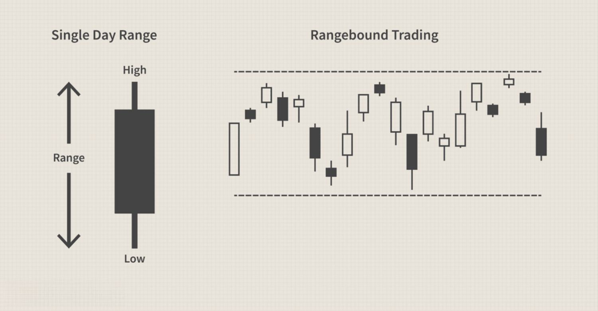

Financial markets are vital components of the global economy, offering platforms for the buying and selling of assets like stocks, bonds, commodities, and currencies. These markets facilitate capital raising, risk management, and hedge against various economic scenarios, thereby sustaining economic growth and wealth creation. A trading range in financial markets signifies a period where the price of a financial instrument moves within a confined boundary, denoted by a consistent high and low. This phenomenon often reflects phases of market equilibrium, indicating stability or investor indecision. Identifying trading ranges is crucial for traders, as it helps in anticipating potential price movements and strategizing accordingly.

Market analysis plays a significant role in trading by offering traders insights into market trends, price movements, and other critical factors. It involves various methodologies, including technical analysis, which focuses on past market data, and fundamental analysis, which evaluates an asset's intrinsic value by examining economic indicators and financial statements. Sentiment analysis, a more contemporary approach, assesses market psychology to predict future price changes. Together, these analytical techniques empower traders to make informed decisions, thereby enhancing their chances of success in the financial markets.



Algorithmic trading (algo trading) refers to the use of computer algorithms to execute trades at speeds and frequencies beyond human capability. The practice of algo trading has evolved significantly, propelled by advances in technology and access to vast datasets. Different types of algorithms, ranging from simple rule-based systems to complex machine learning models, are employed to automate and optimize trading operations. The advantages of algo trading include reduced transaction costs, enhanced trading efficiency, and the ability to process massive amounts of data rapidly. However, it also poses challenges and risks, such as system reliability issues and market volatility exacerbations.

By combining trading range analysis with algorithmic trading, traders can significantly enhance their trading strategies. Trading range identification can serve as a foundational input for trading algorithms, allowing them to optimize buy and sell decisions within the specified price boundaries. This integration enables traders to capitalize on market stability or indecision periods while adapting dynamically to market shifts. It also balances the complexity of algorithmic models with practical insights from traditional analysis, thereby improving overall trading performance. Consequently, the synthesis of these two approaches can lead to more robust trading systems capable of navigating the intricate landscape of financial markets effectively.

## Table of Contents

## Understanding Trading Ranges in Financial Markets

A trading range in financial markets refers to a period where the price of a financial instrument oscillates between a defined upper limit and a lower limit over a certain time frame. This behavior suggests a lack of distinct upward or downward momentum, indicating market stability or indecision among market participants. For instance, when prices consistently fluctuate between a support level (lower limit) and a resistance level (upper limit), a trading range is formed. In technical analysis, these levels serve as crucial indicators: the support level is considered a price point where demand is strong enough to prevent the price from declining further, whereas the resistance level is where selling pressure outbalances buying pressure, preventing the price from rising more.

Trading ranges can offer insights into market stability. A long-lasting trading range may suggest a balanced perception of value among investors, reflecting an equilibrium. Alternatively, in some cases, trading ranges manifest due to indecision, characterized by equal buyer and seller strength preventing price breakthroughs. Such market conditions may follow significant economic events or announcements that generate uncertainty.

Common characteristics of trading ranges include horizontal or slightly sloped price movement. Patterns often observed within trading ranges are rectangles and channels. Rectangles involve the price oscillating sideways between parallel support and resistance levels, while channels depict an upward or downward slant indicating a weak trend within the range. The frequent tests of these levels without a [breakout](/wiki/breakout-trading) strengthen the assumption of a trading range.

Certain financial instruments, particularly those with high [liquidity](/wiki/liquidity-risk-premium) and less market [volatility](/wiki/volatility-trading-strategies), frequently exhibit trading ranges. For example, major currency pairs like EUR/USD, large-cap stocks, and commodities with stable demand and supply such as gold or [crude oil](/wiki/crude-oil) may experience prolonged trading ranges. The extent of a trading range can vary significantly depending on the instrument's volatility and external economic conditions.

Identifying trading ranges presents both benefits and challenges. Recognizing a trading range can aid traders in forecasting price movements, enabling them to capitalize on predictable price boundaries through strategies like buying at support and selling at resistance. However, these ranges can be difficult to identify accurately, especially in volatile markets where rapid price fluctuations blur defined boundaries. Moreover, the eventual breakout from a trading range, driven by shifts in market sentiment or external factors, can lead to significant directional moves, posing risks to traders who fail to anticipate these changes. Thus, a comprehensive understanding of trading ranges and related market dynamics is essential for effective market analysis and trading strategy formulation.

## Market Analysis Techniques

Market analysis is a critical component of trading, providing traders with insights to make informed decisions. It encompasses various methodologies, each offering unique perspectives on market movements. 

**Technical Analysis:** This approach involves analyzing statistical trends from trading activities, such as price movements and volume. Key indicators for recognizing trading ranges include moving averages, Bollinger Bands, and the Relative Strength Index (RSI). For example, moving averages help in identifying the direction of the market by smoothing out price data, making it easier to detect trends. Bollinger Bands, calculated as two standard deviations away from a simple moving average, can indicate market volatility and potential reversals when the price touches or breaks through the bands. The RSI evaluates overbought or oversold conditions in a market, aiding traders in spotting possible trading ranges or breakouts.

**Fundamental Analysis:** This method assesses the intrinsic value of an asset by examining underlying factors such as economic indicators, interest rates, and company financials. These elements affect market ranges by influencing investor perceptions and decision-making processes. For instance, an increase in interest rates might strengthen a currency's value, impacting its trading range. Earnings reports and economic forecasts can also set the tone for an asset's valuation and its subsequent trading range.

**Sentiment Analysis:** This technique gauges market psychology and trends by analyzing the general feeling or tone of market participants. Sentiment analysis involves the use of data from news sources, social media platforms, and market reports to establish the market's emotional state. By understanding whether traders feel optimistic or pessimistic, analysts can anticipate potential shifts in trading ranges. For example, a predominance of negative news might lead to a bearish market sentiment, affecting trading decisions and ranges.

**Tools and Platforms for Conducting Effective Market Analysis:** Modern trading relies heavily on various tools and platforms that facilitate comprehensive market analysis. These include software like MetaTrader, TradingView, and Bloomberg Terminal, which provide advanced charting capabilities, real-time data feeds, and analytical tools. Python and R programming languages are also widely used for building customized analysis models and backtesting strategies. Platforms like QuantConnect and DataCamp offer algorithmic trading environments where traders can harness these analytical strategies within a quantitative framework. 

By combining these analytical techniques, traders can gain a holistic understanding of market dynamics, enhancing their ability to predict and respond to market conditions effectively.

 to Algorithmic Trading

Algorithmic trading, often referred to as algo trading, involves the use of computer programs to execute trading orders based on predefined criteria. These algorithms are built to make trading decisions at speeds and frequencies that are impossible for human traders. The core concept is to leverage mathematical models and real-time market data to determine the optimal timing, pricing, or [volume](/wiki/volume-trading-strategy) of a trade.

Historically, [algorithmic trading](/wiki/algorithmic-trading) began gaining traction in the 1970s with the development of computerized trading systems. The New York Stock Exchange introduced the Designated Order Turnaround (DOT) system in 1976, allowing for electronic communication between brokers and traders. The subsequent decades saw exponential growth in algo trading, especially with the advent of high-frequency trading ([HFT](/wiki/high-frequency-trading-strategies)) in the 2000s, where trades are executed in fractions of a second. Modern advancements have expanded the capabilities of algo trading through [machine learning](/wiki/machine-learning) and [artificial intelligence](/wiki/ai-artificial-intelligence), enabling more sophisticated strategies that adapt to evolving market conditions.

Several types of algorithms are employed in financial trading:

1. **Trend-Following Algorithms**: These are based on technical indicators such as moving averages, which help identify upward or downward trends in the market.

2. **Arbitrage Algorithms**: These exploit price differences between markets or securities and aim to profit from temporary discrepancies.

3. **Mean-Reversion Algorithms**: These strategies assume that prices will revert to their historical average, allowing traders to capitalize on short-term deviations.

4. **Market-Making Algorithms**: These provide liquidity by continuously buying and selling securities, profiting from the bid-ask spread.

Algorithmic trading systems offer several advantages:

- **Speed and Efficiency**: Algorithms can execute trades at a significantly higher speed than human traders, often within milliseconds.

- **Precision**: Automated systems can minimize the impact of human errors such as emotional trading or incorrect order entry.

- **Backtesting Ability**: Algorithms can be tested against historical data to verify their effectiveness before being deployed in live markets.

However, algorithmic trading is not without its challenges and risks. 

- **Complexity and Maintenance**: Developing and maintaining effective algorithms requires expertise and resources to ensure they remain effective in different market conditions.

- **Market Impact**: Large volumes of algo trading can lead to increased volatility and market manipulation concerns.

- **Technical Failures**: Systematic errors or connectivity issues can result in significant financial losses.

Despite these challenges, algorithmic trading continues to be an essential aspect of modern financial markets, offering significant opportunities when integrated with thorough market analysis and risk management practices.

## Integrating Trading Range Analysis with Algorithmic Trading

Integrating trading range analysis with algorithmic trading involves developing strategies that allow traders to systematically identify and exploit market conditions where prices oscillate within a specific range. These strategies capitalize on the predictability of price movements within the range, enabling algorithmic systems to make informed decisions. Effective integration requires a comprehensive understanding of trading ranges and robust algorithmic capabilities.

### Strategies for Incorporating Trading Range Analysis into Algorithms

To effectively implement trading range analysis in algorithmic trading, traders can utilize certain strategies. Algorithms can be programmed to detect support and resistance levels that define the boundaries of a trading range. By employing technical indicators such as moving averages, Bollinger Bands, and the Relative Strength Index (RSI), algorithms can identify potential entry and [exit](/wiki/exit-strategy) points. These indicators help in distinguishing true range-bound conditions from breakouts or trends.

A simple strategy might involve a mean-reversion approach. Here, the algorithm is designed to buy near the support level and sell near the resistance level, assuming that prices will revert to a mean within the range. The use of stop-loss orders would mitigate risks of unexpected breakouts. Code implementation of a basic mean-reversion strategy in Python could look like this:

```python
import numpy as np

def mean_reversion(signal, prices, support, resistance):
    position = 0
    portfolio = []

    for price in prices:
        if position == 0 and price < support:  # Buy signal
            position = 1
            portfolio.append(price)
        elif position == 1 and price > resistance:  # Sell signal
            position = 0
            portfolio.append(price)

    return portfolio

# Example usage
prices = np.array([10, 9.5, 10.5, 11, 9, 10, 10.2])
support = 9.5
resistance = 10.5
portfolio_result = mean_reversion('signal', prices, support, resistance)
```

### Case Studies of Successful Integration

Several trading firms have successfully incorporated trading range analysis into their algorithmic systems. For instance, a case study of XYZ Capital involved creating a hybrid model using both range-bound and trend-following strategies. By dynamically adjusting the algorithms based on detected trading ranges, XYZ Capital achieved a significant reduction in drawdowns and optimized returns during market consolidation phases.

### Influence of Trading Range Dynamics on Algorithmic Decision-Making

Trading range dynamics significantly affect algorithmic decision-making. Algorithms must adapt to varying conditions within the range—addressing false breakouts or volatility fluctuations. For instance, during high volatility, the algorithm might shrink the defined range to prevent excessive trading. Conversely, with stable volatility, the predefined range might be widened to capture more profit opportunities within the boundaries.

### Balancing Algorithm Complexity with Practical Trading Range Insights

While complex algorithms can process large datasets and consider numerous variables, there is often a trade-off between complexity and efficiency. Overly complex algorithms may lead to increased latency and reduced interpretability. Hence, employing concise models that balance detailed trading range analysis with efficient computation is essential. Simplifying algorithms ensures faster execution and easier troubleshooting.

### Platforms and Software Solutions Supporting Integrated Trading Approaches

Numerous platforms provide tools for integrating trading range analysis with algorithmic trading. Solutions such as MetaTrader, QuantConnect, and TradeStation enable traders to backtest strategies under historical market conditions and refine algorithms for trading ranges. These platforms also offer robust APIs and extensive libraries that support quantifying trading range dynamics and embedding them into algorithmic frameworks.

In conclusion, the successful integration of trading range analysis with algorithmic trading requires a thoughtful approach leveraging technical indicators, adaptive strategies, and efficient software tools. By understanding trading range dynamics and incorporating them into algorithmic systems, traders can enhance the precision and profitability of their trading operations.

## Best Practices and Tips for Algo Traders

Identifying and setting appropriate trading range parameters is a crucial step for algo traders aiming to enhance their trading strategies. Trading ranges, often characterized by price oscillating between a defined high and low, can be determined through analysis of historical price data. Algo traders can utilize indicators like Bollinger Bands, Moving Average Convergence Divergence (MACD), or Relative Strength Index (RSI) to identify these ranges effectively. Setting the right parameters involves tuning these indicators to match the specific dynamics of the financial instrument being traded. 

Regularly updating algorithms to reflect changing market conditions is essential for maintaining their efficacy. Market dynamics are subject to constant changes, influenced by factors such as economic reports, geopolitical events, and market sentiment shifts. To keep algorithms relevant, traders should frequently recalibrate them based on recent data, adjusting parameters to accommodate new market behaviors.

Utilizing [backtesting](/wiki/backtesting) and simulation is a critical phase in optimizing algorithm performance. Backtesting involves evaluating how a trading algorithm would have performed in the past using historical data. By simulating trades over a significant period, traders can identify potential weaknesses in their strategies. In Python, libraries such as `[backtrader](/wiki/backtrader)` or `Zipline` can be employed to conduct comprehensive backtesting. For instance:

```python
import backtrader as bt

# Sample strategy
class MyStrategy(bt.Strategy):
    def __init__(self):
        self.sma = bt.indicators.SimpleMovingAverage(period=15)

    def next(self):
        if self.data.close > self.sma:
            self.buy()
        elif self.data.close < self.sma:
            self.sell()

# Initialize cerebro
cerebro = bt.Cerebro()
cerebro.addstrategy(MyStrategy)

# Add data feed
data = bt.feeds.YahooFinanceData(dataname='AAPL', fromdate=datetime(2020, 1, 1), todate=datetime(2021, 1, 1))
cerebro.adddata(data)

# Run backtesting
cerebro.run()
```

Risk management strategies for algo traders using range analysis are indispensable for safeguarding investments. Implementing stop-loss orders and position sizing techniques can mitigate potential losses if the market breaks out of its established range. Algorithms should be programmed to trigger defensive actions if deviations from expected patterns occur.

Continuous learning and staying updated with industry trends and tools can significantly enhance an algo trader’s ability to adapt and thrive. The financial markets evolve rapidly, necessitating that traders continually educate themselves through resources such as financial news, white papers, and industry courses. Following thought leaders and participating in algo trading forums can also provide valuable insights into the latest developments and technological advancements.

By adhering to these best practices, algo traders can refine their strategies, effectively manage risks, and optimize their algorithmic systems to adapt to both current and future market conditions.

## Conclusion

In summary, the integration of trading range analysis with algorithmic trading offers significant advantages in navigating the complexities of financial markets. By understanding trading ranges, traders can identify periods of market stability or indecision, allowing them to optimize their algorithmic strategies to capitalize on these patterns. The use of market analysis techniques, including technical, fundamental, and sentiment analysis, enhances the precision of these strategies, making them more responsive to market dynamics.

The combination of trading range analysis with algorithmic trading harnesses the strengths of both methods, enabling traders to leverage data-driven insights while accounting for market psychology and trends. This approach offers a balanced methodology, reducing the impulse-driven biases inherent in manual trading and allowing for the consistent execution of trades based on predefined criteria.

Looking towards the future, trading in range-bound markets will likely continue to evolve, driven by advancements in technology and the increasing availability of sophisticated analytical tools. For traders, this presents opportunities to enhance performance by integrating diverse data sets, updating algorithms to reflect real-time market conditions, and employing risk management strategies to mitigate potential losses.

As a call to action, traders are encouraged to apply the insights gained from this integrated approach into their trading practices. This involves not only identifying appropriate range parameters and conducting regular backtesting but also staying informed about industry trends and technological advancements. By maintaining a commitment to continuous learning and adaptation, traders can position themselves to succeed in both current and future market environments.

## References & Further Reading

[1]: Bergstra, J., Bardenet, R., Bengio, Y., & Kégl, B. (2011). ["Algorithms for Hyper-Parameter Optimization."](https://papers.nips.cc/paper/4443-algorithms-for-hyper-parameter-optimization) Advances in Neural Information Processing Systems 24.

[2]: ["Advances in Financial Machine Learning"](https://www.amazon.com/Advances-Financial-Machine-Learning-Marcos/dp/1119482089) by Marcos Lopez de Prado

[3]: ["Evidence-Based Technical Analysis: Applying the Scientific Method and Statistical Inference to Trading Signals"](https://www.amazon.com/Evidence-Based-Technical-Analysis-Scientific-Statistical/dp/0470008741) by David Aronson

[4]: ["Machine Learning for Algorithmic Trading"](https://github.com/stefan-jansen/machine-learning-for-trading) by Stefan Jansen

[5]: ["Quantitative Trading: How to Build Your Own Algorithmic Trading Business"](https://www.amazon.com/Quantitative-Trading-Build-Algorithmic-Business/dp/1119800064) by Ernest P. Chan