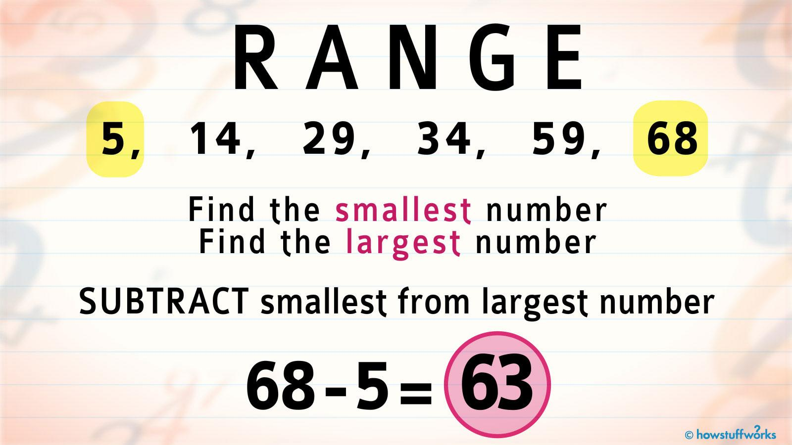

## Table of Contents

## What is the basic definition of range in mathematics?

In mathematics, the range is a term used to describe the difference between the highest and lowest values in a set of numbers. It's a simple way to understand how spread out the numbers are. For example, if you have the numbers 3, 7, and 12, the range would be 12 minus 3, which equals 9.

The range is often used in statistics to get a quick idea of the spread of data. It's easy to calculate and gives you a basic understanding of variability. However, it only considers the two extreme values and doesn't tell you about the distribution of the other numbers in the set.

## How is the range calculated for a set of numbers?

To find the range of a set of numbers, you first need to look at all the numbers in the set. Then, you find the biggest number and the smallest number. The range is simply the difference between these two numbers. For example, if you have the numbers 5, 10, 15, and 20, the biggest number is 20 and the smallest is 5. So, the range is 20 minus 5, which equals 15.

The range is a useful way to see how spread out the numbers are. It's easy to figure out because you only need to know the highest and lowest numbers. But, it doesn't tell you everything about the numbers in between. If you have the numbers 1, 2, 3, and 100, the range would be 100 minus 1, which is 99. This shows a big spread, but it doesn't show that most of the numbers are actually close together.

## Can you explain the difference between range and other measures of dispersion like variance and standard deviation?

Range, variance, and standard deviation are all ways to measure how spread out a set of numbers is, but they do it differently. Range is the simplest one. It's just the difference between the biggest and smallest number in your set. It's quick and easy to calculate, but it only tells you about the extremes and not about the numbers in between. For example, if you have the numbers 1, 2, 3, and 100, the range would be 99, but it doesn't show that most of the numbers are actually close together.

Variance and standard deviation, on the other hand, look at how far each number is from the average, or mean, of the set. Variance is the average of the squared differences from the mean. It's a bit more complicated to calculate, but it gives you a better idea of the spread of all the numbers, not just the biggest and smallest. Standard deviation is the square root of the variance, and it's useful because it's in the same units as the original numbers. This makes it easier to understand and compare. Both variance and standard deviation give you a more complete picture of how spread out the data is compared to the range.

## How does the concept of range apply to functions in mathematics?

In mathematics, when we talk about functions, the range means something a bit different from what we talked about before. For a function, the range is all the possible outputs you can get when you put different numbers into the function. Think of it like a machine: you put a number in, the machine does something to it, and then it spits out a new number. The range is all the different numbers the machine can spit out, no matter what number you put in.

Let's use a simple example to make it clearer. Say you have a function like f(x) = x^2. If you put in any number, like 2, the function will give you 4 because 2^2 equals 4. If you put in -2, you'll also get 4 because (-2)^2 is also 4. So, no matter what number you put in, the output will always be a positive number or zero. That means the range of this function is all the numbers that are zero or bigger. It doesn't include any negative numbers because the function can't give you a negative output.

## What is the range of a function and how is it determined?

The range of a function is all the possible outputs you can get from the function. It's like a list of all the numbers that the function can produce when you put in different numbers. For example, if you have a function that doubles any number you put in, like f(x) = 2x, the range will be all the numbers you can get by doubling any number. If you put in 1, you get 2. If you put in -3, you get -6. So, the range of this function is all the numbers, positive or negative.

To find the range of a function, you need to look at what happens to the output when you put in different numbers. You can do this by trying different numbers or by using math to figure it out. For example, with the function f(x) = x^2, you can see that no matter what number you put in, the output will always be zero or a positive number. So, the range of f(x) = x^2 is all the numbers that are zero or bigger. It's a bit like solving a puzzle to see what all the possible answers can be.

## How can the range be used to describe data sets in statistics?

The range is a simple way to describe how spread out the numbers in a data set are. It's just the difference between the biggest and smallest number in your set. For example, if you have test scores of 60, 70, 80, and 90, the range would be 90 minus 60, which equals 30. This tells you that the scores are spread out over 30 points. The range is easy to find and gives you a quick idea of the spread, but it only looks at the two extreme numbers and doesn't tell you anything about the numbers in between.

While the range is useful for a quick look at how spread out your data is, it has its limits. It doesn't give you a full picture of the data because it ignores all the numbers that aren't the highest or lowest. For example, if you have the numbers 1, 2, 3, and 100, the range would be 99, which sounds like a big spread. But really, most of the numbers are close together. So, while the range is a good starting point to understand the spread of your data, you might want to use other measures like variance or standard deviation to get a more complete picture.

## What are some common misconceptions about the range in mathematics?

One common misconception about the range in mathematics is that it tells you everything about how spread out the numbers in a set are. People might think that if the range is big, all the numbers must be far apart. But that's not true. The range only looks at the biggest and smallest numbers and doesn't say anything about the numbers in between. For example, if you have the numbers 1, 2, 3, and 100, the range is 99, which sounds like a big spread. But really, most of the numbers are close together.

Another misconception is that the range is the same thing as the average or the middle number of a set. The range is just the difference between the highest and lowest numbers, and it doesn't tell you anything about the average or the middle. The average, or mean, is found by adding up all the numbers and dividing by how many there are. The middle number, or median, is the number that's right in the middle when you line up all the numbers from smallest to biggest. So, the range is a different kind of measure that only looks at the spread, not the center of the data.

## How does the range affect the interpretation of data in real-world scenarios?

The range gives us a quick way to see how spread out the numbers in a set are. In real life, this can help us understand things like how different people's test scores are, how much temperatures change over a day, or how much prices can vary for the same product. For example, if a teacher looks at the range of test scores in a class, a big range might mean some students did really well while others struggled. This could show the teacher that they need to help some students more or change how they teach.

But the range has its limits. It only looks at the highest and lowest numbers, so it might not tell the whole story. Imagine a town where the temperature one day goes from 60 degrees to 65 degrees. The range is 5 degrees, which sounds small. But what if the temperature stayed at 60 degrees for most of the day and then suddenly jumped to 65 degrees for just a few minutes? The range wouldn't show that the temperature was mostly steady. So, while the range is a good starting point, we need to use other measures like the average or the middle number to get a fuller picture of the data.

## Can the range be used effectively in higher-dimensional data analysis?

When we talk about higher-dimensional data, like data with more than two or three numbers for each point, using the range can be tricky. The range is just the difference between the biggest and smallest number in a set. In higher dimensions, you have many sets of numbers, and looking at the range for each set can give you some idea of how spread out the data is in each direction. But it doesn't tell you how the numbers are spread out together in all the dimensions at once.

For example, imagine you have data about different fruits, and each fruit has numbers for weight, size, and sweetness. You can find the range for weight, the range for size, and the range for sweetness. But these ranges don't show you how weight, size, and sweetness change together. To understand higher-dimensional data better, you might need to use other ways to measure spread, like looking at how far each point is from the middle in all directions at the same time. So, while the range can give you a quick look at how spread out the data is in each dimension, it's not enough by itself to understand the whole picture in higher dimensions.

## What are the limitations of using range as a statistical measure?

The range is a simple way to see how spread out numbers are, but it has some big limits. It only looks at the biggest and smallest numbers in a set, so it doesn't tell you anything about the numbers in between. For example, if you have the numbers 1, 2, 3, and 100, the range is 99, which sounds like a big spread. But really, most of the numbers are close together. So, the range can be misleading because it doesn't show you the whole picture of how the numbers are spread out.

Another problem with the range is that it can be affected a lot by just one number that's way bigger or smaller than the others. These numbers are called outliers, and they can make the range much bigger than it would be without them. For example, if you have test scores of 70, 75, 80, and 200, the range is 130, but most of the scores are actually pretty close together. So, the range can be thrown off by just one unusual number, which makes it less useful for understanding the data.

## How do advanced statistical methods extend or refine the concept of range?

Advanced statistical methods go beyond the simple idea of range by looking at how numbers are spread out in more detail. Instead of just finding the difference between the highest and lowest numbers, these methods look at how all the numbers are spread out. For example, variance and standard deviation measure how far each number is from the average. This gives a better picture of the spread because it takes into account every number in the set, not just the extremes. These measures can show if the numbers are tightly clustered around the average or if they are spread out a lot.

Another way advanced methods refine the concept of range is by dealing with higher-dimensional data. When you have data with many different parts, like measurements of different things, just looking at the range for each part doesn't tell you how all the parts work together. Methods like principal component analysis or multidimensional scaling can help you see how the data is spread out in all the dimensions at once. This gives a fuller picture of the spread and can help you find patterns or relationships that the simple range wouldn't show.

## What are some cutting-edge research areas involving the concept of range in mathematics?

One cutting-edge area of research involving the concept of range in mathematics is in the field of [machine learning](/wiki/machine-learning) and data science. Researchers are working on ways to use the range, along with other measures of spread, to better understand and predict patterns in big data sets. For example, they might look at the range of values in different features of the data to see how much they vary and how that affects the outcomes they're trying to predict. This can help improve algorithms that learn from data, making them more accurate and useful in real-world applications like predicting stock prices or diagnosing diseases.

Another area where the concept of range is being explored is in the study of complex systems and networks. Scientists are interested in how the range of values in different parts of a network can affect its overall behavior. For instance, in a social network, the range of the number of connections people have can tell us about the structure of the network and how information spreads through it. By studying these ranges, researchers can develop better models of how networks work and how they can be influenced or controlled, which has applications in fields like epidemiology, where understanding the spread of diseases through networks is crucial.

## What is the concept of range in mathematics?

Range, in mathematical terms, is defined as the difference between the maximum and minimum values of a given data set. This concept is crucial for data analysis as it provides insights into the variability or spread of the data set. In the context of trading, the range is used to measure the difference between the highest and lowest prices of a market over a specific time frame.

For instance, if a stock's highest price in a day is $150 and the lowest is $130, the range is calculated as:

$$
\text{Range} = \text{Maximum Price} - \text{Minimum Price} = 150 - 130 = 20
$$

This $20 range indicates the extent of price movement within that day.

A wide range in trading signals high [volatility](/wiki/volatility-trading-strategies), as it shows significant price movement within the given period. High volatility often presents both opportunities and risks, as potential returns can be substantial, but so can potential losses. Conversely, a narrow range suggests price stability, characteristic of less turbulent markets where price movements are relatively subdued.

By calculating the range, traders can make informed assessments regarding potential risks and returns on their trades. A wider range may indicate the possibility of substantial gains, but with increased risk, while a narrower range might suggest a more stable trading environment but potentially lower returns. This understanding aids in defining trade entry and [exit](/wiki/exit-strategy) points, optimizing strategies based on market conditions.

## What are the applications of range in trading strategies?

Range trading strategies are crucial in financial markets, allowing traders to capitalize on predictable price movements within a defined boundary. The fundamental principle involves purchasing securities at the lower end of a price range and selling them at the upper end, thereby profiting from the oscillations in value.

Utilizing range can play a significant role in predicting trends and market movements. By assessing historical price data, traders can identify support and resistance levels—zones where prices consistently encounter buying or selling pressure. When a market price approaches these levels, traders anticipate reversals or breakouts, offering opportunities for strategic trades.

Technical indicators are instrumental in range-based trading. Bollinger Bands and Moving Averages are two popular tools that depend on range calculations to function effectively.

**Bollinger Bands** construct a range around a moving average through two standard deviations. As a result, they form an envelope around price movements to indicate potential overbought or oversold conditions. For instance, when prices touch the upper band, the market may be overbought, signaling a potential sell. Conversely, a touch on the lower band may suggest an oversold condition, indicating a buying opportunity.

Mathematically, Bollinger Bands are represented as:

$$

\text{Upper Band} = \text{SMA}(n) + k \times \sigma 
$$

$$

\text{Lower Band} = \text{SMA}(n) - k \times \sigma 
$$

where $\text{SMA}(n)$ is the simple moving average of $n$ periods, $k$ is the number of standard deviations, and $\sigma$ represents the standard deviation.

**Moving Averages** also rely on range for smoothing price data, which helps in trend identification by eliminating short-term fluctuations. A common strategy is to use a combination of moving averages to generate buy and sell signals, such as the Moving Average Crossover strategy. When a shorter-term moving average crosses above a longer-term moving average, it signals a buy, whereas a cross below indicates a sell.

In implementation, Python provides robust libraries for these calculations. For instance, Bollinger Bands can be computed using the `pandas` library:

```python
import pandas as pd

def compute_bollinger_bands(price_data, window=20, num_std_dev=2):
    rolling_mean = price_data.rolling(window).mean()
    rolling_std = price_data.rolling(window).std()
    upper_band = rolling_mean + (rolling_std * num_std_dev)
    lower_band = rolling_mean - (rolling_std * num_std_dev)
    return rolling_mean, upper_band, lower_band

# Example usage with a pandas DataFrame 'data' and a price column 'close':
mean, upper, lower = compute_bollinger_bands(data['close'])
```

Range trading strategies, enriched by such technical indicators, empower traders to make informed decisions, enhancing their ability to predict price movements and engage in profitable transactions. However, while effective, these strategies require careful analysis and consideration of market conditions to mitigate risks associated with false signals and unexpected market shifts.

## How do you calculate the range for trading?

To calculate the range in trading, determine the highest and lowest values of a price series over a given period, and subtract the lowest value from the highest. Mathematically, this can be expressed as:

$$
\text{Range} = \text{Max} - \text{Min}
$$

For example, if a day's trading prices oscillate between a maximum of \$1265 and a minimum of \$1246, the range is:

$$
1265 - 1246 = 19
$$

Computational tools and software facilitate the process of calculating and visualizing trading ranges, making it easier for traders to analyze large volumes of historical data. Python, a widely-used programming language in the finance industry, provides robust libraries for data analysis and visualization.

Using the `pandas` library, a Python script for calculating the range over a dataset could look like this:

```python
import pandas as pd

# Sample trading data
data = {'Price': [1246, 1250, 1260, 1265, 1255, 1249]}
df = pd.DataFrame(data)

# Calculate the range
max_price = df['Price'].max()
min_price = df['Price'].min()
range_value = max_price - min_price

print("Trading Range: ", range_value)
```

Aside from Python, various trading platforms and analytical tools offer functionalities to compute ranges automatically. For instance, platforms like MetaTrader and NinjaTrader provide in-built tools for range calculation and visualization. Additionally, traders can leverage spreadsheet software like Excel for simpler range calculations using built-in functions.

By utilizing these computational resources, traders can effectively assess market conditions and make informed trading decisions.

## References & Further Reading

[1]: Bergstra, J., Bardenet, R., Bengio, Y., & Kégl, B. (2011). ["Algorithms for Hyper-Parameter Optimization."](https://papers.nips.cc/paper/4443-algorithms-for-hyper-parameter-optimization) Advances in Neural Information Processing Systems 24.

[2]: ["Advances in Financial Machine Learning"](https://www.amazon.com/Advances-Financial-Machine-Learning-Marcos/dp/1119482089) by Marcos Lopez de Prado

[3]: ["Evidence-Based Technical Analysis: Applying the Scientific Method and Statistical Inference to Trading Signals"](https://www.amazon.com/Evidence-Based-Technical-Analysis-Scientific-Statistical/dp/0470008741) by David Aronson

[4]: ["Machine Learning for Algorithmic Trading"](https://github.com/stefan-jansen/machine-learning-for-trading) by Stefan Jansen

[5]: ["Quantitative Trading: How to Build Your Own Algorithmic Trading Business"](https://books.google.com/books/about/Quantitative_Trading.html?id=j70yEAAAQBAJ) by Ernest P. Chan