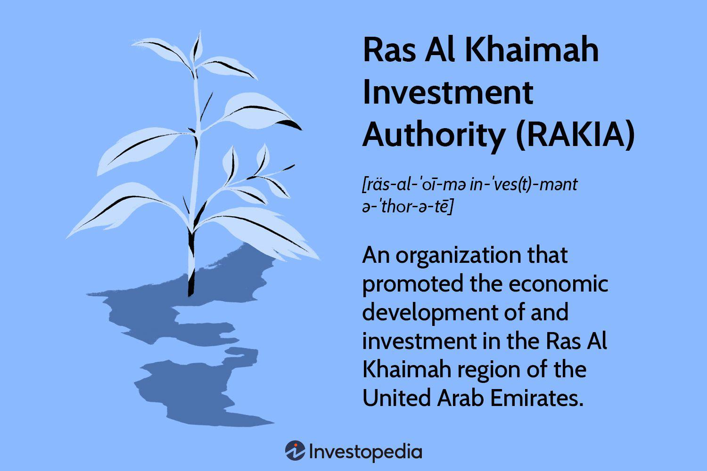

Investment opportunities are increasingly dynamic, and the spotlight is turning towards emerging markets like Ras Al Khaimah. This emirate, recognized for its strategic economic initiatives, is gaining momentum, largely due to the significant contributions of the Ras Al Khaimah Investment Authority (RAKIA). Established with the mission of advancing economic growth in the United Arab Emirates, RAKIA is central to this transformation. 

With the rise of algorithmic trading, a method that revolutionizes financial markets through the use of complex mathematical models and high-speed trading decisions, RAKIA's strategic focus is particularly noteworthy. This technology reduces human error and leverages efficient data processing, making it an invaluable asset for optimizing yields and enhancing market operations across various asset classes including stocks, forex, commodities, and derivatives.



The purpose of this article is to highlight RAKIA's influence on the integration of such advanced trading technologies and how it fosters industrial growth and investment. By forming collaborative ventures with global investors, RAKIA has cultivated an environment that solidifies Ras Al Khaimah's position as a crucial economic hub. Through thoughtful partnerships and strategic planning, RAKIA enables the emirate to attract and sustain international interest, setting a robust foundation for future financial endeavors.

## Table of Contents

## Overview of Ras Al Khaimah Investment Authority (RAKIA)

Ras Al Khaimah Investment Authority (RAKIA) was established in 2005 as a governmental body tasked with catalyzing economic development in Ras Al Khaimah, a region within the United Arab Emirates (UAE). RAKIA plays a pivotal role in attracting both domestic and international investments, aiming to bolster industrial growth within the emirate. By fostering an investor-friendly environment, RAKIA contributes significantly to the economic diversification efforts in the UAE.

One of RAKIA's noteworthy achievements is its instrumental role in the founding of the Ras Al Khaimah Economic Zone (RAKEZ) in 2017. RAKEZ offers a business-friendly hub that provides both free zone and non-free zone facilities, catering to a wide array of industries and business types. This flexibility and competitive offering attract investors who seek a conducive environment for business operations, allowing for the establishment of a robust business ecosystem within Ras Al Khaimah.

RAKIA's strategic initiatives are designed to create a sustainable ecosystem for investors, manufacturers, and enterprises. This involves developing infrastructure, formulating investor-centric policies, and ensuring streamlined processes that reduce the complexities often associated with starting and operating businesses. By delivering such services, RAKIA aims not only to draw investments but also to retain them for the long term, ensuring that investors can operate efficiently and profitably.

Through these efforts, RAKIA establishes Ras Al Khaimah as a formidable player on the global investment stage, contributing to the broader economic objectives of the UAE and positioning the emirate as an attractive destination for investments across diverse sectors.

## Understanding Algorithmic Trading

Algorithmic trading involves the use of complex mathematical algorithms to automate trading decisions, executing orders at speeds and frequencies that are impossible for human traders to match. This technological advancement significantly enhances the efficiency and accuracy of trading in financial markets. By relying on algorithms, which are essentially sequences of rules or instructions, trades can be executed based on predefined criteria without the need for continuous human intervention. 

One of the key benefits of [algorithmic trading](/wiki/algorithmic-trading) is its ability to manage large volumes of data effectively. With the rapid influx of market data, algorithmic systems can process information at vast scales and speeds, adjusting trading strategies in real-time based on data-driven insights. This capacity to handle data efficiently ensures that trading decisions are made using the most current information, providing a significant advantage in fast-paced markets.

In addition to efficiency, algorithmic trading minimizes the impact of human error and emotional bias, which can often skew judgment and lead to suboptimal trading decisions. By adhering to strictly coded rules, this type of trading reduces the risk of decisions being influenced by emotions such as fear or greed, thereby optimizing returns. This is particularly appealing for yield optimization because it prioritizes logic and data over instinct and emotion.

The popularity of algorithmic trading spans various asset classes, including stocks, foreign exchange ([forex](/wiki/forex-system)), commodities, and derivatives. Each asset class may involve different strategies and algorithms tailored to its unique characteristics and market dynamics. For instance, high-frequency trading ([HFT](/wiki/high-frequency-trading-strategies)) strategies are prevalent in equities and forex markets, where speed is critical to exploit small price movements. Likewise, algorithms in commodities may focus on patterns related to seasonality or supply-demand imbalances.

Fundamental understanding of algorithmic trading is vital for institutional investors seeking strategic advantages. As these investors often deal with large portfolios, implementing algorithmic trading can lead to more strategic allocation of assets, better risk management, and improved [liquidity](/wiki/liquidity-risk-premium). Additionally, the strategic use of algorithms allows institutional investors to uncover [arbitrage](/wiki/arbitrage) opportunities and execute trades that would be unfeasible manually due to their complexity and time sensitivity.

Algorithmic trading is not without its complexities and requires a sound understanding of both market dynamics and computational techniques. For those looking to engage in algorithmic trading, proficiency in programming and a strong grasp of mathematics and statistical methods are essential. These skills allow traders to develop, test, and refine their algorithms to ensure they perform effectively under different market conditions. 

To illustrate, a simple algorithmic strategy in Python might involve moving average crossovers—a common approach where buy and sell signals are generated based on the relationship between short-term and long-term moving averages:

```python
import numpy as np
import pandas as pd

# Sample data: closing prices
data = pd.Series([100, 102, 104, 103, 105, 106, 104, 108, 110, 112])

# Calculate short-term and long-term moving averages
short_window = 3
long_window = 5
short_mavg = data.rolling(window=short_window, min_periods=1).mean()
long_mavg = data.rolling(window=long_window, min_periods=1).mean()

# Generate signals: 1 for buy, -1 for sell
signals = np.where(short_mavg > long_mavg, 1, -1)

print(signals)
```

Such algorithms, while simple, form the foundation of more complex strategies that can be built upon to achieve sophisticated trading objectives. Institutional investors, in particular, leverage these capabilities to gain a competitive edge, fine-tune their investment models, and adapt swiftly to market changes.

## RAKIA's Role in Promoting Algorithmic Trading

Ras Al Khaimah Investment Authority (RAKIA) plays a significant role in promoting algorithmic trading within the emirate's budding investment landscape. The authority actively encourages the adoption of advanced trading technologies by formulating strategic partnerships aimed at fostering knowledge transfer and infrastructure development.

RAKIA collaborates with financial institutions and technology providers to integrate sophisticated algorithmic trading systems into Ras Al Khaimah's investment ecosystem. These collaborations help in building the necessary infrastructure that supports seamless operations of algorithmic trading, thereby enhancing the efficiency and accuracy of financial transactions. RAKIA's efforts ensure that the trading technology meets international standards, which further facilitates the integration into existing financial systems.

Central to RAKIA's strategy is the Ras Al Khaimah Economic Zone (RAKEZ), which offers an attractive environment for tech-driven financial institutions. Under RAKIA's leadership, RAKEZ provides incentives such as tax advantages, robust legal support, and state-of-the-art facilities for institutions looking to establish their operations. These incentives are designed to draw global financial firms to Ras Al Khaimah, thereby contributing to the emirate's transformation into a hub of financial innovation.

Furthermore, RAKIA's regulatory frameworks are tailored to support the incorporation of algorithmic trading technologies. These frameworks are crucial in ensuring compliance with international regulations while also accommodating the rapid technological advancements in trading techniques. This positioning not only improves the liquidity and efficiency of financial markets in Ras Al Khaimah but also enhances its reputation as a forward-thinking center for investment.

Overall, RAKIA's proactive approach and supportive infrastructure play a critical role in boosting the emirate's standing in the global economy. By championing algorithmic trading, RAKIA not only improves trading efficiencies but also fosters Ras Al Khaimah’s evolution as a key player in the innovative financial sector.

## Benefits of Algorithmic Trading in Ras Al Khaimah

Algorithmic trading has emerged as a significant instrument in optimizing trading efficiency within Ras Al Khaimah, primarily due to its capacity for precise market analysis and rapid execution of trades. This advancement is essential for maintaining a competitive edge in the ever-evolving financial markets. With the support of the Ras Al Khaimah Investment Authority (RAKIA), the local infrastructure has been significantly enhanced to reduce operational costs and decrease trade execution times. Such improvements are crucial for attracting investors who prioritize efficiency and cost-effectiveness in their trading strategies.

The automation and algorithmic strategies help in mitigating the [volatility](/wiki/volatility-trading-strategies) risks and increasing market liquidity, offering investors a stable trading environment. By facilitating quicker and more accurate trade executions, these systems enhance market depth and liquidity, enabling larger volumes of transactions without disproportionately impacting the market or incurring significant risks.

Global financial institutions recognize the opportunities offered by Ras Al Khaimah's cutting-edge trading technology, leading to an increase in foreign investment. The presence of this advanced trading infrastructure not only garners high levels of foreign interest but also injects capital and technological expertise into the region. This influx plays a vital role in diversifying the economy of Ras Al Khaimah, ensuring economic stability and resilience.

Furthermore, the technological advancements in algorithmic trading support the creation of a dynamic economic ecosystem. This environment is conducive to attracting skilled professionals and financial experts, thereby increasing the intellectual capital and innovation capacity within the region. Such developments lay the groundwork for sustainable economic growth and solidify Ras Al Khaimah's status as a hub for financial innovation and investment.

## Challenges and Future Prospects

Algorithmic trading, while offering demonstrable efficiency and precision, presents several challenges, particularly in regulatory compliance and technological sustainability. Ensuring data security is one of the primary concerns for the Ras Al Khaimah Investment Authority (RAKIA) as the region embraces algorithmic trading. This segment requires robust cybersecurity measures to protect sensitive financial data from breaches and unauthorized access. Complying with international trading standards is equally crucial, demanding rigorous adherence to regulations such as the Markets in Financial Instruments Directive (MiFID II) and others relevant to global trading activities.

To address potential risks, RAKIA is committed to continuous investment in technology and the evolution of its regulatory framework. This involves updating risk management protocols and investing in state-of-the-art trading systems capable of managing high-frequency trading demands and ensuring operational resilience. Moreover, fostering an environment conducive to innovation requires an adaptive regulatory stance, one that encourages growth while safeguarding market integrity.

The prospects for trading in Ras Al Khaimah look favorable, given the proactive steps taken by RAKIA. By incorporating advanced trading technologies and frameworks, the emirate is positioning itself to align with global market trends. This adaptive approach not only enhances Ras Al Khaimah's competitiveness but also sets a benchmark for emerging markets looking to integrate algorithmic trading practices.

RAKIA's strategic foresight and commitment to technology make it a model for others in the investment landscape. By focusing on innovation and effective risk management, RAKIA is establishing a sustainable trading ecosystem, essential for attracting and retaining global investors who seek a secure and dynamic market environment. As markets continue to evolve, RAKIA's role in shaping and enhancing Ras Al Khaimah's investment appeal is assured, paving the way for a technologically advanced and economically robust future.

## Conclusion

RAKIA's initiatives in supporting algorithmic trading highlight its dedication to promoting economic growth in Ras Al Khaimah. By adopting advanced technology, RAKIA is effectively converting the emirate into a center for innovation and sustainable development. The implementation of a strategic framework and forward-thinking policies by RAKIA sets a solid foundation for future advancements in financial trading. This infrastructure appeals to investors who consider Ras Al Khaimah an attractive destination for algorithmic trading, as they benefit from modern infrastructure and supportive regulatory measures. As global markets continue to change, RAKIA is poised to remain an influential player in shaping the investment landscape of the UAE, ensuring the region's competitive edge in the financial sector.

## References & Further Reading

[1]: Lopez de Prado, M. (2018). ["Advances in Financial Machine Learning"](https://www.amazon.com/Advances-Financial-Machine-Learning-Marcos/dp/1119482089). Wiley.

[2]: Chan, E. P. (2009). ["Quantitative Trading: How to Build Your Own Algorithmic Trading Business"](https://github.com/ftvision/quant_trading_echan_book). Wiley.

[3]: Aronson, D. R. (2006). ["Evidence-Based Technical Analysis: Applying the Scientific Method and Statistical Inference to Trading Signals"](https://www.amazon.com/Evidence-Based-Technical-Analysis-Scientific-Statistical/dp/0470008741). Wiley.

[4]: Jansen, S. (2018). ["Machine Learning for Algorithmic Trading"](https://github.com/stefan-jansen/machine-learning-for-trading). Packt Publishing.

[5]: Bergstra, J., Bardenet, R., Bengio, Y., & Kégl, B. (2011). ["Algorithms for Hyper-Parameter Optimization."](https://dl.acm.org/doi/10.5555/2986459.2986743) Advances in Neural Information Processing Systems 24.