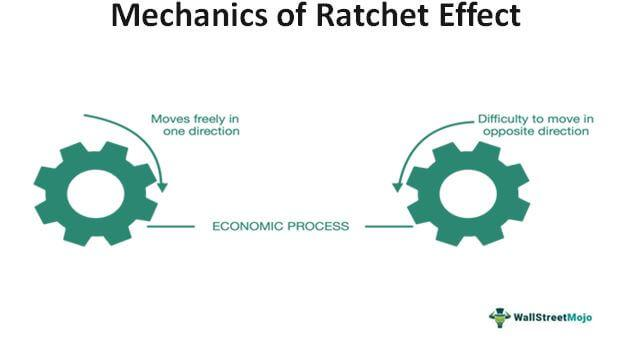

The ratchet effect is a fascinating concept in economics, describing how certain processes become difficult to reverse once they have been initiated. Originating in the field of political economy, the ratchet effect shows how economic systems can become locked into a particular direction due to feedback mechanisms and changing incentives. This concept is widely applicable, influencing various economic dynamics, market behaviors, and even algorithmic trading practices.

In economics, the ratchet effect can explain why public expenditure sometimes remains high even after the initial conditions prompting increased spending have dissipated. As governments implement temporary measures in response to crises, these actions can become entrenched, making it challenging to revert to previous spending levels. Similarly, in markets, businesses may find themselves unable to scale back on capital investments and production levels due to sunk costs and competitive pressures, illustrating the ratchet effect's pervasive impact.



Algorithmic trading exemplifies the ratchet effect through automated strategies that adapt to performance metrics, further cementing market trends once they are initiated. These strategies, if not managed properly, have the potential to magnify trends, introducing systemic risks to financial markets. Understanding the ratchet effect is essential for developing adaptable strategies that can respond to dynamic market conditions and prevent adverse outcomes.

By exploring the ratchet effect, we aim to uncover its mechanisms and examine its broader implications. Insights gained from this analysis are valuable for economists, investors, and traders who seek to navigate complex economic landscapes. Recognizing the conditions that contribute to the ratchet effect and devising strategies to mitigate its impact can lead to more robust economic policies and flexible trading systems.

## Table of Contents

## Understanding the Ratchet Effect

The ratchet effect is a characteristic behavior in economic systems, where a process is simple to start but difficult to reverse, similar to a ratchet tool that permits movement in only one direction. It emerges from intricate feedback loops and the alteration of incentives or expectations, making it inherently self-perpetuating.

The essence of the ratchet effect is found in its capacity to create sustained changes, often through feedback mechanisms. Once a policy or behavior is put in place, it tends to become ingrained due to altered expectations, even when the initial conditions that caused the change are no longer present. This creates a scenario where additional interventions or changes can compound the effect, making it challenging to revert to a previous state. For example, in the context of government spending, temporary measures taken during an economic crisis can become permanent features, as expectations of continued support grow among beneficiaries and political and social pressures make it hard to withdraw such measures.

The ratchet effect also resembles a positive feedback loop, where an initial change leads to outcomes that encourage further changes in the same direction. This can amplify the initial impact, sometimes resulting in abrupt and disruptive shifts if supporting conditions deteriorate. For instance, in business practices, once a company adapts to a new production method in response to competitive pressures and the inertia of sunk costs, it might be more difficult to reverse or abandon such methods, even if they are no longer optimal. The phenomenon is akin to an optimization problem where the dynamic constraints tighten over time, necessitating advanced algorithms to cautiously unwind the intricate dependencies formed by initial conditions and subsequent adaptations.

In mathematical terms, consider a scenario where an economic variable $x_t$ evolves over time based on a recursive relationship influenced by past values:

$$
x_{t+1} = f(x_t) + g(t, P)
$$

where $f(x_t)$ embodies the feedback mechanism, $g(t, P)$ represents external interventions depending on time $t$ and parameters $P$. The ratchet effect is observed when $f(x_t)$ induces a change in $x_{t+1}$ rendering $x$ resilient to reductions unless a significant opposing force is applied.

Understanding the dynamics of the ratchet effect is crucial for economic analysts and policymakers. It allows for the identification of irreversible paths and offers insights into designing interventions that can either leverage or mitigate the ratchet effect's impact, ensuring systems remain adaptable and stable.

## Applications in Economic Dynamics

The ratchet effect manifests prominently in economic dynamics, particularly within political economy, business operations, and consumer behavior. During periods of crisis, governments often implement temporary public spending measures to stabilize the economy. However, these measures tend to become permanent, even after the crisis subsides, reflecting the ratchet effect's influence. This permanence often results from political and social pressures to uphold benefits or services, thus entrenching higher levels of spending in the government's budget.

In the business sector, the ratchet effect is observable in investment decisions and production processes. Companies often face sunk costs—expenses that cannot be recovered once incurred. These sunk costs, coupled with competitive pressures, dissuade firms from retracting once they have committed resources to a particular line of production or market expansion. This effect can lead to overcapacity or continued investment in non-profitable ventures, as reversing such decisions becomes economically and strategically challenging due to the initial investments already made.

Furthermore, consumer behavior is susceptible to the ratchet effect. Once consumers adapt to a certain level of expenditure or lifestyle, scaling back becomes difficult. This entrenchment can be seen in various spending habits, where consumers resist reducing their consumption levels even amid financial constraints. Behavioral economics suggests that such resistance is due to loss aversion—the tendency to prefer avoiding losses over obtaining equivalent gains. This behavioral trait supports the ratchet effect by reinforcing existing consumption patterns and making them hard to reverse.

Overall, the persistence of the ratchet effect across these economic aspects signifies its profound role in shaping economic dynamics, often making processes difficult to unwind once they've been initiated.

## The Ratchet Effect in Algorithmic Trading

Algorithmic trading, which involves using computer algorithms to execute trades at optimal speeds and efficiencies, is susceptible to the ratchet effect. This occurs when trading systems, often designed to leverage historical performance data, lock into specific strategies that are difficult to reverse. The ratchet effect manifests notably in automated trading environments where feedback loops can enhance market trends, potentially inducing systemic risks.

When an algorithmic strategy demonstrates success, it can attract more capital and increase trade volumes, thereby reinforcing its market impact. For instance, a [momentum](/wiki/momentum)-based trading algorithm, which buys assets with rising prices and sells those with declining prices, can exacerbate existing trends by increasing market [volatility](/wiki/volatility-trading-strategies) as more traders adopt the same strategy. As these strategies grow, they may distort asset prices, creating feedback loops that further fuel price movements.

To exemplify, consider a simplified Python snippet for a momentum trading strategy:

```python
import pandas as pd

def momentum_strategy(prices, short_window=20, long_window=50):
    signals = pd.DataFrame(index=prices.index)
    signals['price'] = prices
    signals['short_mavg'] = prices.rolling(window=short_window, min_periods=1).mean()
    signals['long_mavg'] = prices.rolling(window=long_window, min_periods=1).mean()
    signals['signal'] = 0.0

    signals['signal'][short_window:] = np.where(
        signals['short_mavg'][short_window:] > signals['long_mavg'][short_window:], 1.0, -1.0)

    signals['positions'] = signals['signal'].diff()

    return signals
```

This example highlights how trading strategies based on past performance metrics can trigger the ratchet effect. Here, the strategy generates buy (1) or sell (-1) signals based on the crossover of short and long moving averages, potentially locking the algorithm into a pattern that amplifies existing market trends.

Moreover, the ratchet effect in [algorithmic trading](/wiki/algorithmic-trading) underscores the importance of adaptability in algorithm design. A critical strategy to mitigate this involves diversifying the algorithms or incorporating adaptive mechanisms that reassess risk parameters in real-time. Machine learning models, particularly those employing [reinforcement learning](/wiki/reinforcement-learning), offer a solution by continuously optimizing strategies in response to changing market conditions.

Adopting [machine learning](/wiki/machine-learning) techniques can help design algorithms that better anticipate market shifts:

```python
from sklearn.ensemble import RandomForestRegressor
from sklearn.model_selection import train_test_split

# Mock dataset: features as trading signal factors, target as price change
X = data[['factor1', 'factor2', 'factor3']]
y = data['price_change']

X_train, X_test, y_train, y_test = train_test_split(X, y, test_size=0.2, random_state=42)

model = RandomForestRegressor(n_estimators=100, random_state=42)
model.fit(X_train, y_train)

predictions = model.predict(X_test)
```

By incorporating such methodologies, algorithmic trading systems can become more dynamic, reducing the likelihood of becoming overwhelmed by the ratchet effect. As a result, algorithms can avoid entrenching adverse trends, cushioning markets against abrupt adjustments and promoting financial stability. Understanding and anticipating the ratchet effect are crucial for developing resilient systems capable of thriving even under fluctuating economic conditions.

## Implications and Challenges

The ratchet effect presents a complex array of challenges across policy-making, business strategy, and trading domains due to its inherent tendency to create irreversible processes. This rigidity necessitates the development of innovative solutions to mitigate potential adverse outcomes.

In policy-making, the ratchet effect often manifests in fiscal policies where temporary measures, such as increased public spending during crises, become entrenched, leading to sustained budget deficits. Policymakers need to identify and manage conditions like these to prevent such irreversible trajectories that can jeopardize long-term economic stability. An essential strategy is implementing robust frameworks that periodically reassess and adapt policies to current economic realities, thereby preventing the ossification of once-temporary measures.

In the business context, firms experience the ratchet effect when strategic decisions, particularly those involving significant sunk costs, lead to rigid operational processes. This rigidity can result in difficulties adapting to market changes or technological advancements. Businesses must foster a culture of continuous innovation and flexibility, allowing them to pivot and adjust strategies as external conditions evolve. This involves leveraging data analytics and real-time feedback mechanisms to make informed decisions that anticipate and respond to market dynamics.

In trading, algorithmic systems can exhibit ratchet-like characteristics where algorithms, once deployed based on historical performance, continuously reinforce certain trading strategies. This can lead to exacerbation of market trends, increasing systemic risks. Traders and developers should incorporate adaptive algorithms capable of reassessing and adjusting their parameters based on evolving market conditions. Using machine learning models, especially reinforcement learning, can help create algorithms that ‘learn’ and adjust strategies in real-time, minimizing risks associated with rigid trading models.

To effectively manage the challenges posed by the ratchet effect, ongoing research and development in both economic and trading technologies are imperative. Exploring new economic models and improving algorithmic trading frameworks can provide more nuanced insights, leading to better forecasting and mitigation strategies. Further, interdisciplinary research incorporating behavioral economics, data science, and machine learning can offer innovative perspectives on preventing, managing, and, where necessary, reversing ratchet processes.

In summary, tackling the implications of the ratchet effect requires a proactive approach with an emphasis on adaptability, continuous monitoring, and strategic interventions. By anticipating and understanding the potential for ratchet effects, institutions can better navigate the complexities of modern economic and financial systems, ensuring sustainable growth and stability.

## Conclusion

The ratchet effect plays an integral role in enhancing our understanding of economic processes and market behaviors. It underscores the necessity for strategic planning and adaptive management, especially in systems characterized by irreversible changes. By recognizing the persistent and often compounding nature of the ratchet effect, economists and policymakers can develop more robust strategies that accommodate its impact. For example, understanding how feedback loops in public spending or consumer behavior create irreversible trends helps in crafting policies that prevent unsustainable growth or abrupt shocks.

As economic landscapes continue to evolve with increased complexity and automation, insights derived from the ratchet effect become crucial. Simplified financial systems, driven by algorithmic trading, benefit significantly by incorporating principles that account for the ratchet effect. These systems can then better anticipate the kinds of dynamics that lead to amplified trends or systemic risks, thus offering more resilient financial models. Algorithmic trading strategies, for instance, can integrate feedback mechanisms capable of recognizing the onset of ratchet effects, allowing for timely adjustments that mitigate potential adverse outcomes. 

Future advancements in economic policies and algorithmic trading will undoubtedly require a more profound integration of ratchet effect dynamics. By modeling these effects more accurately, such policies and trading strategies can preempt situations where temporary measures or strategies become permanent, risking inefficiencies and systemic instability. 

In conclusion, as we move towards increasingly automated financial systems and more intricate economic environments, adopting a strategic approach grounded in the understanding of the ratchet effect is imperative. This not only aids in the anticipation and management of economic dynamics but also helps in fostering a stable and adaptive economic future.

## References & Further Reading

[1]: Alesina, A., & Perotti, R. (1995). ["The Political Economy of Budget Deficits."](https://www.nber.org/papers/w4637) National Bureau of Economic Research Working Paper No. 4637.

[2]: Samuelson, P. A., & Nordhaus, W. D. (2009). ["Economics"](https://books.google.com/books/about/EBOOK_Economics.html?id=rMovEAAAQBAJ) (19th ed.). McGraw-Hill Education.

[3]: Lopez de Prado, M. (2018). ["Advances in Financial Machine Learning."](https://www.amazon.com/Advances-Financial-Machine-Learning-Marcos/dp/1119482089) Wiley.

[4]: Jansen, S. (2020). ["Machine Learning for Algorithmic Trading."](https://github.com/stefan-jansen/machine-learning-for-trading) Packt Publishing.

[5]: Sornette, D. (2003). ["Why Stock Markets Crash: Critical Events in Complex Financial Systems."](https://www.jstor.org/stable/j.ctt1h1htkg) Princeton University Press.