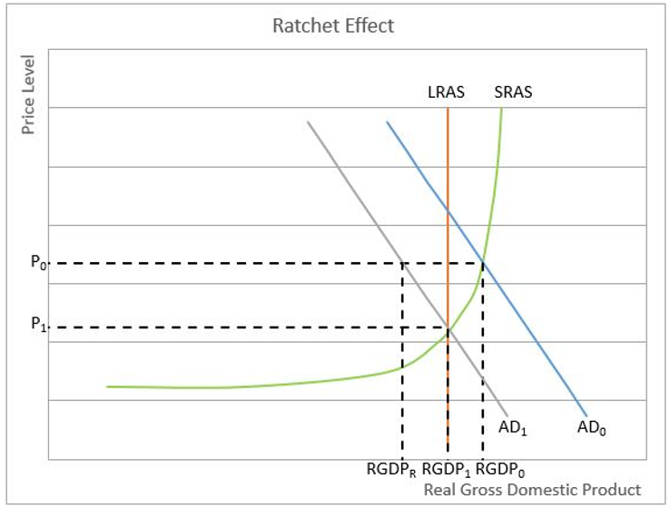

## Table of Contents

## What is the ratchet effect in economics?

The ratchet effect in economics is a concept that describes how certain economic changes are easy to make in one direction but hard to reverse. Imagine a ratchet tool, which you can turn one way easily but can't turn back the other way. In economics, this can happen with things like government spending or wages. For example, during a crisis, a government might increase spending to help the economy. Once the crisis is over, it's often hard to reduce that spending back to the original level because people have gotten used to the higher spending.

This effect can also be seen in wages. When the economy is doing well, workers might get raises. But if the economy starts to struggle, it's hard to lower those wages back to where they were before. Workers expect to keep earning at least as much as they did during the good times. This can make it difficult for businesses to adjust to economic downturns. The ratchet effect shows how some economic changes can become permanent, even when the reasons for those changes go away.

## How does the ratchet effect influence economic policy?

The ratchet effect can make it hard for governments to change economic policies once they are set. For example, if a government increases spending during a bad time, like a recession, it might be hard to cut that spending later. People get used to the extra money and services, and they don't want to lose them. This can lead to bigger government budgets and more debt over time. Policymakers know this, so they might be careful about making big spending changes in the first place.

The ratchet effect also affects wages and prices. When the economy is doing well, wages and prices might go up. But if the economy starts to struggle, it's hard to bring those wages and prices back down. Workers expect to keep [earning](/wiki/earning-announcement) the same amount, and businesses might not want to lower prices after they've raised them. This can make it tough for the economy to adjust to bad times. So, when making economic policies, leaders need to think about how hard it might be to change things later.

## Can you provide a simple example of the ratchet effect in action?

Imagine a city where the government decides to build more parks during a time when the economy is not doing well. They think this will help people feel better and maybe even create some jobs. So, they spend a lot of money on these parks. After a while, the economy gets better, but now the city has to keep spending money to take care of the parks. People love the parks and don't want them to go away. It's hard for the city to stop spending money on the parks, even though they don't need them as much anymore.

This is like a ratchet tool. You can turn it one way easily, but you can't turn it back the other way. The city turned the ratchet by spending more money on parks, and now it's stuck. They can't easily go back to spending less. This is the ratchet effect in action. It shows how some changes in the economy can be hard to undo, even when the reasons for those changes are gone.

## What are the historical origins of the ratchet effect theory?

The idea of the ratchet effect started to be talked about in the 1940s. A man named Milton Friedman, who was a famous economist, helped make this idea more known. He used the ratchet effect to explain why wages and prices could go up easily but were hard to bring back down. Friedman saw this happening after World War II. During the war, the government spent a lot of money, and prices went up. After the war, it was hard to get prices back to where they were before.

Later on, other economists started using the ratchet effect to explain more things in the economy. They saw it in government spending, taxes, and even in how businesses set prices. The idea became important because it showed how some changes in the economy could be hard to undo. This helped people understand why some economic problems kept happening, even when the reasons for those problems went away.

## How does the ratchet effect relate to government spending and taxation?

The ratchet effect can make it hard for the government to change how much it spends or how much it taxes people. Let's say the government decides to spend more money to help the economy during a tough time, like a recession. People get used to the extra help, and when the economy gets better, it's hard for the government to cut back on that spending. If they try, people might get upset because they've come to rely on the extra money or services. This means the government might keep spending more than it planned, even after the tough time is over.

The same thing can happen with taxes. If the government raises taxes to pay for something important, like fixing roads or helping people who are out of work, it can be really hard to lower those taxes later. People start to expect the higher taxes and plan their lives around them. If the government tries to lower taxes, they might not have enough money to keep doing the things people need. So, the ratchet effect makes it tough for the government to go back to spending less or taxing less, even when they want to.

## What are the potential negative impacts of the ratchet effect on an economy?

The ratchet effect can make it hard for an economy to get back to normal after a tough time. Imagine the government spends a lot of money to help during a recession. When the economy gets better, it's hard to stop spending that money. This can lead to bigger government budgets and more debt. If the government keeps spending more than it earns, it can make the economy less stable. It might have to borrow more money or raise taxes, which can slow down economic growth.

The ratchet effect also makes it tough to lower wages and prices when they need to come down. When the economy is doing well, wages and prices might go up. But if the economy starts to struggle, it's hard to bring them back down. Workers expect to keep earning the same amount, and businesses don't want to lower prices after they've raised them. This can make it hard for the economy to adjust to bad times. It might lead to higher unemployment or slower growth because businesses can't cut costs easily.

## How can the ratchet effect be observed in labor markets?

The ratchet effect in labor markets can be seen when wages go up during good economic times but are hard to bring down during bad times. When the economy is doing well, companies might give their workers raises because they can afford it and want to keep their employees happy. Workers get used to earning more money and start to expect those higher wages. But if the economy starts to struggle, it's hard for companies to lower those wages back to where they were before. Workers might quit or go on strike if their pay is cut, so companies often keep paying the higher wages even when they can't really afford it.

This can lead to problems in the labor market. If companies can't lower wages during tough times, they might have to lay off workers instead. This can make unemployment go up and slow down the economy even more. The ratchet effect makes it hard for the labor market to adjust to changes, which can keep wages high even when the economy isn't doing well. This can make it harder for the economy to recover from a downturn because companies have to keep paying more than they might want to.

## Are there any strategies to mitigate the ratchet effect in economic planning?

One way to lessen the ratchet effect in economic planning is to be very careful about making big changes in the first place. If the government knows it will be hard to cut spending or taxes later, they might think twice before raising them too much. They could try to find other ways to help the economy during tough times, like making it easier for businesses to grow or helping people find new jobs. By planning ahead and being careful, the government can avoid getting stuck with high spending or high taxes that are hard to bring back down.

Another strategy is to make changes slowly and in small steps. Instead of making one big change, the government could try making many small changes over time. This way, if they need to reverse the changes later, it's easier to do it little by little. For example, if they need to cut spending, they could do it gradually so people have time to adjust. This can make it less painful for everyone and help avoid the ratchet effect. By being patient and taking small steps, the government can better manage the economy and avoid getting stuck with changes that are hard to undo.

## What role does the ratchet effect play in business cycles?

The ratchet effect can make business cycles harder to manage. During good times, businesses might raise wages and prices. People get used to earning more and paying more. But when the economy starts to struggle, it's hard for businesses to lower wages and prices back to where they were before. Workers expect to keep earning the same amount, and customers don't want to pay more than they have to. This makes it tough for businesses to adjust to bad times. They might have to lay off workers or close down instead of lowering wages, which can make the downturn worse.

Because of the ratchet effect, it can take longer for the economy to recover from a downturn. If businesses can't lower costs easily, they might not be able to start hiring again or investing in new projects. This can slow down the recovery and make the business cycle longer. The ratchet effect shows how some changes during good times can become permanent, making it harder for the economy to bounce back when things get tough.

## How do different economic schools of thought interpret the ratchet effect?

Different economic schools of thought see the ratchet effect in their own way. For example, Keynesian economists believe that the government should spend more money during tough times to help the economy. They know about the ratchet effect and think it's okay if the government can't cut spending back to where it was before. They believe that keeping spending high can help keep the economy stable and growing. On the other hand, classical economists worry a lot about the ratchet effect. They think that if the government spends too much and can't cut back, it will lead to bigger budgets and more debt. They believe this can hurt the economy in the long run.

Monetarists, like Milton Friedman, also worry about the ratchet effect. They think that if the government prints too much money to pay for spending, it can lead to inflation. They believe the ratchet effect can make inflation hard to control because once prices go up, they're hard to bring back down. Austrian economists take a similar view but focus more on how the ratchet effect can lead to bad government policies. They think that if the government keeps spending more and more, it can lead to a bigger government that's harder to control. They believe this can hurt economic freedom and growth.

## Can the ratchet effect be quantified, and if so, how?

Yes, the ratchet effect can be quantified, but it's not easy. Economists look at things like government spending, taxes, wages, and prices over time. They compare how these things change during good times and bad times. For example, they might see that government spending goes up a lot during a recession and stays high even after the economy gets better. They can measure this by looking at the difference between the highest spending level during the recession and the spending level after the recovery. If the spending stays higher than it was before the recession, that's a sign of the ratchet effect.

To measure the ratchet effect in wages, economists can look at average wages during different parts of the business cycle. They might find that wages go up a lot during good times and don't go back down as much during bad times. They can quantify this by calculating the percentage increase in wages during good times and the percentage decrease during bad times. If the decrease is smaller than the increase, it shows the ratchet effect at work. By using these kinds of measurements, economists can see how the ratchet effect impacts different parts of the economy.

## What are some advanced case studies that illustrate the ratchet effect in different economies?

In the United States, the ratchet effect can be seen in government spending after World War II. During the war, the government spent a lot of money on the military and other things. After the war ended, people expected the government to keep spending at the same high level. Even though the war was over, the government found it hard to cut back on spending. They kept spending money on things like social programs and defense. This led to bigger budgets and more debt over time. The ratchet effect made it hard for the government to go back to spending less, even when they wanted to.

Another example is in Japan during the 1990s, when the country went through a long economic downturn called the "Lost Decade." The government tried to help the economy by spending a lot of money on public projects, like building roads and bridges. This helped for a while, but when the economy started to get better, it was hard to stop spending so much. People got used to the extra help from the government and didn't want it to go away. The ratchet effect kept government spending high, even when the economy didn't need it as much. This made it harder for Japan to get back to normal and grow again.

In the European Union, the ratchet effect can be seen in how wages and prices changed after the 2008 financial crisis. Many countries in the EU raised wages and prices during good times before the crisis. When the crisis hit, it was hard to bring those wages and prices back down. Workers expected to keep earning the same amount, and businesses didn't want to lower prices after they had raised them. This made it tough for the economy to adjust to the bad times. The ratchet effect made the downturn last longer and made it harder for these countries to recover.

## What is the Ratchet Effect and how can it be understood?

The ratchet effect is a characteristic behavior in economic systems, where a process is simple to start but difficult to reverse, similar to a ratchet tool that permits movement in only one direction. It emerges from intricate feedback loops and the alteration of incentives or expectations, making it inherently self-perpetuating.

The essence of the ratchet effect is found in its capacity to create sustained changes, often through feedback mechanisms. Once a policy or behavior is put in place, it tends to become ingrained due to altered expectations, even when the initial conditions that caused the change are no longer present. This creates a scenario where additional interventions or changes can compound the effect, making it challenging to revert to a previous state. For example, in the context of government spending, temporary measures taken during an economic crisis can become permanent features, as expectations of continued support grow among beneficiaries and political and social pressures make it hard to withdraw such measures.

The ratchet effect also resembles a positive feedback loop, where an initial change leads to outcomes that encourage further changes in the same direction. This can amplify the initial impact, sometimes resulting in abrupt and disruptive shifts if supporting conditions deteriorate. For instance, in business practices, once a company adapts to a new production method in response to competitive pressures and the inertia of sunk costs, it might be more difficult to reverse or abandon such methods, even if they are no longer optimal. The phenomenon is akin to an optimization problem where the dynamic constraints tighten over time, necessitating advanced algorithms to cautiously unwind the intricate dependencies formed by initial conditions and subsequent adaptations.

In mathematical terms, consider a scenario where an economic variable $x_t$ evolves over time based on a recursive relationship influenced by past values:

$$
x_{t+1} = f(x_t) + g(t, P)
$$

where $f(x_t)$ embodies the feedback mechanism, $g(t, P)$ represents external interventions depending on time $t$ and parameters $P$. The ratchet effect is observed when $f(x_t)$ induces a change in $x_{t+1}$ rendering $x$ resilient to reductions unless a significant opposing force is applied.

Understanding the dynamics of the ratchet effect is crucial for economic analysts and policymakers. It allows for the identification of irreversible paths and offers insights into designing interventions that can either leverage or mitigate the ratchet effect's impact, ensuring systems remain adaptable and stable.

## References & Further Reading

[1]: Alesina, A., & Perotti, R. (1995). ["The Political Economy of Budget Deficits."](https://www.nber.org/papers/w4637) National Bureau of Economic Research Working Paper No. 4637.

[2]: Samuelson, P. A., & Nordhaus, W. D. (2009). ["Economics"](https://books.google.com/books/about/EBOOK_Economics.html?id=rMovEAAAQBAJ) (19th ed.). McGraw-Hill Education.

[3]: Lopez de Prado, M. (2018). ["Advances in Financial Machine Learning."](https://www.amazon.com/Advances-Financial-Machine-Learning-Marcos/dp/1119482089) Wiley.

[4]: Jansen, S. (2020). ["Machine Learning for Algorithmic Trading."](https://github.com/stefan-jansen/machine-learning-for-trading) Packt Publishing.

[5]: Sornette, D. (2003). ["Why Stock Markets Crash: Critical Events in Complex Financial Systems."](https://www.jstor.org/stable/j.ctt1h1htkg) Princeton University Press.