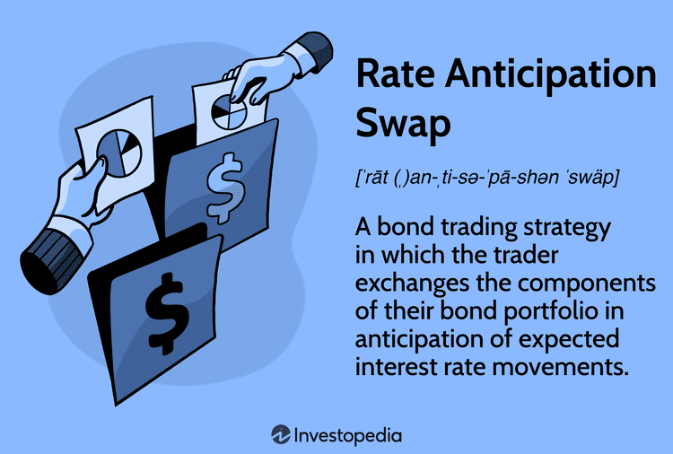

Interest rate management holds significant importance in financial strategy, particularly in periods of market volatility. It is essential for traders and investors seeking stability to have effective methods for managing the inherent risks associated with interest rate fluctuations. Amid these strategies, rate anticipation swaps emerge as a sophisticated tool within the landscape of financial swaps and algorithmic trading. 

Rate anticipation swaps focus on swapping bonds based on predictions about future interest rate movements. This approach not only helps in adjusting the sensitivity of a portfolio to interest rate changes but also serves to manage risk through speculative strategies. Successful execution relies heavily on accurately predicting the direction and magnitude of interest rate changes. Therefore, understanding the inverse relationship between bond prices and interest rates becomes crucial. As bond yields climb, prices typically fall, and vice versa, which underscores the economic intricacies involved in such swaps.



The incorporation of algorithmic trading significantly enhances the management of rate anticipation swaps, offering a multitude of advantages. Automated systems can analyze vast datasets to detect market patterns and respond swiftly to market changes. This automated precision aids in executing trades with greater efficiency, reducing human error, and optimizing swap strategies. By leveraging technology, traders add a layer of rigor and stability to their financial strategies.

Through this article, we seek to provide readers with a detailed understanding of rate anticipation swaps, exploring their mechanics, benefits, and associated risks. We also highlight how the integration of algorithmic trading can improve execution and risk management. Equipped with these insights, traders and investors can adapt their financial strategies to mitigate interest rate risk effectively and enhance portfolio performance in ever-changing market conditions.

## Table of Contents

## Understanding Rate Anticipation Swaps

Rate anticipation swaps are a strategic approach within bond trading, where bonds are exchanged based on forecasts of interest rate movements. This strategy leverages the inverse relationship between bond prices and interest rates; as interest rates rise, bond prices typically fall, and vice versa. The primary objective of these swaps is to adjust a portfolio's sensitivity, or duration, to anticipated changes in interest rates, thus optimizing returns or minimizing risk exposure.

In practice, rate anticipation swaps might involve substituting bonds with different maturities. For instance, if an increase in interest rates is expected, a trader might exchange long-maturity bonds, which have higher interest rate sensitivity, for short-maturity bonds, which are less sensitive. The formula to calculate the price change of a bond in response to interest rate changes can be represented as:

$$
\Delta P \approx -D \times \Delta y \times P
$$

where:
- $\Delta P$ is the change in bond price,
- $D$ is the bond's duration,
- $\Delta y$ is the change in yield (interest rate),
- $P$ is the initial bond price.

The speculative nature of rate anticipation swaps necessitates precise predictions of future [interest rate](/wiki/interest-rate-trading-strategies) movements, making it critical for traders to have a robust analytical framework. This speculative aspect heightens potential gains but also increases risk, as incorrect predictions can lead to significant losses. Understanding the dynamics of how bond prices react to interest rate shifts is foundational for effectively implementing this strategy. By accurately anticipating these changes, traders can strategically manage their portfolios to achieve desired financial outcomes.

## Mechanics of Rate Anticipation Swaps

Rate anticipation swaps are a strategic mechanism in bond trading, primarily utilized to respond to anticipated shifts in interest rates. The fundamental principle lies in exchanging bonds of differing maturities, typically switching from short-maturity bonds to long-maturity bonds, or vice versa. This exchange is predicated on the expectation of interest rate changes and the varying sensitivity of bond prices to these changes.

Understanding the sensitivity of bonds of different maturities to interest rate shifts is crucial. Longer maturity bonds have greater duration and, consequently, are more sensitive to interest rate fluctuations. This is because the present value of distant cash flows changes more significantly with interest rate shifts compared to nearer cash flows. Thus, when traders anticipate a decline in interest rates, they may swap into longer maturity bonds to benefit from the expected price increase. Conversely, if they foresee a rise in interest rates, shifting to shorter maturity bonds can help mitigate potential losses attributable to price decreases.

The procedural aspects of rate anticipation swaps involve complex decision-making and strategic execution. Traders must assess current market indicators, central bank policies, and economic forecasts to form a basis for their swaps. Engaging in these swaps typically follows a structured process:

1. **Market Analysis:** Traders conduct a thorough analysis of economic indicators, interest rate trends, and monetary policy directions to forecast interest rate movements.
2. **Bond Selection:** Based on these forecasts, traders select bonds appropriate for the swap, considering the duration, yield, and potential risks associated with each option.
3. **Execution:** The swap is executed either through direct trading on exchanges or over-the-counter, where traders physically exchange the bonds.
4. **Monitoring and Adjustments:** Traders must continuously monitor the market and make necessary adjustments to the swap strategy to optimize outcomes based on evolving conditions.

By utilizing rate anticipation swaps effectively, traders can navigate interest rate [volatility](/wiki/volatility-trading-strategies) and exploit market conditions to their advantage. However, this approach also demands accurate forecasting and swift execution, underscoring the speculative nature and inherent risks of this strategy.

## Benefits of Rate Anticipation Swaps

Rate anticipation swaps are an effective instrument for managing interest rate risk. These financial swaps enable investors to leverage predicted changes in market conditions, offering significant potential benefits. One of the primary advantages of rate anticipation swaps is their ability to act as a hedge against both rising and falling interest rates. By preemptively adjusting their bond portfolios through these swaps, investors can strategically position themselves to mitigate adverse impacts from interest rate volatility.

In technical terms, when investors anticipate an increase in interest rates, they might opt to swap long-maturity bonds, which are more sensitive to interest rate changes, for short-maturity bonds. Conversely, if a decline in interest rates is expected, swapping short-maturity bonds for long-maturity ones may be beneficial to take advantage of potential price increases in the long bonds. This adaptability provides investors with a dynamic tool for interest rate risk management.

The strategic utilization of rate anticipation swaps can significantly enhance financial stability and predictability. By aligning bond portfolios with market expectations, investors can not only safeguard against losses but also ensure a more consistent performance over time. This, in turn, leads to better financial planning and forecasting, as portfolio values are less susceptible to abrupt interest rate shifts.

Moreover, employing rate anticipation swaps can also optimize the allocation of capital. By reallocating investments in response to anticipated market movements, investors can unlock additional value and potentially improve overall portfolio returns. The flexibility offered by these swaps supports a proactive approach to portfolio management, reducing the likelihood of being caught off guard by unexpected market developments.

Ultimately, the benefits of rate anticipation swaps lie in their capability to provide investors with a mechanism for controlling interest rate exposure and enhancing portfolio resilience. For investors and traders looking to refine their financial strategies, these swaps serve as a valuable ally in navigating the complexities of interest rate fluctuations.

## Risks and Challenges

Rate anticipation swaps [carry](/wiki/carry-trading) significant risks primarily due to their speculative nature. At the core of these challenges is the necessity for precise predictions of future interest rate movements. An erroneous forecast can result in considerable financial losses, as the value of bonds being exchanged may not perform as expected when interest rates deviate from anticipated levels. This inherent risk underscores the need for thorough market analysis and strategic planning before engaging in rate anticipation swaps.

Market volatility presents another layer of complexity. The fluctuations in interest rates can be abrupt and unpredictable, influenced by a myriad of factors including economic data releases, geopolitical events, and central bank policies. Such volatility can lead to sudden shifts in bond prices, impacting the effectiveness of a swap strategy. For instance, if a trader incorrectly anticipates a rise in interest rates and swaps short-maturity bonds for long-maturity bonds, they may face losses if rates fall instead, causing the value of long-maturity bonds to decrease.

Liquidity issues also pose a significant challenge in managing rate anticipation swaps. The ability to swiftly execute trades without causing significant market impact or incurring high transaction costs is crucial. In scenarios where the market is thin, meaning there are fewer buyers and sellers, executing large orders can be difficult without affecting the price. This challenge necessitates a careful assessment of the [liquidity](/wiki/liquidity-risk-premium) environment when planning and executing swaps.

To effectively navigate these risks, participants must undertake a comprehensive risk assessment process. This involves analyzing various interest rate scenarios and their potential impact on bond prices, as well as considering the liquidity and volatility of the market at any given time. Utilizing sophisticated financial models and stress testing strategies can aid in this analysis, allowing for more informed decision-making.

Moreover, maintaining a well-diversified portfolio and leveraging risk management tools such as hedging strategies can mitigate potential losses. By using these approaches, traders can cushion their portfolios against unfavorable market movements while capitalizing on expected changes in interest rates. Additionally, continuous monitoring and adjustment of swap strategies in response to changing market conditions are essential to reducing risk exposure.

In conclusion, while rate anticipation swaps offer opportunities for managing interest rate risk, their speculative nature necessitates careful consideration of inherent risks. Market volatility, liquidity conditions, and the accuracy of interest rate predictions critically influence the success of these financial instruments. Participants must employ rigorous analysis and risk management practices to navigate these challenges effectively.

## Integration with Algorithmic Trading

Algorithmic trading plays a significant role in enhancing the efficiency of managing rate anticipation swaps by providing a robust and streamlined approach to executing strategies and managing risks. Automated systems equipped with sophisticated algorithms are capable of rapidly processing large volumes of data and executing trades with minimal latency. This speed and precision enable traders to respond promptly to market changes, an essential feature when dealing with the dynamic nature of interest rate fluctuations.

The use of algorithms in trade execution can significantly reduce the human error inherent in manual trading. By implementing well-designed automated strategies, traders can ensure that their swaps are executed under predefined parameters, which helps maintain consistency and discipline in trading operations. Algorithmic systems can be programmed to follow complex decision-making rules derived from historical data analysis and predictive modeling, leveraging [machine learning](/wiki/machine-learning) techniques to refine strategies over time.

A typical algorithm for managing rate anticipation swaps might involve the dynamic assessment of interest rate trends and the selection of appropriate bonds for swapping. By continuously monitoring market indicators and executing swaps based on optimal timing, the algorithm maximizes strategic advantage. For instance, using a Python-based library such as NumPy or pandas, one can handle large datasets to determine optimal swap scenarios. Here's an example of how data analysis for swap strategies might look in Python:

```python
import pandas as pd
import numpy as np

# Sample function to assess bond swap decision
def assess_swap_strategy(bond_prices, interest_rates):
    # Assuming bond_prices and interest_rates are Pandas DataFrame objects
    delta_rates = interest_rates.diff()
    expected_swap = np.where(delta_rates > 0, "Swap Short for Long", "Swap Long for Short")
    strategy_df = bond_prices.copy()
    strategy_df['Strategy'] = expected_swap
    return strategy_df

# Example usage
bond_prices = pd.DataFrame({'Short Maturity': [100, 101, 102],
                            'Long Maturity': [105, 106, 107]})
interest_rates = pd.Series([2.5, 2.6, 2.4])

strategy = assess_swap_strategy(bond_prices, interest_rates)
print(strategy)
```

This code snippet shows a basic approach for decision-making in swap strategies under fluctuating interest rates, showcasing how automated systems can be used to dynamically adjust strategies based on real-time data.

Moreover, [algorithmic trading](/wiki/algorithmic-trading) facilitates enhanced risk management. By incorporating risk management metrics such as Value at Risk (VaR) and stress testing within their algorithms, systems can provide insights into potential losses and adapt strategies accordingly. This proactive risk assessment is crucial in mitigating adverse impacts from market swings, providing an additional layer of security to the overall trading strategy.

In conclusion, the integration of algorithmic trading with rate anticipation swaps offers traders substantial improvements in execution efficiency, accuracy, and strategic management, paving the way for superior handling of interest rate risks and optimized portfolio outcomes.

## Comparison with Other Financial Swaps

Rate anticipation swaps are a strategic tool among various financial instruments used for interest rate risk management. To comprehend their utility and strategic value, it is important to compare them with other common financial swap tools, namely traditional interest rate futures, options, and various other swap types.

**Interest Rate Futures:**  
Interest rate futures are standardized contracts to buy or sell a debt instrument at a predetermined future date and price, based primarily on an anticipated interest rate change. These futures are traded on exchanges and provide a means for investors to hedge against interest rate risk. The primary advantage of futures is their liquidity and the regulatory frameworks under which they operate, offering transparency and reduced counterparty risk. However, they require a commitment of capital upfront and are less customizable compared to swaps such as rate anticipation swaps.

**Interest Rate Options:**  
Interest rate options give the holder the right, but not the obligation, to buy or sell interest rate instruments at a specified price on or before a particular date. They offer more flexibility than futures and swaps because the holder can choose whether or not to execute the contract based on market changes. Options require a premium to be paid irrespective of the contract being exercised. They provide a flexible hedge against interest rate movements but can be more expensive, making them suitable for situations where significant rate movements are expected.

**Other Swap Types:**  
1. **Plain Vanilla Interest Rate Swap:** The most common type of swap involves exchanging fixed-rate interest payments for floating-rate payments. These swaps provide straightforward hedges against interest rate fluctuations and are tailored to match specific needs, such as altering cash flows to balance potential interest rate risks. They lack the speculative nature of rate anticipation swaps as they involve an exchange based on existing rates rather than on forecasts.

2. **Currency Swaps:** Though primarily involving currency risk, these swaps also incorporate interest rate exposure differences between currencies. They provide a mechanism to manage both interest rate risk and exchange rate risk simultaneously.

3. **Credit Default Swaps (CDS):** While not directly related to interest rate swaps, CDSs offer a measure against credit risk rather than purely interest rate risk. They ensure protection against default, which can indirectly impact interest rate risk profiles, especially in volatile markets.

**Distinctive Features and Applications:**  
Rate anticipation swaps, compared to these other instruments, are unique in their focus on anticipated changes in interest rates, allowing investors to position their portfolios proactively based on interest rate forecasts. They offer a high degree of customization to align with specific predictions about rate movements but involve higher speculation.  

In contrast, traditional futures and plain vanilla swaps are often used for their reliability and ability to provide a steady hedge against known liabilities. Options are chosen for flexibility, particularly when there is uncertainty about the magnitude of rate changes, whereas credit default swaps and currency swaps address broader risk profiles beyond just interest rate risk.

**Choice Amidst Market Conditions:**  
The selection between different financial swaps, including rate anticipation swaps, is driven by specific investment goals, market conditions, risk tolerance, and cost considerations. Understanding the unique attributes of each tool, the regulatory environment, and strategic objectives of the portfolio is crucial in making informed decisions that contribute to effective interest rate risk management.

## Conclusion

Rate anticipation swaps are pivotal instruments in the domain of financial risk management. Their speculative nature presents both opportunities and challenges for managing interest rate exposure. This dual character stems from the inherent unpredictability of future interest rate movements. Success in utilizing these swaps involves the ability to accurately predict changes, which can either enhance portfolio performance or lead to potential losses if predictions fall short. 

By incorporating algorithmic trading, investors can further optimize their strategy concerning financial swaps. Algorithms provide the capacity for rapid analysis and execution, reducing the latency associated with manual trading. This integration not only enhances execution precision but also mitigates human error, allowing for more agile responses to market fluctuations.

Understanding and applying rate anticipation swaps with care can substantially benefit portfolio management. This requires continuous learning and adaptation to shifting market dynamics. Investors must be well-versed in the underlying mechanics and maintain an up-to-date perspective on economic indicators and interest rate trends. Historical data analysis and machine learning models can aid in refining these predictions, offering a scientific approach to this otherwise speculative activity.

In conclusion, the effective deployment of rate anticipation swaps demands a blend of well-grounded knowledge, technological acumen, and adaptive strategy. Engaging with these financial instruments equips investors with enhanced tools to manage interest rate risks, offering the potential for both stability and growth in volatile market conditions. The dedication to continual education and flexibility in strategy remains paramount for achieving long-term success in interest rate management.

## References & Further Reading

[1]: ["Options, Futures, and Other Derivatives"](https://www.amazon.com/Options-Futures-Other-Derivatives-10th/dp/013447208X) by John C. Hull

[2]: Medvedev, A., & McAleer, M. (2009). ["Forecasting and Risk Management in Financial Markets."](https://www.semanticscholar.org/paper/The-Ten-Commandments-for-Optimizing-Value-at-Risk-McAleer/c95683a5b05a4942c6b220829b8a0943228e2f45) Handbook of Financial Markets: Dynamics and Evolution. 

[3]: Lopez de Prado, M. (2018). ["Advances in Financial Machine Learning"](https://www.amazon.com/Advances-Financial-Machine-Learning-Marcos/dp/1119482089). Wiley.

[4]: Elliott, G., & Timmermann, A. (eds). (2013). ["Handbook of Economic Forecasting, Vol. 2."](https://shop.elsevier.com/books/handbook-of-economic-forecasting/elliott/978-0-444-62732-2) Elsevier.

[5]: ["Quantitative Trading: How to Build Your Own Algorithmic Trading Business"](https://www.amazon.com/Quantitative-Trading-Build-Algorithmic-Business/dp/1119800064) by Ernest P. Chan

[6]: Jansen, S. (2020). ["Machine Learning for Algorithmic Trading"](https://github.com/stefan-jansen/machine-learning-for-trading). Packt Publishing.

[7]: Aronson, D. R. (2006). ["Evidence-Based Technical Analysis: Applying the Scientific Method and Statistical Inference to Trading Signals"](https://www.amazon.com/Evidence-Based-Technical-Analysis-Scientific-Statistical/dp/0470008741). Wiley.

[8]: Tuckman, B., & Serrat, A. (2011). ["Fixed Income Securities: Tools for Today's Markets, 3rd Edition"](https://www.oreilly.com/library/view/fixed-income-securities/9781118133965/). Wiley.