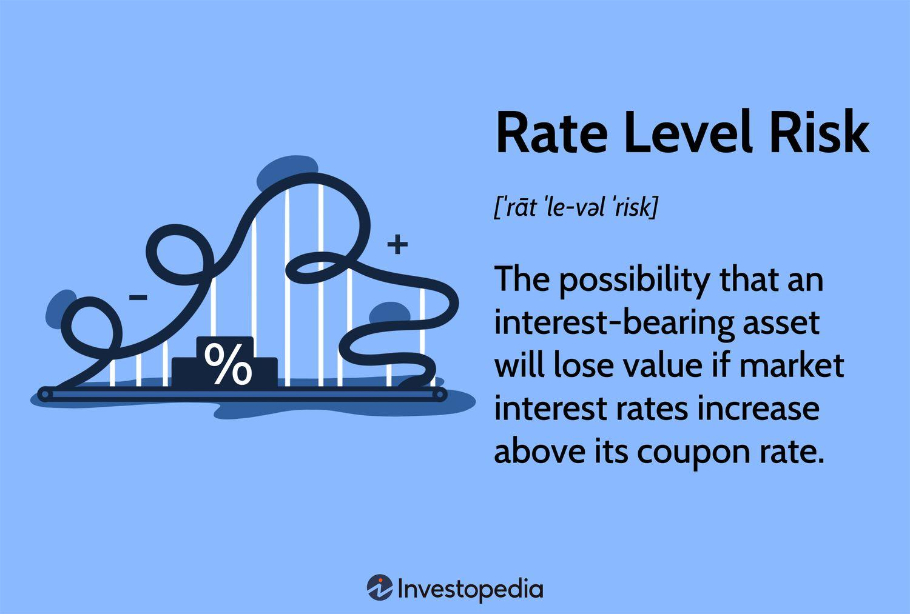

In the ever-evolving financial markets, understanding risk management is crucial for effective trading and investment strategies. The modern financial landscape is characterized by a variety of risks that investors and institutions must navigate to protect and grow their assets. Central to these risks are financial risk, rate risk, interest rate risk, and algorithmic trading, each playing a significant role in the dynamics of today's markets.

Financial risk, a broad category encompassing potential monetary loss stemming from various sources, includes market, credit, liquidity, and operational risks. Market risk, for instance, pertains to the fluctuations in asset prices, while credit risk relates to the possibility of a counterparty defaulting on its obligations. Liquidity risk concerns the ease of converting assets to cash without significant loss, and operational risk involves failures in internal processes or systems. Understanding these risks is vital for developing strategies to mitigate potential losses.



Rate risk, a specific type of financial risk, involves the changes in the value of interest-bearing assets due to interest rate fluctuations. This is particularly pronounced in fixed-income securities like bonds, where an inverse relationship exists between interest rates and bond prices. This underscores the necessity for investors to be aware of rate risk as it directly affects portfolio valuations and income flows.

Interest rate risk further complicates financial decisions, impacting both the value of investments and the cost of borrowing. A rise in market interest rates can decrease the present value of future cash flows, thereby diminishing the market value of interest-sensitive investments. Conversely, falling interest rates can lead to increased borrowing costs for floating-rate debt instruments. As such, managing interest rate risk is a crucial component of financial strategy, influencing decisions in both lending and investing activities.

Algorithmic trading introduces a new dimension to modern financial markets, employing sophisticated algorithms and computer programs to execute trades with high speed and precision. This technology-driven approach allows market participants to exploit inefficiencies and execute strategies at scale. However, it also brings unique risks that necessitate advanced risk management techniques to protect against rapid market changes and technical failures.

The interplay between these elements highlights the complexity and interdependence of factors affecting financial decisions. Thus, a comprehensive understanding and integration of these risks into trading and investment strategies are vital for optimizing performance and ensuring long-term success in fast-paced financial markets. Effective risk management not only safeguards against potential losses but also enables the exploitation of opportunities presented by market dynamics.

## Table of Contents

## Understanding Financial Risk

Financial risk represents the potential for loss in financial activities or investments due to various uncertainties and adverse events. Understanding the types of financial risk and the measures to manage them is crucial for investors and businesses aiming to safeguard their financial health.

Key types of financial risks primarily include:

1. **Market Risk**: This risk arises from the possibility of losses due to changes in market conditions. It encompasses systemic risk factors such as changes in equity prices, currency exchange rates, interest rates, and commodity prices. Market risk affects the entire market rather than specific entities and is often beyond the control of organizations and individuals.

2. **Credit Risk**: Credit risk is the threat of loss stemming from a borrower's inability to meet financial obligations. This risk is typically associated with loans, bonds, and other credit instruments. Financial institutions meticulously assess credit risk to ascertain the probability of a borrower defaulting on a loan, which can have significant financial repercussions.

3. **Liquidity Risk**: Liquidity risk refers to the danger that an entity will not be able to meet its short-term financial obligations due to the inability to convert assets into cash without significant loss in value. This risk can also occur when entities cannot adequately unwind positions in a timely manner without impacting market prices.

4. **Operational Risk**: Operational risk involves potential losses due to internal processes, systems, human errors, or external events. This type of risk encompasses a wide array of issues, including fraud, system failures, legal risks, and compliance breaches, which can disrupt business operations and result in financial losses.

Effective management of financial risk is essential for mitigating potential losses. This management often involves identifying, assessing, and prioritizing risks, followed by coordinated efforts to minimize, monitor, and control the probability or impact of unfortunate events. 

For example, businesses and investors employ diversification strategies to spread their investments across various assets and sectors to reduce exposure to market risk. Similarly, credit risk can be managed using credit assessments, implementing stringent lending criteria, and employing collateral and credit derivatives. To tackle [liquidity](/wiki/liquidity-risk-premium) risk, firms maintain sufficient liquid assets and develop robust cash flow management practices.

No single strategy suffices in isolating businesses or investors from financial risks due to the dynamic nature of markets. Therefore, continuous monitoring and adaptive risk management practices are crucial for preventing financial setbacks and ensuring sustainable operations.

## Rate Risk and Its Implications

Rate risk refers to the potential variation in the value of interest-bearing assets as a result of changes in prevailing interest rates. This risk is particularly pertinent to fixed-income securities such as bonds. When market interest rates rise, the prices of existing bonds typically decrease, owing to the fixed nature of their interest payments or "coupon rates" compared to the newly issued bonds which now offer higher interest rates. This inverse relationship between interest rates and bond prices is a fundamental concept in bond investing.

The mathematics of bond pricing explains this relationship. The price of a bond can be calculated using the present value of its future cash flows, which include periodic coupon payments and the face value paid at maturity. The formula for the present value $P$ of a bond is:

$$

P = \sum_{t=1}^{n} \frac{C}{(1 + r)^t} + \frac{F}{(1 + r)^n} 
$$

where:
- $P$ is the current price of the bond,
- $C$ is the coupon payment,
- $n$ is the number of periods until maturity,
- $F$ is the face value of the bond,
- $r$ is the discount rate or yield, often represented by the market interest rate.

An increase in $r$ ([interest rate](/wiki/interest-rate-trading-strategies)) results in a decrease in $P$, demonstrating the rate risk faced by bond investors.

Managing rate risk is crucial for investors aiming to make informed decisions and maintain effective portfolio strategies. Investors can employ various strategies to mitigate rate risk, such as laddering bond maturities, diversifying across various fixed-income securities, or using derivatives like interest rate swaps and futures to hedge against potential losses.

Furthermore, understanding duration and convexity provides additional insights into rate risk. Duration measures the sensitivity of a bond's price to a change in interest rates, indicating how much the price will change for a 1% change in interest rates. Convexity, on the other hand, measures the curvature in the relationship between bond prices and interest rates, offering a more refined understanding beyond simple duration.

In conclusion, comprehending rate risk is vital for investors, particularly those involved in fixed-income markets, to ensure effective portfolio management and optimization in response to interest rate fluctuations.

## The Impact of Interest Rate Risk

Interest rate risk arises when fluctuations in market interest rates affect the value of financial securities and the cost of borrowing. This type of risk holds significant importance for both borrowers and lenders, guiding decisions related to loan structuring and investment strategies. For instance, when interest rates increase, the fixed payments on existing loans may become relatively expensive, impacting borrowers adversely. Conversely, lenders may find new lending opportunities more lucrative as they can charge higher interest rates.

In the context of investments, interest rate risk can lead to substantial changes in the valuation of interest-bearing securities, particularly fixed-income assets like bonds. When interest rates rise, the fixed coupon payments of bonds become less attractive, resulting in a decrease in their market price. This inverse relationship between interest rates and bond prices is fundamental to understanding interest rate risk.

To manage interest rate risk effectively, investors and financial institutions employ a variety of strategies. Duration analysis, for example, is a quantitative method used to measure a bond's sensitivity to interest rate changes. The duration indicates the percentage change in the bond's price for a 1% change in interest rates. By maintaining a balanced portfolio in terms of duration, investors can mitigate the impact of rate fluctuations.

Additionally, risk management strategies such as interest rate swaps and options allow entities to hedge against unfavorable interest rate movements. Interest rate swaps enable firms to exchange variable interest payments for fixed ones, stabilizing cash outflows. Options, on the other hand, provide insurance against rate hikes or declines, offering the right, but not the obligation, to execute financial contracts at predefined interest rates.

Being proactive in managing interest rate risk is essential, as abrupt shifts in interest rates can lead to significant financial repercussions. For example, inadequate preparation for rising rates can result in increased borrowing costs and reduced investment returns, ultimately affecting a business's profitability and financial stability. Implementing robust interest rate risk management tools and techniques ensures that borrowers and investors are equipped to handle these financial challenges efficiently.

## Algorithmic Trading in Financial Markets

Algorithmic trading employs advanced computer programs and algorithms to smoothly execute trades at extremely high speeds and volumes. This technologically driven method of trading has revolutionized financial markets by enhancing efficiency, precision, and profitability for traders. 

Algorithmic trading enables market participants to exploit minute price differences by conducting trades much faster than a human trader could manage manually. By following pre-defined instructions and strategies, [algorithmic trading](/wiki/algorithmic-trading) systems can make decisions based on various inputs, including price, timing, and quantity, without requiring direct human intervention. This automation allows traders to operate multiple strategies simultaneously, take advantage of market inefficiencies, and maintain a competitive edge.

Despite these advantages, algorithmic trading carries unique risks that necessitate comprehensive risk management strategies. Market [volatility](/wiki/volatility-trading-strategies) can lead to rapid price changes, increasing the potential for adverse outcomes if a trading algorithm is not properly calibrated or monitored. Moreover, technical risks such as hardware failures, software bugs, or connectivity issues can disrupt trading operations, potentially leading to significant financial losses.

To mitigate these risks, traders implement robust risk management mechanisms such as stop-loss orders, which automatically close positions to limit losses when prices move unfavorably. Additionally, diversification across various asset classes and strategies can help reduce exposure to specific market risks. Continuous monitoring and adjustment of algorithmic models are essential to ensure they remain responsive to fluctuating market conditions and evolving trading environments.

Algorithmic trading demands a delicate balance between leveraging technological advantages and safeguarding against the inherent risks of high-speed, automated trading. Implementing sound risk management practices ensures traders can capitalize effectively on the opportunities algorithmic trading presents while protecting their investment portfolios from potential market disruptions.

## Risk Management Techniques in Algo Trading

In algorithmic trading, effective risk management is crucial for mitigating losses and ensuring long-term profitability. Strategies such as stop-loss orders, diversification, and hedging form the foundation of risk management in this domain. 

Stop-loss orders automatically sell a security when its price falls to a predetermined level, thus limiting potential losses. This technique is critical in an automated environment where quick market movements can lead to significant downside risks. For example, a trader can set a stop-loss order at 5% below the purchase price to cap any potential losses at that level.

Diversification involves spreading investments across various instruments or asset classes to reduce exposure to any single asset's volatility. By diversifying, traders can buffer against adverse movements in one market sector with more stable performance in another, minimizing overall portfolio risk.

Hedging strategies involve taking offsetting positions in different instruments to protect against loss. For instance, traders might use options or futures to hedge against potential declines in asset prices. Suppose a trader holds a significant position in a stock; they could purchase a put option for the same stock, securing the right to sell it at a specified price, thus limiting losses if the stock price falls.

Traders in algorithmic settings must continuously monitor and adjust their algorithms to address technical, market, and operational risks. This involves ensuring that algorithms are responsive to changing market conditions and free from vulnerabilities that could be exploited by market anomalies or technical glitches. Automated systems can incorporate [machine learning](/wiki/machine-learning) algorithms to adapt strategies based on historical data, identifying emerging patterns that might signal a need for strategy adjustment.

Advanced risk management techniques often integrate real-time data analytics and [artificial intelligence](/wiki/ai-artificial-intelligence) to anticipate potential market changes. For example, predictive analytics can forecast volatility spikes, allowing traders to adjust positions proactively. Additionally, simulation environments may be used to test and refine algorithms, ensuring they perform reliably across various market scenarios.

Incorporating these risk management techniques helps protect algorithmic traders from unexpected market shifts and rapid changes in asset prices, maintaining strategic robustness and safeguarding capital in volatile markets.

## Integrating Financial Risk and Algorithmic Strategies

Integrating financial risk management with algorithmic strategies is essential for optimizing trading effectiveness and stability in the fast-paced environment of modern financial markets. This integration requires a delicate balance between capitalizing on high-frequency trading opportunities and implementing stringent risk control measures to protect against adverse market movements.

Quantitative models play a crucial role in predicting market trends and managing exposure to interest rate and rate level risks. These models utilize historical data and sophisticated statistical techniques to forecast financial market behavior, allowing traders to make data-driven decisions. For example, time series analysis and machine learning models can be employed to identify patterns and correlations that can indicate potential price movements or volatility changes.

Implementing algorithms capable of dynamically adjusting trading strategies based on real-time data is essential. Consider the following basic example in Python, using a simple moving average (SMA) crossover strategy to automate trading decisions:

```python
import pandas as pd

# Example dataframe with historical data
data = pd.DataFrame({'price': [100, 102, 101, 105, 107, 110, 108, 112]})

# Calculate short-term and long-term moving averages
short_window = 3
long_window = 5

data['SMA_short'] = data['price'].rolling(window=short_window).mean()
data['SMA_long'] = data['price'].rolling(window=long_window).mean()

# Generate trading signals
data['signal'] = 0
data['signal'][short_window:] = np.where(data['SMA_short'][short_window:] > 
                                         data['SMA_long'][short_window:], 1, 0)

# Calculate daily returns and apply signal to obtain strategy performance
data['returns'] = data['price'].pct_change()
data['strategy_returns'] = data['signal'].shift(1) * data['returns']

# Display the strategy performance
print(data[['price', 'SMA_short', 'SMA_long', 'signal', 'strategy_returns']])
```

In this example, the algorithm generates buy signals when the short-term moving average crosses above the long-term moving average, suggesting upward price [momentum](/wiki/momentum). Such automation enables traders to enter and [exit](/wiki/exit-strategy) positions based on pre-defined criteria, minimizing human biases and emotional interference.

A comprehensive approach to managing financial risk within algorithmic trading includes continuous monitoring of operational risk, market risk, and model risk. Implementations should have robust [backtesting](/wiki/backtesting) frameworks to evaluate strategies under different market conditions and ensure robustness. Additionally, diversification of trading strategies, assets, and markets can help mitigate individual asset or strategy risks.

In conclusion, integrating financial risk management with algorithmic trading strategies enhances resilience and performance. By leveraging quantitative models and automated decision-making processes, traders can more effectively navigate financial markets' complexities while safeguarding against potential losses resulting from rapid or unforeseen market changes. This approach ultimately supports the optimization of trading strategies for long-term success.

## Conclusion

Understanding and managing financial risk, rate risk, and interest rate risk is essential for developing effective trading and investment strategies. Financial markets continually evolve, and traders need to adapt to these changes by employing robust risk management practices. Algorithmic trading, while offering substantial advantages like speed and efficiency, also presents unique risks that require careful handling. The automation inherent in algorithmic trading can lead to unintended consequences if risk factors are not adequately managed—ranging from market volatility impacts to systemic risks introduced by the rapid execution of trades.

Algorithmic trading systems must integrate comprehensive risk management techniques to counteract these challenges. Techniques such as stop-loss orders, diversification, and hedging can help mitigate potential losses. Traders need to implement algorithms that can dynamically adjust to market conditions, ensuring they remain robust against both expected and unforeseen market events. Robust risk management also involves continuously monitoring market data and algorithmic performance to adjust strategies as necessary.

Integration of these risk management practices enables traders and investors to optimize their strategies, ensuring they are better positioned to cope with and capitalize on market fluctuations. Ultimately, the ability to effectively balance risk with potential return can significantly enhance long-term success in financial markets, offering a strategic advantage to those who skillfully navigate the complexities of risk and algorithmic trading.

## References & Further Reading

[1]: Bergstra, J., Bardenet, R., Bengio, Y., & Kégl, B. (2011). ["Algorithms for Hyper-Parameter Optimization."](https://proceedings.neurips.cc/paper/2011/file/86e8f7ab32cfd12577bc2619bc635690-Paper.pdf) Advances in Neural Information Processing Systems 24.

[2]: ["Advances in Financial Machine Learning"](https://www.amazon.com/Advances-Financial-Machine-Learning-Marcos/dp/1119482089) by Marcos Lopez de Prado

[3]: ["Evidence-Based Technical Analysis: Applying the Scientific Method and Statistical Inference to Trading Signals"](https://www.amazon.com/Evidence-Based-Technical-Analysis-Scientific-Statistical/dp/0470008741) by David Aronson

[4]: ["Machine Learning for Algorithmic Trading"](https://github.com/stefan-jansen/machine-learning-for-trading) by Stefan Jansen

[5]: ["Quantitative Trading: How to Build Your Own Algorithmic Trading Business"](https://github.com/LucindaYa/quant-resources/blob/master/Quantitative%20Trading%20How%20to%20Build%20Your%20Own%20Algorithmic%20Trading%20Business.pdf) by Ernest P. Chan