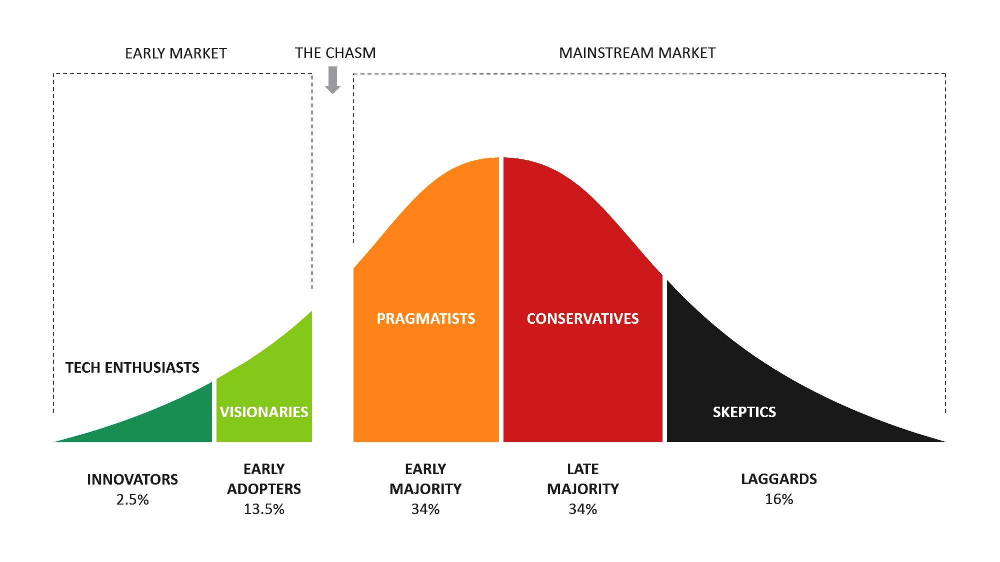

## Table of Contents

## What is the rate of adoption?

The rate of adoption refers to how quickly and widely a new idea, product, or technology is accepted and used by people. It is important for businesses and organizations because it helps them understand how fast their new products or services will be accepted by the public. The rate can be influenced by many things, like how useful the new product is, how easy it is to use, and how well it is marketed.

Different groups of people adopt new things at different speeds. Some people, called innovators, are the first to try new things. They like to be on the cutting edge. Then come the early adopters, who are also quick to try new things but are a bit more cautious. The majority of people, called the early majority and late majority, take more time to adopt new things. They wait to see if the new product or idea is really good and useful. Finally, there are the laggards, who are the last to adopt new things. They are very cautious and prefer to stick with what they know.

## Why is the rate of adoption important to understand?

Understanding the rate of adoption is important because it helps businesses and organizations know how quickly people will start using their new products or ideas. If they know this, they can plan better. For example, they can decide how much to produce or how to market their product. If a product is adopted quickly, they might need to make more of it right away. If it's adopted slowly, they might need to change their marketing plan to make it more appealing.

It also helps them see if their product or idea is really meeting people's needs. If the adoption rate is slow, it might mean that the product isn't as useful or easy to use as they thought. This can give them important feedback to improve the product. On the other hand, a fast adoption rate can show that they are on the right track and that people like what they are offering. This can encourage them to keep going in the same direction.

## How is the rate of adoption measured?

The rate of adoption is measured by looking at how many people start using a new product or idea over time. Researchers often use surveys, sales data, or usage statistics to see how quickly the product is being accepted. They track the number of new users or buyers at different points in time to see if the adoption is fast or slow. This helps them understand if the product is becoming popular quickly or if it is taking a long time for people to start using it.

To make it easier to understand, researchers often divide the people into groups based on when they start using the product. These groups are called innovators, early adopters, early majority, late majority, and laggards. By seeing how many people fall into each group, researchers can get a clear picture of the adoption rate. They can then use this information to predict how the rest of the population might react to the product and plan their next steps accordingly.

## What factors influence the rate of adoption?

Many things can affect how quickly people start using a new product or idea. One big factor is how useful and easy the product is. If it solves a problem well and is simple to use, more people will want to try it. Another important thing is how well the product is marketed. Good marketing can make people more aware of the product and more excited to try it. The price also matters. If the product is too expensive, fewer people might be able to buy it, which can slow down adoption.

The social environment can also influence the rate of adoption. If many people around someone are using the product, that person might be more likely to try it too. This is called social influence. Also, the type of product can make a difference. Some products, like new technology, might be adopted quickly by certain groups of people who love new gadgets. Other products, like new farming methods, might take longer because they need more time and effort to change. Understanding these factors helps businesses know what to focus on to make their product more popular.

## Can you provide a simple example of a technology with a high rate of adoption?

A great example of a technology with a high rate of adoption is the smartphone. When smartphones first came out, people quickly saw how useful they were. They could make calls, send texts, and also use the internet, take pictures, and play games all in one device. This made life a lot easier and more fun for a lot of people. Because smartphones were so handy, many people wanted to get one as soon as they could.

Companies like Apple and Samsung did a good job of telling people about their smartphones through ads and stores. This made more people aware of the phones and excited to buy them. The price was also something that helped. Over time, smartphones became more affordable, so even more people could buy them. Because of all these reasons, smartphones spread very quickly around the world, and now almost everyone has one.

## How does the rate of adoption differ across different industries?

The rate of adoption can be very different in different industries. In the tech industry, new products like smartphones or social media apps can spread very fast. People in this industry are often excited about new gadgets and want to try them right away. They also share information quickly online, which helps new tech products become popular fast. On the other hand, in industries like farming or healthcare, new ideas or products might take a lot longer to be adopted. Farmers might need to see that a new method works well before they try it, and doctors need to make sure new treatments are safe and effective before using them with patients.

In the fashion industry, trends can change very quickly, but the adoption of new materials or production methods might be slower. People might be excited about a new style, but they might not care as much about how the clothes are made. In the automotive industry, new car models can take time to be adopted because they are expensive and people need to trust that they are reliable. Also, big changes like electric cars can take a long time because they need new infrastructure like charging stations. Each industry has its own challenges and reasons why new things might be adopted quickly or slowly.

## What are some common barriers to adoption?

One common barrier to adoption is the cost. If a new product or idea is too expensive, many people might not be able to afford it. This can slow down how quickly it spreads. Another barrier is if the product is hard to use or understand. If people find it confusing or it takes a lot of time to learn, they might not want to try it. Also, if the product doesn't seem very useful or doesn't solve a problem well, people might not see the point in using it.

Another barrier can be a lack of trust. If people don't trust the company making the product or if they are worried about privacy or safety, they might be hesitant to adopt it. Social influence can also be a barrier. If no one around someone is using the product, that person might not want to be the first to try it. They might wait to see if others find it good before they decide to use it themselves. These barriers can make it hard for new products or ideas to be adopted quickly.

## How can organizations increase their rate of adoption?

Organizations can increase their rate of adoption by making their product easy to use and showing how useful it is. If people can see right away how a product makes their life better, they are more likely to try it. For example, if a new app helps people save time or money, they will want to use it. Also, if the product is simple and not confusing, more people will be willing to give it a try. Companies can offer good instructions and support to help people learn how to use the product quickly.

Another way to boost adoption is through good marketing and making the product affordable. If a company can tell people about their product in a way that gets them excited, more people will want to try it. Using ads, social media, and word of mouth can help spread the word. Also, if the product is priced so that many people can afford it, more people will be able to buy it. Sometimes, offering discounts or special deals can help too. By focusing on these things, organizations can help their product become popular faster.

## What are some case studies that illustrate successful adoption strategies?

One good example of a successful adoption strategy is how Apple introduced the iPhone. When the iPhone first came out in 2007, Apple made it clear how useful it was. They showed people that it could do more than just make calls - it could also play music, browse the internet, and take pictures. Apple made the iPhone easy to use with a simple touch screen, which was new at the time. They also marketed it well with big ads and a lot of excitement. The iPhone was priced high at first, but over time, Apple made cheaper models so more people could buy it. This helped the iPhone spread very quickly around the world.

Another example is how Tesla increased the adoption of electric cars. Tesla faced the challenge that electric cars were new and many people didn't trust them. To overcome this, Tesla focused on making their cars really good and showing how they could help the environment. They also built a network of charging stations so people wouldn't worry about running out of power. Tesla used social media and Elon Musk's public image to get people excited about their cars. They started with expensive models but then made cheaper ones like the Model 3, so more people could afford them. These strategies helped more and more people start driving electric cars.

## How do global economic factors affect the rate of adoption?

Global economic factors can really change how quickly people start using new products or ideas. If the economy is doing well, people have more money to spend. This means they might be more willing to try new things, like buying a new smartphone or using a new app. But if the economy is not doing well, people might be more careful with their money. They might not want to spend on new things, especially if they are expensive. This can slow down how fast a new product spreads.

Also, economic conditions can affect how companies market their products. If the economy is good, companies might have more money to spend on ads and making their product better. This can help more people learn about the product and want to try it. But if the economy is bad, companies might not have as much money for marketing. They might need to make their product cheaper or find other ways to get people interested. This can make it harder for the product to be adopted quickly.

## What advanced metrics can be used to predict future adoption rates?

Advanced metrics can help us guess how many people will start using a new product in the future. One way is to look at how many people are talking about the product online, like on social media or in forums. If a lot of people are talking about it and they sound excited, it might mean more people will want to try it soon. Another way is to see how many people are searching for the product on the internet. If the number of searches is going up, it could mean more people are getting interested and might buy it.

We can also use data about how similar products were adopted in the past. If a new smartphone is coming out, we can look at how fast people started using the last smartphone from the same company. This can give us a good idea of what might happen with the new one. By combining all these different pieces of information, we can make a better guess about how quickly the new product will spread.

## How does the rate of adoption relate to innovation diffusion theory?

The rate of adoption is a big part of innovation diffusion theory. This theory explains how new ideas and products spread through a group of people. It says that there are different groups of people who adopt new things at different times. The first group, called innovators, likes to try new things right away. Then come the early adopters, who are also quick to try new things but are a bit more careful. After them, there's the early majority and late majority, who take more time to start using the new product. Finally, there are the laggards, who are the last to try new things. The rate of adoption is all about how fast each of these groups starts using the new product or idea.

Innovation diffusion theory helps us understand why some products spread quickly and others take a long time. It looks at things like how useful the product is, how easy it is to use, and how well it's marketed. If a product is really useful and easy to use, it can spread faster. Good marketing can also help more people learn about the product and want to try it. By studying the rate of adoption, we can see how well a product is doing and guess how it might do in the future. This helps companies plan better and make their products more popular.

## What is the role of network effects in adoption?

Network effects, often referred to as demand-side economies of scale, occur when the value of a product or service increases as more people use it. This phenomenon plays a crucial role in the adoption of various technologies, including algorithmic trading. As more entities embrace algo trading, the overall ecosystem becomes richer—through shared knowledge, enhanced algorithmic strategies, and increased [liquidity](/wiki/liquidity-risk-premium)—thus attracting even more participants.

In the context of algo trading, network effects manifest in several ways. First, wider adoption leads to a more competitive environment, which fosters the development of more sophisticated algorithms. As traders and institutions use these algorithms, the data generated contributes to further refinement and innovation. This cycle promotes not only the effectiveness of trading strategies but also draws in additional market participants seeking to capitalize on these advancements. Consequently, higher participation can lead to improved market efficiencies, such as tighter bid-ask spreads and more consistent price discovery.

A classic example that illustrates the significance of network effects is the internet. Initially, the value of being online was limited with few users and minimal content. However, as more individuals and businesses connected to the internet, the network effect greatly amplified its utility. This increased interaction and content creation led to an exponential growth in internet adoption. Platforms that utilized these network effects, such as social media networks and e-commerce sites, experienced rapid growth as the user base expanded, enhancing content diversity and user experience.

In algo trading, as more traders adopt these systems, the aggregation of trading data allows for better prediction models and innovative trading strategies. Improved algorithms not only benefit current users but also attract new ones, perpetuating a cycle of growth similar to the internet's expansion.

The concept of network effects can be further understood mathematically. Let $V$ represent the value derived by a user from a network, $n$ represent the number of users, and $f(n)$ be a function that models how value changes with users. A simple network effect model can be represented as:

$$
V = k \cdot f(n)
$$

where $k$ is a constant. In many scenarios, $f(n)$ could be $n$ or $n^2$, indicating linear or quadratic growth of value with additional users.

Overall, recognizing and harnessing network effects can powerfully influence the success of technology adoption. In algo trading, understanding these dynamics helps financial firms to strategically leverage their platforms to maximize benefits arising from increased user bases, ultimately enhancing the entire trading ecosystem.

## References & Further Reading

[1]: Rogers, E. M. (2003). ["Diffusion of Innovations."](https://archive.org/details/diffusionofinnov00roge_0) Free Press.

[2]: Lopez de Prado, M. (2018). ["Advances in Financial Machine Learning."](https://www.amazon.com/Advances-Financial-Machine-Learning-Marcos/dp/1119482089) Wiley.

[3]: Jansen, S. (2020). ["Machine Learning for Algorithmic Trading: Predictive Models to Extract Signals From Market and Alternative Data for Systematic Trading Strategies with Python."](https://www.amazon.com/Machine-Learning-Algorithmic-Trading-alternative/dp/1839217715) Packt Publishing.

[4]: Chan, E. (2008). ["Quantitative Trading: How to Build Your Own Algorithmic Trading Business."](https://github.com/ftvision/quant_trading_echan_book) Wiley.

[5]: Aronson, D. (2007). ["Evidence-Based Technical Analysis: Applying the Scientific Method and Statistical Inference to Trading Signals."](https://www.amazon.com/Evidence-Based-Technical-Analysis-Scientific-Statistical/dp/0470008741) Wiley.