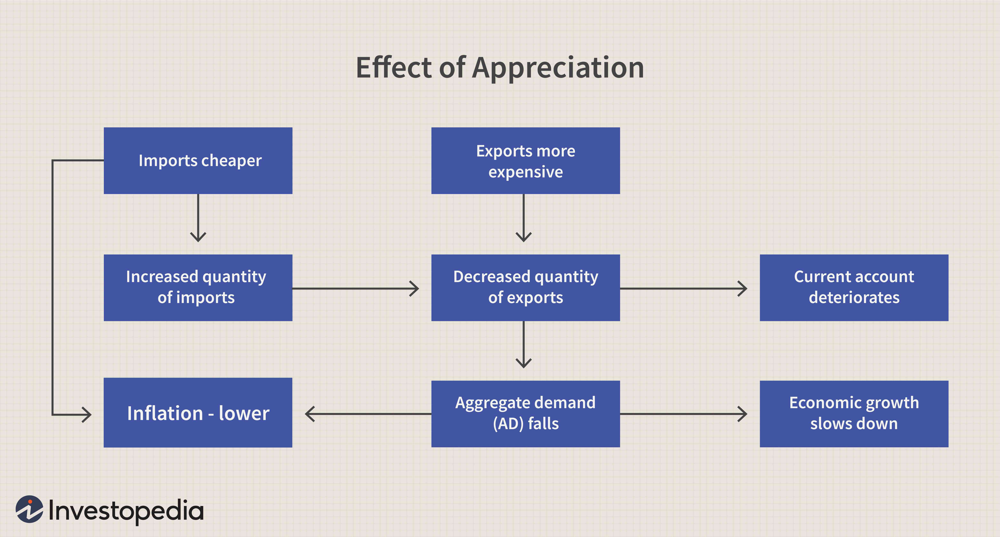

The dynamics of technology adoption play a critical role in the successful diffusion of innovations within the market. This process determines the extent and speed at which new technologies become integral components of business operations and daily life. One such innovation that has seen notable implications is algorithmic trading, commonly known as algo trading. This sophisticated form of trading uses automated and pre-programmed trading instructions to account for variables such as timing, price, and volume, representing a significant advancement in the investment landscape.

This article explores how adoption rates influence the diffusion of algo trading and other technologies. Adoption rates are pivotal, serving as indicators of how quickly a technology is embraced by the market. Influences on these rates include the technology’s perceived advantages, compatibility with existing systems, and ease of use. These factors play a decisive role in whether a new technology becomes a transformative force or fades into obscurity.

Understanding these concepts offers valuable insights, equipping businesses and individuals with the knowledge to navigate the adoption landscape efficiently. Successful navigation is critical, as it enables more strategic planning and implementation of new technologies. In addition, understanding adoption dynamics assists in predicting a technology's potential success and formulating effective marketing and development strategies.

We will examine key examples and theories behind adoption rates and innovation diffusion, offering a comprehensive view of how technologies like algo trading permeate markets. The Diffusion of Innovations Theory, developed by Everett Rogers, provides a framework for categorizing adopters and understanding their behaviors, which we will reference to illustrate these dynamics. By addressing these themes, this article aims to shed light on both the challenges and opportunities associated with the adoption of algo trading and similar innovations.

## Table of Contents

## What is the Rate of Adoption?

The rate of adoption is a metric that quantifies how swiftly a new technology is accepted and used by the market. This rate can significantly affect whether a new innovation can become widely implemented or remain a niche product. Among the crucial factors influencing the rate of adoption are the perceived benefits of the technology, its compatibility with existing systems, and the ease with which it can be used.

Perceived benefits are often the foremost consideration for potential adopters, as they assess whether the advantages of the new technology justify any associated costs or learning curves. In the case of algorithmic trading (algo trading), for example, the potential to significantly enhance trading strategies by automating processes and making data-driven decisions serves as a strong motivator for adoption. This advantage can lead to more efficient trading operations, improved accuracy in transactions, and ultimately, higher profitability.

Compatibility with existing systems is another determinant of the rate of adoption. Technology that seamlessly integrates with established infrastructure is typically more readily adopted, as it minimizes disruption and reduces the need for costly adjustments. For algo trading, traders and financial institutions look for platforms and solutions that can be easily incorporated with their current trading systems and data feeds, facilitating a smoother transition.

Ease of use also plays a pivotal role in technology adoption. Technologies that are user-friendly are less intimidating to potential adopters, thus accelerating their acceptance in the market. The complexity of algo trading, which often requires a deep understanding of both software engineering and financial markets, can hinder its adoption unless platforms are designed to simplify user interaction or offer comprehensive educational support.

The adoption rate of algo trading reflects both its benefits and complexities. While the potential to optimize trading strategies encourages adoption, the technical and operational challenges can act as limiting factors. Understanding these rates of adoption not only allows businesses to predict the success of new technologies but also informs strategic planning to enhance the likelihood of successful implementation. By analyzing these factors, companies and individuals can develop targeted approaches to increase adoption rates, such as offering better support, ensuring greater compatibility, or highlighting the specific benefits that align with user needs.

## Innovation Diffusion and the Diffusion of Innovations Theory

Innovation diffusion refers to the process by which new technologies or ideas are communicated and spread within a population over time. This concept is crucial for understanding how innovations permeate markets and societies. One of the most influential frameworks for analyzing how innovations are adopted is the Diffusion of Innovations Theory, formulated by Everett Rogers. This theory classifies adopters into five distinct categories based on their readiness and speed in adopting new technologies: innovators, early adopters, early majority, late majority, and laggards.

**Categories of Adopters:**

1. **Innovators**: These individuals are the first to embrace new technologies, often driven by a fascination with novelty and a willingness to take risks. They typically represent about 2.5% of the population and are essential for the initial introduction of innovations.

2. **Early Adopters**: This group, making up approximately 13.5% of the population, is more integrated into the social system than innovators and plays a crucial role in influencing subsequent adopters. They are often seen as opinion leaders and are critical for gaining wider acceptance.

3. **Early Majority**: Representing around 34% of the population, the early majority adopts new technologies once they have been tried and tested. They rely heavily on recommendations from early adopters before committing.

4. **Late Majority**: Also comprising about 34% of the population, the late majority is more sceptical. These adopters only embrace innovations after the majority of society has done so, often driven by peer pressure or economic necessity.

5. **Laggards**: This group, accounting for roughly 16% of the population, is the last to adopt new innovations. They tend to be conservative and resistant to change, often sticking with traditional solutions until they become obsolete.

Understanding these adopter categories allows businesses to tailor their marketing strategies effectively, targeting each group differently based on their characteristics and readiness to adopt new technologies.

**Algo Trading Diffusion:**

Algorithmic trading, or algo trading, exemplifies varied diffusion rates influenced by technological access and market readiness. Early adopters of algo trading were primarily financial institutions with substantial resources dedicated to technology development. These institutions recognized the potential efficiency and profitability gains from using algorithms to execute trades at high speed and [volume](/wiki/volume-trading-strategy), which early on provided them with a competitive advantage.

As technological infrastructure improved and awareness of algo trading's benefits increased, we saw a shift toward the early majority. This group, including smaller funds and individual traders, began to adopt algo trading strategies, facilitated by the availability of more accessible and affordable trading platforms.

The spread of algo trading highlights how technological accessibility and market conditions can accelerate or hinder innovation diffusion. In markets where high-speed internet and robust computing infrastructure are prevalent, the adoption of such technologies tends to be quicker. Conversely, in areas with less technological advancement, the diffusion process may be slower, and adoption among the late majority and laggards can be significantly delayed.

In conclusion, the successful diffusion of innovations like algo trading depends heavily on how well businesses understand and engage with each category of adopters. This knowledge enables companies to deploy targeted strategies that accommodate the varying readiness levels and preferences of these groups, ultimately ensuring a smoother integration of new technologies into the market.

## Adoption Examples in the Financial Sector

The financial sector has consistently embraced new technologies to enhance efficiency and competitiveness. A prominent example is the widespread adoption of [algorithmic trading](/wiki/algorithmic-trading) (algo trading), which has revolutionized financial markets by enabling the automated execution of trades using pre-defined criteria and algorithms. Algo trading's success within the industry underscores the factors that drive technology adoption, such as increased speed, accuracy, and the ability to process vast amounts of market data in real-time.

Tech giants like Facebook and platforms such as smartphones illustrate high adoption rates primarily due to network effects. Network effects occur when the value of a product or service increases as more individuals use it. In the case of Facebook, the platform's utility is directly tied to its user base; as more people joined, the richer and more engaging the network became. Similarly, smartphones transformed communications and personal computing by providing a unified platform for apps that leverage these network effects, leading to widespread adoption across various demographics.

On the other hand, not all technologies achieve rapid adoption. 3D TVs serve as a classic example where initial excitement failed to translate into widespread usage. Barriers such as limited 3D content, the discomfort of prolonged usage of 3D glasses, and a lack of consumer demand impeded the technology's adoption. The case of 3D TVs highlights how critical the availability of complementary goods and user acceptance is for adoption success.

These contrasting examples within and beyond the financial sector offer valuable insights into adoption factors. Successful adoption often hinges on the technology's ability to integrate seamlessly into existing ecosystems, offer clear advantages over predecessors, and gain widespread consumer support. In the financial sector, algo trading has capitalized on these factors, showcasing how efficiently the adoption of innovations can reshape industries, providing a template for other technologies seeking to penetrate mature markets.

## The Role of Network Effects in Adoption

Network effects, often referred to as demand-side economies of scale, occur when the value of a product or service increases as more people use it. This phenomenon plays a crucial role in the adoption of various technologies, including algorithmic trading. As more entities embrace algo trading, the overall ecosystem becomes richer—through shared knowledge, enhanced algorithmic strategies, and increased [liquidity](/wiki/liquidity-risk-premium)—thus attracting even more participants.

In the context of algo trading, network effects manifest in several ways. First, wider adoption leads to a more competitive environment, which fosters the development of more sophisticated algorithms. As traders and institutions use these algorithms, the data generated contributes to further refinement and innovation. This cycle promotes not only the effectiveness of trading strategies but also draws in additional market participants seeking to capitalize on these advancements. Consequently, higher participation can lead to improved market efficiencies, such as tighter bid-ask spreads and more consistent price discovery.

A classic example that illustrates the significance of network effects is the internet. Initially, the value of being online was limited with few users and minimal content. However, as more individuals and businesses connected to the internet, the network effect greatly amplified its utility. This increased interaction and content creation led to an exponential growth in internet adoption. Platforms that utilized these network effects, such as social media networks and e-commerce sites, experienced rapid growth as the user base expanded, enhancing content diversity and user experience.

In algo trading, as more traders adopt these systems, the aggregation of trading data allows for better prediction models and innovative trading strategies. Improved algorithms not only benefit current users but also attract new ones, perpetuating a cycle of growth similar to the internet's expansion.

The concept of network effects can be further understood mathematically. Let $V$ represent the value derived by a user from a network, $n$ represent the number of users, and $f(n)$ be a function that models how value changes with users. A simple network effect model can be represented as:

$$
V = k \cdot f(n)
$$

where $k$ is a constant. In many scenarios, $f(n)$ could be $n$ or $n^2$, indicating linear or quadratic growth of value with additional users.

Overall, recognizing and harnessing network effects can powerfully influence the success of technology adoption. In algo trading, understanding these dynamics helps financial firms to strategically leverage their platforms to maximize benefits arising from increased user bases, ultimately enhancing the entire trading ecosystem.

## Overcoming Barriers to Adoption in Algo Trading

Algo trading, or algorithmic trading, has transformed the financial industry by enabling automated trading strategies that are faster and often more precise than human traders. However, the adoption of algo trading is not without its challenges, primarily due to its complexity and the cost associated with its implementation. Overcoming these barriers is crucial for the widespread adoption of algorithmic trading technology.

The complexity of algo trading arises from the need for a deep understanding of both trading strategies and programming. Developing, testing, and deploying trading algorithms requires expertise in quantitative finance and coding skills, often in languages such as Python or C++. This dual expertise is not common, thus creating a significant barrier for many potential users, particularly smaller firms or individual traders who may not have the resources to hire or develop this expertise internally.

Educational initiatives can address this complexity by providing the necessary training and resources. Online courses, workshops, and certifications in financial engineering and algorithmic trading can help bridge the knowledge gap. Platforms like Coursera, edX, and Khan Academy offer courses tailored to the needs of aspiring algo traders. These educational resources can empower traders with limited technical backgrounds to develop and implement their own algorithms.

User-friendly platforms also play a pivotal role in overcoming the complexity barrier. Trading platforms that offer intuitive interfaces and the ability to use pre-coded strategies can significantly lower the entry barrier. These platforms often include drag-and-drop features or visual programming interfaces that allow users to design and test algorithms without deep programming knowledge. They also provide [backtesting](/wiki/backtesting) environments where users can simulate their strategies under various market conditions before risking real capital.

The cost of implementation is another barrier to algo trading adoption. Developing sophisticated trading algorithms can be expensive, requiring investment in technology infrastructure such as high-performance computers and reliable data feeds. Additionally, hiring skilled professionals to develop and maintain the algorithms adds to the cost. To mitigate this, cloud-based solutions can offer scalable computing resources at a fraction of the cost of owning and maintaining physical servers. Moreover, fee structures based on usage rather than flat rates can make these technologies more accessible to smaller traders.

Regulatory frameworks and market readiness also affect the adoption of algorithmic trading. Different regions may have varying regulations regarding automated trading, which can either facilitate or hinder adoption. For example, regulations that ensure fairness and transparency can foster trust in algo trading systems, whereas overly stringent regulations might stifle innovation. Market readiness, including technological infrastructure and participant expertise, is also crucial for adoption. Markets that are mature and technologically equipped are more likely to facilitate higher adoption rates.

In conclusion, while complexity and cost are significant barriers to the adoption of algorithmic trading, educational initiatives, user-friendly platforms, and supportive regulatory frameworks can significantly mitigate these challenges. By focusing on these areas, both individuals and organizations can better prepare for and engage in algo trading, ultimately fostering a more innovative and competitive financial environment.

## Implications for Innovators and Marketers

In the rapidly evolving landscape of technological innovation, comprehending adoption curves is pivotal for strategizing successful product launches and marketing campaigns. For innovators, the primary focus should be on enhancing technology compatibility and simplifying the user experience. These efforts can significantly impact the rate of adoption by reducing perceived barriers among potential users.

Technology compatibility ensures that new innovations seamlessly integrate with existing systems or practices. This integration lowers the resistance users might have when transitioning from old methods to new ones. To achieve high compatibility, innovators should conduct thorough market research and gather user feedback during the development phase. Such practices can prevent potential setbacks that arise from overlooked compatibility issues.

Simplifying the user experience is another critical [factor](/wiki/factor-investing). A complex or unintuitive product can deter potential adopters, regardless of its technological superiority. Clear, user-friendly interfaces and comprehensive support resources can alleviate this concern. The application of user-centered design principles can lead to products that are more accessible, enhancing user satisfaction and promoting wider adoption.

Marketers, on the other hand, play an essential role in leveraging success stories and extensive data to influence potential adopters. Success stories, or case studies, show real-world applications and benefits of the technology, making it more relatable and desirable. They provide concrete evidence of the technology's effectiveness, lower perceived risks, and build trust with new customers.

Extensive data analysis and utilization also support marketing strategies by identifying trends, target demographics, and optimal channels for reaching potential adopters. Market segmentation allows marketers to tailor their messages to specific groups, increasing the likelihood of adoption among diverse audiences.

By focusing on compatibility and user experience, and effectively utilizing narratives and data, innovators and marketers can increase the likelihood of successful technology adoption. This strategy helps bridge the gap between early adopters and the broader market, accelerating the diffusion of innovations.

## Conclusion

The interplay of adoption rates and innovation diffusion is critical to the successful implementation of technology, as seen in the case of algorithmic trading (algo trading). Algo trading highlights several broader implications for various sectors by demonstrating how understanding these dynamics can lead to better strategic decisions. By recognizing the factors that drive or hinder adoption, companies can tailor their approaches to specific market conditions.

One of the key insights from algo trading is the importance of reducing barriers to adoption while enhancing facilitators. Complex technologies often face hurdles such as high implementation costs, intricate user interfaces, and steep learning curves. Addressing these issues through educational initiatives, user-friendly platforms, and supportive regulatory frameworks can significantly improve adoption rates. Moreover, the development of communities that foster collective learning and resource-sharing can also play a vital role in easing the adoption process.

Facilitators like network effects further illustrate the interconnectedness of adoption dynamics. As more entities adopt a technology, its value and efficiency tend to increase, creating a positive feedback loop that encourages further adoption. This pattern is exemplified by the widespread uptake of internet technologies and social media platforms, where increased user numbers amplify utility and attractiveness.

For businesses seeking to improve their innovation diffusion strategies, a focus on understanding and leveraging these dynamics is crucial. Ensuring technology compatibility with existing systems and simplifying user experiences can make a significant difference in adoption rates. Meanwhile, harnessing data-driven insights and success stories as part of marketing strategies can help convince potential adopters of the tangible benefits of new innovations.

In conclusion, a nuanced understanding of adoption rates and innovation diffusion can pave the way for more effective technology implementation strategies. By addressing barriers and leveraging facilitators, businesses across sectors can enhance their capability to capitalize on technological advancements and maintain competitive advantage in an ever-evolving marketplace.

## References & Further Reading

[1]: Rogers, E. M. (2003). ["Diffusion of Innovations."](https://archive.org/details/diffusionofinnov00roge_0) Free Press.

[2]: Lopez de Prado, M. (2018). ["Advances in Financial Machine Learning."](https://www.amazon.com/Advances-Financial-Machine-Learning-Marcos/dp/1119482089) Wiley.

[3]: Jansen, S. (2020). ["Machine Learning for Algorithmic Trading: Predictive Models to Extract Signals From Market and Alternative Data for Systematic Trading Strategies with Python."](https://www.amazon.com/Machine-Learning-Algorithmic-Trading-alternative/dp/1839217715) Packt Publishing.

[4]: Chan, E. (2008). ["Quantitative Trading: How to Build Your Own Algorithmic Trading Business."](https://github.com/ftvision/quant_trading_echan_book) Wiley.

[5]: Aronson, D. (2007). ["Evidence-Based Technical Analysis: Applying the Scientific Method and Statistical Inference to Trading Signals."](https://www.amazon.com/Evidence-Based-Technical-Analysis-Scientific-Statistical/dp/0470008741) Wiley.