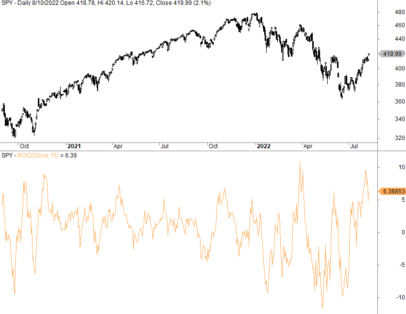

## Table of Contents

## What is the Rate of Change (ROC) indicator in trading?

The Rate of Change (ROC) indicator is a tool used in trading to measure how quickly the price of a stock or other financial asset is changing. It calculates the percentage change in price over a specific period, usually a set number of days. If the price of a stock goes up a lot in a short time, the ROC will be high, showing strong momentum. If the price stays the same or goes down, the ROC will be low or negative.

Traders use the ROC to spot trends and make decisions about buying or selling. When the ROC line crosses above zero, it can mean the start of an upward trend, suggesting it might be a good time to buy. On the other hand, if the ROC line goes below zero, it could signal a downward trend, which might be a sign to sell. By watching the ROC, traders can get a sense of the market's momentum and make better choices about when to enter or exit trades.

## How is the ROC calculated?

The Rate of Change (ROC) is calculated by finding the difference between the current price of a stock and its price a certain number of periods ago, then dividing that difference by the price from that earlier period. This result is then multiplied by 100 to turn it into a percentage. For example, if you want to calculate the ROC over 10 days, you would subtract the stock's price 10 days ago from today's price, divide by the price 10 days ago, and then multiply by 100.

The formula for ROC looks like this: ROC = ((Current Price - Price n periods ago) / Price n periods ago) * 100. Here, "n periods ago" means how many days, weeks, or months back you want to look. If the ROC is positive, it means the price has gone up over that time. If it's negative, the price has gone down. Traders use this information to understand how fast the price is changing and to make decisions about buying or selling.

## What does a positive ROC value indicate?

A positive ROC value means that the price of the stock or asset has gone up over the time period you are looking at. It shows that the price now is higher than it was before. For example, if you are looking at a 10-day ROC and it's positive, it means the price today is higher than it was 10 days ago.

Traders like to see a positive ROC because it can mean that the stock is gaining value and might keep going up. They might see this as a good time to buy the stock, hoping to sell it later at a higher price. But, it's important to remember that just because the ROC is positive now, it doesn't guarantee the price will keep going up. Traders need to look at other things too, like the overall market and other indicators, before making a decision.

## What does a negative ROC value indicate?

A negative ROC value means the price of the stock or asset has gone down over the time period you're looking at. If you're checking a 10-day ROC and it's negative, it means the price today is lower than it was 10 days ago. This tells you that the stock has lost value during that time.

Traders often see a negative ROC as a sign that the stock might keep losing value. They might think it's a good time to sell the stock to avoid losing more money. But, just because the ROC is negative now doesn't mean the price will keep going down. Traders need to look at other things, like the overall market and other indicators, before deciding what to do.

## How can the ROC be used to identify overbought or oversold conditions?

Traders can use the ROC to figure out if a stock is overbought or oversold by watching how high or low the ROC gets. If the ROC goes really high, it might mean the stock is overbought. This happens when a lot of people are buying the stock, pushing its price up fast. A high ROC could be a sign that the price might soon go down because it's too high and people might start selling.

On the other hand, if the ROC goes really low, it might mean the stock is oversold. This happens when a lot of people are selling the stock, making its price drop fast. A low ROC could be a sign that the price might soon go up because it's too low and people might start buying again. By looking at these extreme ROC values, traders can guess when it might be a good time to buy or sell.

## What are the common time periods used for calculating ROC?

The most common time periods for calculating the Rate of Change (ROC) are 12 days and 25 days. Traders like using these time periods because they help see how the stock's price is changing over a short to medium amount of time. The 12-day ROC is good for looking at short-term changes, while the 25-day ROC looks at a bit longer term.

Some traders also use shorter periods like 9 days or even 5 days to get a quicker idea of how the price is moving. These shorter periods can be useful for people who like to make fast trades. But, using very short periods can also make the ROC jump around a lot, which might make it harder to see clear trends.

## How can traders use ROC to generate buy and sell signals?

Traders can use the ROC to generate buy and sell signals by watching when the ROC line crosses above or below the zero line. When the ROC goes from negative to positive and crosses above zero, it can be a signal to buy. This means the stock's price is starting to go up after being down, which might be a good time to get into the trade. Traders look for this as a sign that the stock might keep going up, so they can buy it at a lower price and sell it later at a higher price.

On the other hand, when the ROC goes from positive to negative and crosses below zero, it can be a signal to sell. This means the stock's price is starting to go down after being up, which might be a good time to get out of the trade. Traders see this as a sign that the stock might keep going down, so they can sell it before it loses more value. By using the ROC to spot these crossing points, traders can make decisions about when to buy or sell based on the momentum of the stock's price.

## What are the limitations of using the ROC as a standalone indicator?

Using the ROC by itself can be tricky because it doesn't tell the whole story about a stock's price. The ROC only shows how fast the price is changing, but it doesn't say if the price is high or low compared to what it usually is. This means that even if the ROC is high, the stock might still be a good buy if it's not too expensive. But if you only look at the ROC, you might miss out on other important information like the stock's overall trend or how it's doing compared to other stocks.

Another problem with using the ROC alone is that it can give false signals. Sometimes, the ROC might show that a stock is going up or down really fast, but then the price might change direction quickly. This can make traders buy or sell at the wrong times if they're only looking at the ROC. To make better decisions, traders should use the ROC along with other tools like moving averages, [volume](/wiki/volume-trading-strategy) indicators, or other types of charts to get a fuller picture of what's happening with the stock.

## How can the ROC be combined with other technical indicators for better results?

Combining the ROC with other technical indicators can give traders a more complete view of the market and help them make better decisions. For example, using the ROC along with moving averages can help traders spot trends more clearly. If the ROC shows a strong upward move and the price is also above a long-term moving average, it might be a good sign to buy. On the other hand, if the ROC is dropping and the price is below a long-term moving average, it might be a good time to sell. By looking at both the ROC and moving averages, traders can see not just how fast the price is changing, but also where it is in relation to its past performance.

Another useful combination is using the ROC with the Relative Strength Index (RSI). The RSI helps traders see if a stock is overbought or oversold. If the ROC is high and the RSI is also above 70, it might mean the stock is overbought and could soon go down. If the ROC is low and the RSI is below 30, it might mean the stock is oversold and could soon go up. By using both the ROC and RSI, traders can get a better sense of when to buy or sell based on both the speed of price changes and the stock's current condition.

## What are some real-world examples of ROC trading strategies?

One real-world example of using the ROC for trading is a strategy called "ROC Crossover." Traders using this strategy watch for the ROC line to cross above or below the zero line. When the ROC goes from negative to positive, it's a signal to buy the stock. This means the price is starting to go up after being down, which might be a good time to get in. On the other hand, when the ROC goes from positive to negative, it's a signal to sell. This means the price is starting to go down after being up, so it might be a good time to get out. By looking for these crossovers, traders can catch the start of new trends and make profits from the stock's momentum.

Another example is combining the ROC with the Moving Average Convergence Divergence (MACD) indicator. Traders might use the ROC to see how fast the price is changing and the MACD to confirm the trend's strength. If the ROC shows a strong upward move and the MACD line crosses above its signal line, it might be a strong buy signal. This means both the speed of the price change and the trend's strength are pointing in the same direction. On the flip side, if the ROC is dropping and the MACD line crosses below its signal line, it might be a strong sell signal. By using both the ROC and MACD, traders can get a clearer picture of whether to buy or sell, making their decisions more reliable.

## How does the ROC perform in different market conditions?

The ROC can work differently depending on whether the market is going up, going down, or staying the same. In a strong bull market, where prices are going up a lot, the ROC can be really helpful. It can show traders when the price is moving up fast, which might be a good time to buy. But, in a bull market, the ROC might also give false signals because prices can go up so fast that the ROC stays high for a long time, making it hard to know when to sell.

In a bear market, where prices are going down a lot, the ROC can also be useful. It can show traders when the price is dropping fast, which might be a good time to sell or even short sell. But, just like in a bull market, the ROC can give false signals in a bear market too. If the price keeps going down, the ROC might stay low for a long time, making it hard to know when to buy again. In a sideways market, where prices are not moving much, the ROC might not be as useful. It might keep going back and forth around zero, which doesn't give clear signals for buying or selling.

## What advanced techniques can be applied to enhance the effectiveness of ROC in trading strategies?

One advanced technique to make the ROC more effective in trading is to use it with other indicators like the Bollinger Bands. Bollinger Bands show how much the price is moving around its average. If the ROC is high and the price is also near the top of the Bollinger Bands, it might mean the stock is overbought and could soon go down. If the ROC is low and the price is near the bottom of the Bollinger Bands, it might mean the stock is oversold and could soon go up. By looking at both the ROC and Bollinger Bands, traders can get a better idea of when to buy or sell based on both the speed of price changes and how much the price is moving around.

Another technique is to use the ROC with volume indicators like the On-Balance Volume (OBV). The OBV helps traders see if the volume is going up or down along with the price. If the ROC is high and the OBV is also going up, it might mean the price increase is strong and could keep going up. If the ROC is low and the OBV is going down, it might mean the price decrease is strong and could keep going down. By using the ROC and OBV together, traders can see not just how fast the price is changing, but also if the volume is supporting that change, making their trading decisions more reliable.

## What is the Rate of Change (ROC) Indicator?

The Rate of Change (ROC) indicator is a momentum oscillator utilized by traders to evaluate the velocity at which a security's price changes over a specific time frame. It does this by comparing the current price of the asset to its price 'n' periods earlier. Mathematically, it can be expressed as:

$$
\text{ROC} = \left( \frac{\text{Current Price} - \text{Price } n \text{ periods ago}}{\text{Price } n \text{ periods ago}} \right) \times 100
$$

This calculation results in a percentage that indicates the rate at which the price has changed. The ROC indicator is plotted on a chart against a central zero line. Positive ROC values suggest upward momentum, indicating that the price is higher now than it was 'n' periods ago, while negative values denote downward momentum, showing that the price has decreased.

One of the primary advantages of using the ROC is its ability to signal the [momentum](/wiki/momentum) of an asset. It helps traders make informed decisions by assessing the direction and strength of market trends. When the ROC crosses above the zero line, it might indicate an emerging uptrend, whereas a drop below the zero line could signal a potential downtrend. Traders use these insights to make buy or sell decisions accordingly.

Moreover, the ROC can act as a tool for identifying overbought or oversold market conditions. Extreme positive or negative ROC values may hint at the possibility of an impending price reversal, indicating that an asset might be due to correct its [course](/wiki/best-algorithmic-trading-courses). This insight is particularly useful for identifying potential entry and [exit](/wiki/exit-strategy) points in various trading strategies.

The ROC indicator provides a straightforward yet powerful method for analyzing price changes and understanding market momentum, aiding traders in navigating the complexities of financial markets effectively.

## What is the ROC Indicator Formula and how is it calculated?

The Rate of Change (ROC) indicator is computed using the formula:

$$
\text{ROC} = \left( \frac{\text{Current Price} - \text{Price } n \text{ periods ago}}{\text{Price } n \text{ periods ago}} \right) \times 100
$$

This calculation provides the percentage change in price over a specified number of periods, denoted as 'n'. The selection of 'n' is crucial as it determines the sensitivity and applicability of the ROC in various trading scenarios. Typically, short-term traders opt for a smaller 'n', such as 9 or 14 periods, which renders the indicator highly responsive to price movements. However, this heightened sensitivity can occasionally lead to false signals in turbulent market environments. Conversely, long-term investors may choose a larger 'n', such as 100 or 200 periods, to smooth out short-term fluctuations and focus on broader trends.

The calculation process involves taking the current closing price and subtracting the closing price from 'n' periods ago. This result is then divided by the price from 'n' periods ago, and multiplied by 100 to yield the percentage change.

For practical implementation, the calculation can be executed in Python using the following code snippet:

```python
def calculate_roc(prices, n):
    """
    Calculate the Rate of Change (ROC) for a given set of prices and period 'n'.

    Parameters:
    prices (list): A list of prices (usually closing prices).
    n (int): Number of periods for ROC calculation.

    Returns:
    list: A list of ROC values.
    """
    roc_values = []
    for i in range(n, len(prices)):
        previous_price = prices[i - n]
        current_price = prices[i]
        roc = ((current_price - previous_price) / previous_price) * 100
        roc_values.append(roc)
    return roc_values

# Example usage:
prices = [100, 110, 105, 115, 120, 125]
roc_values = calculate_roc(prices, 3)
print(roc_values)
```

In this example, 'prices' is a list containing historical price data. The function computes the ROC values based on the specified period 'n'. Understanding the sensitivity and implications of 'n' is essential for harnessing the full potential of the ROC, tailored to suit specific trading objectives and market conditions.

## References & Further Reading

[1]: Appel, G. (2005). ["Technical Analysis: Power Tools for Active Investors."](https://www.amazon.com/Technical-Analysis-Power-Active-Investors/dp/0132930048) Financial Times Press.

[2]: Achelis, S. B. (2000). ["Technical Analysis from A to Z, 2nd Edition."](https://archive.org/details/technicalanalysi00ache) McGraw-Hill.

[3]: Murphy, J. J. (1999). ["Technical Analysis of the Financial Markets: A Comprehensive Guide to Trading Methods and Applications."](https://www.amazon.com/Technical-Analysis-Financial-Markets-Comprehensive/dp/0735200661) New York Institute of Finance.

[4]: Pring, M. J. (2014). ["Technical Analysis Explained: The Successful Investor's Guide to Spotting Investment Trends and Turning Points."](https://www.amazon.com/Technical-Analysis-Explained-Fifth-Successful/dp/0071825177) McGraw-Hill Education.

[5]: Wilder, J. W. (1978). ["New Concepts in Technical Trading Systems."](https://books.google.com/books/about/New_Concepts_in_Technical_Trading_System.html?id=WesJAQAAMAAJ) Trend Research.