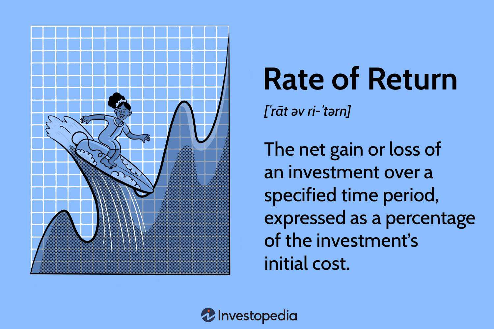

In the ever-evolving landscape of finance and technology, the intersection of public utilities, rate-of-return regulation, and algorithmic trading offers a fascinating arena of exploration. This dynamic intersection is significant given the distinct roles these entities play within financial markets. Public utilities are essential service providers, often subject to stringent regulation to prevent monopolistic practices and ensure fair pricing for consumers. Rate-of-return regulation, a historical framework, has been instrumental in safeguarding consumers from excessive charges by allowing regulated entities to cover costs and secure a reasonable profit margin.

On the other hand, algorithmic trading represents a cutting-edge evolution in financial technology. By utilizing automated, pre-programmed instructions, algorithmic trading allows for rapid transactions that account for variables like price, timing, and volume. This innovation has revolutionized trading by enhancing speed, efficiency, and market liquidity.

The convergence of these two domains—utility regulation and algorithmic trading—presents intriguing possibilities. By applying algorithmic principles within regulated public utility frameworks, more efficient pricing and investment strategies could emerge, potentially benefiting both service providers and consumers.

This article will explore these concepts further, beginning with an in-depth examination of rate-of-return regulation in public utilities. Understanding the historical context and functionality of this regulation is crucial to appreciating its role in contemporary markets. Subsequently, the article will highlight the transformative capabilities of algorithmic trading. Finally, it will analyze the potential integration of rate-of-return regulation into algorithmic trading systems, alongside the associated benefits and risks, offering insight into how these sectors might evolve together to influence financial markets.

## Table of Contents

## Understanding Rate-of-Return Regulation

Rate-of-return regulation is a traditional regulatory framework employed to oversee public utilities, ensuring that the prices charged to consumers are fair while allowing utility companies to recover their operating costs and secure a reasonable profit margin. This regulatory approach is fundamental in industries such as gas, water, and electricity, where natural monopolies often exist due to the high infrastructure costs and critical nature of services. 

Historically, rate-of-return regulation has played a crucial role in maintaining the affordability and reliability of essential public services. The key advantage of this model is its capacity to provide price stability, offering consumers protection against exorbitant rates that could arise from monopolistic practices. Under this system, regulators assess a utility's operational expenses and investments, subsequently determining a rate of return that is deemed just and reasonable. This ensures the utility's capacity to maintain infrastructure, improve service quality, and accommodate demand growth while achieving financial sustainability.

Critics of rate-of-return regulation argue that it can discourage cost minimization and innovation within the utilities sector. Because utilities are assured a fixed return on their investments, they might lack the incentive to streamline operations or adopt new technologies that could enhance efficiency. The guaranteed returns can potentially lead to overinvestment in capital expenditures, known as the "Averch-Johnson effect," where firms invest in excess capacity to maximize profit under regulatory constraints.

The legal foundations of rate-of-return regulation are rooted in landmark United States Supreme Court cases. Munn v. Illinois (1877) established the principle that private enterprises operating in the public interest can be subject to government regulation. Smyth v. Ames (1898) further refined this by outlining that regulated rates must allow utilities to earn a reasonable return on the fair value of the property devoted to public service. These foundational cases underscore the balance sought between private enterprise rights and public welfare in utility regulation.

In recent decades, the prevalence of rate-of-return regulation has waned with the emergence of more dynamic regulatory frameworks, such as performance-based regulation. These modern approaches often emphasize efficiency, innovation, and customer service over traditional cost-recovery models. For instance, incentive-based regulation encourages utilities to reduce costs and improve service quality by allowing them to share in the efficiency gains. These alternative frameworks aim to better align the interests of utility companies with those of consumers and society at large, whilst responding to the rapid changes occurring in technology and market dynamics.

## Algorithmic Trading: A New Dawn

Algorithmic trading refers to the use of automated, pre-programmed trading instructions that take into account variables like timing, price, and [volume](/wiki/volume-trading-strategy). This form of trading capitalizes on advanced technology and quantitative models to execute trades at speeds and frequencies uninhibited by human manual interactions. High-frequency trading ([HFT](/wiki/high-frequency-trading-strategies)), a subset of [algorithmic trading](/wiki/algorithmic-trading), represents an arena where trades are executed within fractions of a second, often significantly influencing market [liquidity](/wiki/liquidity-risk-premium) and efficiency. The backbone of this technology lies in understanding technical indicators and economic fundamentals, which can include statistical [arbitrage](/wiki/arbitrage), [market making](/wiki/market-making), and pattern recognition.

The advent of algorithmic trading has significantly transformed traditional trading methods by enabling faster and more efficient transactions. An example of this is the use of smart order routing systems that dynamically analyze and determine the best execution options across multiple trading venues, optimizing for factors such as price, time, and liquidity. Such automated systems minimize the market impact while maximizing execution performance, providing traders and institutional investors with the tools to manage large volumes of transactions with ease and precision.

Despite its transformative benefits, algorithmic trading introduces challenges, most notably its potential to exacerbate market [volatility](/wiki/volatility-trading-strategies) and systemic risk. The "Flash Crash" of May 6, 2010, serves as a prominent example wherein a massive automated sell order triggered an unprecedented short-term market plunge, only to rebound shortly after. This incident highlighted the need for robust risk management and regulatory frameworks to mitigate potential adverse impacts on market stability.

Recent advancements in [machine learning](/wiki/machine-learning) (ML) and [artificial intelligence](/wiki/ai-artificial-intelligence) (AI) have further broadened the horizons for algorithmic trading. These technologies facilitate the development of more sophisticated algorithms that can adapt to evolving market conditions and learn from vast datasets. Techniques such as [reinforcement learning](/wiki/reinforcement-learning) and [deep learning](/wiki/deep-learning) enable traders to uncover complex trading patterns and designs that traditional methods might not reveal. For instance, AI-driven sentiment analysis can quantify market sentiment from social media feeds or news articles, better equipping algorithms to preemptively adjust trading strategies to hedge against unfavorable market movements.

In conclusion, while algorithmic trading offers numerous advantages in terms of speed, adaptability, and scope, it mandates a balanced approach that considers potential risks. Future developments in this domain will likely focus on enhancing AI capabilities, regulatory oversight mechanisms, and innovative solutions to further refine the delicate equilibrium between technological progress and market integrity.

## Intersecting Paths: Public Utilities and Algo Trading

The integration of algorithmic trading principles into the regulation of public utilities offers a transformative approach to enhancing both operational efficiency and financial performance. By adopting algorithmic models for pricing and investment decisions, utility companies can navigate the complexities of rate-of-return regulation with improved precision. Algorithmic models can process vast amounts of data to identify optimal pricing strategies and investment opportunities, potentially aligning closely with regulatory objectives while maximizing profitability.

Algorithmic trading relies on computational algorithms capable of executing trades at high speeds and volumes, taking into account numerous variables such as price trends, volume changes, and market signals. Applying similar algorithms to public utilities, companies can develop models that dynamically adjust pricing in response to real-time demand and supply fluctuations. Such predictive analytics not only improve regulatory compliance through accurate forecasts but also enhance operational efficiency by optimizing resource allocation and minimizing waste.

Moreover, algorithmic approaches can facilitate better decision-making processes regarding investments in infrastructure or technology upgrades. By evaluating a multitude of variables, algorithms can recommend investment portfolios that align with both regulatory constraints and market conditions. This can lead to more effective capital deployment and risk management strategies.

However, integrating algorithmic models within public utility frameworks presents several challenges. Regulatory oversight must be maintained to ensure that algorithmic decisions adhere to standards of fairness and non-discrimination. There are also ethical considerations, such as ensuring that pricing strategies do not disproportionately disadvantage vulnerable customer groups. Therefore, a balance must be struck between harnessing algorithmic efficiency and upholding the fundamental principles of public utility regulation.

A hybrid approach, employing both human oversight and algorithmic modeling, could address these challenges by ensuring that algorithm-driven decisions are transparent and accountable. This blend of technology and regulation could provide a robust framework that harnesses the strengths of both domains, leading to more sustainable and consumer-friendly utility services. The careful consideration of risks and opportunities will be critical to successfully integrating algorithmic trading principles within public utility sectors.

## Potential Implications and Future Outlook

The integration of algorithmic trading principles within public utility regulation could significantly alter how utilities are managed and controlled. This transformation is likely to bring about several potential benefits, primarily through heightened innovation and improved resource allocation. By adopting algorithmic models, utilities can achieve more dynamic responses to market changes, potentially leading to more efficient and cost-effective operations. This shift could enable better predictive analytics, allowing utility companies to optimize pricing, demand forecasting, and resource management with greater precision.

However, this integration is not without its challenges. One of the primary concerns is data privacy, as algorithmic systems require vast amounts of data to function effectively. Managing this data responsibly is crucial to maintaining consumer trust and adhering to legal standards. Additionally, there are ethical concerns regarding the automation of pricing strategies. The use of algorithms in setting prices could lead to outcomes that, while efficient, are perceived as unfair or discriminatory, raising questions about transparency and equity in the marketplace.

Looking ahead, the future of public utilities may involve hybrid regulatory frameworks that blend traditional methods with algorithmic efficiencies. Such frameworks would need to safeguard public interests while leveraging the benefits of advanced technologies. Achieving this balance will require close collaboration between public utilities and financial regulators. They must work together to establish guidelines and standards that ensure algorithmic trading principles are implemented in a fair, ethical, and effective manner.

Public utilities and regulators must actively engage in dialogue and strategic planning to navigate the complexities of this integration. By doing so, they can develop more resilient and adaptive systems that align with both technological advancements and regulatory requirements, ultimately paving the way for a more sustainable and efficient utility sector.

## Conclusion

The confluence of rate-of-return regulation and algorithmic trading offers exciting opportunities alongside significant challenges. Harnessing the advantages of both can lead to innovative solutions that provide tangible benefits to both consumers and utility companies. By integrating algorithmic approaches with traditional regulatory mechanisms, there's potential to optimize efficiency, enhance profitability, and ensure fairness in pricing strategies. 

To achieve these objectives, ongoing dialogue and research are paramount as these sectors continue to evolve. It is imperative that technological advancements in algorithmic trading are aligned with existing and emerging regulatory frameworks. This alignment will ensure that the improvements made are not only technical but also adhere to legal and ethical standards, preserving the integrity and trust inherent in public utility operations.

Ultimately, the overarching goal remains to enhance the efficiency and sustainability of public utilities while upholding core principles of fairness and transparency. Algorithmic trading, with its ability to rapidly process and analyze large volumes of data, can provide the insights needed for more informed decision-making in rate-of-return regulation. However, this potential must be balanced with conscientious oversight to prevent unintended consequences such as market manipulation or unfair price fluctuations. 

This exploration highlights the promising potential for blending regulatory frameworks with technological innovation, paving the way for evolving utilities that meet future demands without compromising on public responsibility and ethical considerations. As these fields intersect and intertwine, stakeholders must work collaboratively to ensure that this integration fosters an environment where innovation leads to meaningful improvement and sustainable development in public utilities.

## References & Further Reading

[1]: Brown, S. L., & Sibley, D. S. (1986). ["The Theory of Public Utility Pricing."](https://archive.org/details/theoryofpublicut0000brow) Cambridge University Press.

[2]: Phillips, C. F. (1993). ["The Regulation of Public Utilities."](https://www.amazon.com/Regulation-Public-Utilities-Theory-Practice/dp/0910325456) Public Utilities Reports.

[3]: de Prado, M. L. (2018). ["Advances in Financial Machine Learning."](https://www.amazon.com/Advances-Financial-Machine-Learning-Marcos/dp/1119482089) Wiley.

[4]: Hasbrouck, J. (2007). ["Empirical Market Microstructure: The Institutions, Economics, and Econometrics of Securities Trading."](https://academic.oup.com/book/52241) Oxford University Press.

[5]: Chan, E. P. (2009). ["Quantitative Trading: How to Build Your Own Algorithmic Trading Business."](https://github.com/ftvision/quant_trading_echan_book) Wiley.