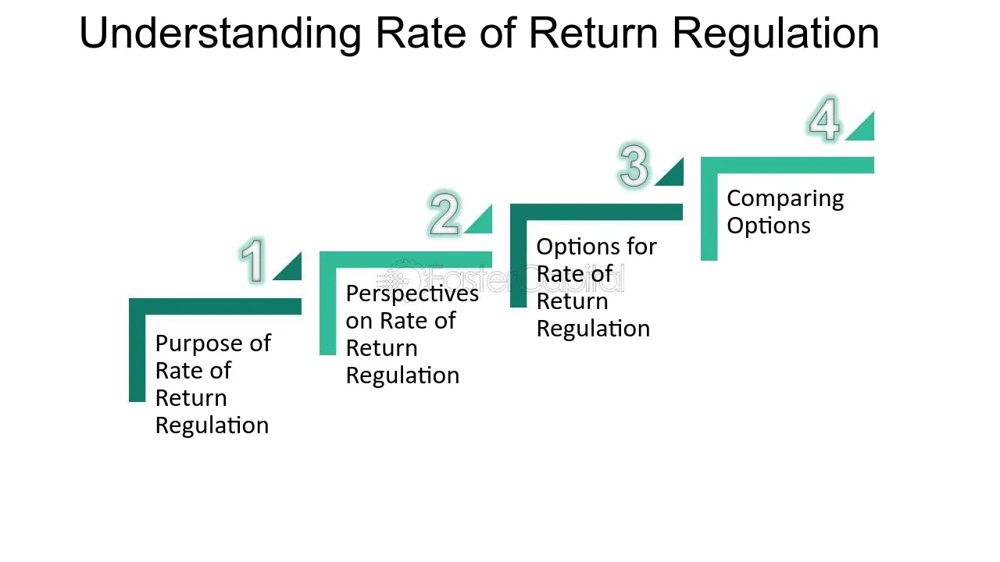

## Table of Contents

## What is Rate of Return Regulation?

Rate of Return Regulation is a way that governments control how much money companies, especially utility companies like those providing electricity or water, can make. It works by setting a maximum percentage of profit that these companies are allowed to earn on the money they have invested in their business. This is done to make sure that the companies don't charge too much from customers and to keep services affordable.

The process involves the government or a regulatory body looking at the company's total investment, known as the rate base, and then deciding what a fair rate of return on that investment should be. If a company makes more profit than the allowed rate, it might have to lower its prices. On the other hand, if it's not making enough, it might be allowed to increase its prices. This helps to balance the interests of the company and the customers, ensuring that the company can keep running while keeping costs reasonable for everyone.

## How does Rate of Return Regulation differ from other regulatory methods?

Rate of Return Regulation is different from other methods because it focuses on controlling the profit that a company can make. It sets a limit on how much profit a company can earn based on what they've invested in their business. This is different from other methods like Price Cap Regulation, which instead sets a maximum price that a company can charge for its services. With Price Cap Regulation, the company can make as much profit as it can as long as it stays under the price limit. This encourages companies to find ways to be more efficient and cut costs.

Another method is Revenue Cap Regulation, which limits the total amount of money a company can make from its services over a certain period. Unlike Rate of Return Regulation, which looks at profit in relation to investment, Revenue Cap Regulation is more about controlling the overall income of the company. This can push companies to serve more customers or find new ways to earn money within the cap. Each of these methods tries to balance the needs of the company and the customers, but they do it in different ways, focusing on different aspects of the business.

## What are the key components of Rate of Return Regulation?

Rate of Return Regulation involves a few important parts. One key part is the rate base, which is all the money a company has spent on things like buildings, equipment, and other investments needed to run its business. The government or a regulatory body looks at this rate base to figure out how much profit the company should be allowed to make. The allowed profit is usually a percentage of the rate base, and this percentage is called the rate of return.

Another important part is setting the actual rates that customers will pay. The company calculates how much money it needs to cover its costs and earn the allowed profit. Then, the regulatory body checks if these rates are fair for customers. If the company is making too much profit, it might have to lower its rates. If it's not making enough, it might be allowed to raise them. This way, the regulation tries to keep services affordable while making sure the company can keep running and investing in its business.

## Why was Rate of Return Regulation implemented in utilities?

Rate of Return Regulation was put in place for utilities like electricity and water companies to make sure they don't charge too much from customers. Utilities are often the only ones providing these services in an area, so they can set high prices if there's no competition. By controlling how much profit these companies can make, the government can keep prices fair and services affordable for everyone.

This type of regulation also helps keep the utility companies stable and able to keep providing services. It does this by allowing them to earn a reasonable profit on their investments, which encourages them to keep their equipment in good shape and to invest in new projects. This balance helps make sure that the companies can run well while still keeping costs reasonable for customers.

## How is the allowed rate of return determined under this regulation?

The allowed rate of return under Rate of Return Regulation is decided by looking at what's fair for both the utility company and its customers. A government agency or regulatory body looks at the company's rate base, which is all the money the company has put into things like buildings and equipment. They then decide what percentage of that money the company should be allowed to earn as profit. This percentage, or rate of return, is meant to be enough to keep the company running well and able to invest in its services, but not so high that it makes services too expensive for customers.

To figure out the right rate of return, the regulatory body considers a few things. They look at how much it costs the company to borrow money, what kind of profits other similar businesses are making, and what the overall economy is like. They want to make sure the company can keep up its services and even improve them, but also that the prices stay reasonable for everyone who uses those services. By balancing these factors, they come up with a rate of return that's fair for everyone involved.

## What are the potential benefits of Rate of Return Regulation for consumers?

Rate of Return Regulation helps keep prices fair for people who use services like electricity and water. It does this by making sure that the companies providing these services don't make too much profit. If a company tries to charge too much, the government can step in and tell them to lower their prices. This way, people don't have to pay more than they should for basic services.

Another good thing about this regulation is that it makes sure the companies keep their services running well. The companies are allowed to make a fair amount of money, which means they can spend on things like fixing equipment and building new facilities. This helps make sure that people get reliable services without having to worry about the companies going out of business or letting things fall apart.

## What challenges do regulators face when implementing Rate of Return Regulation?

Regulators face a big challenge in figuring out the right rate of return for companies. They have to balance what's fair for the company to earn and what's affordable for customers. If they set the rate too high, the company might charge too much, and people will have to pay more for services like electricity or water. But if they set it too low, the company might not make enough money to keep things running well, and the service could get worse. It's a tricky balance to find the right number that keeps everyone happy.

Another challenge is keeping up with how much money the company is actually making. Companies might try to find ways to make more profit than they're allowed, like by saying they need more money for costs than they really do. Regulators have to keep a close eye on the company's [books](/wiki/algo-trading-books) to make sure they're not cheating. This can be hard work and takes a lot of time and effort to do it right. If they miss something, the company could end up making too much money, and customers would have to pay more than they should.

## How does Rate of Return Regulation impact investment decisions in regulated industries?

Rate of Return Regulation affects how companies in regulated industries decide to spend their money on new projects or improvements. Since the regulation sets a limit on how much profit a company can make, it might not want to invest in big new projects if the profit they can earn from it is capped. Companies might think twice before spending a lot of money because they know they can only make a certain amount back, even if the project could bring in more money.

On the other hand, knowing that they can earn a fair return on their investments can make companies feel more sure about putting money into things like new equipment or expanding their services. If the allowed rate of return is set right, it can encourage companies to keep their services up to date and even improve them. But it's a delicate balance, because if the rate is too low, companies might not want to invest at all, and if it's too high, they might charge too much from customers.

## Can you explain the concept of 'regulatory lag' in the context of Rate of Return Regulation?

Regulatory lag is a term used in Rate of Return Regulation that means there's a delay between when a company's costs change and when the government or regulatory body updates the prices the company can charge. This can happen because it takes time for the regulators to review the company's new costs and decide on new rates. During this time, the company might have to keep charging the old rates, even if their costs have gone up. This can make it harder for the company to make a fair profit.

On the flip side, if the company's costs go down, regulatory lag means they might keep charging higher prices for a while, which can be good for their profits but not so good for customers. This delay can affect how well the regulation works because it might not keep up with changes in the company's situation. It's a challenge for regulators to keep the rates fair and up to date, and it can influence how the company makes decisions about investing in new projects or improvements.

## What are the criticisms of Rate of Return Regulation, and how valid are they?

One big criticism of Rate of Return Regulation is that it might not encourage companies to be as efficient as they could be. Since the regulation sets a limit on how much profit they can make, companies might not try very hard to cut costs or find better ways to do things. They know they can only make a certain amount of money no matter how efficient they are. This can be a valid point because if companies aren't pushed to be more efficient, they might not improve their services as much as they could.

Another criticism is that Rate of Return Regulation can lead to what's called "gold plating," where companies spend more money than they need to on things like equipment or buildings. They do this because they know they can earn a profit on their investments, so they might spend more to get a bigger rate base and make more money. This criticism is also valid because it can lead to higher costs for customers without any real benefit. Regulators have to be careful to make sure companies aren't spending too much just to make more profit.

## How has Rate of Return Regulation evolved over time, and what are the current trends?

Rate of Return Regulation has changed a lot over time. At first, it was all about making sure utility companies didn't charge too much and kept their services running well. But as time went on, people started to see that this way of regulating might not be pushing companies to be as efficient as they could be. So, regulators started looking for other ways to do things, like Price Cap Regulation and Revenue Cap Regulation, which focus more on controlling prices or total income instead of just profit.

Nowadays, there's a trend toward using a mix of different regulation methods. Some places still use Rate of Return Regulation but mix it with other approaches to try and get the best of both worlds. For example, they might use Rate of Return Regulation to make sure companies are making a fair profit, but also use Price Cap Regulation to encourage them to find ways to be more efficient. This way, regulators can keep prices fair for customers while also making sure companies keep improving their services.

## What are some case studies or examples where Rate of Return Regulation has been successfully or unsuccessfully applied?

In the United States, Rate of Return Regulation has been used for a long time to control the prices that utility companies charge for services like electricity and water. One successful example is in California, where the Public Utilities Commission has used this regulation to keep electricity prices fair for customers while also allowing utility companies like Pacific Gas and Electric (PG&E) to earn enough profit to maintain and improve their services. By carefully setting the rate of return, the commission has been able to balance the needs of the companies and their customers, helping to keep the lights on and the prices reasonable.

However, there have also been cases where Rate of Return Regulation has faced challenges. In the UK, the water industry used to be regulated this way, but it led to a problem called "gold plating." Water companies were spending more money than they needed to on things like pipes and treatment plants because they knew they could earn a profit on their investments. This made water more expensive for customers without really improving the service. As a result, the UK switched to a different kind of regulation, called Price Cap Regulation, to try and encourage the companies to be more efficient and keep costs down.

These examples show that while Rate of Return Regulation can work well in some cases, it's not perfect and can lead to problems if not managed carefully. Regulators need to keep a close eye on how companies are spending their money and make sure the rate of return is set at the right level to keep everything in balance.

## References & Further Reading

[1]: Brown, S. L., & Sibley, D. S. (1986). ["The Theory of Public Utility Pricing."](https://archive.org/details/theoryofpublicut0000brow) Cambridge University Press.

[2]: Phillips, C. F. (1993). ["The Regulation of Public Utilities."](https://www.amazon.com/Regulation-Public-Utilities-Theory-Practice/dp/0910325456) Public Utilities Reports.

[3]: de Prado, M. L. (2018). ["Advances in Financial Machine Learning."](https://www.amazon.com/Advances-Financial-Machine-Learning-Marcos/dp/1119482089) Wiley.

[4]: Hasbrouck, J. (2007). ["Empirical Market Microstructure: The Institutions, Economics, and Econometrics of Securities Trading."](https://academic.oup.com/book/52241) Oxford University Press.

[5]: Chan, E. P. (2009). ["Quantitative Trading: How to Build Your Own Algorithmic Trading Business."](https://github.com/ftvision/quant_trading_echan_book) Wiley.