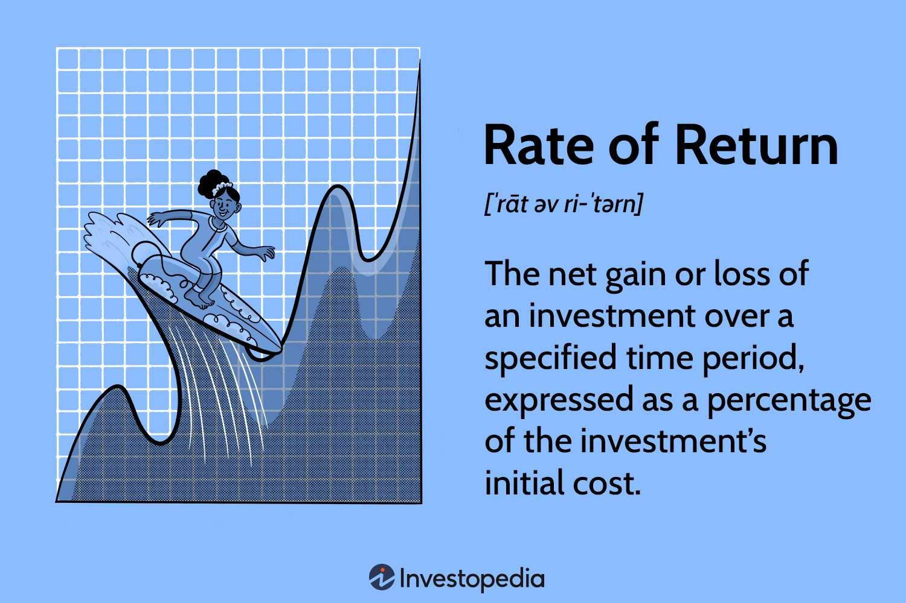

## Table of Contents

## What is the basic definition of rate of return?

The rate of return is a way to measure how much money you've made or lost on an investment over a certain period of time. It's usually shown as a percentage and helps you understand if your investment was a good choice. For example, if you put $100 into a savings account and after a year you have $105, your rate of return would be 5%.

Calculating the rate of return can be simple or complex, depending on the investment. For basic investments like savings accounts, you just need to know the starting amount, the ending amount, and the time period. For more complicated investments like stocks, you might need to consider things like dividends, fees, and taxes. No matter how you calculate it, the rate of return is a key tool for comparing different investments and making smart financial decisions.

## How do you calculate the simple rate of return?

To calculate the simple rate of return, you need to know the amount of money you started with, called the initial investment, and the amount of money you ended up with, called the final value. You find the difference between these two amounts, which tells you how much you gained or lost. Then, you divide that difference by the initial investment. Finally, you multiply the result by 100 to turn it into a percentage. The formula looks like this: (Final Value - Initial Investment) / Initial Investment * 100.

For example, imagine you bought a stock for $50 and sold it later for $60. The difference is $60 - $50 = $10. When you divide $10 by the initial investment of $50, you get 0.2. Multiply that by 100, and you find the simple rate of return is 20%. This means your investment grew by 20% over the time you held it. It's a straightforward way to see how well your investment did, without considering things like fees or taxes.

## What is the difference between simple and compound rate of return?

The simple rate of return calculates how much money you've made or lost on an investment over a certain time, without considering the effect of earning interest on interest. It's like if you put money in a savings account and only earned interest on the original amount you put in, not on any interest you earned along the way. This method is good for short-term investments or when you want a quick way to see how much your investment grew, but it doesn't show the full picture if your money is earning more money over time.

The compound rate of return, on the other hand, takes into account the power of earning interest on interest. It's like if you left your money in a savings account and the interest you earned each year was added to your original amount, so you earned interest on a bigger amount each time. This method is better for long-term investments because it shows how your money can grow faster over time. For example, if you invest $100 and it earns 10% a year, with compound interest, you'd have more than $110 after a year because the interest would be calculated on the new total, not just the original $100.

## How does inflation affect the rate of return?

Inflation can make the rate of return on your investments seem smaller than it really is. Imagine you invest some money and it grows by 5% in a year. That sounds good, but if prices for things you buy went up by 3% because of inflation, your real gain is only 2%. This means even though your money grew, it doesn't buy as much as it used to because everything costs more.

To really understand how well your investments are doing, you need to look at the real rate of return, which takes inflation into account. If your investment grows by 5% and inflation is at 3%, your real rate of return is 2%. This is important because if your rate of return is less than the inflation rate, you're actually losing purchasing power. For example, if your investment only grows by 2% but inflation is at 3%, you're falling behind because your money can buy less than before.

## What are the common types of rate of return used in financial analysis?

In financial analysis, people often use the simple rate of return to understand how much money an investment made over a certain time. It's easy to calculate because you just need to know how much you started with and how much you ended up with. You find the difference between these amounts, divide by the starting amount, and then multiply by 100 to get a percentage. This method is good for quick checks on short-term investments, but it doesn't consider things like earning interest on interest or other costs like fees and taxes.

Another common type is the compound rate of return, which is better for long-term investments. This method shows how your money can grow faster over time because it takes into account the interest you earn on both your original investment and the interest you've already earned. For example, if you leave your money in a savings account and the interest you earn each year is added to your total, you'll earn more interest in the future. This can make a big difference over many years, showing how powerful compound interest can be.

Lastly, there's the real rate of return, which adjusts for inflation. This is important because inflation can make your money worth less over time. If your investment grows by 5% in a year but prices go up by 3%, your real rate of return is only 2%. This helps you see if your investment is really keeping up with the cost of living. Understanding these different rates of return can help you make smarter choices about where to put your money.

## How do taxes impact the rate of return on investments?

Taxes can take a bite out of your investment earnings, making your rate of return lower than you might expect. When you earn money from investments like stocks, bonds, or savings accounts, you usually have to pay taxes on those earnings. This means that part of the money you make goes to the government instead of staying in your pocket. For example, if your investment grows by 10% in a year, but you have to pay 20% in taxes on that growth, your after-tax rate of return is only 8%. This can make a big difference, especially if you're in a high tax bracket where you pay more in taxes.

Understanding how taxes affect your investments can help you plan better. Some investments, like certain retirement accounts, offer tax benefits that can boost your rate of return. For instance, money in a 401(k) or an IRA can grow without being taxed until you take it out, which can help your investments grow faster over time. Knowing about these tax rules can help you choose the best places to put your money and keep more of your earnings.

## What is the internal rate of return (IRR) and how is it used?

The internal rate of return (IRR) is a way to figure out how well an investment is doing over time. It's like a special percentage that shows you the average yearly profit you can expect from your investment. To find the IRR, you need to know how much money you're putting in and how much you're getting back at different times. It's a bit tricky to calculate because you need to use a formula or a computer, but it's really helpful because it considers the time value of money, which means it knows that money now is worth more than money later.

People use the IRR to compare different investments and see which one might be the best choice. If you're thinking about buying a new business or investing in a project, you can use the IRR to see if it's worth it. For example, if one investment has an IRR of 10% and another has an IRR of 8%, you might pick the one with the higher IRR because it promises a better return on your money. But remember, the IRR has its limits. It assumes you can reinvest all your earnings at the same rate, which isn't always possible, and it can be hard to use if the cash flows are too unpredictable.

## How can risk be factored into the rate of return calculations?

When you think about how much money you might make from an investment, you also need to think about how risky it is. Riskier investments might offer bigger rewards, but they also have a higher chance of losing money. To figure out how risk affects the rate of return, people often use something called the risk-adjusted rate of return. This helps you see if the possible reward is worth the risk. One common way to do this is by using the Sharpe ratio, which compares the extra return you get from an investment to how much it moves up and down. A higher Sharpe ratio means you're getting more reward for the risk you're taking.

Another way to think about risk in rate of return is by looking at the expected return. This means you guess how much you might make based on different things that could happen. For example, if you invest in a stock, you might look at what could happen if the company does really well, okay, or badly. By figuring out how likely each of these things is to happen, you can get a better idea of what your return might be. This helps you see if the investment is worth the risk. Both of these methods help you make smarter choices about where to put your money by thinking about both the reward and the risk.

## What is the relationship between rate of return and the time value of money?

The rate of return and the time value of money are closely connected. The time value of money is the idea that money you have now is worth more than the same amount of money you'll get in the future. This is because you can use money now to invest or spend, and it might grow over time. The rate of return shows how much your investment grows over time. When you calculate the rate of return, you're figuring out how the time value of money affects your investment. For example, if you invest $100 and it grows to $110 in a year, your rate of return is 10%. This means your money grew by 10% over that time, showing the effect of the time value of money.

Understanding this relationship helps you make better decisions about your investments. If you know that money now is worth more than money later, you'll want to invest in things that give you a good rate of return to make up for waiting. Different ways of calculating the rate of return, like the compound rate of return, take into account how money can grow over time because of the time value of money. This is why long-term investments often use compound interest, which makes your money grow faster over time. By thinking about both the rate of return and the time value of money, you can choose investments that will help your money work harder for you.

## How do different investment vehicles (stocks, bonds, real estate) influence the expected rate of return?

Different investment vehicles like stocks, bonds, and real estate can affect the expected rate of return in different ways. Stocks are known for having higher potential returns but also come with more risk. When you buy a stock, you're buying a piece of a company, and if the company does well, the value of your stock can go up a lot. But if the company struggles, you could lose money. This means the expected rate of return for stocks can be high, but it's also less certain. On the other hand, bonds are generally safer but offer lower returns. When you buy a bond, you're lending money to a company or government, and they pay you back with interest. The rate of return on bonds is usually more predictable because you know how much interest you'll get, but it won't grow as fast as stocks might.

Real estate is another type of investment that can affect your expected rate of return. When you invest in real estate, you might buy a house or a building to rent out or sell later for a profit. Real estate can offer a good rate of return because property values can go up over time, and you can earn money from rent. But real estate also comes with its own risks, like the cost of maintaining the property and the chance that the market might go down. Each of these investment vehicles has its own balance of risk and reward, which influences what kind of rate of return you can expect. Understanding these differences can help you choose the best way to grow your money.

## What are the advanced methods for adjusting rate of return for risk, such as the Sharpe Ratio and the Sortino Ratio?

The Sharpe Ratio and the Sortino Ratio are advanced ways to adjust the rate of return for risk. The Sharpe Ratio looks at how much extra return you get from an investment compared to a risk-free investment, like a savings account, and then divides that by how much the investment's value moves up and down. This helps you see if the extra return is worth the risk. A higher Sharpe Ratio means you're getting more reward for the risk you're taking. For example, if one investment has a Sharpe Ratio of 1.5 and another has a Sharpe Ratio of 0.5, the first one is a better choice because it gives you more return for the same amount of risk.

The Sortino Ratio is similar to the Sharpe Ratio but focuses only on the bad kind of risk, which is when your investment loses value. It compares the extra return you get to how much the investment's value can drop. This is helpful because most people care more about avoiding losses than about the ups and downs of their investment. A higher Sortino Ratio means you're getting a good return without taking too much risk of losing money. For example, if one investment has a Sortino Ratio of 2 and another has a Sortino Ratio of 1, the first one is better because it gives you more return for the risk of losing money. Both ratios help you make smarter choices about where to put your money by thinking about both the reward and the risk.

## How do macroeconomic factors influence the rate of return across different markets?

Macroeconomic factors like inflation, interest rates, and economic growth can really change how much money you might make from your investments in different markets. If inflation goes up, it can make your money worth less over time. This means even if your investment grows, it might not buy as much as before. Interest rates set by the government or central banks can also affect your returns. When interest rates go up, borrowing money becomes more expensive, which can slow down the economy and make it harder for companies to grow. This might make stocks and other investments less valuable. On the other hand, if the economy is growing fast, companies might make more money, which could make their stocks go up and increase your rate of return.

Different markets react differently to these macroeconomic factors. For example, the stock market might go up when the economy is growing because people feel good about buying stocks. But if interest rates go up, bond prices might go down because new bonds will pay more interest. Real estate markets can also be affected. If the economy is doing well, more people might want to buy homes, which can drive up prices and increase the rate of return on real estate investments. But if interest rates go up, it can make mortgages more expensive, which might slow down the real estate market. Understanding these factors can help you pick the best investments for your money.

## What is the process of understanding investment analysis and financial performance?

Investment analysis is a fundamental process used to evaluate potential investments, with the primary goal of determining their alignment with specific financial objectives. This analysis helps investors make informed decisions by examining various aspects such as potential returns, associated risks, and overall profitability.

One of the central elements of investment analysis is the evaluation of key financial performance metrics. The rate of return (RoR) is particularly crucial as it measures the profitability of an investment over a specified period, usually expressed as a percentage. The formula for calculating the rate of return is:

$$

\text{Rate of Return} = \left(\frac{\text{Final Value} - \text{Initial Value}}{\text{Initial Value}}\right) \times 100 
$$

This calculation considers both capital gains and any income generated from dividends or interest, providing a comprehensive view of the investment's performance.

Risk assessment is another vital component of financial performance analysis. It involves identifying and quantifying the potential risks associated with an investment, helping investors understand the likelihood of achieving their financial goals. Risk metrics such as [volatility](/wiki/volatility-trading-strategies), beta, and [value at risk](/wiki/var-value-at-risk) (VaR) are commonly used in this context to measure the sensitivity of an investment's returns to market fluctuations.

Profitability analysis further complements investment analysis by assessing an investment's ability to generate income relative to its costs. Metrics such as profit margin, return on assets (ROA), and return on equity (ROE) offer insights into the efficiency and effectiveness of an investment in generating profits.

Comprehensive investment analysis not only aids in understanding potential returns and risks but also plays a crucial role in identifying vulnerabilities and opportunities within an investment portfolio. By analyzing these key metrics, investors can pinpoint areas that may require reallocation or diversification to optimize performance and achieve their financial objectives. This holistic approach ensures that investments are not only chosen based on potential returns but also factored with risk considerations and profitability prospects, ultimately enhancing the overall robustness of an investment strategy.

## What is the Role of Rate of Return in Investment Analysis?

The rate of return (RoR) serves as an essential metric in assessing the profitability of investments, enabling investors to understand how well their investments are performing over time. It is typically expressed as a percentage and provides insight into the efficiency of an investment in generating profit.

A positive RoR indicates that an investment has yielded a profit, while a negative RoR suggests a loss over the assessed period. This straightforward indication is crucial for investors seeking to evaluate the success of their investment strategies. To calculate the RoR, both capital gains and income generated from dividends or interest must be taken into account. This comprehensive approach ensures a complete evaluation of an investment's financial return.

The formula for calculating the RoR is:

$$
\text{RoR} = \left(\frac{\text{Ending Value} - \text{Beginning Value} + \text{Income}}{\text{Beginning Value}}\right) \times 100\%
$$

Where:
- Ending Value is the final value of the investment,
- Beginning Value is the initial value of the investment,
- Income refers to any dividends or interest earned during the investment period.

This formula can be implemented in Python as follows:

```python
def calculate_rate_of_return(beginning_value, ending_value, income):
    return ((ending_value - beginning_value + income) / beginning_value) * 100

# Example usage
beginning_value = 1000  # Initial investment
ending_value = 1200    # Value at the end of the investment period
income = 50            # Income from dividends or interest

ror = calculate_rate_of_return(beginning_value, ending_value, income)
print(f"Rate of Return: {ror:.2f}%")
```

Calculation of RoR through such formulas not only aids in quantifying performance but also assists in future investment decisions, enabling investors to compare different investment opportunities on a common scale. This facilitates better strategic planning and portfolio management, ensuring that investment choices align with the investor's financial goals and risk tolerance.

Beyond individual assessment, RoR is a pivotal element for investors when comparing the performance of different asset classes or investment opportunities. It aids in identifying instruments that have historically offered better returns, thereby optimizing the investment mix within a portfolio for enhanced long-term growth.

In conclusion, the rate of return is a fundamental evaluative tool for investors, providing critical insight into profitability and enabling informed decision-making within the broader landscape of investment analysis. By systematically considering both capital enhancement and income streams, RoR offers a nuanced perspective on the overall financial performance of investments.

 to Algorithmic Trading

Algorithmic trading utilizes computer algorithms to automate and execute trading processes according to pre-established guidelines. These strategies are characterized by their ability to process vast amounts of financial data rapidly, analyzing factors such as historical price patterns, trading volumes, and various market indicators to identify opportunities. By automating decision-making, [algorithmic trading](/wiki/algorithmic-trading) can enhance the speed and precision of trades, reducing the likelihood of human error and emotional interference.

A fundamental aspect of algorithmic trading is its reliance on data-driven analysis. Algorithms are designed to interpret extensive datasets, employing statistical methods and [machine learning](/wiki/machine-learning) techniques to discern market trends and potential shifts. For instance, a common algorithm might analyze historical price movements to forecast future price directions, which forms the basis for executing buy or sell orders.

Python, a widely-used programming language in algorithmic trading, offers libraries such as NumPy and pandas for data manipulation and PyAlgoTrade for developing customizable strategies. A simple outline in Python for [backtesting](/wiki/backtesting) a moving average crossover strategy might look like this:

```python
import pandas as pd

def moving_average(data, window):
    return data.rolling(window=window).mean()

# Example of a simple moving average crossover strategy
def trading_strategy(data, short_window, long_window):
    data['Short_MA'] = moving_average(data['Close'], short_window)
    data['Long_MA'] = moving_average(data['Close'], long_window)

    data['Signal'] = 0
    data['Signal'][short_window:] = np.where(data['Short_MA'][short_window:] > data['Long_MA'][short_window:], 1, 0)
    data['Position'] = data['Signal'].diff()

    return data

# Assuming 'data' is a pandas DataFrame with a 'Close' column of stock prices
backtest_data = trading_strategy(data, short_window=40, long_window=100)
```

Algorithmic trading can significantly contribute to the profitability and efficiency of investment portfolios by systematically employing strategies that react swiftly to market signals. However, the complexity of these algorithms also necessitates rigorous backtesting and ongoing refinement to ensure robustness against unforeseen market conditions. Through continuous adaptation, algorithmic trading remains a potent tool in modern finance.

## How can we evaluate the financial performance of algorithmic trading?

Evaluating the financial performance of algorithmic trading involves assessing key metrics that provide insights into the effectiveness and efficiency of the trading strategies employed. These metrics help in understanding how well an algorithmic trading strategy is performing and whether it meets the desired investment objectives.

One of the primary metrics used is the **Sharpe Ratio**. This ratio measures the return of an investment compared to its risk. It is calculated using the formula:

$$
\text{Sharpe Ratio} = \frac{R_p - R_f}{\sigma_p}
$$

where $R_p$ is the expected portfolio return, $R_f$ is the risk-free rate, and $\sigma_p$ is the standard deviation of the portfolio's excess return. A higher Sharpe Ratio indicates that the strategy is delivering a better return for the given level of risk. 

Another critical metric is the **Maximum Drawdown**, which represents the largest peak-to-trough decline in the investment value during a specific period. This metric is essential for understanding the potential losses an investor might face when employing a particular algorithmic strategy. It is critical in managing risk and ensuring that the strategy does not expose the investor to unacceptable levels of potential loss.

The **Profit Factor** measures the net profit generated by the trading strategy relative to the net loss. It is defined as:

$$
\text{Profit Factor} = \frac{\text{Total Gross Profit}}{\text{Total Gross Loss}}
$$

A Profit Factor greater than 1 indicates that the strategy is profitable, while a value less than 1 suggests that the strategy incurs losses over the examined period.

The **Win Rate** is another valuable metric, measuring the percentage of profitable trades relative to the total number of trades executed. A high Win Rate may suggest a reliable strategy, though it should be interpreted alongside other metrics, as it does not account for the magnitude of wins versus losses.

Lastly, the **Average Trade Value** provides a per-trade profitability insight. It is calculated as the total net profit divided by the total number of trades. This metric helps to understand the average gain or loss per trade, offering a granular view of the strategy's profitability.

These metrics, when analyzed collectively, offer a comprehensive view of an algorithmic trading strategy's financial performance, aiding investors in making informed decisions. By continuously monitoring these indicators, traders can identify areas for improvement and adapt their strategies to changing market conditions.

## What are the challenges in algorithmic investment strategies?

Algorithmic investment strategies present unique challenges, the most prominent being overfitting. Overfitting occurs when a trading algorithm is tailored too closely to historical data, capturing noise rather than genuine market signals. This results in models that perform exceptionally well on past data but fail to sustain profitability under new, unseen market conditions. To mitigate overfitting, it's essential to incorporate techniques such as cross-validation and use out-of-sample testing. Cross-validation involves partitioning data into subsets to evaluate model performance iteratively, ensuring robustness. Out-of-sample testing, on the other hand, assesses the model's performance on a separate data set not used during the training phase. Here is a basic example using Python:

```python
from sklearn.model_selection import TimeSeriesSplit 
from sklearn.metrics import mean_squared_error
import numpy as np

# Example time series data
data = np.array([...])

# Initialize the time series cross-validator
tscv = TimeSeriesSplit(n_splits=5)
for train_index, test_index in tscv.split(data):
    train, test = data[train_index], data[test_index]
    model = ...  # Define and train your model
    predictions = model.predict(test)
    print('MSE:', mean_squared_error(test, predictions))
```

Another critical challenge includes transaction costs, which encompass both explicit fees and implicit costs such as slippage. Slippage is the difference between the expected price of a trade and the actual price. This can occur due to market fluctuations between the time a trade decision is made and when it is executed. Transaction costs can erode profit margins, especially for high-frequency trading strategies. A quantitative trader must account for these costs in decision-making processes, often using cost models to estimate and minimize their impact:

$$
\text{Net Profit} = \text{Gross Profit} - (\text{Fees} + \text{Slippage})
$$

Lastly, algorithmic investors must contend with varying market conditions. Markets are dynamic, influenced by numerous factors including macroeconomic indicators, geopolitical events, and regulatory changes. Therefore, algorithms must be both adaptable and robust, capable of recognizing and responding to shifts in market regimes. Continuous monitoring and updating of algorithms are necessary to ensure they remain effective. This may involve employing machine learning techniques that can learn and adapt over time.

In light of these challenges, it is imperative for those engaging in algorithmic trading to remain vigilant, continually testing and refining their strategies to maintain competitive advantage in the ever-evolving financial markets.

## References & Further Reading

[1]: Bergstra, J., Bardenet, R., Bengio, Y., & Kégl, B. (2011). ["Algorithms for Hyper-Parameter Optimization."](https://dl.acm.org/doi/10.5555/2986459.2986743) Advances in Neural Information Processing Systems 24.

[2]: ["Advances in Financial Machine Learning"](https://www.amazon.com/Advances-Financial-Machine-Learning-Marcos/dp/1119482089) by Marcos Lopez de Prado

[3]: ["Evidence-Based Technical Analysis: Applying the Scientific Method and Statistical Inference to Trading Signals"](https://www.amazon.com/Evidence-Based-Technical-Analysis-Scientific-Statistical/dp/0470008741) by David Aronson

[4]: ["Machine Learning for Algorithmic Trading"](https://github.com/stefan-jansen/machine-learning-for-trading) by Stefan Jansen

[5]: ["Quantitative Trading: How to Build Your Own Algorithmic Trading Business"](https://books.google.com/books/about/Quantitative_Trading.html?id=j70yEAAAQBAJ) by Ernest P. Chan