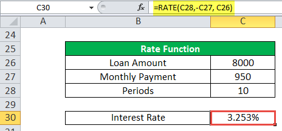

The intersection of finance, economics, and technology has fundamentally altered trading as we know it. At the core of these transformations are financial instruments, interest rate triggers, and algorithmic trading—each playing a pivotal role in reshaping the operations of modern markets. Understanding the dynamics and interplay of these components is essential for investors and traders who wish to successfully navigate contemporary financial landscapes.

Financial instruments, such as stocks, bonds, and derivatives, serve as the fundamental tools that facilitate investment and hedging activities. These instruments are significantly influenced by interest rates, which act as critical economic indicators. Changes in interest rates affect the valuation and attractiveness of financial instruments, prompting reactions from market participants. As such, interest rate triggers—a predefined threshold or change in rates prompting specific financial actions—are central to managing risks and opportunities in trading.



Algorithmic trading, an area of significant technological innovation, has further revolutionized market operations. By automating the execution of trades based on pre-defined criteria, algorithms can swiftly react to market signals, including fluctuations in interest rates. This automation enhances decision-making precision, allowing traders to execute complex strategies that can outpace human capabilities in terms of speed and efficiency.

The impact of these elements is profound, influencing trading strategies and market behaviors. Investors and traders must understand how these components interact to optimize their strategies in a competitive, fast-paced environment. This article seeks to explore the influence of financial instruments, interest rate triggers, and algorithmic trading on market operations and the future of trading, offering insights into their collective role in a complex financial ecosystem.

## Table of Contents

## Understanding Financial Instruments and Interest Rates

Financial instruments are the vehicles through which investors channel funds and engage in capital markets. These instruments include a wide range of assets such as bonds, stocks, and derivatives. They serve as the backbone of investment strategies, offering varied risk-return profiles to cater to diverse investment objectives. Bonds, for example, are debt securities that promise periodic interest payments, known as coupon payments, and the return of the principal amount upon maturity. Derivatives, on the other hand, are financial contracts whose value derives from the performance of underlying assets, including interest rates, stocks, or commodities.

Interest rates play a pivotal role in the valuation and performance of these financial instruments. They are a fundamental economic indicator affecting various aspects of economic growth, inflation, and investment returns. For instance, the value of bonds is inversely related to interest rates. When rates rise, the present value of a bond's future cash flows decreases, leading to a decline in its price. Conversely, when interest rates fall, bond prices typically increase.

Rate triggers are mechanisms that investors and issuers use to respond to significant fluctuations in interest rates. These triggers involve specific pre-determined actions that activate based on [interest rate](/wiki/interest-rate-trading-strategies) changes. For example, a common rate trigger in the bond market is the callable bond feature. Callable bonds give issuers the right to repay the bond's principal before the maturity date if interest rates drop substantially. This allows issuers to refinance debt at lower rates, saving on interest costs. On the other hand, investors face reinvestment risk, as they might have to reinvest the returned principal at lower prevailing interest rates.

Effectively managing interest rate risks and identifying opportunities in the bond market hinges on understanding rate triggers. Investors implement strategies such as interest rate hedging to mitigate potential losses due to adverse rate movements. This involves the use of financial derivatives like interest rate swaps and options. For example, an interest rate swap might be used to exchange a fixed interest payment for a variable one, mitigating the risk of interest rate fluctuations.

In strategic trading and risk management, comprehending how interest rates impact various financial instruments is crucial. Consider a scenario where an investor expects a rise in interest rates. The investor might short-sell long-duration bonds, anticipating a decline in their prices. Concurrently, they could engage in interest rate swaps to lock in lower rates for their borrowing needs. This multifaceted approach highlights the strategic advantage gained from a thorough understanding of interest rate dynamics.

Understanding financial instruments and their relationship with interest rates is vital for formulating effective investment strategies. This knowledge not only helps in optimizing portfolio performance but also in navigating the complexities of the bond and derivatives markets. Effective risk management can significantly enhance returns by leveraging rate triggers to capitalize on interest rate movements, maintaining a competitive edge in the financial markets.

## Rate Triggers in Algorithmic Trading

Algorithmic trading has revolutionized the financial markets by automating trading decisions based on a series of predefined criteria. Among these, interest rate triggers play a crucial role, as they can signal algorithms to execute trades, either entering or exiting positions. These triggers are particularly significant as they react to changes in interest rates which are influential economic indicators.

The integration of interest rate triggers within trading algorithms allows for real-time response to market conditions. This capability is essential in fast-paced financial environments where even milliseconds can impact profitability. Algorithms using rate triggers typically monitor interest rate announcements, economic data releases, and market sentiment fluctuations. By doing so, they can execute trades that capitalize on anticipated or immediate rate changes.

To enhance decision-making precision, algorithms analyze vast datasets, encompassing both structured data (e.g., interest rate [statistics](/wiki/bayesian-statistics)) and unstructured data (e.g., news articles). For instance, [machine learning](/wiki/machine-learning) models incorporated into these algorithms can identify patterns and correlations in how interest rate adjustments affect asset prices, providing strategic insights for trading.

Consider a basic algorithm example in Python that uses rate triggers:

```python
def execute_trade(strategy, current_rate, target_rate):
    """
    Function to execute trade based on strategy and interest rate conditions.
    :param strategy: A predefined trading strategy
    :param current_rate: Current interest rate observed
    :param target_rate: Target interest rate for executing trade
    :return: Trade action
    """
    if current_rate == target_rate:
        return f"Trade executed using {strategy}"
    elif current_rate > target_rate:
        return "Hold position"
    else:
        return "Re-evaluate strategy based on new data"

# Example usage
current_interest_rate = 3.5
target_interest_rate = 3.5
selected_strategy = "Rate Trigger Strategy"

trade_action = execute_trade(selected_strategy, current_interest_rate, target_interest_rate)
print(trade_action)
```

In this example, the function `execute_trade` determines whether to execute a trade based on the comparison between the current and target interest rates. Such simplified decision rules can be extended with more sophisticated logic and data inputs to create powerful trading systems.

Traders leveraging algorithmic strategies with rate triggers can efficiently manage portfolios by predicting market movements following interest rate shifts. This proactive approach is not only about seizing opportunities but also about mitigating risks associated with volatile economic environments.

Overall, the ability of algorithms to swiftly react to interest rate variations enhances their effectiveness, allowing traders to maintain a competitive edge. The continuous development of these systems, fueled by technological advancements in data processing and machine learning, promises to further refine [algorithmic trading](/wiki/algorithmic-trading) strategies and optimize trading outcomes.

## The Technological Edge: Big Data and Machine Learning

The advent of big data and machine learning has significantly advanced algorithmic trading, offering unparalleled capabilities for processing and analyzing market information. With the massive influx of data from various sources, traders can now leverage these technologies to enhance their trading strategies and decision-making processes.

Traders harness vast datasets, including historical prices, economic indicators, and even social media sentiments, to fine-tune algorithms designed to predict market movements. The ability to analyze such comprehensive datasets allows for the identification of intricate signals and trends that traditional methods might overlook. For example, algorithms can assess the correlation between interest rate announcements and subsequent market reactions, providing a strategic edge in timing trades.

Machine learning models play a crucial role in this process by identifying patterns in how interest rate changes affect financial markets. Through supervised and unsupervised learning techniques, models can be trained to recognize shifts in market dynamics and predict potential rate triggers. By continually updating these models with real-time data, traders can maintain a high level of accuracy in their predictions.

Running simulations and backtests is an integral part of developing robust trading strategies. By simulating trades based on historical data, traders can evaluate the performance of their algorithm under various market conditions and refine their strategies accordingly. This process helps in anticipating economic signals and rate triggers, thereby optimizing trade execution and risk management.

The application of big data and machine learning in algorithmic trading has become indispensable in modern financial markets. The capacity to process and analyze extensive datasets with precision transforms how traders interact with the market, enabling more adaptive and forward-looking strategies. As these technologies continue to evolve, they promise to further enhance the efficiency and effectiveness of financial trading.

## Practical Examples and Success Stories

Many hedge funds and financial institutions have successfully integrated rate trigger strategies into their trading models. By leveraging real-time rate data, high-frequency trading firms can make rapid decisions, thus gaining a competitive advantage in fast-moving markets. These firms utilize complex algorithms that integrate rate triggers, enabling them to respond instantaneously to interest rate changes and capitalize on market opportunities.

A prominent example involves high-frequency trading ([HFT](/wiki/high-frequency-trading-strategies)) firms that execute trades in fractions of a second. These firms rely on real-time interest rate data to inform their trading decisions. For instance, when central banks announce interest rate changes, HFT algorithms are pre-programmed to react by analyzing market conditions and executing trades almost simultaneously with the announcement. This capability allows firms to exploit minute price discrepancies, [earning](/wiki/earning-announcement) profits through rapid, small-scale transactions.

One case study highlighting the effectiveness of rate triggers involves a large [hedge fund](/wiki/hedge-fund-trading-strategies) that successfully hedged its bond portfolio against interest rate fluctuations. The fund integrated complex mathematical models and algorithmic trading systems that monitored economic indicators and interest rate changes. By doing so, it could adjust its positions dynamically, reducing risk and optimizing returns.

Another example is Renaissance Technologies, a hedge fund known for its [quantitative trading](/wiki/quantitative-trading) strategies. The firm utilizes a sophisticated algorithmic approach, incorporating interest-rate triggers to optimize its trading strategies. Through the use of extensive historical data and predictive modeling, Renaissance Technologies has consistently achieved substantial returns, demonstrating the potential of integrating rate triggers in trading models.

These success stories provide insights into effective trading tactics, illustrating the significant benefits of integrating rate-based triggers in algorithmic trading. The potential for gains is evident, as firms that effectively utilize these strategies can optimize their trading models, enhance market responsiveness, and improve overall performance.

## Challenges and Opportunities

The financial industry is at a crossroads, where advancements in technology and the intricacies of market dynamics present both formidable challenges and exciting opportunities. One of the primary challenges is navigating the regulatory environment, which is continually evolving to address the complexities introduced by algorithmic trading and high-frequency transactions. Regulations such as the European Union's Markets in Financial Instruments Directive II (MiFID II) and the U.S. Securities and Exchange Commission's (SEC) oversight frameworks demand compliance with comprehensive reporting, transparency, and conduct standards, which can be resource-intensive for financial institutions [1][2].

Algorithmic strategies themselves present inherent complexities. The complexity arises from designing algorithms capable of processing enormous volumes of data in real-time while adjusting to constantly shifting market conditions. These strategies must also incorporate sophisticated models to interpret economic indicators, like interest rates, which can profoundly influence market behavior. The sophistication required in these models involves not just advanced statistical methods but also machine learning techniques to predict and respond to market events.

Yet, for those adept at overcoming these hurdles, substantial opportunities exist. The financial landscape offers significant potential for innovation, driven by the continuous advancement in data analytics, [artificial intelligence](/wiki/ai-artificial-intelligence), and computational power. Traders and firms that effectively integrate economic data triggers, like interest rate movements, into their algorithms can achieve heightened precision and efficiency. This integration allows for the automation of complex decision-making processes, potentially resulting in competitive advantages and increased profitability.

Staying informed about technological developments is essential for maintaining a competitive edge. The rapid pace of advancement in computing technology, such as cloud computing and quantum computing, offers tools that can revolutionize trading strategies. For instance, quantum computing could enable the execution of complex algorithms that were previously computationally infeasible, opening new avenues for market strategy and risk assessment.

The future of trading is anchored in the continual development and refinement of algorithms that incorporate both economic data and rate triggers. The real-time analysis provided by these algorithms can enhance market efficiency by ensuring that trades are executed at optimal times, increasing [liquidity](/wiki/liquidity-risk-premium) and reducing transaction costs. This evolution in algorithmic trading presents a fertile ground for economic gains, as market players are equipped to make more informed and timely decisions.

Ultimately, success in this rapidly changing environment will come to those who are agile enough to adapt to new technologies, proactive in managing regulatory requirements, and innovative in developing sophisticated trading models. The intersection of technology and finance promises a transformative period for trading, one rife with both challenges to overcome and opportunities to seize.

[1] European Securities and Markets Authority. (2021). MiFID II: Reform Implementation. Retrieved from https://www.esma.europa.eu.

[2] U.S. Securities and Exchange Commission. (2021). Regulation National Market System. Retrieved from https://www.sec.gov/rules/final/34-51808.pdf.

## Conclusion

The convergence of financial instruments, interest rates, and algorithmic trading represents a pivotal transformation in modern markets. These elements do not operate in isolation; rather, they dynamically interact to shape market behavior, offering myriad strategic opportunities for traders. As such, comprehending their interplay is crucial for navigating today's financial landscape.

Financial instruments serve as the building blocks of market activities, while interest rates act as a barometer for economic conditions. Together, they inform decisions and strategies, greatly impacting trading outcomes. Algorithmic trading further amplifies these effects by leveraging automation and precision, allowing traders to execute complex strategies with speed and accuracy. The integration of these elements empowers market participants to identify and exploit opportunities that were previously inaccessible.

Technological advancements, notably in big data and machine learning, enhance the ability of traders to synthesize vast amounts of information, leading to informed decision-making and strategic trading positions. By employing sophisticated algorithms, traders can process real-time data, adapt to fluctuations, and mitigate risks effectively. For example, machine learning algorithms can predict rate changes and their potential impacts, providing traders with a competitive edge.

Looking ahead, the evolution of financial trading will be driven by the ability to fuse technology with financial expertise. Those who can synthesize economic insights with technological tools will be at the forefront of innovation in trading strategies. As the financial landscape continually evolves, adapting to new challenges and opportunities will be essential for success. Embracing technological progress, while maintaining a deep understanding of financial principles, will define the new era of trading in a rapidly changing world.

## References & Further Reading

[1]: European Securities and Markets Authority. (2021). MiFID II: Reform Implementation. Retrieved from https://www.esma.europa.eu

[2]: U.S. Securities and Exchange Commission. (2021). Regulation National Market System. Retrieved from https://www.sec.gov/rules/final/34-51808.pdf

[3]: Bergstra, J., Bardenet, R., Bengio, Y., & Kégl, B. (2011). ["Algorithms for Hyper-Parameter Optimization."](https://dl.acm.org/doi/10.5555/2986459.2986743) Advances in Neural Information Processing Systems 24.

[4]: ["Advances in Financial Machine Learning"](https://www.amazon.com/Advances-Financial-Machine-Learning-Marcos/dp/1119482089) by Marcos Lopez de Prado

[5]: ["Evidence-Based Technical Analysis: Applying the Scientific Method and Statistical Inference to Trading Signals"](https://www.amazon.com/Evidence-Based-Technical-Analysis-Scientific-Statistical/dp/0470008741) by David Aronson

[6]: ["Machine Learning for Algorithmic Trading"](https://github.com/stefan-jansen/machine-learning-for-trading) by Stefan Jansen

[7]: ["Quantitative Trading: How to Build Your Own Algorithmic Trading Business"](https://github.com/LucindaYa/quant-resources/blob/master/Quantitative%20Trading%20How%20to%20Build%20Your%20Own%20Algorithmic%20Trading%20Business.pdf) by Ernest P. Chan