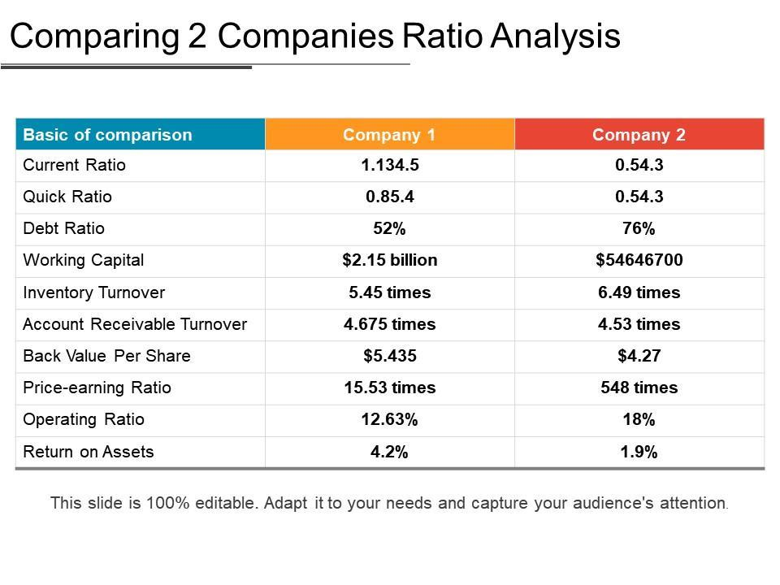

Understanding financial markets requires accurately assessing the performance of companies within those markets. A fundamental method for this assessment is ratio analysis, which serves as a critical tool for comparing the financial health of different companies. Ratio analysis involves calculating various financial ratios from a company’s reported financial information—ensuring investors and analysts gain insights that extend beyond simple balance sheets or income statements. By examining ratios related to profitability, liquidity, and solvency, stakeholders can make informed judgments about a company's operational efficiency and financial stability.

In recent years, the intersection of traditional financial analysis methods and advanced technological approaches like algorithmic trading has become increasingly prominent. Algorithmic trading, or algo trading, relies heavily on quantitative evaluations and involves the use of computer algorithms to execute trades based on predefined criteria. It uses financial metrics, including those derived from ratio analysis, to analyze market data efficiently and execute trades at speeds and volumes that are not possible for human traders. This technology-driven trading mechanism allows for rapid processing of large datasets, thus making quick, emotionless trading decisions.

This article examines how ratio analysis and algorithmic trading intersect to aid traders and analysts. By integrating the quantitative insights provided by ratio analysis into the design of sophisticated trading algorithms, traders can potentially unlock a competitive advantage in the financial markets. This synthesis of traditional financial assessments with computational trading strategies reflects a broader trend towards automation and data-driven decision-making in finance, offering the potential for increased accuracy and performance in trading activities.

## Table of Contents

## What is Ratio Analysis?

Ratio analysis is a systematic approach to evaluating a company's financial health by using a set of key ratios derived from the firm's financial statements. This analytical tool provides a deeper understanding of a company's performance beyond what is visible in basic financial statements. It aids in comparing financial conditions across different periods or between companies, facilitating data-driven investment decisions.

### Common Financial Ratios

1. **Profitability Ratios**: These ratios gauge a company's ability to generate profit relative to its revenue, assets, equity, or other financial metrics. Key profitability ratios include:
   - **Gross Profit Margin**: $\text{Gross Profit Margin} = \frac{\text{Gross Profit}}{\text{Revenue}} \times 100$
   - **Net Profit Margin**: $\text{Net Profit Margin} = \frac{\text{Net Income}}{\text{Revenue}} \times 100$
   - **Return on Equity (ROE)**: $\text{ROE} = \frac{\text{Net Income}}{\text{Shareholder's Equity}} \times 100$

2. **Liquidity Ratios**: These ratios assess a company's capacity to meet its short-term obligations. Important liquidity ratios include:
   - **Current Ratio**: $\text{Current Ratio} = \frac{\text{Current Assets}}{\text{Current Liabilities}}$
   - **Quick Ratio** (also known as the acid-test ratio): $\text{Quick Ratio} = \frac{\text{Current Assets} - \text{Inventories}}{\text{Current Liabilities}}$

3. **Debt Ratios**: These ratios reveal the extent of a company's leverage and its ability to manage debt. Primary debt ratios encompass:
   - **Debt to Equity Ratio**: $\text{Debt to Equity Ratio} = \frac{\text{Total Liabilities}}{\text{Shareholder's Equity}}$
   - **Interest Coverage Ratio**: $\text{Interest Coverage Ratio} = \frac{\text{Earnings Before Interest and Taxes (EBIT)}}{\text{Interest Expense}}$

These ratios are invaluable to financial analysts and institutions. They can indicate trends in financial stability, performance comparison across companies in the same industry, and highlight strengths and weaknesses in a company's operational strategy. By focusing on aspects like profitability, [liquidity](/wiki/liquidity-risk-premium), and debt management, investors are empowered to make informed decisions that align with their financial goals.

Additionally, because ratios distill vast amounts of data into manageable [statistics](/wiki/bayesian-statistics), they serve as useful indicators for benchmarking a company against its peers. The reliance on and interpretation of these metrics can significantly influence investment strategies and management decisions, making ratio analysis a cornerstone of modern financial assessment.

## Comparing Companies Using Financial Ratios

Financial ratios are essential tools for comparing companies within the same industry, providing investors and analysts a clearer perspective on a firm’s financial health and operational efficiency. These ratios can distill complex financial data into digestible metrics that facilitate easier comparisons and informed decision-making.

Profitability ratios measure a company’s ability to generate income relative to revenue, assets, or equity over a specific period, making them crucial indicators of financial performance. The gross profit margin, for example, is calculated as:

$$
\text{Gross Profit Margin} = \left( \frac{\text{Revenue} - \text{Cost of Goods Sold}}{\text{Revenue}} \right) \times 100
$$

This ratio highlights how efficiently a company uses its resources to produce profit and is especially useful in comparing companies with similar business models.

Liquidity ratios are vital for assessing a company’s ability to meet its short-term obligations. The current ratio, a popular liquidity measure, is defined as:

$$
\text{Current Ratio} = \frac{\text{Current Assets}}{\text{Current Liabilities}}
$$

A higher current ratio indicates a stronger liquidity position, although an excessively high current ratio may point to inefficiencies in asset utilization.

Solvency ratios, such as the debt-to-equity ratio, evaluate a company’s long-term debt sustainability and its capacity to meet long-term obligations:

$$
\text{Debt-to-Equity Ratio} = \frac{\text{Total Liabilities}}{\text{Shareholders' Equity}}
$$

This ratio provides insight into the financial leverage and risk profile of a company, revealing how much of the company’s operations are financed by debt compared to its equity.

Operating efficiency ratios, including the asset turnover ratio, offer insights into how effectively a firm utilizes its assets to generate sales:

$$
\text{Asset Turnover Ratio} = \frac{\text{Net Sales}}{\text{Average Total Assets}}
$$

A higher ratio suggests better efficiency in using assets to support sales activities. These ratios are pivotal for understanding business operation effectiveness and identifying areas for potential improvement.

By making use of these ratios, stakeholders can compare companies on a like-to-like basis, identifying strengths and weaknesses relative to competitors in the same industry, thus providing a more comprehensive picture of which companies are performing well and which are not.

## The Role of Algorithmic Trading in Finance

Algorithmic trading, often referred to as algo trading, employs computer programs to execute trades following predetermined criteria. These algorithms operate based on extensive [backtesting](/wiki/backtesting) and rigorous quantitative analysis, which includes inputs from various financial metrics like ratios. The incorporation of financial ratios, such as Price-to-Earnings (P/E), Debt-to-Equity (D/E), and Return on Equity (ROE), enables these systems to assess the financial health and performance metrics of the assets they are programmed to trade. By leveraging this financial data, algorithms can make swift and informed trading decisions.

One of the primary advantages of [algorithmic trading](/wiki/algorithmic-trading) is its capacity to process vast volumes of data at exceptional speeds, a feat unattainable by human traders. Algorithms can analyze real-time financial data streams to recognize and act upon trade opportunities almost instantaneously. This capability is particularly advantageous in high-frequency trading ([HFT](/wiki/high-frequency-trading-strategies)), a subset of algorithmic trading where millisecond execution speeds are critical. As a result, algorithms often outperform human traders in both speed and precision, accomplishing trades with minimal latency and often leading to better price execution and reduced market impact.

The burgeoning prominence of algorithmic trading underscores the critical role of precise financial evaluation. With financial markets becoming increasingly complex and dynamic, relying on accurate and timely financial analysis is paramount. Algorithmic systems necessitate this precision as inaccuracies or delays in financial evaluation can lead to suboptimal trading outcomes or even losses.

Furthermore, the emotionless nature of algorithmic trading offers a significant benefit over traditional human trading. Human traders are often subject to biases and emotional decision-making, which can adversely affect their performance. Algorithms, devoid of emotions, adhere strictly to the coded criteria and trading parameters, thereby eliminating the influence of human error and emotional biases in trading decisions.

As technology continues to evolve, algorithmic trading systems are expanding in sophistication and scope, integrating more advanced [machine learning](/wiki/machine-learning) techniques and [artificial intelligence](/wiki/ai-artificial-intelligence). These advancements further enhance the accuracy and adaptability of trading algorithms. Given these considerations, it is clear that algorithmic trading not only transforms how trades are executed but also emphasizes the indispensability of precise financial evaluation, safeguarding competitive advantages in an increasingly automated financial landscape.

## Integrating Ratio Analysis into Algorithmic Trading

Ratio analysis serves as a cornerstone for developing effective trading algorithms, offering a quantitative foundation for evaluating financial health and performance. By analyzing financial ratios—such as profitability, liquidity, solvency, and operating efficiency—traders can build algorithms that automatically track and respond to the dynamics of these metrics. For instance, a trading algorithm might be configured to monitor the Price-to-Earnings (P/E) ratio, adjusting its strategy in response to fluctuations that suggest overvaluation or undervaluation of stocks.

The incorporation of ratio analysis into algorithmic trading allows traders to identify and leverage market inefficiencies. This practice capitalizes on the idea that markets are not always perfectly efficient and that there are periods when the price of a security might not reflect its intrinsic value based on its financial fundamentals. By using algorithms to continuously scan financial ratios across numerous companies, traders can swiftly detect and exploit these discrepancies before they are corrected by the market.

Empirical evidence suggests that integrating ratio analysis into trading algorithms leads to improved trading outcomes. Case studies demonstrate that when algorithms are designed to [factor](/wiki/factor-investing) in key financial ratios, they tend to perform better in terms of returns and risk management compared to those that do not. For example, employing a strategy that includes monitoring the Debt-to-Equity (D/E) ratio can help in assessing a company's financial leverage, enabling the algorithm to make more informed trade decisions, thus potentially reducing the exposure to high-debt entities.

The shift towards data-driven approaches is transforming traditional trading practices by combining computational power with financial analysis. Automation in trading allows for the processing of large sets of financial data at speeds and accuracies beyond human capability. Algorithms can process thousands of transactions within seconds, execute trades at optimal times, and consistently apply complex strategies based on the financial ratios of target companies. This integration not only enhances the decision-making process but also aligns trading strategies more closely with quantitative financial assessments.

In integrating ratio analysis with algorithmic trading, traders can fine-tune their strategies to be adaptive and responsive, thereby harnessing the full potential of both quantitative analysis and automated trading systems. As the financial markets continue to evolve, the reliance on data-driven strategies is likely to increase, leading to more sophisticated and efficient trading mechanisms.

## Challenges and Considerations

Market [volatility](/wiki/volatility-trading-strategies) poses significant challenges for both ratio analysis and algorithmic trading. As financial markets are inherently dynamic, fluctuations can unpredictably impact both strategy and outcomes. 

Algo trading relies on consistent data input and analysis to function effectively. Therefore, algorithms must be continuously updated to adapt to market changes to remain effective. Continuous updates ensure that trading strategies remain relevant amidst shifting economic conditions, geopolitical events, and financial policy changes.

Negative market movements can compromise the reliability of certain financial ratios, such as profitability and liquidity ratios. These ratios are based on historical financial data and assumptions about future market conditions. In volatile markets, such assumptions might not hold true, leading to misguided trading decisions if not adjusted or interpreted carefully.

Backtesting is a fundamental practice for confirming the robustness of algorithm-based strategies. It involves testing trading strategies against historical data to evaluate their performance. The process requires thorough data quality checks and consideration of historical market conditions—ensuring that strategies could survive past events and tweaks to potential future shifts.

Ethical considerations and regulation adherence play a pivotal role in sustainable algo trading. Given the speed and [volume](/wiki/volume-trading-strategy) at which algorithmic trading operates, maintaining ethical standards and complying with regulations is crucial. Traders must ensure that their algorithms do not engage in manipulative practices or breach market integrity. Regulatory frameworks, such as the Markets in Financial Instruments Directive II (MiFID II) in Europe, emphasize transparency, fairness, and accountability, which are essential for maintaining trust in financial markets.

In conclusion, while challenges abound, understanding and addressing them through diligent updates, comprehensive backtesting, and ethical compliance can enhance the effectiveness and sustainability of algorithmic trading systems.

## Conclusion

Ratio analysis is essential for evaluating and comparing companies, providing key insights that help investors assess financial performance. Financial metrics derived from ratio analysis serve as invaluable inputs in algorithmic trading systems. These systems utilize real-time data processing to make informed, swift decisions in the financial markets.

The combination of ratio analysis with algorithmic trading creates a robust framework, offering significant competitive advantages. This synergy enables traders and analysts to exploit market inefficiencies, leveraging precise financial data to optimize investment decisions. The implementation of this integration requires ongoing refinement and adaptability to ever-changing market conditions.

As financial markets evolve, the trend toward increasingly data-driven and automated systems is evident. Algorithmic trading, enhanced by ratio analysis, is at the forefront of this shift, paving the way for more efficient and effective trading strategies. Looking forward, the landscape of trading will continue to transform, underscoring the importance of quantitative evaluation methods in contemporary finance.

## References & Further Reading

[1]: ["Financial Ratio Analysis: A useful tool for investment analysis."](https://www.researchgate.net/publication/278849000_Financial_Ratio_Analysis_A_useful_tool_for_investment_analysis) ResearchGate.

[2]: Palepu, K., Healy, P., & Peek, E. (2013). ["Business Analysis and Valuation: Using Financial Statements."](https://books.google.com/books/about/Business_Analysis_and_Valuation_Using_Fi.html?id=IDT6DwAAQBAJ) Cengage Learning.

[3]: Jegadeesh, N., & Titman, S. (1993). ["Returns to Buying Winners and Selling Losers: Implications for Stock Market Efficiency."](https://www.jstor.org/stable/2328882) The Journal of Finance.

[4]: ["Algorithmic Trading and DMA: An introduction to direct access trading strategies"](https://www.amazon.com/Algorithmic-Trading-DMA-introduction-strategies/dp/0956399207) by Barry Johnson

[5]: Aldridge, I. (2013). ["High-Frequency Trading: A Practical Guide to Algorithmic Strategies and Trading Systems."](https://books.google.com/books/about/High_Frequency_Trading.html?id=8QpIsVUMhmEC) Wiley Trading.

[6]: ["Pairs Trading: Quantitative Methods and Analysis"](https://www.wiley.com/en-us/Pairs+Trading%3A+Quantitative+Methods+and+Analysis-p-9780471460671) by Ganapathy Vidyamurthy

[7]: Dash, S. K., & Dash, M. (2012). ["Algorithmic Trading: Issues and Perspectives."](https://scholar.google.com.vn/citations?user=On5P_4oAAAAJ&hl=en) Springer, New York, NY.

[8]: Derman, E. (2011). ["Models Behaving Badly: Why Confusing Illusion with Reality Can Lead to Disaster, on Wall Street and in Life."](https://www.sciencenews.org/article/modelsbehavingbadly-why-confusing-illusion-reality-can-lead-disaster-wall-street-and-life) Free Press.