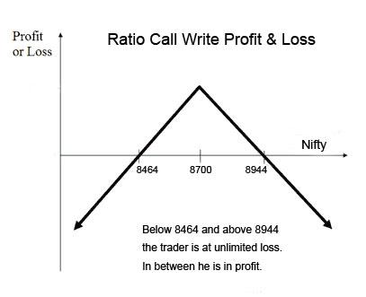

## Table of Contents

## What is a Ratio Call Write?

A Ratio Call Write is a type of options trading strategy where an investor sells more call options than the number of shares they own. For example, if an investor owns 100 shares of a stock, they might sell 2 or 3 call options against those shares. This strategy is used when the investor believes the stock price will stay the same or go up a little bit, but not too much.

The main idea behind a Ratio Call Write is to earn extra money from the premiums of the call options sold. However, it can be risky because if the stock price goes up a lot, the investor might have to buy more shares at a higher price to cover the extra calls they sold. This could lead to losses if the stock price rises more than expected. So, it's important for investors to carefully think about the risks before using this strategy.

## How does a Ratio Call Write strategy work?

A Ratio Call Write strategy involves selling more call options than the number of shares you own. For example, if you own 100 shares of a company, you might sell 2 or 3 call options against those shares. The goal is to earn extra money from the premiums you get when you sell the call options. You would use this strategy if you think the stock price will stay about the same or go up just a little bit, but not too much.

However, this strategy can be risky. If the stock price goes up a lot, you might have to buy more shares at the higher price to give to the people who bought your call options. This could lead to losses if the stock price rises more than you expected. So, it's important to think carefully about the risks before deciding to use a Ratio Call Write strategy.

## What are the basic components needed to execute a Ratio Call Write?

To do a Ratio Call Write, you need to own shares of a stock and sell more call options than the number of shares you have. For example, if you own 100 shares, you might sell 2 or 3 call options. Each call option usually represents 100 shares, so selling 2 call options means you're selling the right to buy 200 shares. The key is to get money from the premiums people pay when they buy your call options.

This strategy works well if you think the stock price will stay the same or go up just a little. The extra money from the premiums can be good if the stock doesn't move much. But it's risky because if the stock price goes up a lot, you might have to buy more shares at a higher price to give to the people who bought your call options. This could lead to losses if the stock price rises more than you expected. So, it's important to think carefully about the risks before deciding to use this strategy.

## What are the potential benefits of using a Ratio Call Write strategy?

Using a Ratio Call Write strategy can help you earn extra money from the premiums you get when you sell call options. If you think the stock price will stay the same or go up just a little, this strategy can work well. The extra money from the premiums can make up for small changes in the stock price, giving you a bit more income than if you just held onto the stock.

However, this strategy is not without risks. If the stock price goes up a lot, you might have to buy more shares at a higher price to give to the people who bought your call options. This could lead to losses if the stock price rises more than you expected. So, it's important to think carefully about the risks before deciding to use a Ratio Call Write strategy.

## What are the risks associated with a Ratio Call Write?

A Ratio Call Write can be risky because if the stock price goes up a lot, you might lose money. If you own 100 shares and sell 2 call options, and the stock price rises above the strike price of the calls, you'll have to buy more shares at the higher price to give to the people who bought your call options. This could lead to big losses if the stock price keeps going up.

Another risk is that the stock price might drop a lot. If that happens, the money you made from selling the call options might not be enough to cover the loss in the value of your shares. So, you could end up losing money on the stock itself, even if you got some extra money from the call options.

It's important to think carefully about these risks before using a Ratio Call Write strategy. It's best for people who are okay with taking some risk and who have a good understanding of how options work.

## How does the Ratio Call Write compare to other options strategies?

A Ratio Call Write is different from other options strategies like a Covered Call or a Naked Call. In a Covered Call, you own the stock and sell call options for the same number of shares you have. This is less risky than a Ratio Call Write because you're only selling as many options as you have shares. With a Ratio Call Write, you sell more options than you have shares, which can be riskier if the stock price goes up a lot.

A Naked Call is even riskier than a Ratio Call Write. In a Naked Call, you sell call options without owning any shares of the stock. If the stock price goes up, you have to buy the shares at the higher market price to give to the option buyer, which could lead to big losses. A Ratio Call Write is less risky than a Naked Call because you at least own some shares, but it's still more risky than a Covered Call.

Both strategies aim to make money from option premiums, but the Ratio Call Write tries to earn more by selling extra options. However, this extra potential reward comes with more risk. It's important to understand these differences and think about how much risk you're willing to take before choosing a strategy.

## What market conditions are most favorable for a Ratio Call Write?

The best time to use a Ratio Call Write is when you think the stock price will stay about the same or go up just a little bit. If the stock doesn't move much, you can make extra money from the premiums you get when you sell the call options. This strategy works well in a market that is not very volatile, where the stock price is expected to be stable or have small movements.

However, if the stock price goes up a lot, you might lose money. Since you sell more call options than the shares you own, you might have to buy more shares at a higher price to give to the people who bought your call options. This can lead to big losses if the stock price rises more than you expected. So, it's important to use this strategy when you're pretty sure the stock won't go up too much.

## How do you determine the appropriate ratio for a Ratio Call Write?

To figure out the right ratio for a Ratio Call Write, you need to think about how much risk you want to take and what you think the stock will do. If you own 100 shares and you think the stock price will stay the same or go up just a little, you might choose to sell 2 call options. This means you're selling the right to buy 200 shares, which is double the number of shares you own. The more call options you sell compared to the shares you own, the more money you can make from the premiums, but it also means more risk if the stock price goes up a lot.

It's important to look at how much the stock usually moves and what you think it will do in the future. If the stock is not very volatile and you're pretty sure it won't go up too much, a higher ratio might be okay. But if the stock can move a lot, you might want to stick with a lower ratio to keep the risk down. Always think about how much you could lose if the stock price goes up more than you expect, and make sure you're comfortable with that risk before you decide on the ratio.

## What are the key considerations for managing a Ratio Call Write position?

When managing a Ratio Call Write position, it's important to keep an eye on the stock price. If the stock price starts to go up a lot, you might need to take action to limit your losses. One way to do this is by buying back some of the call options you sold. This can help reduce the risk if the stock keeps going up. Another thing to think about is setting a price point where you'll close out the position if the stock goes above it. This can help you avoid big losses if the stock price rises more than you expected.

It's also a good idea to have a plan for what to do if the stock price stays the same or goes down a little. If the stock price doesn't move much, you can keep the money from the premiums you got when you sold the call options. But if the stock price drops a lot, you might lose money on the stock itself, even though you got some extra money from the options. So, it's important to think about how much you're willing to lose and have a plan for when to close out the position if things don't go as you hoped.

## How can adjustments be made to a Ratio Call Write during its lifecycle?

If the stock price starts to go up a lot while you have a Ratio Call Write, you might want to buy back some of the call options you sold. This can help reduce the risk if the stock keeps going up. You can also set a price point where you'll close out the position if the stock goes above it. This helps you avoid big losses if the stock price rises more than you expected. 

If the stock price stays the same or goes down a little, you can keep the money from the premiums you got when you sold the call options. But if the stock price drops a lot, you might lose money on the stock itself, even though you got some extra money from the options. So, it's important to think about how much you're willing to lose and have a plan for when to close out the position if things don't go as you hoped.

## What are advanced techniques for optimizing a Ratio Call Write strategy?

One advanced technique for optimizing a Ratio Call Write strategy is to use a dynamic ratio. This means you can change the number of call options you sell based on how the stock is doing. If the stock price stays the same or goes up a little, you might sell more call options to get more money from the premiums. But if the stock price starts to go up a lot, you can buy back some of the call options to lower your risk. This way, you can adjust the strategy as the market changes.

Another technique is to use stop-loss orders to manage your risk. A stop-loss order can automatically close out your position if the stock price goes up to a certain level. This can help you avoid big losses if the stock price rises more than you expected. You can also use a rolling strategy, where you close out the current call options and sell new ones with a higher strike price if the stock price goes up. This can help you keep making money from the premiums while managing your risk.

## Can you provide a real-world example of a successful Ratio Call Write strategy?

Imagine you own 100 shares of a company called ABC Corp, and the stock price is $50 per share. You think the stock will stay around $50 or go up just a little bit, so you decide to do a Ratio Call Write. You sell 2 call options with a strike price of $55 for a premium of $2 each. This means you get $400 from the premiums ($2 x 100 shares x 2 options). If the stock price stays below $55 when the options expire, you keep the $400 and your 100 shares. 

Now, let's say the stock price goes up to $53 by the time the options expire. The call options are not exercised because the stock price is below the $55 strike price. You still keep the $400 from the premiums and your 100 shares, which are now worth $5,300. This is a successful Ratio Call Write because you made extra money from the premiums without having to sell your shares. If the stock price had stayed at $50, you would have made the same amount of money from the premiums, and your shares would still be worth $5,000. Either way, you come out ahead because of the extra income from the call options.

## References & Further Reading

[1]: Hull, John C. (2017). ["Options, Futures, and Other Derivatives"](https://elibrary.pearson.de/book/99.150005/9781292212920). Pearson.

[2]: Sinclair, Euan. (2010). ["Volatility Trading, 2nd Edition"](https://onlinelibrary.wiley.com/doi/book/10.1002/9781118662724). Wiley Finance.

[3]: Chan, Ernest P. (2008). ["Quantitative Trading: How to Build Your Own Algorithmic Trading Business"](https://github.com/ftvision/quant_trading_echan_book). Wiley Trading.

[4]: Jansen, Stefan. (2018). ["Machine Learning for Algorithmic Trading: Predictive models to extract signals from market and alternative data for systematic trading strategies with Python"](https://github.com/stefan-jansen/machine-learning-for-trading). Packt Publishing.

[5]: Aronson, David R. (2006). ["Evidence-Based Technical Analysis: Applying the Scientific Method and Statistical Inference to Trading Signals"](https://www.amazon.com/Evidence-Based-Technical-Analysis-Scientific-Statistical/dp/0470008741). Wiley.

[6]: López de Prado, Marcos. (2018). ["Advances in Financial Machine Learning"](https://www.amazon.com/Advances-Financial-Machine-Learning-Marcos/dp/1119482089). Wiley.