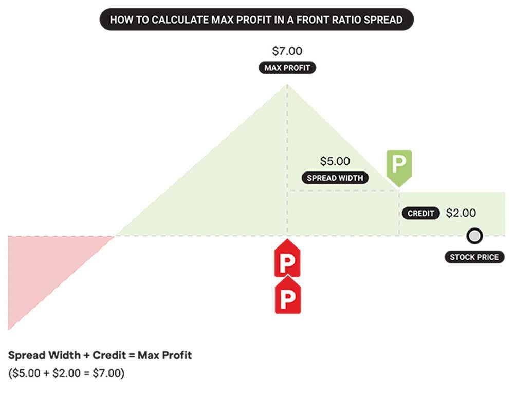

## Table of Contents

## What is a ratio spread in options trading?

A ratio spread in options trading is a strategy where you buy and sell different numbers of options. For example, you might buy one call option and sell two call options at a different strike price. This strategy is used to take advantage of the difference in price between the options you buy and sell. It's called a "ratio" spread because the number of options bought and sold is not the same, creating a ratio.

This strategy can be used to make money if you think the price of the stock will move in a certain way. If you think the stock price will go up a little bit, you might use a call ratio spread. If you think the stock price will go down a little bit, you might use a put ratio spread. The goal is to make more money from the options you sell than you spend on the options you buy. However, it can be risky because if the stock price moves too much, you could lose money.

## How does a ratio spread differ from a regular spread?

A ratio spread and a regular spread are both options trading strategies, but they work a bit differently. In a regular spread, you buy and sell the same number of options. For example, you might buy one call option and sell one call option at a different strike price. This is called a "one-to-one" spread because you're buying and selling the same number of options.

In a ratio spread, you buy and sell different numbers of options. For example, you might buy one call option and sell two call options at a different strike price. This is called a "ratio" spread because you're buying and selling options in a different ratio, not one-to-one. The main difference is that a ratio spread can be riskier because if the stock price moves a lot, you could lose more money than with a regular spread. But it can also offer a chance to make more money if the stock price moves just the right amount.

## What are the basic components of a ratio spread?

A ratio spread involves buying and selling different numbers of options. For example, you might buy one call option and sell two call options at different strike prices. The key parts of a ratio spread are the options you buy and the options you sell, and the fact that you're buying and selling a different number of each. This difference in numbers is what makes it a ratio spread.

The goal of a ratio spread is to make money from the difference in price between the options you buy and sell. If you think the stock price will go up a little bit, you might use a call ratio spread. If you think the stock price will go down a little bit, you might use a put ratio spread. The strategy can be risky because if the stock price moves too much, you could lose money. But if it moves just the right amount, you could make more money than with a regular spread.

## Can you explain the setup of a call ratio spread?

A call ratio spread is a way to trade options where you buy and sell different numbers of call options. Let's say you think a stock's price will go up a little bit. You might buy one call option at a lower price (strike price) and sell two call options at a higher strike price. This means you're betting that the stock will go up enough to make money on the call option you bought, but not so much that you lose too much on the two call options you sold.

The goal of this setup is to make money from the difference in price between the call option you buy and the two call options you sell. If the stock price goes up just the right amount, you can make more money than you would with a regular spread. But it's risky because if the stock price goes up too much, you could lose a lot of money on the two call options you sold. So, it's important to think carefully about how much you think the stock price will move before you set up a call ratio spread.

## How do you set up a put ratio spread?

A put ratio spread is a way to trade options where you buy and sell different numbers of put options. If you think a stock's price will go down a little bit, you might buy one put option at a higher price (strike price) and sell two put options at a lower strike price. This means you're betting that the stock will go down enough to make money on the put option you bought, but not so much that you lose too much on the two put options you sold.

The goal of this setup is to make money from the difference in price between the put option you buy and the two put options you sell. If the stock price goes down just the right amount, you can make more money than you would with a regular spread. But it's risky because if the stock price goes down too much, you could lose a lot of money on the two put options you sold. So, it's important to think carefully about how much you think the stock price will move before you set up a put ratio spread.

## What are the potential profit and loss scenarios for a ratio spread?

When you use a ratio spread, you're trying to make money if the stock price moves just the right amount. For example, if you set up a call ratio spread and the stock price goes up a bit, you might make money from the call option you bought. At the same time, you might not lose too much on the two call options you sold. This is the best-case scenario because you're making more money from the option you bought than you're losing from the options you sold.

However, there's also a risk that things won't go as planned. If the stock price goes up too much in a call ratio spread, you could lose a lot of money on the two call options you sold. This is because the price of those options could go up a lot more than the price of the one option you bought. The same thing can happen with a put ratio spread if the stock price goes down too much. You might lose more money on the two put options you sold than you make on the one put option you bought. So, it's important to think carefully about how much the stock price might move before you set up a ratio spread.

## How does the choice of strike prices affect the outcome of a ratio spread?

The choice of strike prices in a ratio spread can make a big difference in how much money you make or lose. When you set up a call ratio spread, you buy one call option at a lower strike price and sell two call options at a higher strike price. If you pick the right strike prices, the stock price might go up just enough to make money on the call option you bought, but not so much that you lose too much on the two call options you sold. The same idea works for a put ratio spread, where you buy one put option at a higher strike price and sell two put options at a lower strike price. If the stock price goes down just the right amount, you can make money.

But if you pick the wrong strike prices, things can go badly. If the stock price goes up too much in a call ratio spread, the two call options you sold at the higher strike price can lose a lot of money. This is because the price of those options can go up a lot more than the price of the one option you bought. The same thing can happen with a put ratio spread if the stock price goes down too much. The two put options you sold at the lower strike price can lose a lot of money. So, it's really important to think carefully about the strike prices you choose when you set up a ratio spread.

## What are the key risk management considerations when using ratio spreads?

When using ratio spreads, one of the main things to think about is how much the stock price might move. If the stock price moves too much, you could lose a lot of money. For example, if you set up a call ratio spread and the stock price goes up a lot, the two call options you sold could lose more money than the one call option you bought makes. The same thing can happen with a put ratio spread if the stock price goes down a lot. So, it's important to think about how much the stock price might move before you set up a ratio spread.

Another important thing to think about is how to limit your losses. One way to do this is to use stop-loss orders. A stop-loss order is an order to sell your options if they lose a certain amount of money. This can help you limit how much you lose if the stock price moves too much. It's also a good idea to have a plan for what you'll do if the stock price doesn't move the way you thought it would. Having a plan can help you make better decisions and manage your risk better.

## How can one calculate the break-even points for a ratio spread?

To calculate the break-even points for a ratio spread, you need to figure out at what stock prices you neither make nor lose money. Let's start with a call ratio spread, where you buy one call option at a lower strike price and sell two call options at a higher strike price. The first break-even point happens when the stock price is just high enough to cover the cost of setting up the spread. This is the lower break-even point. You find it by adding the net cost of the spread to the lower strike price of the call option you bought. The net cost is the price you paid for the call option you bought minus the money you got from selling the two call options.

The second break-even point for a call ratio spread happens when the stock price is so high that the profit from the two call options you sold equals the cost of the spread plus the profit from the call option you bought. This is the higher break-even point. You find it by starting with the higher strike price of the call options you sold, then adding the net cost of the spread divided by the number of call options you sold (which is two in this case), and finally adding the difference between the higher and lower strike prices. For a put ratio spread, the process is similar but reversed. You buy one put option at a higher strike price and sell two put options at a lower strike price. The first break-even point is found by subtracting the net cost of the spread from the higher strike price, and the second break-even point is found by starting with the lower strike price, then subtracting the net cost of the spread divided by two, and finally subtracting the difference between the higher and lower strike prices.

## What are the advanced strategies for adjusting a ratio spread as market conditions change?

When you set up a ratio spread, you might need to make changes as the market moves. One way to do this is by rolling the options. This means you close out the options you have and open new ones with different strike prices or expiration dates. If the stock price is moving against you, you might roll the options to a different strike price to give yourself more room. If the stock price is moving in your favor, you might roll the options to a closer expiration date to lock in your profits sooner.

Another way to adjust a ratio spread is by adding or removing options. If the stock price is moving a lot, you might add more options to balance out your position. For example, if you have a call ratio spread and the stock price is going up a lot, you might buy more call options at a higher strike price to protect yourself. If the stock price isn't moving as much as you thought, you might remove some of the options you sold to reduce your risk. The key is to keep an eye on the market and be ready to make changes to your ratio spread as things change.

## How do implied volatility and time decay impact the profitability of ratio spreads?

Implied volatility and time decay can both affect how much money you make or lose with a ratio spread. Implied volatility is how much the market thinks the stock price will move. If implied volatility goes up, the price of the options you bought and sold can go up too. This can be good if you bought options, but bad if you sold more options than you bought. If implied volatility goes down, the opposite can happen. The price of the options you bought and sold can go down, which can be bad if you bought options, but good if you sold more options than you bought.

Time decay is how the value of options goes down as they get closer to expiring. This can help you make money if you sold more options than you bought, because the options you sold will lose value over time. But it can hurt you if you bought options, because the options you bought will lose value too. So, when you set up a ratio spread, you need to think about how implied volatility and time decay might affect your options. If you think implied volatility will go up or time decay will hurt you, you might want to make changes to your ratio spread to protect yourself.

## What are some real-world examples of successful ratio spread trades?

Imagine you're a trader who thinks a stock will go up a little bit. You set up a call ratio spread by buying one call option at a $50 strike price and selling two call options at a $60 strike price. The stock price goes up to $55, which is just what you hoped for. You make money on the call option you bought at $50, and you don't lose too much on the two call options you sold at $60. This is a successful trade because the stock price moved just the right amount.

Another example is a trader who thinks a stock will go down a little bit. They set up a put ratio spread by buying one put option at a $100 strike price and selling two put options at a $90 strike price. The stock price goes down to $95, which is what the trader expected. They make money on the put option they bought at $100, and they don't lose too much on the two put options they sold at $90. This trade works out well because the stock price moved just enough to make money on the put option they bought without losing too much on the put options they sold.

## What is Understanding Ratio Spreads?

A ratio spread is an advanced options trading strategy designed to exploit specific price movements in the underlying asset. At its core, this strategy involves holding an unequal number of long and short options. Typically, a common implementation is to buy one option and sell two options of the same type, such as calls or puts, hence the common ratio being 2:1. This combination allows traders to benefit from volatility within a specific price range, while also exposing them to certain risks if the price moves unexpectedly.

In a typical call ratio spread, the trader buys one call option and sells two call options at a higher strike price. For example, if an investor believes a stock currently priced at $50 will rise but remain below $60, they might purchase a call at the $50 strike price and sell two calls at the $55 strike price. The profit potential in this setup comes from the premiums collected from the calls sold, which should be greater than the premium paid for the call purchased.

Mathematically, the profit or loss ($P/L$) of a call ratio spread at expiration can be described by:

$$
P/L = \begin{cases} 
-P_{\text{net\ premium}}, & \text{if } S \leq K_1 \\
S - K_1 - P_{\text{net\ premium}}, & \text{if } K_1 < S \leq K_2 \\
(K_2 - K_1) - P_{\text{net\ premium}}, & \text{if } K_2 < S \leq K_3 \\
2(S - K_2) - P_{\text{net\ premium}}, & \text{if } S > K_3 \\
\end{cases}
$$

Where:
- $S$ = Stock price at expiration
- $K_1$ and $K_2$ = Strike prices of the bought and sold calls, respectively
- $P_{\text{net\ premium}}$ = Net premium paid

Key advantages of ratio spreads include the possibility of entering low-cost or even credit positions when the premium received from selling options offsets the cost of the options bought. Nonetheless, this strategy is not without significant risks. If market movements are more dramatic than anticipated, leading to a significant increase or decrease in the price of the underlying asset, traders face the risk of substantial losses. Specifically, loss potential is nearly unlimited if the market advances sharply beyond the higher strike, due to the short position's exposure.

Due to these challenges, traders must carefully analyze market conditions, including [volatility](/wiki/volatility-trading-strategies) and price trends, before deploying ratio spreads. Position size and the potential for adjustment are crucial considerations, ensuring that the trader's exposure aligns with their risk tolerance and market outlook.

## How do you calculate profit and loss?

Ratio spreads produce profits primarily by leveraging the differential between the premiums of bought and sold options. This differential is most effective when the price of the underlying asset aligns precisely with the short options' strike price at expiration. For maximum profit, the asset's price should land exactly at the strike price of the short options, allowing traders to capitalize on the narrowest spread between the market price and the exercise price.

However, this strategy does not come without risks. Serious losses can occur if the price shifts significantly beyond the intended range, leading to potential unlimited liabilities. If the price of the underlying asset rises or falls past a certain point, the gains from the short options may be dwarfed by the losses from the long positions. This happens because the sold options, being more in number, [carry](/wiki/carry-trading) an uncovered risk that expands as prices deviate from the optimal strike range.

To effectively navigate these risks, it is crucial to identify the breakeven points of a ratio spread. A basic way to determine the breakeven points is by setting up an equation involving the realized premiums and the strike prices. Consider the following formula for a simple 2:1 call ratio spread, where one call option is bought and two are sold:

1. **Upper Breakeven**: 
$$
   \text{Upper Breakeven} = \text{Strike Price of Sold Call} + \left(\text{Net Premium} \div \text{Number of Short Options}\right)

$$

2. **Lower Breakeven**: 
$$
   \text{Lower Breakeven} = \text{Strike Price of Bought Call} + \text{Net Premium}

$$

Here, the "Net Premium" is the total premium received from selling the options minus the premium paid for the options bought. These breakeven calculations are vital for strategizing [exit](/wiki/exit-strategy) points, as they indicate the prices beyond which the strategy shifts from being profitable to incurring losses.

Incorporating these elements into a cohesive trading strategy is critical for managing the intricate balance between risk and return that ratio spreads present. Understanding and calculating these points allow traders to craft more resilient trading frameworks and ensure well-informed decision-making throughout the trading cycle.

## What is the conclusion?

Ratio spreads provide traders with a strategic blend of risk and reward within the spectrum of options trading. By engaging in this complex strategy, traders can position themselves to exploit market movements while maintaining controlled exposure to risk. The asymmetric nature of ratio spreads, where the trader holds unequal quantities of long and short options, allows for significant profit potential if the underlying asset moves within a specific anticipated range. When integrated into [algorithmic trading](/wiki/algorithmic-trading) systems, ratio spreads can enhance trading operations, enabling automated execution and optimization based on real-time market conditions.

For proactive traders, understanding the full implications of ratio spreads on profit and loss, alongside robust risk management practices, is essential. This includes a clear comprehension of breakeven points and the diligence to adjust positions in response to market fluctuations. Here's an example of calculating a breakeven point for a 2:1 call ratio spread:

- Suppose a trader buys one call option with a strike price of $50 for a premium of $5 and sells two call options with a strike price of $55 for a premium of $3 each. 
- The net premium received would be the sum of premiums from sold options minus the premium paid for the bought option: $2 \times 3 - 5 = 6 - 5 = 1$.
- Thus, the breakeven point can be calculated using the formula: 
$$
  \text{Breakeven Price} = \text{Lower Strike Price} + \text{Net Premium Received} = 50 + 1 = 51

$$

Continuous learning and the ability to adapt to evolving market situations are key in harnessing the potential of ratio spreads effectively. Traders who remain vigilant and responsive can capitalize on the dynamic nature of markets, optimizing their strategies for long-term success. By leveraging technology and market insights, traders are better positioned to manage the complexities and opportunities that ratio spreads present.

## References & Further Reading

[1]: Natenberg, S. (1994). ["Option Volatility & Pricing: Advanced Trading Strategies and Techniques."](https://www.amazon.com/Option-Volatility-Pricing-Strategies-Techniques/dp/0071818774) McGraw-Hill Education.

[2]: Hull, J. C. (2018). ["Options, Futures, and Other Derivatives"](https://www.semanticscholar.org/paper/Options%2C-Futures%2C-and-Other-Derivatives-Hull/89bdee500c8623864fc9eb7a471546aa713acc44) (10th Edition). Pearson.

[3]: Taleb, N. N. (1997). ["Dynamic Hedging: Managing Vanilla and Exotic Options"](https://archive.org/details/dynamichedgingma0000tale). Wiley.

[4]: Coughlin, T. J. (2015). ["Profiting with Iron Condor Options: Strategies from the Frontline for Trading in Up or Down Markets"](https://www.pearson.de/media/muster/ext/9780132615990.pdf). FT Press.

[5]: Espen Gaarder Haug (2007). ["The Complete Guide to Option Pricing Formulas"](https://www.amazon.com/Complete-Guide-Option-Pricing-Formulas/dp/0071389970). McGraw-Hill.