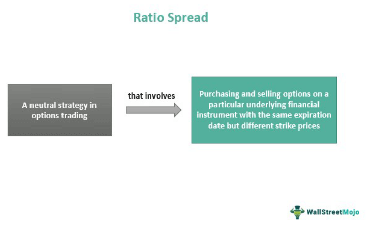

In options trading, the ratio spread strategy stands out as a sophisticated financial instrument. It serves a critical role in strategic trading, enabling traders to balance risk and reward intricately through the tactical management of options contracts. Ratio spread options involve buying and selling options in unequal quantities, providing traders with the flexibility to adapt to diverse market conditions. This strategy often involves either call or put options with a common underlying asset, allowing traders to craft positions that can potentially yield profits from specific market movements or volatility changes.

This article investigates into the essence of ratio spread options, examining how they are integrated into financial strategies and exploring the synergy they create when incorporated within algorithmic trading frameworks. By understanding the complexities of ratio spreads, investors gain enhanced control over their trading outcomes, as this strategy enables them to navigate unpredictable market dynamics with greater precision. Throughout this exploration, we will unpack the fundamental concepts, variations, and applications that make ratio spreads a compelling choice for traders seeking to optimize their portfolios.



As we embark on this comprehensive examination, we will uncover how the components of ratio spreads interweave with modern trading technologies, offering distinct advantages in navigating turbulent markets. The focus will be on elucidating the unique benefits of these strategies and providing insights into their practical implementation, ultimately helping traders unlock the full potential of this intricate trading tool.

## Table of Contents

## What is a Ratio Spread?

A ratio spread is a refined options trading strategy involving the purchase and sale of options in varying quantities on a single underlying asset. Unlike typical strategies that use symmetric quantities, the ratio spread utilizes a non-symmetric structure, allowing traders to manage risk and seek profits through strategic imbalances in their positions. This approach entails creating a position with an uneven ratio, such as buying one option and selling two, manifesting either through call or put options based on the trader's projections and market conditions.

Utilizing ratios like 1:2 enables traders to potentially capitalize on both directional movements and volatility shifts, making the strategy suitable under specific market circumstances. For instance, when implied volatility declines, the value of the sold options may decrease more than that of the bought options, resulting in a favorable outcome for the trader. Conversely, favorable trends in asset prices can enhance the profitability of this strategy by allowing the sold options to expire worthless while capturing gains from the bought options.

The fundamentals of ratio spread mechanics involve understanding the payoff structures, which hinge on the differential pricing behavior of options based on strike prices and time to expiration. This requires a comprehensive assessment of the underlying asset's volatility trends and an astute selection of strike prices that can optimize the profitability of the spread. Traders proficient in adjusting to these variables can effectively harness the inherent complexities of ratio spreads to achieve desired trading outcomes, leveraging them as powerful instruments for navigating the options market landscape.

## Implementing Ratio Spread Strategies

Execution of ratio spread strategies requires strategic planning and market insight. The decision-making process begins with selecting appropriate strike prices and expiration dates, which are crucial for aligning the strategy with expected market movements and [volatility](/wiki/volatility-trading-strategies) levels. By carefully choosing these parameters, traders can better control risk and enhance potential returns.

Market trends and volatility are pivotal in defining the payoff potential and risks of a ratio spread. For instance, in a typical call ratio spread, a trader might purchase one call option at a lower strike price and sell two call options at a higher strike price. This setup is profitable when the underlying asset experiences mild to moderate price increases; however, it can incur losses if the price movement exceeds expectations rapidly. Conversely, a put ratio spread involves purchasing one put option and selling two puts at a lower strike, which can be beneficial in bearish markets with controlled declines.

Detailed examples include setting up call and put ratio spreads that allow traders to profit from directional moves or volatility skews. In a bullish scenario, if a trader anticipates moderate upward movement in an asset, they might implement a call ratio spread by buying one call option with a lower strike price and selling two calls at a higher strike price. This benefits from the underlying asset's appreciation up to a certain limit, beyond which potential losses must be managed. Conversely, in bearish markets, a put ratio spread provides opportunities; traders buy one put option at a higher strike and sell two puts at a lower strike, gaining from downward price movements while managing risks associated with sharp declines.

Real-world applications of ratio spreads in both bullish and bearish markets underscore their adaptability and utility. In practice, ratio spreads can be tailored to take advantage of perceived volatility skews. For example, if implied volatility is higher for options farther out of the money, traders might exploit this skew by constructing a ratio spread to benefit from the declining volatility as expiration approaches. The strategy's asymmetrical nature, while introducing potential risks, simultaneously offers lucrative risk-reward profiles not found in more conventional strategies.

In conclusion, the successful implementation of ratio spread strategies hinges on a comprehensive understanding of market conditions, including price trends and volatility. By strategically selecting strike prices and expiration dates, and by analyzing market scenarios, traders can effectively implement ratio spreads to capitalize on specific market movements.

## The Intersection of Ratio Spreads and Algorithmic Trading

Algorithmic trading has revolutionized financial markets by leveraging advanced computational techniques to optimize trading strategies, execute orders with precision, and manage risk effectively. Ratio spreads, which involve buying and selling unequal quantities of options, are particularly well-suited for [algorithmic trading](/wiki/algorithmic-trading) due to their complex structures and intricate risk profiles. Integrating ratio spreads within algorithmic frameworks can lead to enhanced risk management and strategic flexibility, providing traders with a significant edge.

Algorithms are designed to analyze vast quantities of market data in real-time, identifying profitable trading opportunities and executing orders at speeds beyond human capability. This rapid response allows traders to adapt to market changes with minimal latency, reducing the likelihood of human errors in judgment and execution. In the context of ratio spreads, algorithms can systematically examine a range of variables such as implied volatility, strike prices, and expiration dates to determine optimal entry and [exit](/wiki/exit-strategy) points, as well as manage positions dynamically.

The incorporation of ratio spreads into algorithmic trading systems can be demonstrated through various case studies and software solutions. For instance, consider a scenario where a trader wants to implement a 1:2 call ratio spread on a stock with high implied volatility expecting a moderate increase in the underlying price. An algorithm can be configured to monitor the stock's price movements and volatility levels, automatically triggering the necessary trades when predefined conditions are met. Such automation not only ensures timely execution but also continuously assesses the position's risk-reward profile as market conditions evolve.

Python, a popular programming language in quantitative finance, can be utilized to code such algorithms. Using libraries like NumPy for numerical computations and pandas for handling financial data, a basic algorithm for monitoring a ratio spread strategy could be developed as follows:

```python
import numpy as np
import pandas as pd

def monitor_ratio_spread(options_data, stock_price, volatility):

    # Identify optimal strike prices based on volatility and stock price
    strike_buy = stock_price * (1 + 0.05)
    strike_sell = stock_price * (1 + 0.10)

    # Filter options data for potential trades
    buy_options = options_data[(options_data['strike'] == strike_buy) & (options_data['type'] == 'call')]
    sell_options = options_data[(options_data['strike'] == strike_sell) & (options_data['type'] == 'call')]

    # Logic for executing trades if conditions are met
    if not buy_options.empty and not sell_options.empty:
        buy_price = buy_options['price'].values[0]
        sell_price = sell_options['price'].values[0]
        if volatility > 0.25:  # Example condition for high implied volatility
            execute_trade('buy', strike_buy, buy_price)
            execute_trade('sell', strike_sell, sell_price * 2) # Selling two options

def execute_trade(action, strike, price):
    print(f"Executing {action} on strike {strike} at price {price}")

# Example usage:
options_data = pd.DataFrame({
    'strike': [105, 110, 115],
    'price': [5.0, 3.5, 2.0],
    'type': ['call', 'call', 'call']
})
monitor_ratio_spread(options_data, stock_price=100, volatility=0.3)
```

Through the integration of ratio spreads within algorithmic trading frameworks, traders can achieve elevated levels of strategic flexibility and risk management. By leveraging technology to continuously monitor, analyze, and execute trades, these systems capitalize on the nuances of ratio spread strategies, unlocking enhanced trading outcomes in dynamic market environments.

## Risk Management and Strategy Optimization

The inherent asymmetry of ratio spreads requires meticulous risk management to mitigate potential losses. To navigate the complexities effectively, traders can employ several advanced strategies. 

Firstly, setting stop-loss limits is essential. By defining predetermined levels at which an option position will be closed, traders can control losses should the market move unfavorably. This approach involves calculating and establishing thresholds based on market trends and historical data, ensuring that potential losses are restricted to acceptable levels.

Rolling strategies offer another layer of flexibility in managing risks. This technique involves adjusting the strike prices or expiration dates of options contracts before expiry. For instance, if a position is initially established with a bullish outlook using a call ratio spread, and the market shifts unexpectedly, traders might roll the position to higher strike prices, extending the maturity to accommodate changing market dynamics.

Hedges serve as defensive mechanisms, counterbalancing the risks associated with ratio spreads. By introducing complementary positions, such as buying protective puts alongside a call ratio spread, traders insulate against significant adverse moves. This hedge functions by limiting the downside exposure, thus maintaining positions within desired risk tolerance levels.

Optimization techniques further enhance the efficacy of ratio spreads. Volatility analysis is a fundamental approach, whereby traders assess the current and implied volatility levels. A keen understanding of volatility trends enables more informed decisions about when to enter or exit positions, aligning strategies with the market sentiment. 

Strike selection also plays a pivotal role. Choosing appropriate strike prices impacts the risk-reward profile of the strategy. In volatile markets, selecting strikes further away from the current price of the underlying asset can help capture favorable opportunities while balancing potential exposure. Conversely, in stable environments, closer strike prices may optimize returns while accepting less risk.

Position adjustments are crucial for maximizing ratio spread potentials. Ongoing evaluation allows traders to modify option quantities, thus realigning the strategy with evolving market conditions. Frequent reassessment and alterations not only enhance the reward potential but also keep the risk exposure within optimal bounds.

Balancing reward and downside exposure centers on effective management practices. Best practices include comprehensive planning, agile response to market movements, and incessant monitoring of option greeks — delta, gamma, theta, and vega — which inform about sensitivity to market changes. By incorporating these practices, traders effectively navigate the intricacies of ratio spreads, harnessing their full potential while maintaining rigorous risk control.

## Conclusion

Ratio spread options are a powerful and flexible tool that traders can employ to navigate the uncertainties of volatile markets. Their design allows for strategic adaptability, providing a structured approach to managing potential risks and rewards in options trading. By integrating ratio spreads within algorithmic trading systems, traders can achieve enhanced performance through precise execution and outcome optimization. The synergy between technology and these sophisticated strategies results in a compounding advantage, leveraging algorithms to swiftly respond to market shifts and minimize errors.

The essence of ratio spreads is found in their complexity and the meticulous management they require. This complexity, however, is not a barrier but an opportunity for those willing to deepen their comprehension and application of these strategies. By approaching ratio spreads with a nuanced understanding, traders can unlock a wide array of possibilities, enhancing their ability to capitalize on market conditions.

Continuous learning and adaptation are crucial for any trader aiming to excel with ratio spread options. As market dynamics evolve, so too must the strategies employed. By staying informed and flexible, traders can ensure that their approach remains relevant and effective, reaping the full benefits that ratio spread options can offer. This dedication to ongoing education and strategy refinement will likely distinguish successful traders in the ever-changing landscape of financial markets.

## FAQs

### What differentiates ratio spreads from other options trading strategies?

Ratio spreads set themselves apart through their unique structure of buying and selling options in an unequal ratio. Unlike traditional options strategies such as straddles or strangles, ratio spreads involve differing numbers of contracts on either side of the spread, typically seen in configurations like 1:2. This asymmetry allows traders to capitalize on specific market views, where they can potentially benefit from directional moves while also offering a built-in mechanism for managing certain risks.

### How do market conditions affect the effectiveness of ratio spreads?

Market conditions such as volatility levels, underlying asset price trends, and interest rates play significant roles in the effectiveness of ratio spreads. For instance, during periods of falling implied volatility, the potential profit from short options positions in a ratio spread strategy may diminish due to lower premiums. Conversely, a trending market can either enhance profits or expose the trader to risks if the direction is unfavorable. Traders must continuously assess these conditions and adjust their strategies to align with current market dynamics.

### Can ratio spreads be effectively managed using algorithmic trading systems?

Yes, ratio spreads can be efficiently managed through algorithmic trading systems. Automation facilitates the rapid analysis of market conditions, enabling swift execution of trades with minimal human error. Algorithms can incorporate complex conditions and rules to implement ratio spreads with precision. By setting predefined criteria such as strike prices and volatility thresholds, automated systems ensure that ratio spreads are executed under optimal circumstances, providing enhanced risk management and operational efficiency.

### What are some common risks associated with ratio spread trading?

The key risks in ratio spread trading arise from the inherent asymmetry of the positions. A significant movement in the underlying asset's price can result in substantial losses, particularly if the market moves sharply against the trader's position. Additionally, time decay and changes in implied volatility can negatively impact the strategy. To mitigate these risks, traders often employ risk management tools such as stop-loss limits and hedging strategies to maintain positions within their risk tolerance levels.

### How does implied volatility influence the success of ratio spread strategies?

Implied volatility is a critical [factor](/wiki/factor-investing) in ratio spread strategies. As implied volatility decreases, the premiums received from selling options reduce, which might lessen the strategy's profit potential. In contrast, higher implied volatility increases potential profits from selling options but also enhances risk exposure should the market move unfavorably. Successful traders monitor and anticipate changes in implied volatility to adjust their positions, ensuring that they capitalize on favorable conditions while minimizing downside exposure.

## References & Further Reading

[1]: Natenberg, S. (1994). ["Option Volatility and Pricing: Advanced Trading Strategies and Techniques."](https://www.amazon.com/Option-Volatility-Pricing-Strategies-Techniques/dp/0071818774) McGraw-Hill Education.

[2]: Hull, J. C. (2018). ["Options, Futures, and Other Derivatives."](https://www.semanticscholar.org/paper/Options%2C-Futures%2C-and-Other-Derivatives-Hull/89bdee500c8623864fc9eb7a471546aa713acc44) Pearson.

[3]: Taleb, N. N. (1997). ["Dynamic Hedging: Managing Vanilla and Exotic Options."](https://www.amazon.com/Dynamic-Hedging-Managing-Vanilla-Options/dp/0471152803) Wiley.

[4]: Haug, E. G. (2007). ["The Complete Guide to Option Pricing Formulas."](https://www.amazon.com/Complete-Guide-Option-Pricing-Formulas/dp/0786312408) McGraw-Hill Education.

[5]: Szabolcs, G. M., & Clewlow, L. T. (1998). ["Implementing Derivative Models."](https://link.springer.com/chapter/10.1057/9780230392687_10) Wiley.