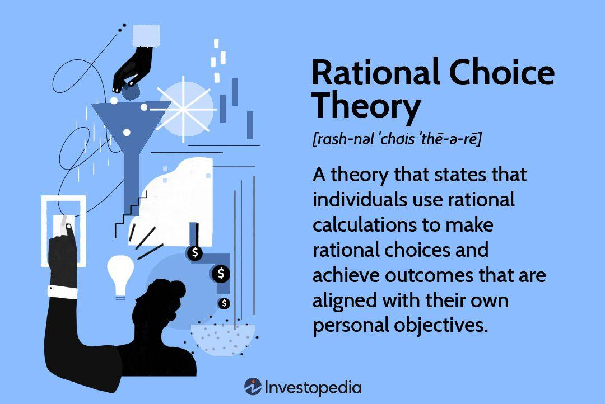

Understanding economic behavior is crucial for predicting market trends and making informed decisions. At the heart of economic theory lies rational choice theory, which posits that individuals make decisions to maximize their utility. This foundational concept suggests that individuals weigh the costs and benefits of their options and choose the option that provides the greatest net benefit or utility. This principle has been instrumental in analyzing consumer behavior, preparing policy frameworks, and understanding market dynamics.

With technological advancements, economic theories like rational choice have found new avenues in the industry, notably through algorithmic trading, or algo trading. Algorithmic trading refers to using computer algorithms to execute trading strategies at speeds and volumes that surpass human capability. By embedding principles of rational choice into sophisticated trading algorithms, traders can automate decision-making processes to optimize their trading outcomes, effectively capitalizing on market opportunities.



This article aims to explore how rational behavior and economic examples are intricately linked with the modern practice of algo trading. We will examine the applications and implications of these concepts, shedding light on how they operate within the financial world. Understanding this intersection not only deepens the knowledge of economic behavior but also highlights how technology is reshaping traditional trading and investment strategies.

## Table of Contents

## Understanding Economic Examples

Economic examples serve as essential tools for demonstrating the application of economic theories in tangible settings. These examples emphasize the significance of rational decision-making processes, a core aspect of both microeconomic and macroeconomic contexts. At the microeconomic level, consumers and firms make decisions that best satisfy their preferences and constraints, often depicted through the lens of utility maximization and profit optimization. In macroeconomics, policymakers strive to design economic policies that promote growth and stability, using rational choice principles to anticipate and manage national and global economic phenomena.

A pertinent instance of rational decision-making is observed during periods of inflation. Consumers, in response to rising prices, tend to change their purchasing habits to maintain utility. This behavior is explicated by the substitution effect, which posits that consumers will substitute cheaper alternatives for more expensive goods when prices rise. For example, if the price of beef increases significantly, consumers may choose to purchase more chicken if it remains relatively cheaper, therefore maximizing their utility under new budget constraints. This adaptive behavior showcases the practical application of rational choice theory in consumer decision-making during inflationary periods.

Case studies, such as the 2008 financial crisis, further underscore the critical need for comprehensive risk assessment and informed rational choice evaluation. The financial crisis highlighted several failures in decision-making by both financial institutions and regulatory bodies. A lack of thorough risk assessment and over-reliance on flawed financial models led to widespread economic instability. Financial institutions underestimated the risk associated with mortgage-related securities, leading to massive losses when housing prices declined. The crisis demonstrated that even perceived rational choices, guided by inadequate or erroneous information, could result in catastrophic economic consequences. The lessons learned emphasize the need for rational decision-making processes that account for uncertainties and adapt to evolving economic environments.

Overall, these economic examples illustrate the vital importance of applying rational decision-making principles across different economic contexts. Whether it involves consumer behavior during inflation or the strategic choices of financial entities, understanding and implementing rational economic theories can lead to more informed and effective decisions with far-reaching implications.

## The Principles of Rational Choice Theory

Rational choice theory suggests that individuals make decisions aimed at maximizing their utility by systematically evaluating the associated costs and benefits. Mathematically, utility maximization is often depicted through utility functions, U(x), which measure the satisfaction or happiness that a consumer derives from consuming a bundle of goods, x.

The fundamental idea within the theory is that individuals operate under certain constraints, most commonly budget constraints, which restrict their ability to consume goods based on their available resources. The consumer's problem can be formalized as finding the optimal bundle of goods, x*, that maximizes their utility subject to the budget constraint. This can be expressed as:

$$
\max U(x)
$$
$$
\text{subject to } \sum p_i x_i \leq M
$$

where $p_i$ represents the prices of goods, $x_i$ denotes the quantity of goods, and $M$ is the consumer's income. Solving this optimization problem often employs the Lagrange multiplier method or techniques from calculus to derive demand functions, which describe how consumption patterns change with varying prices and income.

Rational choice theory is adaptable across several disciplines, finding applications in areas such as political science, where it helps explain voting behavior, and sociology, where it provides insights into collective action and social interactions. In these contexts, individuals or groups make decisions that theoretically maximize their perceived benefits given their constraints, whether those be political capital or social norms.

However, the theory has faced criticism for its foundational assumptions. Chiefly, it presupposes that decision-makers have perfect information, enabling them to evaluate all potential costs and benefits accurately. In reality, information is often asymmetric or incomplete, complicating the decision-making process. Additionally, the theory assumes that individuals act rationally and logically, yet numerous real-world scenarios reveal that human behavior can be driven by emotion, cognitive limitations, or societal influences that lead to non-logical decision-making processes.

These limitations have led to the development of alternative models, such as behavioral economics, which incorporate psychological insights into economic reasoning. Behavioral models adjust the classic assumptions of rational choice theory to better account for observed deviations from classical rationality, providing a more nuanced understanding of decision-making under uncertainty and risk.

## Algo Trading: Merging Economics with Technology

Algorithmic trading, often referred to as algo trading, leverages advanced algorithms to automate financial trading decisions. These algorithms embody the principles of rational choice theory, which proposes that individuals or, in this case, systems, aim to maximize utility by evaluating costs and benefits.

The core advantage of [algorithmic trading](/wiki/algorithmic-trading) lies in its ability to process data and execute trades with a speed and accuracy that far exceeds human capabilities. This efficiency is crucial in high-frequency trading ([HFT](/wiki/high-frequency-trading-strategies)), where trades are executed in fractions of a second, capitalizing on minimal price fluctuations. By utilizing vast amounts of market data, these algorithms can identify trends, optimize trading strategies, and execute orders precisely when conditions are optimal.

One of the key technological advancements in algo trading is the integration of [artificial intelligence](/wiki/ai-artificial-intelligence) (AI) and [machine learning](/wiki/machine-learning) (ML). These technologies enhance the algorithms' ability to learn from data and adapt to market changes. Machine learning models can be trained on historical market data to predict future trends, allowing algo trading systems to refine their strategies and improve performance. For instance, using Python's machine learning libraries, such as scikit-learn, traders can develop predictive models that inform trading decisions, improving the accuracy of buy and sell signals.

```python
from sklearn.ensemble import RandomForestRegressor
from sklearn.model_selection import train_test_split

# Example of training a model to predict stock prices
X_train, X_test, y_train, y_test = train_test_split(market_data_features, stock_prices, test_size=0.2)
model = RandomForestRegressor(n_estimators=100)
model.fit(X_train, y_train)
predictions = model.predict(X_test)
```

Risk management is another fundamental aspect of algorithmic trading, aligning with rational choice principles to mitigate potential losses. By employing techniques such as stop-loss orders and value-at-risk (VaR) models, algo trading strategies are designed to minimize risk exposure. These measures ensure that even in volatile market conditions, the potential for significant financial loss is reduced.

In conclusion, algorithmic trading epitomizes the fusion of economics and technology, employing rational choice theory's tenets to optimize trading decisions. Through speed, data analysis, AI, and robust risk management, algo trading represents a sophisticated approach to navigating the complexities of financial markets.

## Real-World Applications and Case Studies

Leading financial institutions increasingly employ algorithmic trading as a strategic tool to gain competitive advantages in the financial markets. These institutions leverage advanced algorithms that execute trades at speeds and efficiencies unattainable by human traders, following the rational choice principles of maximizing utility and efficiency.

Renaissance Technologies stands out as a prominent example of a firm successfully applying rational choice principles in trading. Founded by Jim Simons, Renaissance Technologies is well-known for its Medallion Fund, which employs complex mathematical models and algorithms to achieve exceptional returns. The firm's approach underscores the effective implementation of rational choice theory, as it systematically evaluates vast datasets to maximize returns while controlling risks. By prioritizing quantitative analysis and statistical methods, Renaissance Technologies illustrates the profound impact of integrating computational models and rational decision-making in contemporary trading strategies.

However, the rise of algorithmic trading has also introduced ethical and regulatory challenges. Ensuring market fairness and transparency remains a significant concern for regulatory bodies worldwide. High-frequency trading, a subset of algorithmic trading, has been scrutinized for creating unfair advantages and contributing to market [volatility](/wiki/volatility-trading-strategies). The debate revolves around whether these practices align with fair trading principles or distort market integrity. As such, regulators frequently assess and update policies to strike a balance between fostering innovation in trading technologies and preserving orderly market conditions.

Publicized failures, such as the 2007-2008 financial crisis, serve as cautionary tales for the limitations of relying solely on rational choice assumptions. The crisis exposed the inadequacies of risk models and the dangers of over-reliance on automated systems without comprehensive understanding and supervision. The shortcomings in predicting systemic risks and the resulting financial turmoil highlighted that not all market behaviors can be encapsulated within rational models. This event underscored the need for incorporating behavioral insights and continuously adapting algorithms to account for both rational and irrational behaviors in financial markets.

In conclusion, while algorithmic trading exemplifies the embodiment of rational choice theory in financial markets, it also poses critical challenges that require addressing ethical, regulatory, and behavioral considerations. The interplay between advanced technologies and traditional economic theories demands continuous evaluation to ensure that the financial markets operate efficiently and equitably.

## The Future of Economics, Rational Choices, and Algo Trading

The integration of AI and big data into algorithmic trading holds significant promise for the future of financial markets. These technologies offer unparalleled capabilities for data analysis and decision-making, which are expected to enhance the efficiency and profitability of trading strategies. AI enables the processing of vast amounts of market data at high speeds, identifying patterns and trends that may elude human traders. Machine learning algorithms can optimize trading decisions by learning from historical data and adapting to new market conditions.

Emerging markets are increasingly adopting these technologies, resulting in improved market efficiencies and higher [liquidity](/wiki/liquidity-risk-premium). As algorithmic trading penetrates these markets, traders benefit from reduced transaction costs and tighter bid-ask spreads. The widespread implementation of such technologies could lead to more integrated global markets, where information is processed quickly and effectively, allowing for more accurate price discovery.

Nevertheless, the evolving regulatory landscape poses challenges to algorithmic trading. Regulators are increasingly focused on ensuring market fairness and stability, necessitating compliance with stringent rules and standards. Traders and financial institutions must adapt their strategies to meet these regulatory requirements while maintaining ethical practices. Compliance measures may include setting limits on trading speeds, implementing robust risk management protocols, and providing transparent reporting.

Additionally, integrating behavioral economics into algo trading presents a substantial opportunity to address the limitations of rational choice theory. Behavioral economics acknowledges that market participants are not always rational actors; they are influenced by psychological and emotional factors, leading to potentially irrational behaviors. By incorporating these insights into algorithmic models, traders can create systems that better predict and react to market anomalies driven by human behavior.

In summary, the confluence of advanced technologies and improved understanding of economic behavior suggests a transformative shift in how financial markets function. While this holds promise for enhanced efficiency and profitability, it also demands careful consideration of regulatory changes and ethical responsibilities. Future developments in AI, big data, and behavioral economics will likely shape the next phase of algorithmic trading, further influencing the global financial landscape.

## Conclusion

The integration of economic theory and technology in financial markets presents both opportunities and challenges. Algorithmic trading, a frontier where these two domains converge, exemplifies how rational choice theory is applied to optimize trading outcomes. At its core, algorithmic trading leverages the computational power to process vast amounts of market data and execute trades at speeds unattainable by human traders. By applying rational choice principles, these algorithms evaluate costs and benefits to maximize expected utility, thereby aligning trading strategies with the theoretical framework of utility maximization.

However, the continuous evolution of technology necessitates an ongoing commitment to innovation and ethical considerations. For algorithmic trading to remain sustainable and responsible, traders and developers must address issues such as market manipulation and ensure compliance with regulatory standards. Ethical trading practices must be ingrained in the design and deployment of trading algorithms to prevent market disruptions and preserve investor trust.

Looking forward, future developments in technology and economic theory will undoubtedly shape the landscape of financial markets. The integration of artificial intelligence and machine learning promises to enhance the predictive capabilities of trading algorithms, enabling more sophisticated decision-making processes. Additionally, the fields of behavioral economics and computational finance may increasingly intersect with algorithmic trading, providing insights into irrational market behaviors and offering new strategies for navigating complex market dynamics. As these advancements unfold, market participants must remain vigilant, adapting to new regulatory environments while capitalizing on technological innovations to maintain a competitive edge.

## References & Further Reading

1. Friedman, M. (1953). "The Methodology of Positive Economics". This seminal work by Milton Friedman argues that economic models should be evaluated based on their predictive accuracy rather than the realism of their assumptions. Friedman advocates for positive economics as a means to generate hypotheses that predict economic phenomena effectively. This framework provides foundational insights for understanding rational choice theory, emphasizing utility maximization and cost-benefit evaluation in decision making.

2. Thaler, R. H. (2016). "Behavioral Economics: Past, Present, and Future". Richard Thaler, a pioneer in behavioral economics, explores the evolution of the field and its divergence from traditional economic theories such as rational choice theory. Thaler discusses how behavioral economics incorporates psychological insights into economic models, addressing the limitations of assuming perfectly rational agents and highlighting the importance of understanding actual human behavior in economic decision making.

3. Fama, E. F. (1970). "Efficient Capital Markets: A Review of Theory and Empirical Work". Eugene Fama's work on market efficiency forms a cornerstone of modern financial economics. He posits that financial markets are informationally efficient, meaning prices reflect all available information. This concept is critical for algo trading, as it underscores the importance of integrating vast amounts of data to identify nuances that human traders might overlook, potentially leading to more effective trading strategies.

4. Lo, A. W. (2004). "The Adaptive Markets Hypothesis: Market Efficiency from an Evolutionary Perspective". Andrew Lo introduces the Adaptive Markets Hypothesis, proposing that market efficiency is not a static condition but instead evolves over time. He combines principles from evolutionary biology with traditional economic theories to suggest that financial markets adapt as financial agents learn and evolve. This perspective is highly relevant for the development of algorithmic trading systems that incorporate machine learning and are capable of evolving strategies over time based on new data.

5. Hansen, L. P., & Sargent, T. J. (2001). "Robust Control and Model Uncertainty in Economics". This work explores the concept of robust control in economic modeling, particularly when facing uncertainties in model parameters. Hansen and Sargent address how economic agents make decisions when faced with model uncertainty and unknown variables. Robust control theory has implications for algo trading, where uncertain market conditions necessitate strategies that can perform well across a variety of potential scenarios, thus aligning with the principles of rational choice theory and risk management practices.