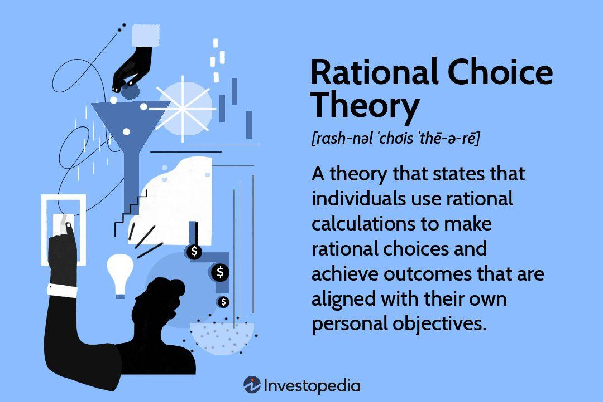

Understanding economic behavior is integral to predicting market trends and making informed decisions. This process often involves assessing a wide range of factors that govern the choices made by individuals and organizations. One such framework is rational choice theory, which suggests that individuals make decisions by comparing the costs and benefits to maximize their utility. This theory provides valuable insights into decision-making processes within economics by assuming that people act in their best interest when faced with constraints.

In the modern financial landscape, the principles of rational choice have tangible applications through algorithmic trading, or algo trading. This practice leverages advanced algorithms to automate trading decisions, embodying both the theories and strategies derived from economics. Algorithmic trading uses historical and real-time data to optimize outcomes, often executing trades at speeds and frequencies unattainable by human traders.



This article will explore how economic examples, rational choice theory, and algo trading intersect and influence each other. By examining these subjects, we aim to shed light on their utilization in real-world scenarios. The synergy between theoretical knowledge and practical applications is pivotal in understanding how these concepts drive efficiency and innovation in financial markets. Consequently, the integration of these elements not only shapes market dynamics but also offers valuable insights for traders and policymakers aiming to navigate the complexities of the global economy.

## Table of Contents

## Understanding Economic Examples

Economic examples provide concrete insights into the theoretical constructs of economic theories, reflecting their applicability in real-world scenarios. By analyzing these examples, economists and stakeholders can identify patterns that not only explain past and present market behavior but also assist in predicting future trends. These examples span various market conditions, encompassing both successes and failures, and illustrate the importance of rational decision-making.

During periods of inflation, for example, consumer behavior often adapts according to predicted changes in purchasing power. A microeconomic example of this is the substitution effect, where consumers substitute more expensive goods with cheaper alternatives when prices rise, thus exemplifying rational decision-making. Similarly, during a recession, businesses may prioritize cost-cutting measures to maintain profitability, showcasing strategic planning based on economic indicators.

Macroeconomic examples also offer significant insights. For instance, fiscal policy adjustments during economic downturns, such as tax cuts or increased government spending, aim to stimulate economic activity by influencing aggregate demand. These actions are grounded in economic theory and reflect the application of rational choice principles aimed at reversing economic decline.

Case studies play a crucial role in understanding how rational decision-making can lead to economic success or failure. The 2008 financial crisis serves as a prominent example where certain financial institutions failed to adequately assess risk, leading to widespread economic turmoil. This highlights the importance of factoring in all potential costs and benefits—a primary tenet of rational choice theory—when making economic decisions.

Furthermore, examining economic examples contributes to a deeper understanding of complex economic activities. By reviewing past economic data and case studies, stakeholders can better comprehend the intricacies of market dynamics and the multifaceted nature of economic systems. This, in turn, supports the formulation of more effective economic strategies and policies.

In summary, economic examples illuminate the practical applications of economic theories, providing valuable lessons from which future market predictions can be drawn. They underscore the significance of rational decision-making across both microeconomic and macroeconomic landscapes and foster a deeper understanding of economic complexities.

## The Principles of Rational Choice Theory

Rational choice theory is a fundamental concept in economics that suggests individuals make decisions by carefully evaluating associated costs and benefits. This process of decision-making underpins much of economic theory and practice. The core assumption of rational choice theory is that individuals aim to maximize their utility, striving to obtain the greatest benefit possible given the constraints they face.

Utility maximization is often represented mathematically in economics as optimizing a utility function $U(x)$, where $x$ is a vector of goods or services consumed. The objective is to select $x$ such that the utility function $U(x)$ is maximized subject to a budget constraint, typically expressed as:

$$

\sum_{i=1}^{n} p_i x_i \leq I 
$$

where $p_i$ represents the price of each good or service and $I$ is the individual's income. Individuals are assumed to operate under the assumption of perfect information, which means they have complete and accurate information about their choices and their potential consequences.

Rational choice theory is employed to explain and predict behaviors not only in economics, but also in other disciplines such as political science and sociology, by assuming that individuals act in their own best interest. In political science, for instance, voters are viewed as making rational choices based on the policies that will most benefit them personally. Sociology might apply the theory to understand social behaviors and institutional frameworks.

Despite its wide applicability, rational choice theory faces criticism, chiefly due to its limited capacity to account for non-logical decision-making processes. Critics argue that the theory oversimplifies human behavior by neglecting emotional, psychological, and social factors that often guide decisions. For example, irrational exuberance in stock markets or voting decisions swayed by charisma rather than policy efficacy challenge the premise of entirely rational actors.

Thus, while rational choice theory provides a valuable framework for understanding decision-making processes, it is essential to recognize its constraints and complement it with insights from behavioral economics and psychology. These interdisciplinary approaches consider the tendency of individuals to deviate from utility-maximizing choices, acknowledging the complexity of human behavior in economic models.

## Algo Trading: Merging Economics with Technology

Algorithmic trading, often referred to as algo trading, utilizes sophisticated algorithms to automate the decision-making process in financial trading. These algorithms are designed to [carry](/wiki/carry-trading) out trading tasks at speeds and frequencies that would be impossible for a human trader. By structuring trading strategies that leverage historical and real-time data, algo trading optimizes decision-making in line with rational choice principles. The objective is to execute trades that maximize utility, akin to the utility maximization sought for in rational choice theory. 

A key attribute of algo trading is its extensive contribution to the overall trading [volume](/wiki/volume-trading-strategy) in global financial markets. Various estimates suggest that it accounts for a substantial portion, with some markets witnessing more than 70% of total trading volumes being conducted algorithmically. This prevalence underscores the efficiency and speed advantages offered by algorithmic systems over traditional manual trading.

The integration of [artificial intelligence](/wiki/ai-artificial-intelligence) and [machine learning](/wiki/machine-learning) has further enhanced the capabilities of algo trading systems. These technologies afford algorithms the ability to learn from vast datasets, analyze patterns, and make decisions that are continuously refined by evolving market conditions. Machine learning models can adapt by adjusting their parameters based on new data inputs, allowing for dynamic trading strategies that can respond swiftly to market changes. For instance, [reinforcement learning](/wiki/reinforcement-learning), a subfield of machine learning, can be applied to develop algorithms that improve through trial and error, potentially leading to more profitable trading outcomes.

The economic theories embedded within these algorithms are designed to not only maximize profits but also mitigate risks. This is achieved through the incorporation of risk management techniques and economic indicators that guide decision-making. For example, algorithms might include stop-loss criteria to prevent excessive losses or diversification strategies to spread risk across various assets. By doing so, trading strategies align more closely with the rational choice model, which emphasizes making decisions based on a clear assessment of potential outcomes.

In Python, a basic structure for a moving average crossover strategy, which is a common [algorithmic trading](/wiki/algorithmic-trading) strategy, might look like this:

```python
import pandas as pd
import numpy as np

# Assuming `data` is a DataFrame with stock prices and a DateTime index
short_window = 40
long_window = 100

# Generate signals
data['short_mavg'] = data['price'].rolling(window=short_window, min_periods=1, center=False).mean()
data['long_mavg'] = data['price'].rolling(window=long_window, min_periods=1, center=False).mean()

# Create signals when short moving average crosses above long moving average
data['signal'] = 0
data['signal'][short_window:] = np.where(data['short_mavg'][short_window:] > data['long_mavg'][short_window:], 1, 0)

# Generate trading orders
data['positions'] = data['signal'].diff()

# Display the data with signals
print(data)
```

This simple strategy identifies buy and sell signals based on the crossover of short-term and long-term moving averages, showcasing how historical data drives algorithmic decision-making. Though simplistic, it exemplifies the foundational concept of data-driven strategy optimization, which, at scale and with added complexity, characterizes contemporary algo trading systems.

The integration of economic theories with technological advancements in algorithmic trading has reshaped trading landscapes, presenting both lucrative opportunities and challenges. Those invested in developing these technologies must continually refine their systems, balancing the pursuit of high-frequency trades with the pressing need for robust risk management and ethical considerations.

## Real-World Applications and Case Studies

Leading financial institutions extensively use algorithmic trading to enhance trading efficiency, minimize costs, and gain competitive advantages in global markets. Banks, hedge funds, and asset management firms employ sophisticated algorithms that execute high-frequency trading ([HFT](/wiki/high-frequency-trading-strategies)) strategies based on rapid data analysis, applying rational choice theory to optimize decision-making processes. A pioneering example is Goldman Sachs, whose use of algorithmic models has expanded to trading equities, derivatives, and currencies with remarkable precision.

A significant case illustrating the successful implementation of rational choice theory in trading is Renaissance Technologies, a [hedge fund](/wiki/hedge-fund-trading-strategies) known for its flagship Medallion Fund. This fund applies quantitative models, using historical and real-time data to predict market movements accurately. By leveraging rational choice principles, such as utility maximization and statistical [arbitrage](/wiki/arbitrage), Renaissance achieves exceptional returns, showcasing the synergy between theory and practice.

Economic indicators play a vital role in algorithmic decision-making. These indicators, including GDP growth rates, inflation, and employment figures, inform algorithms to adapt strategies according to prevailing economic conditions. For instance, a decrease in unemployment may signal economic recovery, prompting algorithms to adjust their market exposure. Machine learning models enhance this adaptability by continuously refining strategies based on new data, ensuring decisions remain aligned with current market dynamics.

Despite the theoretical robustness of rational choice theory, its limitations become apparent in financial markets, particularly during periods of irrationality or systemic disruptions. The 2007-2008 financial crisis exemplifies such a failure. Many algorithmic strategies during this time, designed under rational choice assumptions, collapsed as investor behavior deviated from rational expectations. These algorithms underestimated the probability and impact of low-probability, high-impact events, resulting in substantial financial losses.

Algorithmic trading poses ethical and regulatory challenges. The speed and complexity of algo trading can create unfair markets, giving sophisticated traders an advantage over traditional investors. This disparity raises concerns about market integrity and fairness. Regulatory bodies, like the Securities and Exchange Commission (SEC) and the European Securities and Markets Authority (ESMA), have implemented regulations to mitigate these risks. Measures include imposing limits on HFT activities and enhancing transparency through stricter reporting requirements.

As algorithmic trading evolves, its ethical implications demand ongoing scrutiny. High-profile incidents, such as the 2010 "Flash Crash," highlight the potential for algorithms to destabilize markets within seconds. Consequently, financial institutions must incorporate robust risk management protocols and ensure compliance with evolving regulatory standards to safeguard market stability.

## The Future of Economics, Rational Choices, and Algo Trading

The future of economics, rational choices, and algorithmic trading is poised for significant transformation driven by technological advancements and evolving economic theories. One of the major trends is the integration of artificial intelligence (AI) and machine learning into algorithmic trading systems, which enhances their ability to process vast amounts of data and make more accurate predictions. AI techniques, such as neural networks and reinforcement learning, enable algorithms to learn from historical trading data and adapt to changing market conditions, improving decision-making accuracy and efficiency.

Big data plays a pivotal role by providing traders with deeper insights into market trends and patterns. By analyzing large datasets, traders can uncover hidden correlations and make data-driven decisions that optimize their trading strategies. For example, sentiment analysis of news articles and social media posts can provide real-time insights into public perception and potential market movements, thereby informing trading decisions.

Emerging markets are also adopting rational economic practices and algorithmic trading as they seek to modernize their financial systems. These markets benefit from the reduced transaction costs and increased market efficiency that algo trading offers. As a result, they are likely to see an increase in trading volume and [liquidity](/wiki/liquidity-risk-premium), attracting both domestic and international investors.

However, the future of algorithmic trading is not without challenges. Potential changes in regulations could impact trading strategies and market dynamics. Regulators are increasingly focused on ensuring market stability and preventing manipulative practices, which could lead to stricter oversight of algorithmic trading activities. Traders must navigate these regulatory changes while maintaining compliance and ethical standards.

Evolving economic theories may also influence algorithmic strategies. Concepts such as behavioral economics, which considers psychological factors in decision-making, may be integrated into trading algorithms to account for irrational market behaviors. As these theories continue to evolve, they may provide valuable insights that enhance algorithm performance.

In conclusion, the future of economics, rational choices, and algorithmic trading is characterized by rapid technological advancements, regulatory challenges, and the integration of new economic theories. Traders and financial institutions must adapt to these changes to maximize opportunities and mitigate risks in an increasingly complex and dynamic trading landscape.

## Conclusion

The interconnectedness of economic examples, rational choice theory, and algorithmic trading reveals the sophistication and complexity of modern financial markets. Economic examples serve as practical illustrations of theoretical principles, providing a foundation from which rational choice theory can be both verified and refined. This theory, grounded in the notion of utility maximization, underpins decisions in financial markets, determining how resources are allocated and investments are made.

Algorithmic trading exemplifies the application of rational choice theory on a technological platform, where trading decisions are automated through sophisticated algorithms. These algorithms are designed to optimize outcomes based on historical data and real-time market conditions, embodying the principles of rational decision-making. By integrating these theories with technological advancements, traders can maximize profits while minimizing risks, making the financial markets more efficient and responsive.

However, the dynamic nature of financial markets necessitates ongoing research and adaptation to new developments. As technology continues to evolve, incorporating advancements in machine learning and artificial intelligence, the landscape of algorithmic trading is expected to become even more complex. Traders and economists must stay abreast of these changes to harness their potential effectively. Beyond technical advancements, there is also a pressing need to explore ethical trading practices. The implications of these practices are significant for global markets, as they affect issues such as transparency, fairness, and regulatory compliance.

In conclusion, while the integration of economic theory and technology holds significant promise for financial markets, it is accompanied by challenges that require careful consideration. Ethical concerns, technological complexity, and market fluctuations all present potential hurdles for decision-makers and traders. Navigating these challenges will be crucial in realizing the benefits of these advancements, ensuring that economic decisions are not only rational but also responsible and sustainable for the future.

## References & Further Reading

[1]: Friedman, M. (1953). ["The Methodology of Positive Economics"](https://www.cambridge.org/core/books/methodology-of-positive-economics/methodology-of-positive-economics-1953/CFF7143A05C9A667D3E54E9AD747A98A) in Essays in Positive Economics. University of Chicago Press.

[2]: Thaler, R. H. (2016). ["Behavioral Economics: Past, Present, and Future."](https://www.aeaweb.org/articles?id=10.1257/aer.106.7.1577) Psychological Science.

[3]: Fama, E. F. (1970). ["Efficient Capital Markets: A Review of Theory and Empirical Work."](https://www.jstor.org/stable/2325486) The Journal of Finance, 25(2), 383-417.

[4]: Lo, A. W. (2004). ["The Adaptive Markets Hypothesis: Market Efficiency from an Evolutionary Perspective."](https://papers.ssrn.com/sol3/papers.cfm?abstract_id=602222) The Journal of Portfolio Management, 30(5), 15-29.

[5]: Hansen, L. P., & Sargent, T. J. (2001). ["Robust Control and Model Uncertainty"](https://www.jstor.org/stable/2677734) in Economics. Princeton University Press.