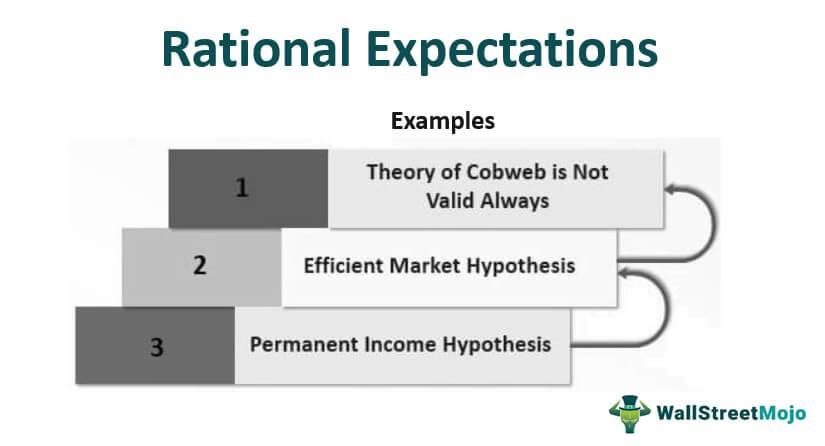

Economic forecasting plays a crucial role in guiding both investment decisions and policy-making. By anticipating future economic conditions, businesses and governments can allocate resources more effectively, mitigate risks, and capitalize on potential opportunities. Central to the accuracy of these forecasts is the understanding of how expectations influence economic outcomes. Rational Expectations Theory provides a framework to grasp these dynamics, positing that individuals make decisions based on rationality, the information available, and past experiences. This framework holds that people's expectations will, on average, be correct because they utilize all accessible, relevant information in their decision-making processes. 

The implications of Rational Expectations Theory extend to various economic sectors. In macroeconomics, it serves as a foundation to predict economic trends such as inflation and interest rates. This predictive power is invaluable for policymakers who strive to formulate strategies that address and preempt economic issues. Furthermore, Rational Expectations Theory has significant applications in finance, particularly influencing the development of automated trading systems. Algorithmic trading leverages computer algorithms to execute trades according to predefined criteria, and incorporating rational expectations into these systems can enhance their ability to adjust to new information and market dynamics.



Understanding and anticipating how expectations shape economic outcomes is essential for building robust economic models and prediction tools. This article explores the integration of Rational Expectations Theory into economic forecasting methodologies and examines its potential impact on the efficacy of algorithmic trading strategies. By unraveling these connections, we gain insights into crafting more adaptive and responsive economic and financial models, ultimately driving more informed decision-making processes.

## Table of Contents

## Understanding Rational Expectations Theory

Rational Expectations Theory is a pivotal construct in economic thought, suggesting that individuals use all available information, their understanding of the economy, and past experiences to make informed decisions about future economic phenomena. This theory thrives on the premise that people's predictions of economic variables are not systematically biased and that any deviation from actual economic outcomes is random and not predictable. In other words, when forming expectations about future inflation rates, interest rates, or any economic indicator, individuals utilize a comprehensive set of information, striving to make forecasts as accurately as possible given what they know.

The foundation of Rational Expectations Theory can be traced back to John F. Muth, who introduced the concept in the early 1960s. Muth proposed that firms’ expectations should be modeled consistently with the actual structure of the economy. He argued that systematic forecasting errors would not persist because firms and individuals constantly adapt and update their expectations based on new information. This notion marked a significant departure from traditional, more static expectations models and has subsequently significant ramifications in macroeconomic modeling.

Further advancements in Rational Expectations Theory were driven by Robert Lucas Jr., who applied it to macroeconomic policy analysis, revolutionizing the understanding of how expectations influence economic dynamics. Lucas emphasized that economic agents make rational predictions that reflect the model economy's structure, including anticipated policy interventions. This insight led to what is known as the Lucas Critique, highlighting the pitfalls of traditional econometric models that fail to account for changes in policy regime expectations.

In practical macroeconomics, Rational Expectations Theory is employed to predict economic trends, such as inflation and interest rates. The theory implies that monetary policy would be neutral or ineffective if it is fully anticipated by economic [agents](/wiki/agents), as they would have already incorporated these expectations into their decision-making processes. Thus, surprise elements in policy shifts are more likely to influence macroeconomic outcomes than expected ones.

To model such expectations mathematically, economists express the expected value of a variable $Y_t$ at time $t$ using the conditional expectation based on the information available up to that point, denoted as $E_t(Y_{t+1})$. This can be written as:

$$
E_t(Y_{t+1}) = \text{Possible Outcome} \times \text{Probability of Outcome}
$$

This approach ensures that expectations are unbiased predictors of the true future value of economic variables, aligning with available data and consistent economic determinants.

Rational Expectations Theory continues to be a critical component of modern economic analysis, providing a framework that aligns predictive models more closely with the realities of decision-making processes employed by individuals and firms.

## Implications of Rational Expectations in Economic Forecasting

Economic forecasting is a cornerstone of economic analysis, providing essential insights to guide both policy-making and individual investment decisions. At the heart of effective forecasting lies the assumption fundamental to Rational Expectations Theory: agents form expectations that, on average, align with actual economic outcomes. This alignment assumes that individuals utilize all available information effectively, thereby contributing to the accuracy of forecasts.

Policymakers rely heavily on economic forecasts grounded in rational expectations to design and implement strategies that anticipate and address potential economic issues. For example, if individuals expect inflation, they might adjust their behavior in ways that influence actual inflation rates, such as by demanding higher wages or adjusting spending patterns. Forecast models incorporating rational expectations can help policymakers predict such behaviors and, consequently, future economic conditions. This foresight enables economic strategies that aim to stabilize markets, manage inflation, and support sustainable growth.

Understanding and incorporating expectations into economic forecasting models enhance both the accuracy and reliability of predictions. Traditional models often assume static expectations, which might not adapt to new information. However, models based on Rational Expectations Theory adapt dynamically, reflecting updated beliefs and new information as they become available. This dynamism allows forecasts to better match real-world outcomes by adjusting to new economic data and trends.

To illustrate, consider the use of rational expectations in forecasting inflation. If the public expects higher future inflation, they are likely to act in ways that cause inflation to rise, fulfilling the initial expectation. Thus, forecasting models would integrate these expectations to predict not just inflation rates, but also how these expectations might shape the future economic landscape. Mathematically, if $E_t$ represents the expected value of an economic variable at time $t$, Rational Expectations Theory posits $E_t(x_{t+1}) = x_{t+1} + \epsilon_t$, where $\epsilon_t$ is the error term with an expected value of zero, reflecting that on average, these expectations are unbiased.

Improvements in data collection and computational power allow economists to refine their models by incorporating real-time data, thereby continuously improving the forecasting process. As a result, rational expectations have become a valuable tool not just theoretically, but practically, in formulating economic policies and strategies to mitigate future economic challenges.

## Automated Trading and Rational Expectations

Algorithmic trading, a sophisticated domain within financial markets, leverages computer algorithms to automate trading decisions and execute transactions based on predefined criteria. These systems are designed to process vast amounts of data, analyze market conditions, and make rapid trading decisions that would be impossible for a human trader to replicate. By integrating Rational Expectations Theory, these algorithms can be significantly enhanced to not only react to market signals but also incorporate expectations about future market conditions.

Rational Expectations Theory posits that economic agents use available information and past experiences to form expectations about the future. This foundational concept can be applied to [algorithmic trading](/wiki/algorithmic-trading) by constructing models that predict not only immediate market movements but also broader economic trends affecting those movements. This integration allows algorithms to adjust their strategies dynamically as new information becomes available, aligning with the assumptions of rational expectations.

For example, a trading algorithm equipped with rational expectations might incorporate macroeconomic indicators such as inflation rates, interest rates, and GDP growth into its decision-making process. In this way, it can adjust its trades to anticipate central bank policies or shifts in economic growth, rather than merely responding to historical price or [volume](/wiki/volume-trading-strategy) data. Such proactive adjustment can be mathematically modeled using predictive analytics and [machine learning](/wiki/machine-learning) techniques, which allow the algorithm to learn from market reactions and refine its strategies over time.

Python, a popular language for financial modeling due to its versatility and extensive libraries, can be used to implement these concepts. A simple framework might involve using libraries such as pandas for data manipulation, scikit-learn for statistical analysis, and NumPy for numerical operations. The following Python snippet illustrates a basic model that could, in theory, incorporate rational expectations into trading decisions:

```python
import numpy as np
import pandas as pd
from sklearn.linear_model import LinearRegression

# Sample economic indicators
data = pd.DataFrame({
    'inflation_rate': [2.0, 2.1, 2.2, 2.3],
    'interest_rate': [1.5, 1.6, 1.7, 1.8],
    'gdp_growth': [3.0, 3.1, 3.2, 3.3],
    'market_movement': [2.5, 2.6, 2.7, 2.8]
})

# Creating a model to predict market movements based on economic indicators
X = data[['inflation_rate', 'interest_rate', 'gdp_growth']]
y = data['market_movement']

model = LinearRegression()
model.fit(X, y)

# Predict future market movement using new economic data
new_data = np.array([[2.4, 1.9, 3.4]])
predicted_movement = model.predict(new_data)
print(f'Predicted Market Movement: {predicted_movement[0]}')
```

Incorporating Rational Expectations into algorithmic trading entails continuous adaptation and learning, aligning trading strategies with the evolving expectations of market participants. By doing so, algorithms become more responsive and better equipped to mitigate risks associated with unexpected market shifts. The integration of these theoretical insights promises to enhance the predictive accuracy and robustness of automated trading systems, thereby facilitating more efficient and profitable trades.

## Criticisms and Controversies of Rational Expectations

Rational Expectations Theory has been influential in the field of economics, but it is not without its criticisms and controversies. One of the primary criticisms of Rational Expectations is its assumption of perfect information. According to the theory, individuals make decisions based on their rational evaluation of all available information. However, this assumption is often unrealistic in real-world scenarios where information is imperfect or incomplete. The assumption overlooks the complexity of information dissemination and the potential for misunderstandings or misinterpretations. As a result, critics argue that the theory's reliance on perfect information limits its practical applicability.

Another significant critique comes from the field of behavioral economics, which provides an alternative perspective on how individuals form expectations. Behavioral economists argue that human decision-making is affected by cognitive biases, emotions, and other psychological factors that can lead to irrational decisions. These biases can skew expectations away from what Rational Expectations Theory would predict. For example, overconfidence bias might lead individuals to overestimate their knowledge or ability to predict future events, while loss aversion might drive decision-making contrary to rational predictions. These human factors are often neglected in models based on rational expectations.

The applicability of Rational Expectations in diverse economic environments remains a contentious issue. While the theory offers a useful framework for predicting aggregate economic outcomes, its assumptions may not hold in all contexts. For instance, in rapidly changing or highly volatile markets, the speed and accuracy with which individuals can process information may be compromised. Furthermore, in economies with limited access to information technology or lower levels of financial literacy, the expectation formation process might vastly differ from the rational model proposed by the theory.

The debate surrounding Rational Expectations Theory highlights the challenges of modeling economic behavior accurately. While the theory provides a structured approach to understanding expectations, its limitations necessitate ongoing research and adaptation. Economists continue to evaluate the theory's assumptions and explore alternative models that incorporate the human elements of decision-making. As such, Rational Expectations Theory remains a foundational yet contested concept in the study of economics.

## Conclusion

Rational Expectations Theory continues to be a fundamental component in the domains of economic forecasting and financial modeling. By assuming that economic agents form expectations based on all relevant information and utilize past experiences to make informed decisions, the theory provides a robust framework for predicting economic outcomes. This methodological approach is invaluable for policymakers and investors seeking to anticipate future market conditions and adjust their strategies accordingly.

Incorporating Rational Expectations Theory into automated trading systems offers the potential to create more adaptive and responsive trading models. Algorithmic trading can be enhanced by integrating this theory to effectively account for the expectations and information processing activities of market participants. By employing sophisticated algorithms that analyze and respond to new market information in real-time, trading systems can potentially achieve higher accuracy in predicting price movements and executing trades.

The ongoing advancement in computational capabilities and data analysis techniques fuels the research and development efforts directed at enhancing the applicability of Rational Expectations Theory in economic modeling and algorithmic trading. As these technologies continue to evolve, the extent of the theory's impact on modern economics will become more pronounced. Researchers and practitioners are encouraged to explore the integration of this theory into various economic models and trading strategies to leverage its full potential.

Ultimately, the interplay between Rational Expectations Theory and emerging technologies holds promise for developing innovative solutions that can handle the complexities of today's economic environment, paving the way for more precise and effective economic forecasting and financial decision-making.

## FAQ - Frequently Asked Questions

### What is the Rational Expectations Theory?

Rational Expectations Theory is an economic idea that posits individuals and agents form forecasts about the future based on all available information, historical context, and intrinsic human rationality. Initially articulated by John F. Muth in 1961, and further developed by Robert Lucas Jr., the theory suggests that people use the best possible data and models to make predictions. In doing so, any errors in predictions are random and not systematic, meaning that on average, individuals' expectations are accurate.

### How does Rational Expectations Theory affect macroeconomic policy?

In macroeconomics, Rational Expectations Theory implies that policy makers should recognize that agents anticipate the effects of economic policies and adjust their behavior accordingly. For example, if a central bank plans to reduce inflation by tightening monetary policy, rational agents will predict this change, adjust their expectations for inflation, and as a result, modify their financial and investment decisions. This self-fulfilling characteristic can either enhance or undermine policy effectiveness. A key consequence is the potential for policy neutrality, where anticipated policies have no real effect on output due to proactive counteractions by rational agents. 

### What are the limitations of Rational Expectations Theory?

Rational Expectations Theory assumes that all agents have access to and can process complete information efficiently. Critics argue that this assumption is unrealistic as information asymmetries and cognitive limitations exist. Additionally, human behavior often deviates from purely rational decision-making due to biases and heuristics, as emphasized by behavioral economics. Furthermore, diverse economic environments may experience unpredictable shocks, making the perfect foresight assumption an oversimplification of reality. Therefore, while useful, reliance on rational expectations without accounting for these factors can lead to suboptimal forecasting and policy outcomes.

### How is Rational Expectations Theory used in economic forecasting?

Economic forecasting benefits from Rational Expectations Theory by assuming that market participants, such as consumers, investors, and firms, make forecasts that align with actual economic trends. This approach allows economists to model and predict future economic variables, such as inflation rates and GDP growth, under the premise that collective human predictions are reliable. By assuming that agents react to changes in economic policies, models can anticipate these reactions and more accurately forecast events like market fluctuations and economic cycles.

### How can investors use Rational Expectations Theory in their investment strategies?

Investors can leverage Rational Expectations Theory to align their strategies with collective market forecasts and anticipated policy changes. By analyzing how rational agents are expected to respond to new information, investors can design approaches that preemptively account for these shifts. For example, with a predicted rise in interest rates, a rationally informed investor might adjust their portfolio to minimize exposure to interest-sensitive stocks. Algorithmic trading systems can also be tailored to reflect rational expectations, increasing adaptability and responsiveness to emerging market data. By integrating these expectations into decision-making, investors may potentially enhance their returns while mitigating risk.

## References & Further Reading

[1]: Muth, J. F. (1961). ["Rational Expectations and the Theory of Price Movements."](https://extranet.parisschoolofeconomics.eu/docs/guesnerie-roger/muth61.pdf) Econometrica, 29(3), 315-335.

[2]: Lucas, R. E. Jr. (1976). ["Econometric Policy Evaluation: A Critique."](https://www.sciencedirect.com/science/article/pii/S0167223176800036) Carnegie-Rochester Conference Series on Public Policy, 1, 19-46.

[3]: Evans, G. W., & Honkapohja, S. (2001). ["Learning and Expectations in Macroeconomics."](https://www.jstor.org/stable/j.ctt7s6t9) The MIT Press.

[4]: Hoover, K. D. (2012). ["Applied Intermediate Macroeconomics."](https://www.cambridge.org/core/books/applied-intermediate-macroeconomics/79D615CF74E12811EE569B34237F148C) Cambridge University Press.

[5]: Lopez de Prado, M. (2018). ["Advances in Financial Machine Learning."](https://www.amazon.com/Advances-Financial-Machine-Learning-Marcos/dp/1119482089) Wiley.