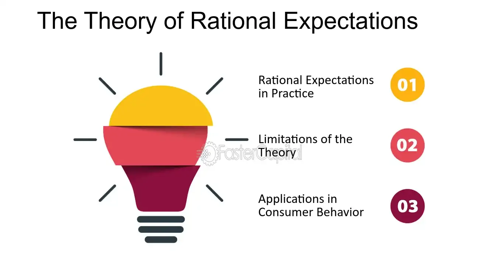

## Table of Contents

## What is the Rational Expectations Theory?

The Rational Expectations Theory is an economic idea that says people use all the information they have to make the best guesses about the future. This theory is important in economics because it helps explain how people make decisions about things like spending money, saving, or investing. For example, if people expect prices to go up, they might buy things now instead of later. The theory suggests that people are pretty good at predicting what will happen, as long as they have enough information.

In the world of economics, this theory affects how policies are made. If policymakers want to change something, like interest rates, they need to think about how people will react based on their expectations. If people expect the change and act on it, the policy might not work as planned. This is why understanding rational expectations is key for making effective economic policies. It's all about trying to predict how people will behave when they have certain information.

## Who developed the Rational Expectations Theory?

The Rational Expectations Theory was mainly developed by John F. Muth in the early 1960s. Muth was an economist who wanted to understand how people make predictions about the future. He thought that people use all the information they have to make the best guesses possible. This was different from what many economists thought at the time, who believed people often made mistakes in their predictions.

Muth's idea became very important in economics. Other economists, like Robert Lucas and Thomas Sargent, built on his work. They used the theory to explain how economic policies work and how people react to them. The theory changed the way economists think about how people make decisions and how the economy works.

## How does the Rational Expectations Theory differ from other economic theories?

The Rational Expectations Theory is different from other economic theories because it says people use all the information they have to make the best guesses about the future. Many older theories, like those based on Adaptive Expectations, thought people only used past information to make predictions. They believed people would slowly change their expectations based on what happened before. But Rational Expectations says people are smarter and use all kinds of information, not just what happened in the past.

Another big difference is how Rational Expectations affects economic policies. Traditional theories often thought that policies could surprise people and change their behavior. For example, if the government suddenly changed interest rates, people might not expect it and would react in a way that helped the policy work. But with Rational Expectations, people are expected to predict these policy changes. If they do, they might act in ways that make the policy less effective. This means policymakers need to think about how people will react based on their expectations, making it harder to surprise the economy into changing.

## What are the key assumptions of the Rational Expectations Theory?

The Rational Expectations Theory assumes that people are smart and use all the information they have to make the best guesses about what will happen in the future. This means they don't just look at what happened before but also consider news, economic reports, and other things that might affect the economy. The theory believes people are good at predicting things if they have enough information. It's like saying if you know a lot, you can make better guesses about what's going to happen.

Another key assumption is that people understand how the economy works. They know how policies, like changes in interest rates, might affect them. So, when they make decisions, they think about these policies and how they might change. This makes it harder for policymakers to surprise people with new policies because people are already thinking about what might happen. It's all about expecting the unexpected and planning for it.

## How do rational expectations influence economic decision-making?

Rational expectations influence economic decision-making by making people think about the future in a smart way. When people believe they can predict what's going to happen, they use all the information they have to make choices. For example, if someone thinks prices will go up, they might decide to buy things now instead of later. This can affect how much people spend or save, which in turn impacts the whole economy. If lots of people think the same way, their actions can lead to big changes in things like inflation or employment.

Because of rational expectations, policymakers need to be careful about how they make new rules or change old ones. If people expect these changes, they might act in ways that make the new policies less effective. For instance, if the government says it will raise taxes next year, people might spend more now to avoid higher taxes later. This means that when planning new policies, leaders have to think about what people will do based on their expectations. It's like a game where everyone is trying to guess what the others will do next.

## What is the mechanism through which rational expectations affect economic outcomes?

Rational expectations affect economic outcomes by changing how people behave based on what they think will happen. If people believe prices will go up, they might buy more things now, which can lead to higher inflation. If they expect interest rates to rise, they might borrow money now before it gets more expensive. This means that what people expect can actually make those expectations come true, like a self-fulfilling prophecy. When many people act on the same expectations, it can have a big impact on things like how much people spend, how much businesses produce, and even how many people have jobs.

Policymakers need to think about these expectations when they make new rules or change old ones. If people expect a policy change, like a tax increase, they might act in ways that make the policy less effective. For example, if people know taxes will go up next year, they might spend more now to avoid paying more later. This makes it harder for the government to use policies to surprise the economy into changing. So, understanding what people expect is really important for making economic decisions that work well.

## Can you explain the concept of 'information sets' in the context of rational expectations?

In the context of rational expectations, an 'information set' is all the information that a person has at a certain time. This includes things like news, past experiences, and economic reports. When people make decisions, they use everything in their information set to guess what will happen in the future. The idea is that if people have a lot of information, they can make better predictions. So, an information set is like a big box of knowledge that helps people decide what to do.

The concept of information sets is important because it explains how rational expectations work. If everyone has the same information set, they will all make similar predictions about the future. This can lead to big changes in the economy, like everyone deciding to buy things now if they think prices will go up. But if people have different information sets, their expectations and actions might be different. This shows why it's important for economists to understand what information people have when they make decisions.

## How do rational expectations impact monetary and fiscal policy effectiveness?

Rational expectations make it harder for monetary and fiscal policies to work the way policymakers want. When people think they know what the government or the central bank will do, they can act in ways that make these policies less effective. For example, if people expect the central bank to raise interest rates, they might borrow money now before it gets more expensive. This can make the policy less effective because people have already acted on their expectations. It's like trying to surprise someone who already knows what you're going to do.

Fiscal policy, like changing taxes or spending, is also affected by rational expectations. If people expect taxes to go up next year, they might spend more now to avoid paying more later. This can make the tax increase less effective because people have already changed their spending habits. Policymakers need to think about what people expect and how those expectations will change their behavior. It's a tricky game where everyone is trying to guess what the others will do next.

## What are some criticisms of the Rational Expectations Theory?

Some people think the Rational Expectations Theory doesn't work well in real life. They say it's too hard to believe that everyone can always use all the information they have to make perfect guesses about the future. People often make mistakes or don't have all the information they need. Also, not everyone understands the economy the same way. So, expecting everyone to predict things perfectly is not realistic. Critics also point out that the theory doesn't explain why some people might make different guesses even if they have the same information.

Another criticism is that the Rational Expectations Theory makes it hard for policies to work. If people can always predict what the government will do, then policies might not change anything. But in real life, policies can still surprise people and make a difference. Critics argue that the theory doesn't fit with how the world actually works. They think it's too simple and doesn't consider how complicated people and the economy really are.

## How has the Rational Expectations Theory been tested empirically?

Economists have tested the Rational Expectations Theory by looking at how well people predict things like inflation or interest rates. They use data to see if people's guesses about the future match what actually happens. For example, researchers might look at surveys where people say what they think inflation will be next year, and then compare that to what inflation really is. If people's guesses are close to the real numbers, it supports the idea that they use all the information they have to make good predictions.

One famous way to test the theory is by using something called the "Lucas Critique." Robert Lucas said that if people have rational expectations, then changes in policy should not surprise them much. So, economists test this by looking at how people react to new policies. If people change their behavior in ways that match what the policy was trying to do, it might mean they had rational expectations. But if they don't react the way expected, it could mean the theory doesn't work as well as thought. These tests help economists understand if rational expectations really explain how people make decisions.

## What are the implications of rational expectations for economic forecasting?

Rational expectations make economic forecasting more complicated because they mean people use all the information they have to predict the future. If people are good at guessing what will happen, then economic forecasts need to think about what people expect. If everyone thinks prices will go up, they might spend more now, which can actually make prices go up. This means that what people expect can change the economy, making it harder to predict what will happen next.

Because of rational expectations, economic forecasts have to include what people think will happen. If a forecast says interest rates will rise, but people expect them to stay the same, they might not change their behavior. This can make the forecast wrong because people's actions are based on their own expectations, not just what the forecast says. So, understanding what people expect is really important for making good economic forecasts.

## How do rational expectations integrate with other economic models like the Lucas Critique?

Rational expectations and the Lucas Critique work together to explain how people make decisions and how economic policies work. The Rational Expectations Theory says people use all the information they have to guess what will happen in the future. The Lucas Critique, named after economist Robert Lucas, says that if people have these rational expectations, then they won't be surprised by new policies. They will change their behavior based on what they expect the policy to do. So, when economists make new rules or change old ones, they need to think about how people will react based on their expectations.

This means that when using models like the Lucas Critique, economists have to include what people expect will happen. If people expect a policy change, like a tax increase, they might spend more now to avoid paying more later. This can make the policy less effective because people have already acted on their expectations. Understanding rational expectations helps economists see why some policies might not work as planned and how to make better forecasts about the economy. It's all about trying to predict how people will behave when they have certain information.

## What is the Understanding of Rational Expectations Theory?

Rational Expectations Theory is a pivotal construct in economic thought, suggesting that individuals use all available information, their understanding of the economy, and past experiences to make informed decisions about future economic phenomena. This theory thrives on the premise that people's predictions of economic variables are not systematically biased and that any deviation from actual economic outcomes is random and not predictable. In other words, when forming expectations about future inflation rates, interest rates, or any economic indicator, individuals utilize a comprehensive set of information, striving to make forecasts as accurately as possible given what they know.

The foundation of Rational Expectations Theory can be traced back to John F. Muth, who introduced the concept in the early 1960s. Muth proposed that firms’ expectations should be modeled consistently with the actual structure of the economy. He argued that systematic forecasting errors would not persist because firms and individuals constantly adapt and update their expectations based on new information. This notion marked a significant departure from traditional, more static expectations models and has subsequently significant ramifications in macroeconomic modeling.

Further advancements in Rational Expectations Theory were driven by Robert Lucas Jr., who applied it to macroeconomic policy analysis, revolutionizing the understanding of how expectations influence economic dynamics. Lucas emphasized that economic agents make rational predictions that reflect the model economy's structure, including anticipated policy interventions. This insight led to what is known as the Lucas Critique, highlighting the pitfalls of traditional econometric models that fail to account for changes in policy regime expectations.

In practical macroeconomics, Rational Expectations Theory is employed to predict economic trends, such as inflation and interest rates. The theory implies that monetary policy would be neutral or ineffective if it is fully anticipated by economic [agents](/wiki/agents), as they would have already incorporated these expectations into their decision-making processes. Thus, surprise elements in policy shifts are more likely to influence macroeconomic outcomes than expected ones.

To model such expectations mathematically, economists express the expected value of a variable $Y_t$ at time $t$ using the conditional expectation based on the information available up to that point, denoted as $E_t(Y_{t+1})$. This can be written as:

$$
E_t(Y_{t+1}) = \text{Possible Outcome} \times \text{Probability of Outcome}
$$

This approach ensures that expectations are unbiased predictors of the true future value of economic variables, aligning with available data and consistent economic determinants.

Rational Expectations Theory continues to be a critical component of modern economic analysis, providing a framework that aligns predictive models more closely with the realities of decision-making processes employed by individuals and firms.

## References & Further Reading

[1]: Muth, J. F. (1961). ["Rational Expectations and the Theory of Price Movements."](https://extranet.parisschoolofeconomics.eu/docs/guesnerie-roger/muth61.pdf) Econometrica, 29(3), 315-335.

[2]: Lucas, R. E. Jr. (1976). ["Econometric Policy Evaluation: A Critique."](https://www.sciencedirect.com/science/article/pii/S0167223176800036) Carnegie-Rochester Conference Series on Public Policy, 1, 19-46.

[3]: Evans, G. W., & Honkapohja, S. (2001). ["Learning and Expectations in Macroeconomics."](https://www.jstor.org/stable/j.ctt7s6t9) The MIT Press.

[4]: Hoover, K. D. (2012). ["Applied Intermediate Macroeconomics."](https://www.cambridge.org/core/books/applied-intermediate-macroeconomics/79D615CF74E12811EE569B34237F148C) Cambridge University Press.

[5]: Lopez de Prado, M. (2018). ["Advances in Financial Machine Learning."](https://www.amazon.com/Advances-Financial-Machine-Learning-Marcos/dp/1119482089) Wiley.