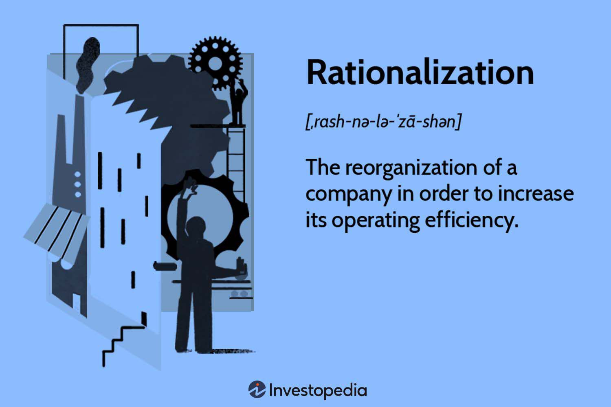

In the modern financial landscape, rationalization and algorithmic trading have emerged as pivotal concepts that redefine the way businesses and traders approach efficiency and competitiveness. Rationalization typically focuses on restructuring a company to enhance its operational efficiency by aligning resources with market demands. This process might include resizing the company, altering strategies, or introducing new policies, all aimed at improving the financial bottom line by increasing revenue and reducing costs. 

On the other hand, algorithmic trading revolutionizes financial markets by employing sophisticated computer algorithms to execute trades based on predefined rules and mathematical models. The automation of trading allows for faster and more accurate transactions, free from human error and emotional biases. This technological advancement is increasingly significant, as it accounts for a large portion of modern market trades, predominantly used by institutional investors for high-frequency trading scenarios.

Both rationalization and algorithmic trading share the common goal of optimizing operations and enhancing financial performance. Rationalization simplifies business processes and reduces inefficiencies, while algorithmic trading ensures rapid execution of trades with increased accuracy and lower transaction costs. By understanding these concepts, businesses and traders can make more informed decisions, strategically implementing these mechanisms to achieve improved operational performance and financial success. 

As businesses and financial markets continue to evolve, the integration of rationalization and algorithmic trading will play a crucial role in shaping the future of operations, pushing organizations to balance technological advancements with human elements for successful market participation.

## Table of Contents

## What is Rationalization?

Rationalization is the process by which an organization reorganizes its structure and operations to enhance efficiency and productivity. This strategic process often entails a variety of actions, including resizing the company to better fit market conditions, revising strategies to capitalize on emerging opportunities, and implementing new policies to streamline operations. By realigning resources and processes, rationalization aims to bolster revenue and reduce costs, thereby improving the overall financial health of the company.

The pursuit of operational efficiency through rationalization can manifest in several forms. Companies might downsize by reducing staff or divesting non-core business units to focus on areas with the highest growth potential. Alterations to corporate strategies may include shifting market focus, adopting new business models, or utilizing technology to automate labor-intensive processes. Additionally, introducing new policies can help eliminate redundancies and foster a more agile and responsive organizational culture.

By undertaking rationalization efforts, businesses often strive to make structural changes that align their objectives with current market demands. This might involve restructuring departments, optimizing supply chains, or improving customer service processes. The ultimate goal is to create a leaner, more competitive organization capable of adapting to rapid changes in the business environment while maximizing profitability. Through careful planning and execution, rationalization helps companies not only survive but thrive in an increasingly competitive global marketplace.

## Types of Rationalization

Rationalization in a business context encompasses various strategies aimed at enhancing operational efficiency and reducing redundancy. Two predominant forms of rationalization include product rationalization and application rationalization.

Product rationalization involves the critical assessment and management of a product's lifecycle to minimize redundancy and focus resources on strategic products that align with the company's goals. The primary aim here is to streamline the product line by identifying underperforming or obsolete products that do not contribute effectively to the company's profitability or competitive advantage. By doing so, companies can reallocate resources towards more promising opportunities, ultimately fostering innovation and improving market presence. This method requires a thorough evaluation of the product portfolio, often guided by metrics such as sales [volume](/wiki/volume-trading-strategy), profit margins, and market trends.

Application rationalization, on the other hand, targets the IT systems and applications within an organization. This approach involves reviewing and analyzing the existing IT portfolio to identify redundant, outdated, or inefficient software applications. The objective is to streamline operations and reduce costs by consolidating applications, eliminating unnecessary software, and aligning IT capabilities with business objectives. Application rationalization typically includes steps such as inventorying current applications, assessing their usage and value, and making strategic decisions on whether to retain, retire, or replace them. Successful application rationalization not only reduces maintenance costs but also enhances system interoperability and data integration.

Both product and application rationalization strive to simplify business processes by eliminating inefficiencies and focusing efforts on core, value-adding activities. Through these rationalization efforts, organizations can achieve significant improvements in operational performance and ensure that their resources are aligned with strategic business objectives.

## Advantages and Disadvantages of Rationalization

Rationalization provides numerous benefits, primarily through enhanced efficiency and increased productivity, which can contribute to improved financial performance. By focusing on modern techniques, organizations can create better working conditions that may even lead to higher wages. These improvements are often achieved through the optimization of resources, streamlining processes, and elimination of redundant tasks.

One of the main advantages of rationalization is the streamlined allocation of resources, which is achieved by identifying and eliminating inefficiencies within an organization. This can result in a more agile and responsive business structure, allowing companies to better meet market demands and capitalize on new opportunities. The adoption of cutting-edge technology and innovative practices further aids in achieving these efficiency gains.

However, rationalization is not without its challenges. One significant drawback is the potential for layoffs as firms seek to reduce costs and optimize their workforce. While this can lead to financial stability for the company, it can negatively impact employee morale and result in a reduction of workforce initiative. As employees face the fear of job insecurity, their engagement and willingness to contribute creatively can diminish.

Rationalization often incurs high implementation costs, particularly when new technologies and processes are adopted. These initial investments require careful consideration and strategic planning to ensure that they lead to long-term gains rather than immediate financial strain. Moreover, while efforts to boost efficiency can be beneficial, they may sometimes overlook the value of human capital. Employees are a vital component of any organization, and an exclusive focus on efficiency can result in a lack of attention to personal growth, skill development, and job satisfaction.

Additionally, while rationalization aims to improve returns through optimized operations, it does not always guarantee such outcomes. Market conditions, competitive pressures, and unforeseen external factors can influence the actual results of a rationalization strategy. Therefore, while the benefits of rationalization are significant, they should be weighed against the potential drawbacks to ensure responsible and balanced decision-making within organizations.

 to Algorithmic Trading

Algorithmic trading, often referred to as algo trading, employs advanced computer algorithms to conduct trading activities based on certain predefined instructions or parameters. These instructions can encompass various metrics, including timing, price, quantity, or any mathematical model. The fundamental objective is to execute trades at speeds and frequencies far superior to human capabilities.

The benefits of [algorithmic trading](/wiki/algorithmic-trading) are significant. Speed is a primary advantage, as algorithms can execute orders in just milliseconds, far surpassing the fastest human traders. This allows traders to capitalize on fleeting market opportunities before they vanish. Additionally, algorithmic trading enhances accuracy by minimizing human error, which is inevitable with manual trading. The trades are executed as precisely as they are programmed, adhering strictly to the rules without deviation.

Another major advantage of algorithmic trading is its capability to operate devoid of emotional influence. Human traders are susceptible to emotional swings, which can cloud judgment and lead to irrational trading decisions. By removing the emotional component, algo trading systems ensure decisions are consistent and rational, based solely on data and pre-established criteria.

In recent years, algorithmic trading has seen an exponential increase in popularity. It constitutes a significant portion of market trades, revolutionizing how trades are conducted. This surge is largely due to the increasing availability of sophisticated trading software and powerful computing capabilities. Both institutional investors and retail traders have adopted algorithmic trading extensively. For institutional investors, it enables the management of large orders efficiently without significantly impacting stock prices. Retail traders, on the other hand, leverage algorithmic trading in high-frequency trading ([HFT](/wiki/high-frequency-trading-strategies)) strategies, where the rapid and automated execution of trades is crucial.

The growing use of algorithms in trading is reshaping the financial markets. By allowing for complex trading strategies to be executed promptly and automatically, algorithmic trading is paving the way for innovative trading methodologies and strategies, thus driving the evolution of global financial markets.

## Advantages of Algorithmic Trading

Algorithmic trading offers several compelling advantages that have contributed to its widespread adoption in financial markets. One of the primary benefits is the incredible speed at which algorithms can execute trades. Unlike traditional trading methods that rely on manual inputs, algorithms can process data and execute orders in fractions of a second. This ability to act quickly allows traders to capitalize on fleeting opportunities that might be missed in manual trading.

In addition to speed, algorithmic trading enables high accuracy in trade execution. By following predefined rules and parameters, algorithms minimize the risk of human error, ensuring consistency and precision in trading activities. The removal of human intervention reduces the possibility of mistakes related to order execution, such as placing incorrect trades or misjudging market trends.

Another significant advantage of algorithmic trading is the elimination of emotional biases, which can often cloud judgment and lead to irrational decision-making in trading. Algorithms operate based on logic and statistical models, ensuring that trades are made according to set strategies rather than emotional reactions to market fluctuations. This rational approach can lead to more consistent and reliable trading outcomes.

Furthermore, algorithmic trading can result in lower transaction costs. Automated trading systems are often programmed to optimize trade execution strategies, reducing the market impact and transaction fees associated with large trades. By executing trades efficiently and potentially in smaller batches, algorithms can minimize the spread and other costs that can arise in less efficient trading environments.

Lastly, the use of algorithmic trading contributes to increased market [liquidity](/wiki/liquidity-risk-premium). As algorithms are able to execute numerous trades rapidly and simultaneously, they provide constant market activity, which can enhance liquidity. This increased liquidity is beneficial to all market participants as it facilitates smoother trading operations and tighter bid-ask spreads, making it easier to enter and [exit](/wiki/exit-strategy) positions without substantial price changes.

Collectively, these advantages highlight the transformative impact of algorithmic trading on modern financial markets, making it an essential tool for both institutional and retail traders seeking to optimize their trading performance.

## Disadvantages of Algorithmic Trading

Algorithmic trading, while offering significant advantages, comes with its own set of disadvantages that warrant careful consideration. One of the primary concerns is the heavy reliance on technology. Since algorithms execute trades with minimal human intervention, they are prone to technical glitches and system failures. These glitches can result in significant financial losses if not promptly detected and mitigated. For instance, a malfunctioning algorithm may continuously execute incorrect trades, leading to unintended market positions.

The initial setup costs of algorithmic trading can be prohibitively high. Developing robust algorithms requires sophisticated computing infrastructure and specialized programming expertise. Traders often need to invest in high-speed internet connections, advanced software, and powerful hardware to ensure that trades are executed efficiently and accurately. Additionally, the complexity of developing and maintaining these systems requires hiring skilled professionals, further escalating costs.

Regulatory challenges present another significant hurdle for algorithmic traders. The highly automated nature of algo trading raises concerns with financial regulators regarding fair market practices, transparency, and systemic risk. Traders must ensure that their algorithms comply with the ever-evolving regulatory frameworks of the markets in which they operate. This often necessitates regular audits and updates to the trading algorithms, adding to the operational burden and cost.

Market manipulation and flash crashes are also major risks associated with algorithmic trading. Due to the high-speed execution of trades, algorithms can inadvertently contribute to market [volatility](/wiki/volatility-trading-strategies). In some cases, malicious actors may design algorithms to manipulate prices, creating artificial demand or supply. Furthermore, rapid automatic trading can lead to flash crashes, where the market experiences a precipitous drop in value within a very short time. These crashes are often exacerbated by the cascading effect of multiple algorithms triggering sell orders simultaneously.

In conclusion, while algorithmic trading offers efficiency and speed, it is fraught with challenges, including technological vulnerabilities, high setup costs, regulatory compliance issues, and the potential for market disruption. Traders must navigate these disadvantages carefully to leverage the benefits of algorithmic trading effectively.

## Conclusion

Both rationalization and algorithmic trading are integral to modern financial strategies, focusing on optimizing operations and enhancing efficiency. Understanding the advantages and limitations of these concepts is crucial for organizations and traders aiming to maximize their benefits. Rationalization involves restructuring processes and eliminating inefficiencies, which can lead to increased productivity and better financial outcomes. Algorithmic trading, marked by rapid execution and precision, offers substantial advantages in trading execution speed and accuracy by alleviating the influence of human emotion in decision-making processes.

Strategically implementing these concepts can significantly improve operational performance and financial success. For instance, a well-executed rationalization strategy can align a company's resources and goals with market demands, resulting in streamlined operations and cost savings. Similarly, deploying algorithmic trading methodologies can lead to lower transaction costs and higher market liquidity, both of which are advantageous for institutional investors and retail traders.

However, it is essential to balance technological advancements with human expertise. Neither rationalization nor algorithmic trading should overshadow the human elements that can provide strategic insights and adaptability. While technology can handle routine tasks efficiently, human innovation and oversight remain critical for nuanced decision-making and long-term strategy development.

As markets continue to evolve with technological advancements, these concepts will likely shape the future of trading and business operations. Staying informed about developments in rationalization techniques and algorithmic trading technology will help businesses and traders maintain a competitive edge. Embracing the interplay between technological and human factors will be key to successful participation in the ever-changing financial landscape.

## References & Further Reading

[1]: [Bergstra, J., Bardenet, R., Bengio, Y., & Kégl, B. (2011). "Algorithms for Hyper-Parameter Optimization."](https://dl.acm.org/doi/10.5555/2986459.2986743) Advances in Neural Information Processing Systems 24.

[2]: ["Advances in Financial Machine Learning"](https://www.amazon.com/Advances-Financial-Machine-Learning-Marcos/dp/1119482089) by Marcos Lopez de Prado

[3]: ["Evidence-Based Technical Analysis: Applying the Scientific Method and Statistical Inference to Trading Signals"](https://www.amazon.com/Evidence-Based-Technical-Analysis-Scientific-Statistical/dp/0470008741) by David Aronson

[4]: ["Machine Learning for Algorithmic Trading"](https://github.com/stefan-jansen/machine-learning-for-trading) by Stefan Jansen

[5]: ["Quantitative Trading: How to Build Your Own Algorithmic Trading Business"](https://www.amazon.com/Quantitative-Trading-Build-Algorithmic-Business/dp/1119800064) by Ernest P. Chan