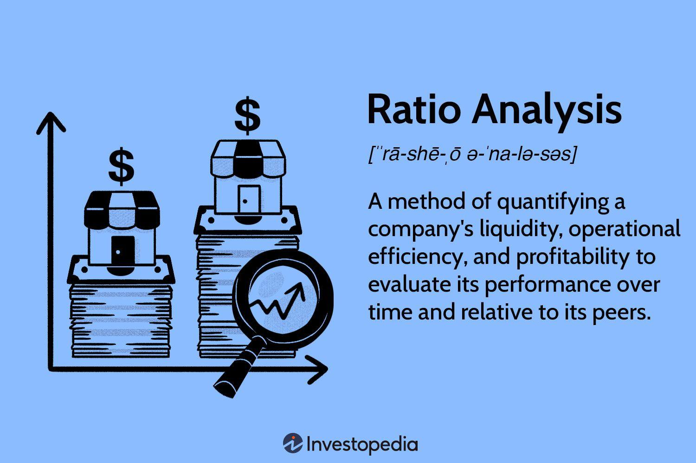

This article explores the objectives and historical examples of rationing and algorithmic trading. Both concepts have played pivotal roles in shaping the socio-economic landscape, albeit in different contexts. Rationing, traditionally employed during crises such as wars or economic downturns, has aimed to ensure equitable distribution of limited resources. This has involved governmental policies to control quantities through mechanisms like quotas and coupons, thus addressing immediate needs while striving to maintain societal balance.

On the other hand, algorithmic trading represents a technological transformation in financial markets, automating trading decisions and transactions based on complex algorithms. It aims to enhance market efficiency, improve liquidity, and reduce transaction costs, reflecting a shift from manual to electronic trading platforms. This evolution is characterized by rapid technological advancements, reshaping market operations and interactions on a global scale.

Understanding the role of rationing during economic or crisis situations provides insights into resource management strategies crucial for maintaining stability. Moreover, as algorithmic trading continues to transform financial markets, driven by continuous innovation, its impact on market dynamics, including liquidity and volatility, becomes increasingly significant.

This introductory section sets the stage for a comprehensive examination of these topics, highlighting their historical significance and contemporary relevance. By exploring the evolution and impact of rationing and algorithmic trading, we gain a nuanced understanding of their roles in past and present economic landscapes, offering lessons for future resource management and market efficiency practices.

## Table of Contents

## Understanding Rationing: Objectives and Mechanisms

Rationing is a systematic approach to distribute scarce resources equitably among a population, particularly in times of shortage. The primary objective of rationing is to ensure that essential goods and services are available to all sections of society, preventing any one group from monopolizing limited supplies. Rationing serves to stabilize society during periods of crisis by maintaining public order and preventing rapid inflation of prices due to excessive demand.

Mechanisms of rationing are diverse and have evolved over time to suit varying conditions and resources. Common approaches include quotas, coupons, and controlled prices. Quotas define the maximum amount of a resource that an individual or entity can purchase within a specified period. This approach directly controls consumption and prevents overuse. Coupons or ration stamps are often distributed to allocate specific quantities of goods to individuals or families. These serve as a personal allowance for purchasing resources, ensuring everyone receives a fair share irrespective of their purchasing power. Controlled prices, meanwhile, are imposed to prevent price gouging, where sellers might take advantage of scarcity to increase profits unreasonably.

Governmental policies play a crucial role in implementing effective rationing systems, especially during wars or economic crises. In such scenarios, governments are tasked with not only ensuring the availability of essential goods but also managing the societal impacts of shortages. For instance, during World War II, numerous countries adopted comprehensive rationing programs to support the war effort while maintaining civilian morale. These programs were characterized by meticulous planning, involving the distribution of ration [books](/wiki/algo-trading-books) and strict regulatory oversight to enforce compliance.

The role of government extends beyond merely setting rules; it also involves monitoring resource availability, forecasting demand, and mitigating potential shortfalls through strategic reserves or international trade. Effective rationing relies on balancing demand and supply dynamically to adapt to changing circumstances. This balance is achieved by continually assessing current stock levels, production capacities, and consumption rates, allowing policymakers to adjust rationing mechanisms as needed.

In conclusion, rationing is a critical tool in resource management during scarcity. By implementing structured systems such as quotas, coupons, and controlled prices, governments can ensure equitable distribution and maintain economic stability. The success of these systems is largely dependent on the careful design and execution of policies that align with the scarcity conditions and societal needs they aim to address.

## Historical Examples of Rationing

Rationing has historically been employed as a means to manage limited resources during times of crisis, ensuring equitable distribution among populations. One of the most significant instances of rationing occurred during World War II. During the war, many countries implemented strict control measures on food and fuel to support the war effort and maintain civilian morale. In the United Kingdom, ration books were issued, allowing individuals to purchase a limited amount of essential goods such as meat, sugar, butter, and gasoline. These measures were designed to prevent hoarding, control inflation, and ensure fair distribution of scarce resources.

In the United States, the Office of Price Administration (OPA) played a vital role in administering rationing programs. Gasoline was heavily rationed, partly due to the need to conserve fuel for military purposes and because of shortages caused by disrupted supply chains. The rationing system utilized coupons to limit the quantity of goods an individual or family could purchase, balancing demand and supply effectively during a period of economic strain.

The oil crisis of the 1970s presented another example of rationing, highlighting its utility beyond wartime conditions. Triggered by geopolitical tensions, the crisis led to a stark reduction in oil supplies and skyrocketing prices. In response, several countries, including the United States, introduced gasoline rationing measures to stabilize markets and ensure essential transportation needs were met. The measures included odd-even rationing, where consumers could purchase fuel only on certain days based on their vehicle license plate numbers. This aimed to evenly distribute limited fuel supplies and reduce panic buying.

More recent instances of rationing have occurred in response to environmental and health crises. Water rationing during periods of drought has been essential in many regions to conserve water resources and prioritize critical uses. In California, for example, severe droughts have prompted restrictions on water usage for non-essential activities, enforced by regulatory agencies to protect against resource depletion.

The COVID-19 pandemic highlighted the importance of rationing medical supplies, including personal protective equipment (PPE) and ventilators. Governments and healthcare institutions implemented distribution strategies to ensure frontline workers and vulnerable populations received necessary resources. This involved prioritizing supply to critical areas and managing inventories effectively to address unprecedented global demand.

While rationing has been an effective tool in managing resources during crises, it is not without challenges. Ensuring compliance and preventing black markets has been a persistent issue. Moreover, rationing systems have to be adaptive to changing circumstances and must be supported by robust logistical and policy frameworks to be effective.

Through these historical contexts, rationing demonstrates its critical role in stabilizing markets and societies under strain. However, it requires careful planning, transparent communication, and efficient execution to address the profound challenges of resource scarcity.

## Emergence and Growth of Algorithmic Trading

Algorithmic trading refers to the use of computer algorithms to automate the process of buying and selling financial instruments in the markets. These algorithms execute trades based on pre-set criteria, allowing for swift and often complex trading actions that are beyond the capabilities of human traders alone. The primary objectives of [algorithmic trading](/wiki/algorithmic-trading) include enhancing market efficiency, reducing transaction costs, and minimizing the impact of human emotion and error in trading decisions.

Historically, trading was a manual process, labor-intensive and limited by the physical presence and cognitive capacity of human traders. The transition from manual to electronic trading began in the late 20th century with the advent of electronic communication networks (ECNs). These platforms allowed trades to be executed electronically, marking a significant shift from the traditional open outcry systems on trading floors. ECNs set the stage for the introduction of algorithmic trading by facilitating a faster, more efficient market.

Technological advancements have further propelled the growth of algorithmic trading. The development of high-speed internet and increases in computational power allowed for the processing of vast amounts of market data in real-time. Machine learning and [artificial intelligence](/wiki/ai-artificial-intelligence) have enabled algorithms to adapt and optimize trading strategies based on predictive analytics and pattern recognition. These technologies continue to drive innovation within algorithmic trading, expanding its capabilities and applications.

Moreover, the Financial Information eXchange (FIX) protocol has played a pivotal role in standardizing electronic trading communication, allowing for the seamless integration of different systems and platforms. This standardization ensures that various market participants can execute and process trades efficiently, contributing to the widespread adoption of algorithmic trading.

Algorithmic trading strategies often include [market making](/wiki/market-making), [arbitrage](/wiki/arbitrage), and [trend following](/wiki/trend-following). These strategies aim to exploit short-term market inefficiencies and [volatility](/wiki/volatility-trading-strategies) to achieve optimal trade execution. For instance, through arbitrage, algorithms can instantly identify and act upon price discrepancies across different exchanges, ensuring profit without significant risk exposure.

In conclusion, algorithmic trading has transformed modern financial markets by optimizing trade execution through technology. Its ability to enhance market efficiency and reduce transaction costs makes it an integral part of contemporary market infrastructure. As technology continues to evolve, algorithmic trading will likely play an even more significant role in shaping the dynamics of global financial markets.

## Historical Milestones in Algorithmic Trading

Algorithmic trading has undergone significant transformations since its inception, marked by technological advances and regulatory developments. Initially, the adoption of the Financial Information eXchange (FIX) protocol in the early 1990s was a pivotal moment that set the stage for the automated trading systems we see today. FIX provided a standard messaging format that enhanced communication between trading platforms and market participants, effectively reducing transaction times and costs. Its widespread adoption standardized electronic trading communications, facilitating the growth of algorithmic trading.

High-frequency trading ([HFT](/wiki/high-frequency-trading-strategies)) emerged as a dominant force in the early 2000s, characterized by ultra-fast execution speeds and the ability to execute a large number of trades in fractions of a second. HFT firms typically leverage sophisticated algorithms to exploit minute price discrepancies in markets. The consequences of HFT on market [liquidity](/wiki/liquidity-risk-premium) and volatility have been profound; while it generally increases liquidity by ensuring constant market activity, its contribution to volatility has sparked debates among economists and regulators. The increased liquidity comes from HFTs creating buy and sell orders rapidly, but this can also lead to heightened market sensitivity to large orders or sudden market shifts.

Several significant regulatory measures have been introduced to address the challenges posed by algorithmic trading. Following the 2010 Flash Crash—a dramatic market drop and rapid recovery within minutes—U.S. regulators implemented several changes such as circuit breakers to temporarily halt trading when significant market moves occur. The Securities and Exchange Commission (SEC) introduced Rule 15c3-5, also known as the "Market Access Rule," to ensure brokers implement controls to prevent erroneous trades. These steps were aimed at safeguarding market integrity and preventing systemic risks attributed to algorithmic trading.

The Flash Crash of May 6, 2010, is a landmark event in the history of algorithmic trading, underscoring the vulnerabilities of financial markets in the face of high-speed, automated trading systems. In merely 36 minutes, the Dow Jones Industrial Average plummeted nearly 1,000 points before rebounding. Investigations revealed that the crash was triggered by the automated execution of large sell orders mixed with high-frequency trading activities, leading to a liquidity vacuum. This event sharpened focus on the necessity for robust risk management strategies and the implementation of regulatory safeguards within algorithmic trading frameworks.

Overall, algorithmic trading continues to evolve, driven by advancements in technology and ongoing regulatory efforts. Each historical milestone reflects a step towards more efficient, yet complex financial markets, with ongoing discussions about the balance between innovation and the stability of financial systems.

## Comparative Analysis: Rationing vs. Algorithmic Trading

Rationing and algorithmic trading, albeit fundamentally different in their foundations, both focus on resource allocation and market efficiency, albeit in contrasting contexts. Rationing is typically used during periods of scarcity, ensuring equitable distribution of finite resources to prevent shortages and stabilize the societal status quo. Its objectives center around maintaining fairness, mitigating shortages, and managing demand through controlled distribution mechanisms such as quotas, coupons, and regulated pricing.

In contrast, algorithmic trading seeks to enhance market efficiency under conditions of resource abundance, particularly financial assets, by leveraging technology to execute trades at optimal prices. Its core objectives include minimizing transaction costs, increasing liquidity, and exploiting market inefficiencies through the use of predefined algorithms.

### Addressing Scarcity and Access

Rationing systems directly tackle scarcity by implementing controls that prevent the hoarding of limited resources and ensure they reach those in need. By imposing restrictions, such as limiting purchases or mandating equitable distribution, rationing systems aim to maintain societal balance during crises like wars or natural disasters. This method acknowledges human needs and prioritizes access based on predetermined criteria, often emphasizing fairness over market forces.

Algorithmic trading, while not addressing physical scarcity, deals with the informational inefficiencies in financial markets. By using complex algorithms to analyze and predict market movements, algorithmic trading addresses access to opportunities and capital rather than tangible goods. It allows market participants to access better liquidity and pricing but can also inadvertently exacerbate access inequalities when high-frequency trading dominates the market.

### Societal and Economic Impacts

Rationing impacts society by enforcing equality during critical times, thus preserving societal cohesion and stability. It can, however, lead to inefficiencies, corruption, and black markets if not effectively managed. Historically, rationing has been pivotal in contexts where the survival and welfare of populations depended on fair distribution, such as during World War II.

Algorithmic trading transforms markets by facilitating high-speed transactions, increasing market depth, and often improving price discovery. However, it can contribute to increased market volatility and systemic risks, as illustrated by events like the 2010 Flash Crash. While enhancing efficiency for those with access to technology, it presents challenges of fairness and regulatory oversight, sometimes overshadowing the fundamental purpose of the financial markets — to serve the broader economy.

### Lessons from Rationing for Modern Markets

Modern markets, when faced with potential scarcities such as energy or environmental resources, can learn valuable lessons from historical rationing practices. The primary takeaway is the importance of creating equitable systems that can proactively manage limited resources without resorting to drastic measures post-crisis. Moreover, developing robust regulatory frameworks that ensure transparency, limit excessive speculative behavior, and prioritize long-term stability over short-term gains parallels the lessons from rationing where policy effectiveness and fairness were crucial.

In conclusion, while rationing and algorithmic trading operate in different environments and with diverging objectives, both offer insights into managing resources and ensuring efficient market operation. Understanding their dynamics and lessons can inform contemporary policy decisions and technological advancements for sustainable resource management.

## The Future of Algorithmic Trading and Rationing

The future of algorithmic trading is poised to be shaped by several key trends and innovations, driven by the increasing complexity and dynamism of global financial markets. One major trend is the integration of artificial intelligence (AI) and [machine learning](/wiki/machine-learning), which allows for the development of sophisticated algorithms that can adapt to and predict market conditions with higher accuracy. Enhanced data analytics capabilities enable these algorithms to process vast amounts of market data in real time, leading to more informed decision-making and potentially greater market efficiency.

Additionally, the rise of quantum computing presents possible breakthroughs in algorithmic trading. Quantum computers, with their ability to solve complex problems much faster than classical computers, could revolutionize financial modeling and risk assessment. This could lead to more optimized trading strategies and a sharper competitive edge for those firms capable of harnessing this technology.

Rationing mechanisms can also play a crucial role in tackling future global challenges such as climate change and resource shortages. Advances in technology could facilitate the development of real-time monitoring systems to manage resource distribution more effectively. For instance, blockchain technology can offer transparent and tamper-proof systems that ensure fair distribution of resources by tracking inputs and outputs across supply chains. Smart contracts can automate rationing processes, reducing human error and improving efficiency.

Technological integration between algorithmic trading and resource management systems could lead to significant improvements in how commodities like energy and water are distributed across global markets. For example, predictive analytics could optimize supply chain operations, anticipating scarcity and distribution needs in advance.

The role of regulatory frameworks in overseeing these emerging systems is paramount. Robust regulations are necessary to ensure that the deployment of algorithmic trading and rationing technologies is both ethical and secure. Regulatory bodies will need to continuously update policies to match technological advancements, safeguarding against systemic risks such as market manipulation or excessive resource monopolization. The development of international standards can facilitate cooperation across borders, maximizing the benefits while mitigating potential downsides.

In conclusion, the future of algorithmic trading and rationing mechanisms will be heavily influenced by technological progress and regulatory environments. With the right balance, these tools have the potential to significantly enhance market and resource efficiencies on a global scale, addressing both financial and ecological challenges of the modern world.

## Conclusion

This article has highlighted the complex roles of rationing and algorithmic trading in economic systems, illustrating their historical and contemporary significance. Rationing has historically been a tool for equitable distribution during scarcity, ensuring essential resources are accessible in times of crisis. Its mechanisms, from controlled pricing to quotas, underscore the necessity for balance in supply and demand when resources are limited. On the other hand, algorithmic trading has revolutionized modern financial markets, driven by technological advances that improve efficiency and reduce transaction costs. Both practices reflect an ongoing adaptation to economic challenges, whether through managing physical commodities in times of scarcity or efficiently trading financial assets.

The enduring relevance of these systems is notable as they adapt to evolving market landscapes. Rationing remains a crucial strategy in managing resources during unexpected shortfalls or global crises, such as the COVID-19 pandemic. Meanwhile, algorithmic trading continues to shape financial markets, offering opportunities for innovation but also posing risks that require vigilant regulation. Both approaches necessitate informed policy-making to harness their advantages while mitigating risks. For instance, ensuring that algorithmic trading algorithms function within safe parameters without exacerbating market volatility is critical.

To navigate future challenges effectively, a deeper understanding of historical practices and their modernization is essential. Learning from past rationing efforts can inform strategies to address future global issues such as climate change and resource shortages. Simultaneously, leveraging technology to enhance both resource distribution mechanisms and market operations can provide more resilient economic systems. As such, thoughtful integration of these practices, underpinned by robust regulatory frameworks, is vital for sustainable economic progress. This comprehensive view fosters better resource management strategies that are responsive to both historical insights and future innovations.

## References & Further Reading

[1]: "Algorithmic Trading: Winning Strategies and Their Rationale" by Ernest P. Chan

[2]: "Inside the Black Box: The Simple Truth About Quantitative Trading" by Rishi K. Narang

[3]: "Flash Boys: A Wall Street Revolt" by Michael Lewis

[4]: Baker, P., & Milne, S. (1978). ["Rationing and the crisis in health care."](https://pmc.ncbi.nlm.nih.gov/articles/PMC3652808/) The New England Journal of Medicine.

[5]: Aldridge, I. (2013). ["High-Frequency Trading: A Practical Guide to Algorithmic Strategies and Trading Systems"](https://books.google.com/books/about/High_Frequency_Trading.html?id=8QpIsVUMhmEC) by Irene Aldridge