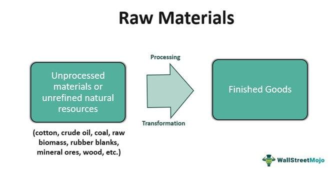

The complexity of cost accounting has been significantly amplified with the rise of algorithmic trading. This progression necessitates a more nuanced understanding of how costs are delineated and managed within any business framework. In particular, the ability to distinguish between direct and indirect costs has become more crucial than ever for effective financial management.

Direct costs in manufacturing typically pertain to expenses that are directly attributable to the creation of a product, such as raw materials. Indirect costs, on the other hand, encompass overhead expenses that support production but are not directly tied to any one product or service. These distinctions play an essential role in how businesses calculate financial metrics and, consequently, in how they strategize for operational efficiency and profitability.



In the complex landscape of algorithmic trading, direct costs might include transaction fees and costs related to data acquisition, while indirect costs could encompass software maintenance and administrative salaries. This bifurcation allows for a clearer allocation of expenses, improving the accuracy of cost forecasting and strategic budgeting.

Understanding these distinctions is critical for optimizing operations across both manufacturing and trading environments. By effectively managing and accounting for direct and indirect costs, businesses can strategically enhance their profitability. A thorough grasp of these financial principles empowers businesses, underpinning informed decision-making and better aligning operational tactics with overarching financial goals.

## Table of Contents

## Understanding Raw Materials

Raw materials serve as the fundamental inputs in the manufacturing process, and their role is indispensable in the production of finished goods. These materials are raw commodities that undergo various transformation processes to become part of the final product. The management of raw material costs is pivotal for manufacturers aiming to optimize their production efficiency and refine their pricing strategies.

Raw materials can be broadly classified into three main categories: mined, plant-based, and animal-based. Mined raw materials include minerals and metals such as iron ore, gold, and copper, which are extracted from the earth through mining processes. These materials often form the backbone of construction, electronic, and automotive industries. Plant-based raw materials are derived from vegetation and include items such as cotton, wood, and rubber. These materials are essential for sectors like textiles, paper, and furniture manufacturing. Animal-based raw materials, on the other hand, are sourced from animals and include products like leather, wool, and silk, widely used in the fashion and textile industries.

The effective management of raw material costs involves a comprehensive approach that considers various factors such as procurement, storage, and utilization in production. Companies must strategically source these materials at competitive prices while maintaining high quality to ensure that the cost of goods sold (COGS) remains manageable. Procurement strategies such as bulk purchasing, long-term contracts, and supplier diversification are commonly employed to mitigate the risks associated with price [volatility](/wiki/volatility-trading-strategies) and supply chain disruptions.

Optimization of raw material expenses also extends to inventory management. Efficient stock management systems help in reducing holding costs and minimizing wastage due to obsolescence or deterioration. Implementing technologies like Just-In-Time (JIT) inventory systems can significantly aid in aligning raw material availability with production schedules, thereby reducing excess inventory costs.

In summary, raw materials are essential for manufacturing processes, and their efficient management is crucial for reducing production costs and improving profitability. By categorizing raw materials and implementing effective cost management strategies, manufacturers can enhance their competitive edge in the market.

## Types of Raw Materials Costs

Raw materials costs are essential components in the financial reporting of manufacturing entities, categorized into two main types: direct and indirect costs. These classifications significantly impact how expenses are recorded in financial statements and influence pricing, budgeting, and strategic financial planning.

Direct materials are integral parts of the final product. They are materials that are physically incorporated into the finished goods and can be directly traced back to a specific product. For example, the wood used to create a piece of furniture, steel in the production of automobiles, or flour in the baking industry are considered direct materials. These costs are variable, fluctuating with the level of production because they are tied to the units of output. In financial statements, direct materials contribute to the calculation of the cost of goods sold (COGS), an important measure of business profitability.

The formula for calculating direct material cost is as follows:
$$
\text{Direct Material Cost} = \text{Units Produced} \times \text{Material Cost per Unit}
$$

Indirect materials, in contrast, are inputs used in the production process but do not form part of the final product. They support manufacturing operations and, although essential, cannot be directly assigned to a single product. Examples of indirect materials include lubricants for machinery, safety equipment, and cleaning supplies. These costs are generally classified under factory overheads and are treated as fixed or semi-variable costs. They are allocated across products based on a predetermined overhead rate rather than actual usage, complicating the precise tracing of these costs.

In cost accounting, the distinction between direct and indirect materials is crucial for accurate financial reporting and operational efficiency. Properly identifying and categorizing raw materials costs allow companies to optimize their production processes and maintain competitive pricing while ensuring accurate financial records and compliance with accounting standards.

## Accounting for Direct Costs

Direct costs are expenditures that can be directly attributed to the production of a specific good or service. In the context of cost accounting, these costs play a crucial role in determining the cost of goods sold (COGS) and directly impact profitability calculations. 

In the manufacturing sector, direct costs typically comprise expenses such as raw materials and labor that are directly involved in the creation of a product. For instance, in a furniture manufacturing process, the cost of wood is a direct cost because it is directly consumed in the production of a table. 

In the domain of [algorithmic trading](/wiki/algorithmic-trading), direct costs differ but adhere to the same principle of traceability. Transaction fees are among the most recognizable direct costs, as they are incurred every time a trade is executed. Similarly, data acquisition costs are vital direct expenses; trading algorithms rely on real-time market data to make informed decisions, and acquiring this data often involves subscription fees and other related costs. Other direct costs in algorithmic trading might include expenses for high-speed data feeds and exchange connection fees, all of which are essential for the execution of trades.

To optimize financial performance, accurate tracking and management of direct costs is imperative. Pricing strategies benefit significantly from this accuracy, enabling firms to set prices that not only cover costs but also yield a desired profit margin. Profitability analysis also depends on precise cost allocation to individual products or trades. This involves consistently updating cost estimates and comparing them against actual figures to identify discrepancies and areas for improvement.

Here is an example of how direct costs can be calculated using Python:

```python
# Assume we have a list of transactions and their associated direct costs.
transactions = [
    {'transaction_id': 1, 'transaction_fee': 50, 'data_acquisition_cost': 30},
    {'transaction_id': 2, 'transaction_fee': 60, 'data_acquisition_cost': 35},
    # More transactions can be added
]

# Function to calculate total direct costs
def calculate_total_direct_costs(transactions):
    total_costs = 0
    for transaction in transactions:
        total_costs += transaction['transaction_fee'] + transaction['data_acquisition_cost']
    return total_costs

# Calculate total direct costs for all transactions
total_direct_costs = calculate_total_direct_costs(transactions)
print(f"Total Direct Costs: {total_direct_costs}")
```

The need for meticulous cost tracking extends beyond pricing. It is essential for compliance with financial reporting standards where businesses are required to report their direct costs accurately. Moreover, through effective management of direct costs, businesses can achieve better financial outcomes and sustain competitive advantages in their respective markets.

## Accounting for Indirect Costs

Indirect costs, commonly grouped under the umbrella of overhead, represent expenses that cannot be directly traced to a specific product, service, or trading strategy. These costs are integral to running a business and are distributed across various operational activities. For companies engaging in algorithmic trading, the precise allocation and management of indirect costs are pivotal for financial precision and strategic planning.

Indirect costs typically include expenses such as rent, utilities, and the salaries of administrative staff. These costs are essential for maintaining a functional work environment but do not directly contribute to the production of a specific product or execution of a trading algorithm. For algorithmic trading firms, indirect costs extend to areas such as software maintenance, research and development (R&D), and the maintenance of technology infrastructure. An allocation formula often utilizes these indirect costs to distribute them across multiple products or services based on a rational basis, such as hours worked or square footage used.

In algorithmic trading, specifically, software maintenance is a significant indirect cost. This involves ensuring that trading algorithms operate optimally within existing market conditions and comply with regulatory standards. As these algorithms are software-driven, maintaining updated systems and ensuring their efficient operation necessitates continuous analysis and adjustments, leading to ongoing costs.

Moreover, research and development expenses often account for a substantial portion of indirect costs in algorithmic trading. R&D is crucial for developing innovative trading strategies and tools. It involves costs associated with data analysis, prototype development, and testing of algorithms under different market scenarios. Although these costs do not directly link to a single product or trade, they are instrumental in sustaining competitive advantage and ensuring the firm's long-term growth and profitability.

Cost accounting methods such as activity-based costing (ABC) can be employed to allocate indirect costs more accurately. ABC assigns costs to products and services based on the activities that drive these costs, providing more precise product cost information and aiding in strategic decision-making. Utilizing advanced cost allocation methods and keeping abreast of technological advancements help trading firms optimize their cost structures, improve financial performance, and comply with regulatory requirements.

In summary, managing indirect costs effectively enables businesses, including algorithmic trading firms, to make informed financial decisions, enhance operational efficiency, and sustain profitability. Through comprehensive tracking and allocation methods, companies can address the complexities of indirect costs and bolster their strategic planning capabilities.

## Role of Cost Accounting in Algorithmic Trading

Cost accounting is an indispensable tool for algorithmic trading firms, playing a crucial role in the effective management of various expenses such as technology infrastructure, transaction costs, and research and development (R&D). With the rapid advancements and competitive nature of financial markets, especially those dominated by algorithmic trading, accurate cost accounting becomes essential for achieving profitability and sustainability.

One of the primary roles of cost accounting is to provide actionable insights that facilitate the optimization of trading strategies and operations. By meticulously tracking and categorizing costs, firms can identify inefficiencies in their trading processes. For instance, a detailed analysis of transaction costs can reveal patterns or strategies that incur higher fees, allowing firms to adjust their algorithms to minimize such costs. This optimization is not only about reducing expenses but also about reallocating resources to more profitable areas, thereby improving the overall return on investment.

Cost accounting further aids in resource management concerning technology infrastructure. Algorithmic trading relies heavily on high-performance computing systems and cutting-edge software to execute trades with precision and speed. The expenses associated with maintaining and upgrading these systems can be significant. Through cost accounting, firms can ascertain the true cost-benefit ratio of technology investments, ensuring that they are allocating their budgets efficiently. This understanding helps in making informed decisions about infrastructure scaling and adoption of new technologies, ultimately leading to enhanced operational efficiency.

Moreover, detailed cost analysis plays a pivotal role in ensuring compliance with regulatory requirements. The financial industry is subject to stringent regulations that mandate detailed reporting of trading activities and associated costs. Accurate cost accounting practices enable firms to maintain comprehensive records that can withstand regulatory scrutiny. By keeping a precise account of costs, from acquisition of data to the deployment of trading strategies, firms can ensure transparency and accountability, mitigating the risks of non-compliance which can have significant financial and reputational repercussions.

In summary, cost accounting is not merely a function of reporting but a strategic component that influences decision-making in algorithmic trading. It helps firms manage their expenses effectively, optimize their operations, and comply with regulatory standards. By leveraging these insights, algorithmic trading firms can focus on enhancing their profitability and maintaining a competitive edge in a fast-evolving market landscape.

## Challenges and Solutions in Cost Accounting

Cost accounting presents several challenges, particularly in the accurate allocation of indirect costs and management of raw materials' fluctuating expenses. Indirect costs, often categorized as overheads, include expenses such as utilities, rent, and administrative salaries, which are not directly attributable to a specific product or service. Accurately allocating these costs to various products or services can be complex. Traditional methods of cost allocation, such as distributing overhead evenly across all products, can result in inaccurate cost assessments and potentially skew profitability analysis.

One effective solution for addressing these challenges is the implementation of advanced allocation methods like activity-based costing (ABC). ABC assigns costs to products and services based on the activities and resources consumed during production. This method provides more accurate cost data by identifying specific activities involved in the production process and quantifying their resource usage.

For example, in Python, the allocation of indirect costs using ABC can be illustrated with a simple script:

```python
# Example Python script for simple activity-based costing allocation

# Define activities and their cost drivers
activities = {
    'Machine Setup': 5000,
    'Quality Control': 3000,
    'Packaging': 2000
}

# Define products and the number of setups, quality checks, etc.
products = {
    'Product A': {'Machine Setup': 10, 'Quality Control': 5, 'Packaging': 20},
    'Product B': {'Machine Setup': 15, 'Quality Control': 10, 'Packaging': 10}
}

# Calculate the total cost allocation for each product
cost_allocation = {}

for product, activity_use in products.items():
    total_cost = 0
    for activity, count in activity_use.items():
        total_cost += activities[activity] * count
    cost_allocation[product] = total_cost

print(cost_allocation)
```

Such a robust cost-tracking system ensures more precise financial analysis and supports strategic decision-making.

In addition to accurately allocating indirect costs, managing the expenses of fluctuating raw materials remains a crucial challenge. Implementing real-time cost tracking and data analysis tools can significantly aid in overcoming this obstacle. These tools enable firms to monitor raw material price variations closely and make informed procurement decisions, thus minimizing the impact of erratic price changes on their financial health.

Advanced software solutions offer functionalities such as real-time analytics, predictive modeling, and automated reporting. By leveraging these technologies, businesses can not only track expenses more accurately but also forecast cost trends, allowing for timely adjustments in their operations and strategies. Adopting these advanced systems and techniques helps companies remain competitive by enhancing their cost management capabilities and improving their overall financial performance.

## Conclusion

Balancing raw material direct and indirect costs is essential for businesses engaged in both manufacturing and algorithmic trading. Proper cost accounting serves as a vital tool in this balancing act, enabling firms to meticulously track and categorize expenses. The precise identification and allocation of these costs can significantly impact a company's financial statements and overall strategic decision-making.

For manufacturing businesses, understanding the direct costs associated with raw materials, like lumber or metals, allows for accurate cost of goods sold (COGS) calculations. These calculations are crucial for setting competitive prices and achieving targeted profit margins. Conversely, recognizing indirect costs, such as maintenance supplies or factory overhead, helps ensure that all production-related expenses are accounted for, leading to more comprehensive financial analyses.

In algorithmic trading, distinguishing between direct costs, like transaction fees and data acquisition expenses, and indirect costs, such as software infrastructure or R&D for trading algorithms, is equally important. Effective cost management in this context allows for enhanced operational efficiency and profitability. By applying principles of cost accounting, trading firms can optimize their resource allocation, improving trade execution and overall financial performance.

Moreover, cost accounting frameworks support businesses in managing cash flow and strategic planning. By analyzing cost data, firms can identify areas for cost reduction, streamline operations, and enhance their competitive advantage. This systematic approach supports better budgeting and forecasting, aligning financial management practices with overall business goals.

In conclusion, the application of cost accounting principles to direct and indirect costs enables businesses across industries to enhance their financial health and operational efficiency. Through diligent cost management and strategic allocation, firms can ensure long-term sustainability and success.

## References & Further Reading

[1]: Kaplan, R. S., & Anderson, S. R. (2004). ["Time-Driven Activity-Based Costing."](https://hbr.org/2004/11/time-driven-activity-based-costing) Harvard Business Review.

[2]: Horngren, C. T., Datar, S. M., Rajan, M. V. (2012). ["Cost Accounting: A Managerial Emphasis"](https://archive.org/details/20240317_20240317_0811). Pearson.

[3]: Wild, J. J., Shaw, K. W., & Chiappetta, B. (2018). ["Financial and Managerial Accounting."](https://www.amazon.com/Financial-Managerial-Accounting-John-Wild/dp/1259726703) McGraw-Hill Education.

[4]: O'Regan, S. (2005). ["Financial Information Analysis"](https://www.taylorfrancis.com/books/mono/10.4324/9781315848372/financial-information-analysis-philip-regan). John Wiley & Sons.

[5]: Higdon, T., & Halperin, D. (2006). ["Algorithmic Trading: A Comprehensive Overview"](https://link.springer.com/book/10.1007/978-3-030-41068-1).