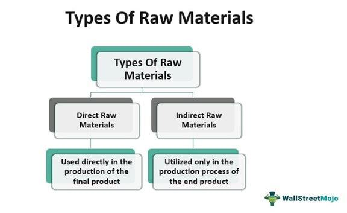

## Table of Contents

## What are raw materials in the context of automobile manufacturing?

Raw materials in automobile manufacturing are the basic substances used to create car parts and the final vehicle. These materials include metals like steel and aluminum, which are used to make the car's body and frame. Plastics and rubber are also important, as they are used for things like dashboards, seats, and tires. Glass is another raw material, used for windows and windshields.

In addition to these, other raw materials include fabrics for upholstery, and various chemicals for paints and coatings. These materials are often sourced from different places around the world and are transformed through various manufacturing processes into the components that make up a car. For example, steel might be rolled into sheets, cut, and welded to form the car's body, while plastics are molded into specific shapes for interior parts.

The choice of raw materials can affect the car's performance, safety, and environmental impact. Manufacturers must carefully select materials that meet their standards for durability, weight, and cost. As technology advances, new raw materials and methods are being developed to make cars lighter, stronger, and more eco-friendly.

## What are the most common raw materials used in car production?

In car production, the most common raw materials are steel and aluminum. Steel is used a lot because it is strong and can be shaped easily. It makes up the car's body and frame. Aluminum is also used because it is light and helps make the car more fuel-efficient. Both metals are important for making cars safe and strong.

Another common raw material is plastic. Plastic is used for many parts inside the car, like the dashboard and seats. It's also used for things like bumpers on the outside. Rubber is used too, mainly for tires, but also for seals and hoses. Glass is another important material for windows and windshields.

Lastly, fabrics are used for the car's upholstery, and various chemicals are used for paints and coatings. These materials help make the car comfortable and good-looking. All these raw materials are chosen to make sure the car is durable, safe, and affordable for people to buy.

## How do raw materials like steel and aluminum contribute to vehicle construction?

Steel and aluminum are very important for making cars. Steel is strong and can be shaped into different parts of the car, like the body and the frame. It helps keep the car safe because it can handle a lot of force. Cars need to be strong to protect people inside if there's an accident. Steel is also good because it's not too expensive, so it helps keep the cost of the car down.

Aluminum is lighter than steel, which is good for making cars that use less gas. When a car is lighter, it doesn't need as much power to move, so it can go further on less fuel. Aluminum is often used for parts like the hood and doors. Even though it's more expensive than steel, using aluminum can make the whole car lighter and more efficient. Both steel and aluminum are key materials that help make cars safe, strong, and good for the environment.

## What role do plastics and composites play in modern automobiles?

Plastics and composites are very important in modern cars. They are used for many parts inside the car, like the dashboard, seats, and door panels. Plastics are light and can be shaped into almost any form, which makes them perfect for these parts. They also help make the car lighter, which means it uses less gas. This is good for the environment and saves money on fuel.

Composites are materials made from two or more substances, like fiberglass or carbon fiber mixed with a plastic resin. They are even stronger and lighter than regular plastics. Composites are often used for parts that need to be very strong but also light, like some car body panels or parts of the engine. Using composites can make the car safer and more fuel-efficient. Both plastics and composites help make cars better in many ways.

## How are rubber and textiles utilized in car manufacturing?

Rubber is a very important material in car manufacturing. It is mostly used for making tires, which are essential for the car to move safely. Tires need to be strong and flexible to handle different road conditions. Rubber is also used for other parts like seals and hoses. Seals help keep water and air out of the car, and hoses [carry](/wiki/carry-trading) fluids like coolant and fuel. Using rubber makes these parts last longer and work well.

Textiles are used a lot inside the car. They are mainly used for making the seats and the carpets. Textiles can be made from different materials like cloth or leather, and they make the inside of the car comfortable and nice to look at. They also help with safety because they can be made to absorb energy in a crash. Textiles are important for making the car a nice place to be while driving.

## What are the sources of raw materials for automobile production?

The raw materials for making cars come from many places around the world. Steel, which is very important for car bodies and frames, is often made from iron ore. Iron ore is mined in countries like Australia, Brazil, and China. Aluminum, used for lighter parts like hoods and doors, comes from bauxite. Bauxite is mined in places like Australia, Guinea, and Jamaica. These metals are then processed and shaped into parts that can be used in cars.

Plastics and rubber are also key materials. Plastics come from oil and natural gas, which are found in many countries, including the United States, Saudi Arabia, and Russia. Rubber, used mostly for tires, comes from rubber trees grown in places like Thailand, Indonesia, and Malaysia. Textiles for car seats and carpets can be made from natural fibers like cotton, which is grown in countries like the United States, China, and India, or synthetic fibers made from oil.

Glass for car windows and windshields is made from sand, soda ash, and limestone. These materials are found in many places, but big glass-making countries include China, the United States, and Germany. Chemicals for paints and coatings come from various sources, often derived from oil and natural gas. All these raw materials are brought together from around the world to build cars that are safe, strong, and comfortable.

## How does the choice of raw materials affect the cost of manufacturing automobiles?

The choice of raw materials can really change how much it costs to make a car. Some materials, like steel, are cheaper and easy to find, so using a lot of steel can keep the cost down. But other materials, like aluminum or carbon fiber, are more expensive. If a car uses a lot of these, it will cost more to make. Also, the price of raw materials can go up and down because of things like where they come from or how hard they are to get. So, car makers have to think carefully about which materials to use to keep the cost just right.

Another thing to think about is how the materials are made into car parts. Some materials need special machines or a lot of energy to shape them, which can add to the cost. For example, making parts from plastic might be cheaper than making them from metal because plastic is easier to mold. But if the plastic needs to be very strong or heat-resistant, it might cost more. Car makers have to balance the cost of the materials with how well they work and how much people will pay for the car. This helps them make cars that are good quality but not too expensive.

## What are the environmental impacts of sourcing and using these raw materials?

Sourcing and using raw materials for cars can have big effects on the environment. Mining for metals like iron ore and bauxite can harm the land and water where it happens. It can make the air dirty and destroy places where animals live. Also, getting oil and natural gas for plastics and rubber can cause pollution and harm the climate. These activities can release gases that make the Earth warmer, which is bad for the planet.

Using these materials in cars also has environmental impacts. Making cars uses a lot of energy, which can come from burning fossil fuels and add to air pollution. When cars are old and thrown away, the materials can be hard to recycle. If they are not recycled well, they can end up in landfills and cause more pollution. But, if car makers use materials that are easier to recycle or use less harmful materials, it can be better for the environment.

## How have advancements in material science changed the raw materials used in cars?

Advances in material science have changed the raw materials used in cars a lot. Scientists have made new kinds of steel that are stronger and lighter than before. This helps cars be safer and use less gas. They've also found ways to use more aluminum in cars because it's light and strong. Now, car makers use aluminum for more parts, like the hood and doors, to make cars lighter and better for the environment.

Another big change is the use of new plastics and composites. These are made from different materials mixed together to be strong and light. For example, carbon fiber is used more now because it's very strong but doesn't weigh much. This helps make cars that are faster and use less fuel. Also, scientists have made plastics that can be recycled better, which is good for the environment. These new materials help car makers make cars that are safer, more efficient, and kinder to the planet.

## What are the challenges associated with recycling raw materials from old vehicles?

Recycling raw materials from old cars can be hard. Cars are made from many different materials like steel, aluminum, plastics, and rubber. These materials are often mixed together in ways that make them hard to separate. For example, a car door might have steel, plastic, and rubber all together. To recycle these materials, you need to take them apart, which can be a lot of work. Also, some materials, like certain plastics, are not easy to recycle because they need special processes that can be expensive.

Another challenge is that some parts of a car can be dangerous if not handled right. For example, old car batteries and fluids like oil and coolant can harm the environment if they leak out during recycling. You need special places and ways to deal with these dangerous materials safely. Also, not all recycling places have the right machines or know-how to recycle every part of a car. This means some materials might end up in landfills instead of being reused, which is not good for the environment.

## How do different manufacturers vary in their use of raw materials?

Different car makers use raw materials in different ways because they have different goals for their cars. Some makers want to make cars that are very strong and safe, so they might use a lot of steel. Other makers want to make cars that use less gas, so they use more aluminum and lighter materials like plastics and composites. Also, some car makers might choose to use more recycled materials to help the environment, while others might use new materials that are strong but more expensive.

For example, a company like Toyota might use a mix of steel and aluminum to balance safety and fuel efficiency in their cars. On the other hand, a company like Tesla might use more advanced materials like carbon fiber to make their electric cars lighter and faster. Each car maker has to think about what their customers want and what fits best with their brand. This means they might choose different raw materials to make their cars special and meet their goals.

## What future trends can we expect in the use of raw materials for automobile manufacturing?

In the future, car makers will likely use more eco-friendly materials to help the environment. They might use more recycled materials like steel and aluminum to make cars. Also, they could use new kinds of plastics that break down easier and don't harm the planet. Car makers are trying to find ways to make cars that are better for the Earth, so they might use materials that can be reused over and over again.

Another trend we might see is the use of lighter materials to make cars more efficient. Cars that weigh less use less gas or electricity, so car makers might use more aluminum and carbon fiber. These materials are strong but light, which helps cars go further on less fuel. As technology gets better, we might see even newer materials that are strong, light, and good for the environment, making cars better and safer for everyone.

## References & Further Reading

[1]: Humphries, M. (2013). *Rare Earth Elements: The Global Supply Chain*. Congressional Research Service.

[2]: ["Advances in Financial Machine Learning"](https://www.amazon.com/Advances-Financial-Machine-Learning-Marcos/dp/1119482089) by Marcos Lopez de Prado

[3]: ["Machine Learning for Algorithmic Trading"](https://github.com/stefan-jansen/machine-learning-for-trading) by Stefan Jansen

[4]: ["Quantitative Trading: How to Build Your Own Algorithmic Trading Business"](https://www.amazon.com/Quantitative-Trading-Build-Algorithmic-Business/dp/1119800064) by Ernest P. Chan

[5]: ["Evidence-Based Technical Analysis: Applying the Scientific Method and Statistical Inference to Trading Signals"](https://www.amazon.com/Evidence-Based-Technical-Analysis-Scientific-Statistical/dp/0470008741) by David Aronson