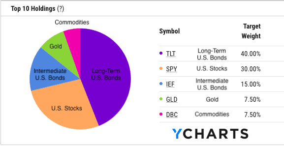

## Table of Contents

## What is Ray Dalio's All-Weather Portfolio?

Ray Dalio's All-Weather Portfolio is a type of investment strategy that aims to perform well in different economic conditions. It was created by Ray Dalio, who is the founder of Bridgewater Associates, a big investment firm. The idea behind the All-Weather Portfolio is to spread your money across different types of investments so that no matter what happens in the economy, your portfolio stays balanced and can grow over time.

The All-Weather Portfolio is made up of four main types of investments: stocks, bonds, commodities, and gold. Each type of investment reacts differently to economic changes. For example, when the economy is doing well, stocks usually do better. But when the economy is struggling, bonds and gold might do better. By putting your money into all these different types of investments, you can reduce the risk of losing money and have a chance to make money no matter what the economy is doing.

## Who is Ray Dalio and why is his portfolio strategy significant?

Ray Dalio is a famous investor and the founder of Bridgewater Associates, which is one of the world's largest hedge funds. He started the company in his apartment many years ago and turned it into a huge success. Dalio is known for his smart investment ideas and for writing a popular book called "Principles," where he shares his life lessons and how he thinks about making decisions.

His All-Weather Portfolio is significant because it helps people protect their money and still make some gains no matter what's happening in the economy. The strategy is simple to follow and can be used by anyone, not just big investors. By spreading investments across different types of assets like stocks, bonds, commodities, and gold, the All-Weather Portfolio aims to stay balanced and grow over time. This approach has made Dalio's strategy popular among people who want a safer way to invest their money.

## What are the main principles behind the All-Weather Portfolio?

The main idea behind the All-Weather Portfolio is to spread your money across different types of investments so that your money is safe no matter what happens in the economy. Ray Dalio believes that by having a mix of stocks, bonds, commodities, and gold, you can protect your money from big ups and downs. This way, if one type of investment does badly, the others might do well and balance things out. It's like having a safety net for your money.

The All-Weather Portfolio works because it takes into account that the economy goes through different cycles. Sometimes the economy grows a lot, and sometimes it slows down or even shrinks. Each type of investment reacts differently to these cycles. Stocks might do well when the economy is growing, but bonds might do better when the economy is slowing down. By putting your money in all these different types of investments, you can make sure that your portfolio stays strong no matter what the economy is doing.

## How does the All-Weather Portfolio aim to perform in different economic environments?

The All-Weather Portfolio is designed to do well no matter what the economy is doing. Ray Dalio created it to help people keep their money safe and still make some gains even if the economy is growing, slowing down, or going through a tough time. The key is to spread your money across different types of investments like stocks, bonds, commodities, and gold. Each of these investments reacts differently to changes in the economy. So, if one type of investment isn't doing well, the others might be doing better and help balance things out.

For example, when the economy is growing fast, stocks usually do really well. But if the economy starts to slow down or goes into a recession, stocks might not do as well. That's when bonds and gold can help because they often do better during tough economic times. Commodities can also be useful because they can go up in value when inflation is high. By having a bit of everything, the All-Weather Portfolio aims to stay steady and grow over time, no matter what's happening in the economy.

## What asset classes are included in the All-Weather Portfolio and their respective allocations?

The All-Weather Portfolio includes four main types of investments: stocks, bonds, commodities, and gold. Each of these investments plays a different role in keeping your money safe and growing it over time. Stocks are pieces of companies that you can buy and sell. Bonds are like loans you give to the government or companies, and they pay you back with interest. Commodities are things like oil, wheat, or metals that people use every day. Gold is a precious metal that many people see as a safe place to put their money.

In the All-Weather Portfolio, Ray Dalio suggests putting about 30% of your money in stocks, 40% in bonds, 15% in commodities, and 7.5% in gold. There's also another 7.5% that goes into other types of bonds, like inflation-protected securities. This mix is meant to balance out the ups and downs of the economy. When stocks go up, they can help your portfolio grow. When the economy is doing badly, bonds and gold can help protect your money. Commodities can be good when prices are going up. By spreading your money across these different types of investments, you can have a better chance of doing well no matter what happens in the economy.

## How does risk parity play a role in the All-Weather Portfolio?

Risk parity is a big part of how the All-Weather Portfolio works. It's all about making sure that the risk in your investments is spread out evenly. Instead of just putting most of your money in stocks, which can be really risky, Ray Dalio's strategy uses risk parity to balance the risk across different types of investments like stocks, bonds, commodities, and gold. This way, no single type of investment can hurt your portfolio too much if it does badly.

By using risk parity, the All-Weather Portfolio aims to keep your money safe and still let it grow over time. Each type of investment has its own level of risk, and risk parity makes sure that each part of your portfolio is carrying its fair share of that risk. So, even if the economy goes through different cycles, like growing, slowing down, or going into a recession, the portfolio stays balanced. This helps to protect your money and gives you a better chance of making gains no matter what's happening in the economy.

## What is the historical performance of the All-Weather Portfolio?

The All-Weather Portfolio has done pretty well over the years. Since Ray Dalio made it, it's been known for keeping money safe and still growing a bit. From 1984 to 2019, the portfolio had an average yearly return of about 7-8%. That might not sound like a lot, but it's pretty good when you think about how it did this through all sorts of economic ups and downs. The portfolio did well during times when the economy was growing and also when things were tough, like during the 2008 financial crisis.

One of the best things about the All-Weather Portfolio is how steady it is. It doesn't go up and down as much as a portfolio that's just in stocks. This makes it a good choice for people who don't want to take big risks with their money. Even though it might not make as much money as a stock-only portfolio in really good years, it also doesn't lose as much in bad years. So, over time, it can be a smart way to grow your money without too much worry.

## How can an individual investor implement the All-Weather Portfolio strategy?

To implement the All-Weather Portfolio strategy, an individual investor needs to start by figuring out how much money they want to put into each type of investment. Ray Dalio suggests putting about 30% of your money in stocks, 40% in bonds, 15% in commodities, and 7.5% in gold. The other 7.5% should go into inflation-protected securities, which are a special type of bond. You can buy these investments through a brokerage account, which is like a bank account but for buying and selling investments. You might need to use different funds or ETFs (exchange-traded funds) to get the right mix of stocks, bonds, commodities, and gold.

Once you have your money spread out the way Ray Dalio suggests, you need to keep an eye on your portfolio and make sure it stays balanced. Over time, some of your investments might grow faster than others, which can throw off the balance. You might need to sell some of the investments that have grown a lot and buy more of the ones that haven't done as well. This is called rebalancing, and it helps keep your portfolio working the way it should. By sticking to this strategy and rebalancing regularly, you can have a better chance of keeping your money safe and growing it over time, no matter what the economy is doing.

## What are the potential drawbacks or criticisms of the All-Weather Portfolio?

One of the main criticisms of the All-Weather Portfolio is that it might not make as much money as other investment strategies, especially during really good times for the economy. Because it spreads money across different types of investments, it doesn't put all its eggs in one basket like a stock-only portfolio might. This means that when stocks are doing really well, the All-Weather Portfolio might not grow as fast because it also has money in bonds, commodities, and gold, which might not be doing as well at that time.

Another potential drawback is that the All-Weather Portfolio can be a bit tricky to set up and keep balanced. You need to buy different types of investments like stocks, bonds, commodities, and gold, which might mean using different funds or ETFs. Plus, you have to keep an eye on your portfolio and rebalance it regularly to make sure it stays in line with Ray Dalio's suggested mix. This can take some time and effort, and if you don't do it right, your portfolio might not work as well as it should.

## How does the All-Weather Portfolio compare to other investment strategies like the 60/40 portfolio?

The All-Weather Portfolio and the [60/40 portfolio](/wiki/60-40-portfolio-vs-SP-500) are both ways to invest your money, but they do it a bit differently. The 60/40 portfolio is simpler because it just puts 60% of your money in stocks and 40% in bonds. This can be good when the economy is doing well because stocks usually grow a lot. But if the economy goes into a tough time, the 60/40 portfolio might lose more money because it has a lot in stocks. The All-Weather Portfolio, on the other hand, spreads your money across stocks, bonds, commodities, and gold. This mix is meant to keep your money safer no matter what the economy is doing.

The All-Weather Portfolio might not grow as fast as the 60/40 portfolio during really good times for the economy because it doesn't have as much in stocks. But it can be better at protecting your money during bad times because it has a bit of everything. The All-Weather Portfolio needs more work to set up and keep balanced, but it can be a good choice if you want to keep your money safe and still grow it a bit over time. The 60/40 portfolio is easier to manage but might be riskier because it depends a lot on how stocks are doing.

## Can the All-Weather Portfolio be adjusted for different risk tolerances or investment goals?

Yes, the All-Weather Portfolio can be changed to fit different people's comfort with risk or what they want from their investments. If you like taking more risks and want to grow your money faster, you might want to put more money into stocks and less into bonds, commodities, and gold. This can make your portfolio grow more when the economy is doing well, but it can also lose more money if things go bad. On the other hand, if you don't like taking risks and just want to keep your money safe, you might want to put more money into bonds and less into stocks. This can help protect your money but might not grow it as fast.

You can also change the All-Weather Portfolio based on what you want to achieve with your investments. If you're saving for something in the short term, like buying a house in a few years, you might want to have more money in safer investments like bonds. But if you're saving for the long term, like for retirement, you might be okay with more risk and can put more money into stocks. By tweaking the mix of investments, you can make the All-Weather Portfolio work better for your own goals and how much risk you're willing to take.

## What advanced strategies or modifications can be applied to enhance the All-Weather Portfolio's performance?

To make the All-Weather Portfolio work even better, you can use something called leverage. Leverage means borrowing money to buy more investments than you could with just your own money. This can help your portfolio grow faster when things are going well, but it also makes it riskier because if things go bad, you could lose more money. Another way to improve the portfolio is by using what's called dynamic asset allocation. This means changing how much money you have in each type of investment based on what's happening in the economy. For example, if you think stocks are going to do really well, you might put more money into them for a while. This can help you take advantage of good times and protect your money during bad times.

Another advanced strategy is to use alternative investments. These are things like real estate, private equity, or hedge funds that aren't part of the usual mix of stocks, bonds, commodities, and gold. Adding these can help spread out your risk even more and might give you a chance to make more money. You can also think about using options or futures, which are special types of investments that let you bet on whether the price of something will go up or down. These can be risky, but if you know what you're doing, they can help you protect your money or make more from it. By using these advanced strategies, you can try to make the All-Weather Portfolio work even better for you, but remember that they also come with more risk.

## What is the All Weather Portfolio and how does it work?

The All Weather Portfolio (AWP) is designed to maintain consistent performance across various economic scenarios, such as inflation, deflation, and stagflation. This investment strategy achieves stability by incorporating a diversified mix of asset classes: stocks, bonds, and commodities. 

The typical allocation for the AWP is structured as follows: 30% stocks, 55% bonds, and 15% commodities. This allocation formula is instrumental in balancing potential returns with minimal risk exposure. Stocks provide potential growth and traditionally higher returns, albeit with increased volatility. Bonds contribute stability and income, cushioned against stock market fluctuations. Commodities serve as a hedge against inflation, offering diversification unmatched by the typically higher correlation between stocks and bonds.

Essential to the All Weather Portfolio is its foundation in risk parity principles. Unlike traditional portfolios where allocations are made based on capital, risk parity allocates assets based on their risk contributions. This method aims to equalize the risk each asset class contributes to the total portfolio risk. By applying risk parity, the AWP seeks to mitigate the disproportionate impact of any single asset class on the entire portfolio's [volatility](/wiki/volatility-trading-strategies), thereby striving for steadier performance.

The mathematical approach to risk parity involves calculating the risk weight of each asset class and adjusting the portfolio such that each class contributes equally to the portfolio's total risk. Suppose $w_i$ is the weight of asset $i$ in the portfolio, and $\sigma_i$ is the standard deviation (risk) of asset $i$, while $\rho_{ij}$ is the correlation between assets $i$ and $j$. The goal is to satisfy:

$$
w_i \cdot \sigma_i = w_j \cdot \sigma_j
$$

for all assets $i$ and $j$. This equation illustrates that the risk contribution of asset $i$ should match that of asset $j$, ensuring equal risk distribution.

The application of such equity in risk distribution enables the AWP to perform resiliently across diverse economic conditions, aiming for lower volatility and drawdowns compared to more traditional asset allocations that might concentrate risk. This balanced approach aligns with the strategic objective of the All Weather Portfolio: achieving long-term financial stability through disciplined diversification.

## What is an All Weather Portfolio in Algorithmic Trading?

Algorithmic trading enables the automation of the All Weather Portfolio (AWP) strategy by configuring predetermined portfolio allocations and adapting to varying market conditions without manual intervention. This approach leverages algorithms to dynamically adjust asset allocations based on predefined criteria and market inputs, ensuring that the portfolio remains aligned with its strategic asset allocation targets such as those outlined in the AWP.

Algorithms utilize historical data and [backtesting](/wiki/backtesting), which involve simulating the portfolio's performance using past data, to refine and optimize the target asset allocations. This process helps in forecasting potential returns and estimating risk metrics. By incorporating backtesting, algorithms can assess the impact of market conditions on the portfolio and adjust their parameters to align with the desired risk-adjusted outcomes. A typical formulation used here might involve calculating the expected return, $\mu$, and standard deviation, $\sigma$, of the portfolio:

$$
\text{Expected Return} = \sum (w_i \cdot r_i)
$$

$$
\text{Portfolio Variance} = \sum (w_i^2 \cdot \sigma_i^2 + \sum_{i \neq j} w_i \cdot w_j \cdot \sigma_i \cdot \sigma_j \cdot \rho_{i,j})
$$

where $w_i$ is the weight of asset $i$, $r_i$ is the return of asset $i$, $\sigma_i$ is the standard deviation of asset $i$, and $\rho_{i,j}$ is the correlation between asset $i$ and asset $j$.

Risk management algorithms are integral to [algorithmic trading](/wiki/algorithmic-trading), monitoring the portfolio's volatility and the correlations between its asset classes. These algorithms continuously analyze market data to ensure that true risk parity is achieved by automatically rebalancing the portfolio. This is aimed at equalizing the risk contribution of each asset class relative to the others, rather than their capital allocation percentages. For example, if a particular asset class becomes more volatile, the algorithm will be programmed to reduce its allocation in the portfolio to maintain the intended risk parity.

Moreover, algorithmic systems help mitigate human error by reducing the emotional bias inherent in discretionary decision-making. The automated nature of these systems ensures that investment strategies are implemented consistently, enhancing the discipline in asset allocation and rebalancing. Consequently, the AWP, through algorithmic trading, maintains a constant vigilance over market dynamics, adjusting the portfolio in accordance with the preset strategic objectives. This automation not only aids in preserving portfolio resilience and stability but also optimizes the investment process for precision and efficiency.

## References & Further Reading

[1]: Dalio, R. (2015). ["Principles: Life and Work."](https://www.amazon.com/Principles-Life-Work-Ray-Dalio/dp/1501124021) Simon & Schuster.

[2]: Dalio, R. (2017). ["Big Debt Crises."](https://www.amazon.com/Big-Debt-Crises-Ray-Dalio/dp/1732689806) Bridgewater Associates.

[3]: Ang, A. (2014). ["Asset Management: A Systematic Approach to Factor Investing."](https://academic.oup.com/book/3342) Oxford University Press.

[4]: Asness, C. S., Frazzini, A., & Pedersen, L. H. (2012). ["Leverage Aversion and Risk Parity."](https://pages.stern.nyu.edu/~lpederse/papers/LeverageAversionRP.pdf) Financial Analysts Journal, 68(1), 47-59.

[5]: ["Risk Parity Fundamentals"](https://www.taylorfrancis.com/books/mono/10.1201/b21089/risk-parity-fundamentals-edward-qian) by Edward E. Qian.

[6]: Fabozzi, F. J., & Focardi, S. M. (2010). ["The Mathematics of Financial Modeling and Investment Management."](https://www.semanticscholar.org/paper/The-Mathematics-of-Financial-Modeling-and-Focardi-Fabozzi/9ef7cbeee77cf22e2ee62cfef22f466a27aec6c8) Wiley.

[7]: Boyd, E., & Hill, J. (2018). ["Professional Automated Trading: Theory and Practice."](https://books.google.com/books/about/Professional_Automated_Trading.html?id=PUXxAAAAQBAJ) Elsevier.

[8]: ["Algorithmic Trading: Winning Strategies and Their Rationale"](https://books.google.com/books/about/Algorithmic_Trading.html?id=CIwCTVqEj4oC) by Ernie Chan.