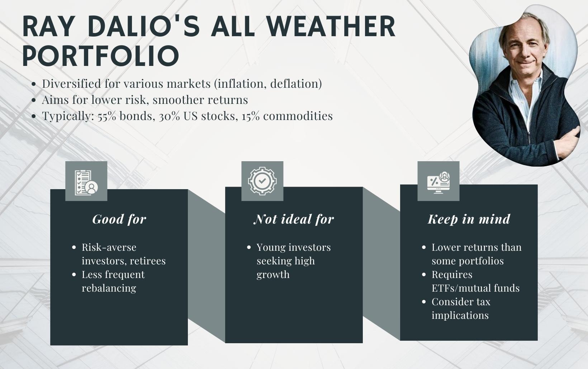

The All Weather Portfolio (AWP) is an investment strategy developed by Ray Dalio, the founder of Bridgewater Associates, with the primary objective of performing well across various economic conditions. This approach emphasizes robust diversification across asset classes to mitigate potential losses and enhance risk-adjusted returns.

AWP's core principle is to achieve a balanced exposure to different economic environments by incorporating a strategic mix of assets such as stocks, bonds, and commodities. By doing so, the portfolio aims to reduce drawdowns and maintain stability, regardless of whether the economy is experiencing inflation or deflation.



In recent years, the integration of the All Weather Portfolio into algorithmic trading has garnered significant attention. Algorithmic trading provides a systematic method for managing asset allocations and making dynamic adjustments in response to market changes. This automation enhances the portfolio's resilience, allowing for continuous adaptation to shifting economic conditions. By utilizing algorithmic approaches, investors can optimize asset allocation, improve risk management, and streamline portfolio optimization processes.

This article examines the synergy between the All Weather Portfolio and algorithmic trading, focusing on crucial elements such as asset allocation, risk management, and portfolio optimization. Through this exploration, we aim to demonstrate how combining traditional portfolio management principles with modern algorithmic techniques can offer a fortified investment strategy capable of weathering various economic climates effectively.

## Table of Contents

## Understanding the All Weather Portfolio

The All Weather Portfolio (AWP) is designed to maintain consistent performance across various economic scenarios, such as inflation, deflation, and stagflation. This investment strategy achieves stability by incorporating a diversified mix of asset classes: stocks, bonds, and commodities. 

The typical allocation for the AWP is structured as follows: 30% stocks, 55% bonds, and 15% commodities. This allocation formula is instrumental in balancing potential returns with minimal risk exposure. Stocks provide potential growth and traditionally higher returns, albeit with increased volatility. Bonds contribute stability and income, cushioned against stock market fluctuations. Commodities serve as a hedge against inflation, offering diversification unmatched by the typically higher correlation between stocks and bonds.

Essential to the All Weather Portfolio is its foundation in risk parity principles. Unlike traditional portfolios where allocations are made based on capital, risk parity allocates assets based on their risk contributions. This method aims to equalize the risk each asset class contributes to the total portfolio risk. By applying risk parity, the AWP seeks to mitigate the disproportionate impact of any single asset class on the entire portfolio's [volatility](/wiki/volatility-trading-strategies), thereby striving for steadier performance.

The mathematical approach to risk parity involves calculating the risk weight of each asset class and adjusting the portfolio such that each class contributes equally to the portfolio's total risk. Suppose $w_i$ is the weight of asset $i$ in the portfolio, and $\sigma_i$ is the standard deviation (risk) of asset $i$, while $\rho_{ij}$ is the correlation between assets $i$ and $j$. The goal is to satisfy:

$$
w_i \cdot \sigma_i = w_j \cdot \sigma_j
$$

for all assets $i$ and $j$. This equation illustrates that the risk contribution of asset $i$ should match that of asset $j$, ensuring equal risk distribution.

The application of such equity in risk distribution enables the AWP to perform resiliently across diverse economic conditions, aiming for lower volatility and drawdowns compared to more traditional asset allocations that might concentrate risk. This balanced approach aligns with the strategic objective of the All Weather Portfolio: achieving long-term financial stability through disciplined diversification.

## All Weather Portfolio in Algorithmic Trading

Algorithmic trading enables the automation of the All Weather Portfolio (AWP) strategy by configuring predetermined portfolio allocations and adapting to varying market conditions without manual intervention. This approach leverages algorithms to dynamically adjust asset allocations based on predefined criteria and market inputs, ensuring that the portfolio remains aligned with its strategic asset allocation targets such as those outlined in the AWP.

Algorithms utilize historical data and [backtesting](/wiki/backtesting), which involve simulating the portfolio's performance using past data, to refine and optimize the target asset allocations. This process helps in forecasting potential returns and estimating risk metrics. By incorporating backtesting, algorithms can assess the impact of market conditions on the portfolio and adjust their parameters to align with the desired risk-adjusted outcomes. A typical formulation used here might involve calculating the expected return, $\mu$, and standard deviation, $\sigma$, of the portfolio:

$$
\text{Expected Return} = \sum (w_i \cdot r_i)
$$

$$
\text{Portfolio Variance} = \sum (w_i^2 \cdot \sigma_i^2 + \sum_{i \neq j} w_i \cdot w_j \cdot \sigma_i \cdot \sigma_j \cdot \rho_{i,j})
$$

where $w_i$ is the weight of asset $i$, $r_i$ is the return of asset $i$, $\sigma_i$ is the standard deviation of asset $i$, and $\rho_{i,j}$ is the correlation between asset $i$ and asset $j$.

Risk management algorithms are integral to [algorithmic trading](/wiki/algorithmic-trading), monitoring the portfolio's volatility and the correlations between its asset classes. These algorithms continuously analyze market data to ensure that true risk parity is achieved by automatically rebalancing the portfolio. This is aimed at equalizing the risk contribution of each asset class relative to the others, rather than their capital allocation percentages. For example, if a particular asset class becomes more volatile, the algorithm will be programmed to reduce its allocation in the portfolio to maintain the intended risk parity.

Moreover, algorithmic systems help mitigate human error by reducing the emotional bias inherent in discretionary decision-making. The automated nature of these systems ensures that investment strategies are implemented consistently, enhancing the discipline in asset allocation and rebalancing. Consequently, the AWP, through algorithmic trading, maintains a constant vigilance over market dynamics, adjusting the portfolio in accordance with the preset strategic objectives. This automation not only aids in preserving portfolio resilience and stability but also optimizes the investment process for precision and efficiency.

## Asset Classes within the All Weather Portfolio

The All Weather Portfolio (AWP) is strategically diversified across three primary asset classes—stocks, bonds, and commodities—to balance risk and reward through different economic phases. 

### Stocks
Stocks represent the equity portion of the portfolio, typically accounting for about 30% of the total allocation. This asset class offers potentially higher returns compared to traditional savings or fixed-income investments; however, it comes with increased volatility. Stocks are sensitive to economic growth, and their value can significantly fluctuate due to market conditions, company performance, and broader economic trends.

### Bonds
Bonds, composing approximately 55% of the AWP, form the portfolio's backbone by providing stability and income. They generally exhibit lower volatility than stocks, making them a reliable counterbalance within the portfolio. Bonds tend to perform well during economic downturns or deflationary periods when stock market returns are lower. This defensive characteristic helps mitigate the overall portfolio risk.

### Commodities
Commodities account for around 15% of the portfolio's allocation and serve as a hedge against inflation. Unlike stocks and bonds, commodities like gold, oil, and agricultural products often experience price movements that are independent of the economic cycle. Their inclusion in the portfolio enhances diversification because their returns are typically uncorrelated with those of stocks and bonds. This uncorrelated nature helps stabilize the portfolio during inflationary pressures when traditional asset classes might underperform.

### Asset Class Selection
The selection of these asset classes within the All Weather Portfolio is guided by their contribution to overall portfolio balance, with a particular emphasis on minimizing correlations between them. By achieving a low correlation among the assets, the portfolio aims to maintain stability across various economic scenarios. The risk parity approach, which distributes risk rather than capital equally among asset classes, ensures that no single asset class disproportionately influences the portfolio’s performance. This strategy aligns with the portfolio’s objective of achieving consistent returns across different market conditions.

## Backtesting the All Weather Portfolio

Backtesting involves using historical data to simulate the performance of the All Weather Portfolio (AWP), allowing investors to assess potential returns and associated risks across different market environments. This critical step helps gauge the effectiveness of the AWP strategy under various economic conditions, providing insights into its performance during periods of inflation, deflation, and stagflation.

Algorithmic systems play a pivotal role in the backtesting process. They automate the simulation of the portfolio, adjusting the asset allocation based on pre-set rules tailored to emulate market reactions. By using Python or other programming languages, backtesting algorithms can analyze historical price data to refine strategy parameters, ensuring they align with the desired risk-adjusted returns.

Here is a simple Python snippet to demonstrate the backtesting process:

```python
import numpy as np
import pandas as pd

# Assuming `data` is a DataFrame with historical price data for stocks, bonds, and commodities
data = pd.read_csv("historical_data.csv", index_col='Date', parse_dates=True)

# Define asset allocation for AWP
allocations = {'stocks': 0.30, 'bonds': 0.55, 'commodities': 0.15}

# Calculate daily returns
returns = data.pct_change()

# Calculate portfolio returns
portfolio_returns = (returns * pd.Series(allocations)).sum(axis=1)

# Simulate cumulative returns
cumulative_returns = (1 + portfolio_returns).cumprod()

# Display results
print(cumulative_returns.tail())
```

This code demonstrates a basic approach to calculate portfolio returns based on historical price data. The cumulative returns provide insight into how the AWP would have performed over the chosen historical period.

Historical backtesting has shown that the All Weather Portfolio tends to exhibit lower volatility and reduced drawdowns compared to portfolios heavily weighted in stocks. This attribute makes the AWP appealing to risk-averse investors seeking more stability during market downturns. Its balanced asset allocation, designed around risk parity, ensures that risks are evenly distributed across different classes, thereby minimizing potential losses even in unfavorable market conditions.

Through backtesting, investors can better understand the potential benefits of the AWP, particularly its defensive strength. This process serves as an essential tool for optimizing the portfolio strategy, ensuring it remains aligned with long-term investment goals while adapting to changing economic circumstances.

## Implementation Challenges in Algorithmic Trading

Algorithmic trading offers significant potential for enhancing the All Weather Portfolio (AWP) by automating asset allocation and risk management. However, the implementation of such strategies is not without challenges, especially when striving to maintain a balanced and resilient investment portfolio.

Maintaining optimal asset allocations in algorithmic trading requires careful management of transaction costs and [liquidity](/wiki/liquidity-risk-premium) issues. Transaction costs can erode returns, making it crucial for trading algorithms to execute orders efficiently to minimize these expenses. Liquidity issues pose another problem, as assets in the portfolio might not be easily tradable in large volumes without impacting their prices. To address these concerns, algorithms must be designed to distribute trades over time and choose optimal execution times based on market conditions.

Using leverage in algorithmic portfolios is another area requiring prudent risk management. Leverage amplifies potential returns, but it also increases exposure to losses. To avoid overexposure, trading algorithms must incorporate robust risk management parameters, ensuring that leverage is used judiciously and aligning with the overall risk profile of the portfolio. Risk management frameworks can include stop-loss orders, volatility targeting, and dynamic rebalancing, staying responsive to shifts in market conditions.

Algorithm tuning is essential to account for market dynamics and asset correlations, which are inherently variable. Market conditions evolve, and asset correlations fluctuate due to economic shifts, geopolitical events, and other factors. Effective algorithms are those that can adapt to these changes through continuous learning and adjustment of their parameters. Incorporating [machine learning](/wiki/machine-learning) models can assist in detecting patterns and relationships in data that are not immediately obvious, thus helping to fine-tune the algorithm's decision-making process.

Continuous monitoring and refinement of algorithms are vital to ensure they remain effective under changing economic conditions. This involves regular backtesting and performance evaluation to validate the strategy's robustness. Anomaly detection can be integrated into the system to identify unexpected behaviors or deviations in algorithm performance, prompting immediate investigation and adjustment.

In Python, a basic structure to monitor and adjust an algorithm could look like this:

```python
import numpy as np
from sklearn.ensemble import RandomForestClassifier
from sklearn.model_selection import train_test_split
from sklearn.metrics import accuracy_score

# Example of adaptive algorithm trading framework
class AdaptiveTradingAlgorithm:
    def __init__(self, historical_data):
        self.historical_data = historical_data
        self.model = RandomForestClassifier()

    def train_model(self):
        X = self.historical_data.drop('Target', axis=1)
        y = self.historical_data['Target']

        X_train, X_test, y_train, y_test = train_test_split(X, y, test_size=0.2, random_state=42)
        self.model.fit(X_train, y_train)

        predictions = self.model.predict(X_test)
        print(f'Accuracy: {accuracy_score(y_test, predictions)}')

    def adjust_strategy(self, new_market_data):
        # Logic to adapt and update strategy based on new data
        # Dummy implementation for illustrative purposes
        prediction = self.model.predict(new_market_data)
        # Implement actions based on prediction

# Implementation
# historical_data should be a DataFrame containing market indicators and target signals
# new_market_data should reflect current or incoming data for real-time prediction and strategy adjustment
```

In summary, while algorithmic trading presents an efficient path for optimizing the All Weather Portfolio, it necessitates managing transaction costs, leverage, and the inherent complexity of adapting to evolving market conditions. Continuous refinement and vigilant oversight are mandatory to maintain the efficacy of the algorithmic strategies employed.

## Conclusion

The All Weather Portfolio (AWP), when integrated with algorithmic trading, provides a comprehensive strategy for achieving diversified and balanced investing. This hybrid approach is particularly beneficial for investors who prioritize risk management and long-term stability over short-term gains. While the AWP may not outperform more aggressive, stock-heavy portfolios during bullish market periods, its primary advantage is its effectiveness in minimizing losses during downturns. This is achieved through its defensive diversification, which efficiently spreads risk across various asset classes, such as stocks, bonds, and commodities.

Algorithmic trading further refines the portfolio management process by automating the key functions of maintaining balance and resilience. Algorithms can swiftly respond to changing market conditions, ensuring that the portfolio's asset allocation remains optimal. This automation reduces the potential for human error and emotional bias, two critical factors that can adversely affect investment decisions.

Moreover, investors leveraging this strategy benefit from a systematic approach that efficiently manages and adjusts portfolio components in response to economic indicators. This adaptability is crucial in navigating uncertain market environments and aligning with risk-adjusted performance goals. Overall, the combination of algorithmic trading with the All Weather Portfolio maximizes the potential for enhanced efficiency, precision, and financial stability, making it a compelling choice for investors aiming to secure their assets against varying economic conditions.

## References & Further Reading

[1]: Dalio, R. (2015). ["Principles: Life and Work."](https://www.amazon.com/Principles-Life-Work-Ray-Dalio/dp/1501124021) Simon & Schuster.

[2]: Dalio, R. (2017). ["Big Debt Crises."](https://www.amazon.com/Big-Debt-Crises-Ray-Dalio/dp/1732689806) Bridgewater Associates.

[3]: Ang, A. (2014). ["Asset Management: A Systematic Approach to Factor Investing."](https://academic.oup.com/book/3342) Oxford University Press.

[4]: Asness, C. S., Frazzini, A., & Pedersen, L. H. (2012). ["Leverage Aversion and Risk Parity."](https://pages.stern.nyu.edu/~lpederse/papers/LeverageAversionRP.pdf) Financial Analysts Journal, 68(1), 47-59.

[5]: ["Risk Parity Fundamentals"](https://www.taylorfrancis.com/books/mono/10.1201/b21089/risk-parity-fundamentals-edward-qian) by Edward E. Qian.

[6]: Fabozzi, F. J., & Focardi, S. M. (2010). ["The Mathematics of Financial Modeling and Investment Management."](https://www.semanticscholar.org/paper/The-Mathematics-of-Financial-Modeling-and-Focardi-Fabozzi/9ef7cbeee77cf22e2ee62cfef22f466a27aec6c8) Wiley.

[7]: Boyd, E., & Hill, J. (2018). ["Professional Automated Trading: Theory and Practice."](https://books.google.com/books/about/Professional_Automated_Trading.html?id=PUXxAAAAQBAJ) Elsevier.

[8]: ["Algorithmic Trading: Winning Strategies and Their Rationale"](https://books.google.com/books/about/Algorithmic_Trading.html?id=CIwCTVqEj4oC) by Ernie Chan.