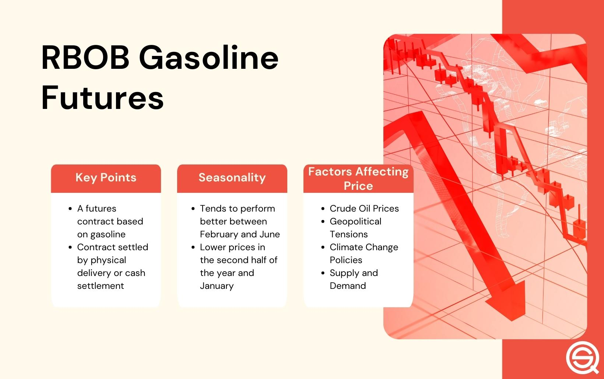

## Table of Contents

## What is RBOB gasoline?

RBOB gasoline stands for Reformulated Blendstock for Oxygenate Blending. It is a type of gasoline that is used in the United States to help reduce air pollution. RBOB is made without the oxygenate, which is a substance that adds oxygen to the fuel. This means that it needs to be mixed with an oxygenate, like ethanol, before it can be used in cars.

The main reason for using RBOB gasoline is to meet the environmental standards set by the government. These standards are meant to lower the amount of harmful emissions from cars. By using RBOB, the fuel can be adjusted to meet different regional requirements for cleaner air. This helps to make the air we breathe healthier and safer.

## Why is RBOB gasoline important in the energy market?

RBOB gasoline is important in the energy market because it helps meet environmental rules set by the government. These rules are meant to make the air cleaner by reducing harmful emissions from cars. RBOB is used across the United States, especially in areas where air pollution is a big problem. By using RBOB, energy companies can adjust the fuel to meet different local standards, making it a flexible option for cleaner air.

In the energy market, RBOB also plays a big role because it is a major part of the gasoline supply chain. It is traded on commodity markets, which means its price can affect the overall cost of gasoline. This makes RBOB an important [factor](/wiki/factor-investing) for both producers and consumers. When the price of RBOB goes up or down, it can impact the price people pay at the gas station, influencing the economy as a whole.

## How does RBOB gasoline trading work?

RBOB gasoline trading happens on big markets where people buy and sell it like other things you can trade, like stocks or gold. These markets are called commodity exchanges, and the main one for RBOB is the New York Mercantile Exchange (NYMEX). People who trade RBOB can be big companies that make or use gasoline, or they can be traders who buy and sell it to make money. They agree on a price and a time in the future when they will trade the RBOB. This is called a futures contract.

When someone wants to buy or sell RBOB, they use these futures contracts to make their deals. The price of RBOB can change every day based on things like how much gasoline people want, how much oil is available, and what's happening in the world that might affect energy prices. Traders watch these things closely to decide when to buy or sell. The trading of RBOB helps set the price of gasoline that people see at gas stations, so it's important for both the energy market and everyday people who drive cars.

## What are the basic principles of trading RBOB gasoline?

Trading RBOB gasoline follows some basic principles that help people buy and sell it. One main principle is using futures contracts. These are agreements to buy or sell RBOB at a certain price on a specific date in the future. People trade these contracts on big markets like the New York Mercantile Exchange (NYMEX). This helps set the price of gasoline and lets companies plan ahead for how much they will need and what they will pay.

Another important principle is understanding what affects RBOB prices. Things like how much oil is available, how much people want gasoline, and big world events can all change the price. Traders watch these things closely to decide when to buy or sell. If they think the price will go up, they might buy now to sell later at a higher price. If they think it will go down, they might sell now to buy back later at a lower price. This helps them make money and also helps set the price that people see at gas stations.

## What are the key factors that influence RBOB gasoline prices?

Several things can make the price of RBOB gasoline go up or down. One big factor is how much oil is available. If there's less oil, the price of RBOB can go up because oil is what they use to make gasoline. Another thing that matters is how much people want gasoline. If more people want to drive, they need more gasoline, and that can make the price go up. Big world events, like wars or natural disasters, can also change oil and gasoline prices because they might affect where oil comes from or how easy it is to get it.

Another factor is the rules about the environment. The government has rules to make the air cleaner, and RBOB helps meet these rules. Sometimes, changing these rules or making them stricter can make the price of RBOB go up because it costs more to make it the right way. Also, the cost of making RBOB, like the price of the things they use to make it, can affect the price. If these things cost more, then RBOB will cost more too.

## How can one start trading RBOB gasoline?

To start trading RBOB gasoline, you need to open an account with a broker that lets you trade on the New York Mercantile Exchange (NYMEX). This is where RBOB is traded. You can find these brokers online or through financial companies. Once you have an account, you'll need to put some money in it as a deposit, called margin. This money is there to make sure you can pay if the price of RBOB goes against you.

After setting up your account, you can start trading. You do this by buying or selling futures contracts for RBOB. A futures contract is an agreement to buy or sell RBOB at a certain price on a specific date in the future. You can use a trading platform that your broker gives you to make these trades. It's important to keep an eye on things that can change the price of RBOB, like how much oil is available, how much people want gasoline, and big world events. By watching these things, you can decide when to buy or sell to make money or to plan for your needs.

## What are common trading strategies for RBOB gasoline?

One common strategy for trading RBOB gasoline is called [trend following](/wiki/trend-following). This means watching the price of RBOB over time to see if it's going up or down. If you see the price going up, you might buy RBOB now and sell it later when the price is even higher. If you see the price going down, you might sell RBOB now and buy it back later when the price is lower. This strategy works well if the price keeps moving in one direction for a while.

Another strategy is called mean reversion. This is based on the idea that if the price of RBOB goes too high or too low, it will eventually come back to a more normal level. If you think the price is too high, you might sell RBOB now, expecting it to go down soon. If you think the price is too low, you might buy RBOB now, expecting it to go up soon. This strategy can be good if the price often goes back to the middle after big changes.

A third strategy is called spread trading. This involves trading the difference in price between two different RBOB contracts, like one for now and one for later. If you think the price difference will get smaller, you might buy the cheaper contract and sell the more expensive one. If you think the price difference will get bigger, you might do the opposite. This can be a good way to make money even if the overall price of RBOB doesn't change much.

## How do seasonal trends affect RBOB gasoline trading?

Seasonal trends can have a big impact on RBOB gasoline trading. In the summer, more people drive because of holidays and good weather. This means they need more gasoline, so the demand for RBOB goes up. Because of this, the price of RBOB can go up too. Traders watch this closely and might buy RBOB in the spring, hoping to sell it at a higher price in the summer. On the other hand, in the winter, people drive less because of cold weather and fewer holidays. This means less demand for gasoline, and the price of RBOB can go down. Traders might sell RBOB in the fall, expecting to buy it back at a lower price in the winter.

Another thing to think about is how the government changes the rules for gasoline in different seasons. In the summer, there are stricter rules to make the air cleaner. This means RBOB has to be made in a special way, which can cost more. So, the price of RBOB can go up because it's more expensive to make. Traders need to know about these rules and plan their trades around them. By understanding how the seasons affect both the demand for gasoline and the rules about making it, traders can make better decisions about when to buy and sell RBOB.

## What technical analysis tools are useful for RBOB gasoline trading?

Technical analysis tools help traders look at past prices of RBOB gasoline to guess where the price might go next. One useful tool is moving averages. These are lines on a chart that show the average price of RBOB over a certain time, like 50 days or 200 days. If the price goes above the moving average, it might mean the price will keep going up. If the price goes below the moving average, it might mean the price will keep going down. Traders use this to decide when to buy or sell.

Another helpful tool is the Relative Strength Index (RSI). This tool shows if RBOB is being bought a lot or sold a lot. The RSI goes from 0 to 100. If the RSI is over 70, it might mean RBOB is being bought too much and the price could go down soon. If the RSI is under 30, it might mean RBOB is being sold too much and the price could go up soon. Traders use the RSI to see if RBOB is overbought or oversold and make their trading decisions based on that.

## How can one manage risk when trading RBOB gasoline?

Managing risk when trading RBOB gasoline is important to avoid losing a lot of money. One way to do this is by using stop-loss orders. A stop-loss order is like a safety net. It tells your broker to sell RBOB if the price goes down to a certain level. This can help you limit how much you lose if the price goes against you. Another way to manage risk is by not putting all your money into one trade. If you spread your money across different trades, you won't lose everything if one trade goes bad.

Another good way to manage risk is by understanding the market really well. This means keeping an eye on things that can change the price of RBOB, like how much oil is available, how much people want gasoline, and big world events. By knowing these things, you can make better guesses about where the price might go next. It's also smart to start with small trades until you get the hang of it. This way, you can learn without risking too much money.

## What advanced strategies can experts use in RBOB gasoline trading?

Experts in RBOB gasoline trading can use a strategy called options trading. Options give you the right, but not the obligation, to buy or sell RBOB at a certain price before a certain time. This can be useful because it lets you make money from the price going up or down without having to buy or sell the actual RBOB. For example, if you think the price will go up, you can buy a call option. If you think the price will go down, you can buy a put option. This way, you can make money no matter which way the price moves, as long as you guess right.

Another advanced strategy is called [algorithmic trading](/wiki/algorithmic-trading). This is when you use a computer program to buy and sell RBOB based on certain rules you set. The program can look at a lot of information very quickly and make trades faster than a person can. This can be helpful because it can find small chances to make money that a person might miss. The program can also help you manage risk by automatically using stop-loss orders and other safety measures. This way, you can trade RBOB more efficiently and safely.

## How do global events and policies impact RBOB gasoline trading?

Global events and policies can have a big impact on RBOB gasoline trading. Things like wars, natural disasters, or big changes in oil-producing countries can change how much oil is available. If there's less oil because of these events, the price of RBOB can go up because oil is what they use to make gasoline. Also, if countries decide to work together to control how much oil they produce, like in the OPEC group, this can make the price of RBOB go up or down depending on what they decide. Traders need to watch these events closely to guess how the price of RBOB might change.

Government policies about the environment can also affect RBOB trading. In the United States, there are rules to make the air cleaner, and RBOB helps meet these rules. If the government changes these rules or makes them stricter, it can cost more to make RBOB the right way, which can make the price go up. Also, if other countries start making their own rules about cleaner air, it can change how much RBOB they need and how much they are willing to pay for it. Traders need to keep an eye on these policy changes to plan their trades and manage their risk.

## References & Further Reading

[1]: ["RBOB Gasoline Futures Contract Specifications"](https://www.cmegroup.com/markets/energy/refined-products/rbob-gasoline-cash-settled.contractSpecs.html) - CME Group

[2]: Lopez de Prado, Marcos (2018). ["Advances in Financial Machine Learning"](https://www.amazon.com/Advances-Financial-Machine-Learning-Marcos/dp/1119482089). Wiley.

[3]: Aronson, David (2006). ["Evidence-Based Technical Analysis: Applying the Scientific Method and Statistical Inference to Trading Signals"](https://www.amazon.com/Evidence-Based-Technical-Analysis-Scientific-Statistical/dp/0470008741). Wiley.

[4]: Chan, Ernest P. (2008). ["Quantitative Trading: How to Build Your Own Algorithmic Trading Business"](https://github.com/ftvision/quant_trading_echan_book). Wiley.

[5]: Hull, John C. (2017). ["Options, Futures, and Other Derivatives"](https://books.google.com/books/about/Options_Futures_and_Other_Derivatives_eB.html?id=2iopDwAAQBAJ). Pearson.