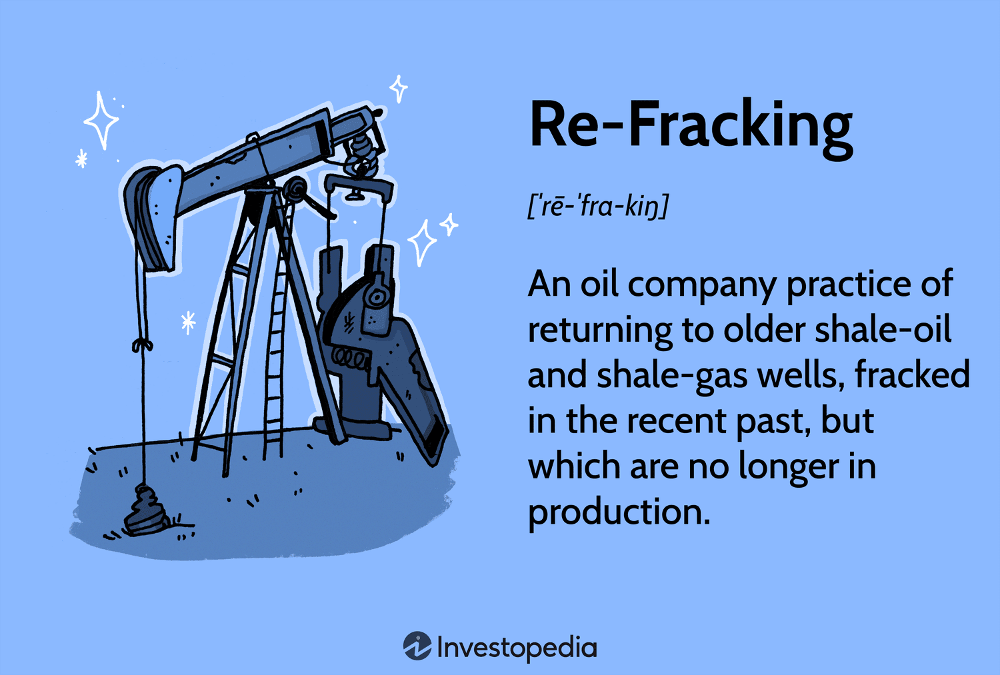

In the modern energy sector, hydraulic fracturing, commonly referred to as fracking, has become a pivotal technique for extracting oil and gas from challenging underground reservoirs. This method involves the injection of high-pressure fluid into shale rock formations to create fractures, thereby facilitating the release of hydrocarbons that were previously inaccessible. The adoption of hydraulic fracturing has significantly expanded the availability of energy resources, playing a critical role in meeting global energy demands.

Concurrently, algorithmic trading has emerged as a transformative force in financial markets. By utilizing complex algorithms to execute trades at high speeds and volumes, algorithmic trading has redefined the dynamics of how trades are conducted. This technological advancement allows for rapid responses to market changes, increasing liquidity but also introducing new layers of complexity due to its capacity to amplify market volatility.

This article explores the intersections between hydraulic fracturing, its intrinsic energy costs, advancements in re-fracking technologies, and the resultant implications on algorithmic trading. Understanding these intricate relationships provides valuable insights into both the economic benefits and the environmental challenges posed by these technologies. The interplay of fracking and algorithmic trading not only influences energy markets but also broader financial systems.

Furthermore, this discussion addresses how technological progress in hydraulic fracturing and algorithmic trading prompts crucial considerations about sustainability and systemic risks. As these fields continue to evolve, they compel stakeholders to balance economic gains with the imperative of ecological stewardship, posing challenges that necessitate comprehensive strategies and innovative solutions for sustainable development.

## Table of Contents

## Understanding Hydraulic Fracturing

Hydraulic fracturing, commonly known as fracking, is a technique deployed to extract oil and gas from shale rock formations. This method involves the injection of a high-pressure fluid mixture — predominantly water, sand, and chemicals — into subsurface rock layers. The injected fluid creates fractures in the rock, facilitating the release of hydrocarbons that were previously inaccessible. The ability to tap into these unconventional resources has significantly bolstered global energy supplies, reducing reliance on conventional oil and gas reserves.

Since its inception in the late 1940s, hydraulic fracturing has undergone considerable technological advancements. One notable enhancement is horizontal drilling, which has improved the efficacy of fracking. This technique enables operators to access larger areas of the shale layer from a single vertical wellbore, thereby increasing the [volume](/wiki/volume-trading-strategy) of recoverable resources and optimizing extraction processes.

Economically, fracking has played a substantial role in revitalizing the energy sector. It has led to the creation of numerous jobs across various industries, spurred local investments in infrastructure and services, and contributed to enhanced energy security by decreasing dependency on energy imports. The U.S. energy landscape, for example, has been transformed with increased energy exports and reduced energy prices, showcasing the economic benefits of the practice.

Despite these advantages, hydraulic fracturing remains controversial. One of the primary environmental concerns associated with fracking is the potential for groundwater contamination. The chemicals used in the fracking fluid pose a risk to water sources if not managed properly. Additionally, the process has been linked to induced seismicity or human-made earthquakes, attributed to the re-injection of wastewater into deep underground wells.

Critics argue that these environmental risks necessitate stricter regulatory oversight and improved safety practices. The balance between advancing energy needs and preserving environmental integrity is vital to ensure the sustainable use of hydraulic fracturing technologies. As the industry continues to innovate, addressing these concerns will be paramount to maintaining public trust and achieving long-term viability.

## Economic and Environmental Costs of Fracking

Fracking's resurgence, driven by technological innovations and access to previously untapped hydrocarbon reserves, has significantly lowered energy costs and bolstered energy security. However, this method of extracting oil and gas is not without its formidable environmental and economic challenges.

One major environmental impact of fracking is the risk of groundwater contamination. The high-pressure injection of fluid, used to fracture rock and release hydrocarbons, can result in the migration of hazardous chemicals into freshwater aquifers. Research has documented cases where fracking fluids and methane have seeped into drinking water sources, posing health risks to nearby communities [1]. Moreover, methane emissions, a potent greenhouse gas, are a significant byproduct of fracking operations. Methane's ability to trap heat is over 25 times greater than that of carbon dioxide over a 100-year period, contributing substantially to global climate change [2].

Fracking operations are also notorious for their high water usage. Each hydraulic fracturing operation can consume millions of gallons of water, which poses a significant burden in regions where water is scarce. The vast quantities of water, mixed with chemicals, become wastewater, which requires proper disposal to prevent environmental contamination.

To mitigate these challenges and improve efficiency, the industry has turned to re-fracking, where new technologies enhance production from existing wells. This strategy reduces the need for drilling new wells, potentially lowering overall resource consumption and cost. Although more cost-effective, re-fracking faces scrutiny regarding the persistence of environmental issues akin to those encountered in initial fracking stages.

Balancing economic gains with environmental protection remains a critical challenge. The economic benefits of fracking, such as job creation and energy independence, are considerable, yet they must be weighed against the need to protect ecosystems, public health, and address climate change. Efforts to achieve a sustainable equilibrium involve developing cleaner technologies, implementing stricter regulations on emissions, and fostering transparent monitoring systems to manage risks effectively.

To ensure economic and environmental stewardship in fracking practices, interdisciplinary collaboration between industry stakeholders, policymakers, and environmental scientists is essential. Adopting a comprehensive regulatory framework that emphasizes sustainability will be pivotal in aligning the economic benefits of fracking with the imperative of ecological conservation.

**References:**
1. Osborn, S. G., Vengosh, A., Warner, N. R., & Jackson, R. B. (2011). Methane contamination of drinking water accompanying gas-well drilling and hydraulic fracturing. *Proceedings of the National Academy of Sciences, 108*(20), 8172-8176.
2. Howarth, R. W., Santoro, R., & Ingraffea, A. (2011). Methane and the greenhouse-gas footprint of natural gas from shale formations. *Climatic Change, 106*(4), 679-690.

## Re-Fracking: Enhancements and Implications

Re-fracking, a practice gaining importance within the energy sector, involves the re-injection of fluids into older and underperforming wells, employing the latest technological advancements to enhance production. This method is increasingly considered by exploration and production companies due to its cost-effectiveness when compared to drilling new wells. By optimizing existing resources, re-fracking can significantly improve the output of established sites such as Bakken and Eagle Ford, which have already demonstrated notable increases in production following such interventions.

The core advantage of re-fracking lies in its ability to extend the life span of an oil or gas well. By utilizing updated techniques, this process maximizes resource utilization, allowing for increased efficiency and reduced operational costs. Notably, technologies such as advanced wellbore imaging and improved fracturing fluids are instrumental in identifying optimal zones for re-fracturing, leading to enhanced extraction rates and better management of reservoir pressures.

However, much like initial fracking endeavors, re-fracking carries environmental and regulatory challenges. The process can potentially lead to issues similar to those associated with traditional hydraulic fracturing, such as groundwater contamination, induced seismicity, and heightened methane emissions. Therefore, it necessitates stringent oversight and adherence to regulatory frameworks designed to mitigate adverse ecological impacts.

While re-fracking offers economic benefits and the prospect of amplified production rates, it also requires careful consideration of its environmental ramifications. As the technique continues to evolve, ongoing research and development will play a pivotal role in refining practices and minimizing ecological footprints, ensuring that the benefits of re-fracking are realized sustainably.

## Algorithmic Trading and Energy Commodities

Algorithmic trading, employing complex computational algorithms for executing trades at high speeds and volumes, has increasingly become a dominant force in today's financial markets. This transformative technology leverages advances in computer science and financial theory to optimize trades, streamline operations, and reduce transaction costs. Its application spans a broad array of financial instruments, with energy commodities emerging as significantly influenced entities, particularly in light of changes in fracking supplies.

The [volatility](/wiki/volatility-trading-strategies) of energy commodities, such as oil and natural gas, is inherently tied to the fluctuations in supply, which hydraulic fracturing has notably altered. Fracking has increased the availability of these resources, thereby impacting their market price dynamics. Algorithmic trading strategies are finely tuned to react to such supply-side changes, often using predictive modeling and real-time data analysis to forecast price movements and execute trades accordingly. This capability to respond swiftly to market signals can amplify price fluctuation phenomena, creating ripple effects across global markets.

Consider, for instance, a scenario where an unexpected increase in shale oil production is announced. Algorithmic trading systems, equipped with data analytics tools, might predict a potential decrease in oil prices due to increased supply. These systems can then automatically execute large volumes of sell orders to capitalize on anticipated market movements, which can, in turn, lead to more rapid and pronounced price declines, thus enhancing market volatility. 

The interplay between fracking supply changes and [algorithmic trading](/wiki/algorithmic-trading) strategies highlights the need for a deep understanding of market dynamics. Traders and analysts must recognize how shifts in energy production influence market behavior and, consequently, the algorithms deployed in trading. This understanding is crucial for forecasting potential market disruptions and crafting strategies that mitigate adverse impacts.

Regulatory bodies play a critical role in overseeing these activities to ensure market stability. The rapid evolution of trading technologies poses challenges in crafting regulatory frameworks that balance the benefits of such innovations with the need to protect markets from systemic risks inherent in high-frequency trading environments. Regulators face the task of developing policies that not only foster innovation but also safeguard the integrity of financial markets, especially as algorithmic trading continues to intertwine with the dynamic shifts in energy commodities propelled by fracking advancements. 

Overall, maintaining a stable trading environment in the context of energy commodities requires continuous collaboration between technologists, traders, and regulators. This collaboration aims to harness the advantages of algorithmic trading while ensuring it supports the broader goals of market sustainability and financial system resilience.

## Intersections: Fracking, Re-fracking, and Trading Algorithms

Hydraulic fracturing, commonly referred to as fracking, has significantly altered the energy markets by increasing the availability of oil and gas resources. This escalation in supply has direct consequences for commodities pricing and the underlying dynamics of trading. One of the key players in these market dynamics is algorithmic trading, which leverages advanced computing algorithms to execute trades at speeds and volumes beyond human capabilities.

Algorithmic trading substantially impacts the trading environment for energy commodities, particularly in how price fluctuations are managed and predicted. As fracking influences supply levels, trading algorithms are programmed to respond instantaneously to these market changes, often amplifying price volatility. For instance, a sudden increase in the oil supply resulting from successful fracking operations can lead algorithms to trigger a series of trades, driving down prices further due to excess supply perceptions.

Understanding how fracking’s market impacts and algorithmic strategies are integrated is crucial. In particular, market forecasts rely heavily on the ability to predict how trading algorithms will react to various supply shifts, providing traders with insights on potential price movements. For instance, consider a situation where fracking activities signal a future increase in supply. Traders need to assess how algorithmic systems will interpret these signals and adjust their strategies accordingly.

The speed at which trading algorithms process information and execute trades underscores the interconnectedness of fracking developments and market responses. These rapid responses can sometimes lead to exaggerated market reactions, posing challenges for market stability. For example, a significant output increase might trigger algorithmic trading strategies to short-sell, precipitating steep price declines, which might not align with actual market fundamentals.

Stakeholders, including traders, market analysts, and regulators, are tasked with navigating these complex interactions. Their goal is to align market activities with sustainability and economic objectives. This requires continuous monitoring and adaptation of trading strategies to ensure that they not only capture short-term gains but also adhere to long-term sustainability goals.

In conclusion, the intersection of fracking, re-fracking, and algorithmic trading intricately ties the energy markets to technological advancements in trading. While these innovations offer significant benefits in terms of market efficiency and [liquidity](/wiki/liquidity-risk-premium), they also pose challenges that need meticulous oversight to maintain market stability and align with broader sustainability objectives.

## Future Perspectives and Sustainability Challenges

Fracking and re-fracking advancements present dual challenges of harnessing economic growth and minimizing ecological footprints. As the global demand for energy increases, these technologies have the potential to substantially increase oil and gas production, boosting economic growth. However, their environmental impacts cannot be ignored. Increased investment in clean technologies is vital to mitigating these impacts. Implementing sustainable practices, such as using biodegradable fracturing fluids and improving water recycling techniques, can substantially reduce the environmental footprint. 

Algorithmic trading plays an increasingly important role, offering opportunities through the use of [artificial intelligence](/wiki/ai-artificial-intelligence) to optimize market efficiency and stability. AI-driven trading algorithms can enhance decision-making processes by analyzing vast amounts of market data in real-time, predicting trends, and executing trades more effectively. These capabilities can contribute to more efficient energy markets, reducing volatility and ensuring smoother operations.

The integration of fracking and trading technologies necessitates comprehensive regulatory frameworks to balance innovation with ecological integrity. Regulations should be developed to govern the environmental practices of energy companies, ensuring that technological advancements do not come at the expense of the environment. Similarly, in financial markets, trading algorithms should be monitored to prevent systemic risks and market manipulation.

Finally, collaborative efforts among stakeholders, including government agencies, industry leaders, environmental groups, and academia, are crucial. These collaborations can foster an environment where technological progress benefits society sustainably. This could involve initiatives such as developing industry-wide standards for best environmental practices, investing in joint research projects to explore new sustainable technologies, and engaging in public dialogue to align technological advances with societal values. By working together, stakeholders can ensure that both the energy and financial sectors evolve in a manner that supports both economic prosperity and environmental stewardship.

## Conclusion

Hydraulic fracturing and algorithmic trading represent significant technological advancements that have reshaped their respective sectors, providing substantial economic opportunities alongside considerable ecological and systemic challenges. While hydraulic fracturing has unlocked vast amounts of hydrocarbons previously deemed inaccessible, it has also stirred environmental concerns, such as groundwater contamination and seismic activity. Similarly, algorithmic trading has revolutionized financial markets, offering efficiency and speed, but also contributing to increased market volatility and complexity.

Balancing these advancements necessitates careful oversight and management to mitigate associated risks. In the energy sector, future success hinges on enhancing the efficiency of fracking technologies while addressing ecological impacts through stringent environmental regulations and innovative practices. For the financial sector, algorithmic trading requires robust risk management frameworks and regulatory oversight to maintain market stability and protect against systemic risks.

Promoting sustainable practices and implementing comprehensive regulatory measures are pivotal to maximizing technological benefits while minimizing adverse impacts. For instance, integrating clean technologies in fracking operations and leveraging artificial intelligence for more responsible trading strategies could offer pathways to sustainability.

Through informed policy and strategic practice, both the energy and trading sectors can contribute meaningfully to a sustainable and economically viable future. Collaborative efforts involving governments, industry stakeholders, and the scientific community are crucial to ensure that these technological advances are aligned with broader societal and environmental goals. Through such integrated approaches, the potential for economic growth can be harmonized with the imperative for ecological stewardship, fostering a future that is both prosperous and sustainable.

## References & Further Reading

[1]: Osborn, S. G., Vengosh, A., Warner, N. R., & Jackson, R. B. (2011). [Methane contamination of drinking water accompanying gas-well drilling and hydraulic fracturing.](https://pubmed.ncbi.nlm.nih.gov/21555547/) Proceedings of the National Academy of Sciences, 108(20), 8172-8176.

[2]: Howarth, R. W., Santoro, R., & Ingraffea, A. (2011). [Methane and the greenhouse-gas footprint of natural gas from shale formations.](https://link.springer.com/article/10.1007/s10584-011-0061-5) Climatic Change, 106(4), 679-690.

[3]: ["Algorithms for Hyper-Parameter Optimization"](https://papers.nips.cc/paper/4443-algorithms-for-hyper-parameter-optimization.pdf) by Bergstra, J., Bardenet, R., Bengio, Y., & Kégl, B. Advances in Neural Information Processing Systems 24.

[4]: Chou, K. C., & Parhamovich, E. M. (2015). [A comprehensive review of energy efficient fracking techniques and technologies: Theory and practice.](https://searchworks.stanford.edu/view/12923000) Petroleum Research, 5(1), 22-28.

[5]: ["Advances in Financial Machine Learning"](https://www.amazon.com/Advances-Financial-Machine-Learning-Marcos/dp/1119482089) by Marcos Lopez de Prado.

[6]: ["Quantitative Trading: How to Build Your Own Algorithmic Trading Business"](https://www.amazon.com/Quantitative-Trading-Build-Algorithmic-Business/dp/1119800064) by Ernest P. Chan.