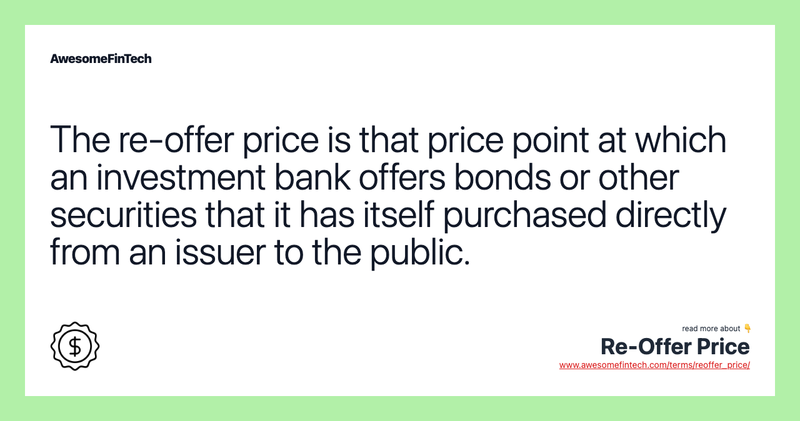

## Table of Contents

## What is a re-offer price?

A re-offer price is the price at which a security, like a bond or stock, is sold to the public after it has been initially purchased by underwriters. Underwriters are companies that help businesses sell their securities. They buy the securities from the business at a certain price and then sell them to the public at the re-offer price, which is usually higher. This difference in price is how underwriters make money.

The re-offer price is important because it helps determine how much money a business can raise from selling its securities. If the re-offer price is set too high, the securities might not sell well, and the business might not get the money it needs. If it's set too low, the business might not raise as much money as it could have. So, finding the right re-offer price is a key part of the process of selling securities.

## How does a re-offer price differ from an initial offer price?

The re-offer price and the initial offer price are two different prices in the process of selling securities like bonds or stocks. The initial offer price is the price that underwriters pay to buy the securities from the company that's selling them. This is the first price set in the process, and it's what the company gets for each security sold.

The re-offer price, on the other hand, is the price at which those same securities are then sold to the public by the underwriters. This price is usually higher than the initial offer price. The difference between these two prices is how underwriters make their profit. So, the re-offer price is important because it affects how much money the underwriters can make and how much money the company can raise from the public.

## In what scenarios is a re-offer price typically used?

A re-offer price is used when a company wants to sell securities like bonds or stocks to the public. The company works with underwriters, who are special companies that help with selling securities. The underwriters buy the securities from the company at a price called the initial offer price. Then, they sell these securities to the public at a higher price, which is the re-offer price. This difference in price is how the underwriters make their money.

This process is common in situations like when a company wants to raise money to grow its business or pay off debts. For example, if a company needs money to build a new factory, it might issue bonds. The underwriters would buy these bonds at the initial offer price and then sell them to investors at the re-offer price. The re-offer price helps determine how much money the company can raise and how much the underwriters can earn.

## Who determines the re-offer price?

The re-offer price is set by the underwriters. Underwriters are companies that help other companies sell their stocks or bonds to the public. They buy the securities at a lower price from the company and then decide on the re-offer price, which is the price they will sell those securities to the public.

Setting the re-offer price is important because it affects how much money the underwriters can make and how much money the company can raise. The underwriters think about many things when they set this price, like how much people want to buy the securities, what similar securities are selling for, and how much risk is involved. They want to make sure the price is high enough to make a good profit but not so high that people won't want to buy the securities.

## How is a re-offer price calculated?

The re-offer price is figured out by underwriters, who are like helpers that companies use to sell their stocks or bonds. The underwriters look at many things to decide on this price. They think about how much people want to buy the securities, what similar securities are selling for, and how much risk is involved. They also consider the company's financial health and the current market conditions. The goal is to set a price that is high enough to make a good profit but not so high that people won't want to buy the securities.

To come up with the re-offer price, underwriters might do some research and talk to investors to see what they think the securities are worth. They might also use special tools and models to help them figure out the best price. It's a bit like trying to find the right price for something you want to sell at a yard sale – you want to get as much money as you can, but you also want people to actually buy it. Once they have all this information, the underwriters set the re-offer price and start selling the securities to the public.

## What factors influence changes from the initial offer to the re-offer price?

The difference between the initial offer price and the re-offer price is influenced by several factors. One big [factor](/wiki/factor-investing) is how much people want to buy the securities. If lots of people are interested, the underwriters might set the re-offer price higher because they know people will still buy it. Another factor is what similar securities are selling for in the market. If other stocks or bonds are selling for a lot, the underwriters might set the re-offer price higher too.

Another important thing that affects the re-offer price is the company's financial health. If the company is doing well and making a lot of money, the underwriters might think they can sell the securities for more. Market conditions also play a big role. If the stock market is doing well, the re-offer price might be higher. But if the market is not doing so well, the underwriters might lower the re-offer price to make sure people will still buy the securities.

## Can a re-offer price be negotiated?

A re-offer price can sometimes be negotiated, but it's not very common. The underwriters set the re-offer price after looking at a lot of information, like how much people want to buy the securities and what other similar securities are selling for. They want to make sure they can sell the securities and make a profit. Because of this, they usually don't change the price much once it's set.

If someone really wants to negotiate the re-offer price, they might need to be a big investor or have a special relationship with the underwriters. Even then, it's not guaranteed that the price will change. Most of the time, people just have to decide if they want to buy the securities at the price the underwriters set.

## What are the implications of accepting a re-offer price for the buyer?

When a buyer accepts a re-offer price, they are agreeing to buy the securities, like stocks or bonds, at the price set by the underwriters. This means the buyer will pay the re-offer price, which is usually higher than the price the underwriters paid to the company. By accepting this price, the buyer is hoping that the value of the securities will go up over time, so they can make money. If the securities do well, the buyer could earn a good return on their investment. But if the securities don't do well, the buyer might lose money.

The re-offer price also affects how much the buyer has to pay upfront. If the re-offer price is high, the buyer needs more money to buy the securities. This can be a big decision because it might mean the buyer has less money to spend on other things. It's important for the buyer to think about whether they can afford the re-offer price and if they believe the securities are a good investment. If the buyer is not sure, they might want to talk to a financial advisor to help them make the best choice.

## What are the implications of accepting a re-offer price for the seller?

When a seller accepts a re-offer price, it means they agree to sell their securities to underwriters at the initial offer price. This is important because it sets the stage for how much money the company can raise from the public. The re-offer price, which is set by the underwriters, is the price the public will pay. If the re-offer price is set well, the company can raise a lot of money. This money can be used to grow the business, pay off debts, or invest in new projects. So, accepting the re-offer price is a big step for the seller because it affects how much money they can get.

The seller also needs to trust that the underwriters will do a good job selling the securities to the public at the re-offer price. If the underwriters can't sell all the securities, the company might not get all the money it was hoping for. This can be risky for the seller. But if the underwriters do a good job and the re-offer price is attractive to buyers, the company can successfully raise the funds it needs. So, the seller's decision to accept the re-offer price is crucial for their financial plans and the future of their business.

## How does market volatility affect the re-offer price?

Market [volatility](/wiki/volatility-trading-strategies) can make the re-offer price go up and down. When the market is very up and down, it can be hard for underwriters to decide on the right re-offer price. If the market is going up a lot, the underwriters might think they can set a higher re-offer price because people might be more willing to buy the securities. But if the market is going down a lot, the underwriters might lower the re-offer price to make sure people will still want to buy the securities.

This is important because the re-offer price affects how much money the company can raise. If the market is very volatile, the underwriters might be more careful and set a lower re-offer price to be safe. This means the company might not get as much money as they hoped. But if the underwriters think the market will calm down soon, they might keep the re-offer price higher, hoping to raise more money for the company. It's a tricky balance, and market volatility makes it even harder to get right.

## What are the legal considerations when setting a re-offer price?

When setting a re-offer price, underwriters need to follow the rules set by the government and other financial groups. They have to make sure the price is fair and not too high or too low. If they don't follow these rules, they could get in trouble. The rules are there to protect people who might want to buy the securities and to make sure everyone is playing fair.

One important rule is that underwriters have to tell the truth about the securities they are selling. They can't lie or leave out important information that could affect the re-offer price. If they do, they could be breaking the law. Another rule is that they have to be careful not to set the re-offer price in a way that could hurt the company or the investors. This means they need to think about the market and the company's situation when they set the price.

## How can historical data be used to predict future re-offer prices?

Historical data can help predict future re-offer prices by showing what has worked in the past. When underwriters look at old information, they can see how much people were willing to pay for similar securities before. They can also see how the market was doing at that time and if the company was doing well or not. By looking at this data, underwriters can make a guess about what might happen in the future. They might see that when the market was good, people paid more for securities, so they might set a higher re-offer price if they think the market will be good again.

But, historical data is not perfect because things can change. What worked in the past might not work the same way now. The economy might be different, or the company might be doing better or worse than before. So, underwriters need to be careful and not just rely on old data. They should also look at what is happening now and what people are saying about the future. By mixing historical data with current information, underwriters can make a better guess about what the re-offer price should be.

## What is Re-Offer Price?

Re-offer price is the price at which financial institutions, such as banks or underwriting syndicates, sell securities they have initially bought from issuers. This concept is essential in understanding the secondary market mechanisms for securities, often involving steps beyond the primary issuance. Unlike the original purchase price set during the initial offering, the re-offer price accounts for several influencing factors including accrued interest, prevailing market conditions, and any shifts in demand for the securities.

Accrued interest refers to the interest that accumulates on a bond between its last payment and the settlement of a transaction. Market changes might include variations in interest rates or shifts in investor sentiment, which can influence the pricing. Financial institutions will assess these elements to set a re-offer price that balances competitiveness with profitability. The formula to calculate the re-offer price can be represented generally as:

$$
\text{Re-offer Price} = \text{Initial Price} + \text{Accrued Interest} + \Delta \text{Market Conditions}
$$

Where $\Delta \text{Market Conditions}$ represents adjustments for changes like interest rates or security demand.

Typically, the re-offer price is set higher than the initial purchase price. This approach ensures that institutions can cover their costs and achieve a profit margin on the resale of the securities. 

For investors, understanding the nuances of re-offer pricing is crucial. It allows them to make informed decisions about when to buy or sell securities, potentially optimizing their investment outcomes by accounting for price adjustments made by institutional sellers. A comprehensive grasp of how re-offer prices are determined can enhance an investor's ability to navigate the complexities of secondary market trading effectively.

## References & Further Reading

[1]: Hull, J. (2018). ["Options, Futures, and Other Derivatives"](https://www.amazon.com/Options-Futures-Other-Derivatives-10th/dp/013447208X) (10th Edition). Pearson Education.

[2]: Hasbrouck, J. (2009). ["Trading Costs and Returns for U.S. Equities: Estimating Effective Costs from Daily Data"](https://pages.stern.nyu.edu/~jhasbrou/Research/GibbsCurrent/HasbrouckJF.pdf). The Journal of Finance, 64(6), 2871-2905.

[3]: Narang, R. (2013). ["Inside the Black Box: A Simple Guide to Quantitative and High-Frequency Trading"](https://onlinelibrary.wiley.com/doi/book/10.1002/9781118662717). Wiley.

[4]: Aldridge, I. (2013). ["High-Frequency Trading: A Practical Guide to Algorithmic Strategies and Trading Systems"](https://www.amazon.com/High-Frequency-Trading-Practical-Algorithmic-Strategies/dp/1118343506), 2nd Edition. Wiley.

[5]: Khandani, A.E., & Lo, A.W. (2011). ["What Happened To The Quants In August 2007?: Evidence from Factors and Transactions Data"](https://www.nber.org/papers/w14465). NBER Working Paper No. 14465. National Bureau of Economic Research.

[6]: Pardo, R. (2008). ["The Evaluation and Optimization of Trading Strategies"](https://onlinelibrary.wiley.com/doi/book/10.1002/9781119196969), 2nd Edition. Wiley Trading.