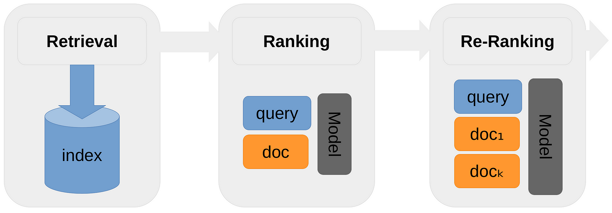

## Table of Contents

## What is re-ranking in machine learning?

Re-ranking in machine learning is a technique used to improve the accuracy of search results or recommendation systems. After an initial set of results is generated by a model, re-ranking applies another algorithm to reorder these results based on additional criteria or more complex models. This can lead to better user satisfaction because the re-ranked list often better matches what users are looking for.

For example, in a search engine, the initial results might be based on keyword matching. Then, a re-ranking model might consider user behavior data, such as click-through rates, to reorder the results. This can make the most relevant or popular items appear higher in the list. Re-ranking can be computationally expensive, but it's worth it because it can significantly improve the quality of the output.

## Why is re-ranking important in machine learning applications?

Re-ranking is important in machine learning applications because it helps make search results or recommendations better. When you first search for something or get recommendations, the computer uses a simple method to find things that match your words or interests. But this first list might not be perfect. Re-ranking comes in to fix this by using smarter ways to put the results in a better order. This makes sure that the most useful or interesting things show up at the top, which makes people happier with what they find.

For example, think about a shopping website. When you search for "shoes," the website might show you a lot of different shoes based on the words you used. But re-ranking can look at other things, like which shoes other people bought or liked, and move those shoes to the top of the list. This way, you see the shoes that are more likely to be what you want first. Re-ranking makes the shopping experience better because it uses more information to give you better results.

## What are the basic steps involved in a re-ranking process?

The first step in a re-ranking process is to get the initial results. This means using a basic method to find things that match what you are looking for. For example, if you search for "red shoes" on a website, the website will show you a list of shoes that have the words "red" and "shoes" in their descriptions. This initial list is just the starting point.

Next, the re-ranking process takes this initial list and uses more advanced methods to reorder it. These methods can look at things like how popular each item is, how often people click on it, or even what other people who searched for similar things ended up buying. The goal is to move the most relevant or interesting items to the top of the list. So, if a lot of people who searched for "red shoes" ended up buying a certain pair, those shoes would move up in the list.

By doing this, re-ranking makes the results more useful and satisfying for the user. It's like taking a rough draft and making it better. The final list of results is more likely to have what the user really wants at the top, which makes the whole experience better.

## How does re-ranking differ from traditional ranking methods?

Traditional ranking methods use simple rules to order search results or recommendations. For example, when you search for "red shoes" on a website, the website might show you shoes based on how well their descriptions match your search words. These methods are quick and easy but can miss important details like what other people liked or bought.

Re-ranking improves on this by taking the initial list from traditional methods and reordering it using more advanced rules. It looks at things like how popular items are, how often people click on them, or even what similar users ended up choosing. This makes the results more useful and satisfying because the items at the top of the list are more likely to be what you really want.

## What are some common algorithms used for re-ranking?

Some common algorithms used for re-ranking include learning to rank methods like LambdaMART and RankNet. These algorithms learn from examples of good and bad rankings to create a model that can reorder items in a way that makes the most relevant ones appear at the top. For example, LambdaMART uses gradient boosting to optimize a ranking metric, like NDCG (Normalized Discounted Cumulative Gain), which measures how good the order of items is. This helps in improving the quality of search results or recommendations by considering more than just keyword matches.

Another approach is using collaborative filtering, which looks at how users interact with items to reorder them. If many people who searched for "red shoes" ended up buying a specific pair, that pair might be moved to the top of the list. This method uses the behavior of other users to make the results more relevant. Algorithms like matrix factorization can be used to predict user preferences and adjust the ranking accordingly.

In addition, some re-ranking algorithms use contextual bandits, which learn to rank items based on user feedback in real-time. For example, if a user clicks on an item after it has been re-ranked, the algorithm can use this information to improve future rankings. This method balances exploration (trying new rankings) and exploitation (using what has worked before) to continuously refine the order of items. By using these algorithms, re-ranking can significantly enhance the user experience by providing more relevant and personalized results.

## Can you explain how re-ranking improves search engine results?

Re-ranking helps search engines give you better results by taking the first list of results and making it even better. When you search for something, the search engine starts with a simple way to find things that match your words. But this first list might not be perfect because it only looks at the words and not other important things. Re-ranking comes in and looks at more details, like how popular each result is or what other people who searched for the same thing ended up clicking on. This way, the most useful and interesting results move to the top of the list, making it easier for you to find what you're looking for.

For example, if you search for "best pizza places near me," the search engine might first show you places based on how well their names or descriptions match your search. But re-ranking can look at how many people have visited those places, what ratings they have, and even what time of day you're searching. By considering all this extra information, re-ranking can move the most popular and highly-rated pizza places to the top of your search results. This makes your search experience better because you get to see the places that are more likely to be what you want right away.

## What metrics are typically used to evaluate the performance of re-ranking models?

When people want to see how well a re-ranking model is working, they use special numbers called metrics. Some common ones are NDCG (Normalized Discounted Cumulative Gain) and MAP (Mean Average Precision). NDCG looks at how good the order of the results is. It gives higher scores when the most important results are at the top. MAP measures how many good results are in the list and how early they appear. Both of these help to see if the re-ranking is making the results better for users.

Another important metric is MRR (Mean Reciprocal Rank). This one focuses on how high up the first correct result is in the list. If the best result is at the top, MRR will be higher. There are also metrics like Precision@K and Recall@K, which look at the top K results. Precision@K checks how many of the top K results are good, while Recall@K sees how many good results are in the top K. All these metrics help to understand if the re-ranking model is doing a good job at putting the most useful results at the top of the list.

## How does re-ranking handle large datasets and maintain efficiency?

Re-ranking can be tough when you have a lot of data because it takes more time and computer power to sort through everything. But there are smart ways to make it faster. One way is to use something called "approximate nearest neighbors" algorithms. These algorithms quickly find items that are close to what you're looking for without checking every single item. Another way is to use "caching," which means saving the results of common searches so you don't have to do the same work over and over. By using these tricks, re-ranking can work well even with lots of data.

Another way to keep re-ranking efficient is by breaking down the problem into smaller pieces. You can first use a simple method to get a short list of possible results, and then apply the re-ranking only to this smaller list. This approach is called "two-stage ranking." It makes the whole process faster because you're only re-ranking a smaller number of items. Plus, you can use special computer setups like "distributed computing" to spread the work across many computers, making the re-ranking even quicker. By using these methods, re-ranking can handle big datasets without slowing down too much.

## What are the challenges faced when implementing re-ranking systems?

One big challenge when setting up re-ranking systems is that they can take a lot of time and computer power. When you have a huge amount of data, going through all of it to find the best order can be really slow. To make it faster, people use tricks like "approximate nearest neighbors" algorithms, which quickly find items that are close to what you're looking for without checking every single item. Another trick is caching, where you save the results of common searches so you don't have to do the same work again. But even with these tricks, re-ranking can still be tough to do quickly with lots of data.

Another challenge is making sure the re-ranking system works well for everyone. Different people might want different things, so the system has to be smart enough to figure out what each person likes. This means the system needs to learn from a lot of different examples and keep getting better over time. It's also hard to measure how well the system is doing because you need to use special numbers called metrics, like NDCG and MAP, to see if the results are really better. Getting these metrics right can be tricky, but it's important to know if the re-ranking is actually helping people find what they need.

Lastly, setting up a re-ranking system can be complicated because it involves a lot of different parts working together. You might need to use "two-stage ranking" where you first get a short list of possible results and then apply re-ranking only to this smaller list. This makes things faster but adds another layer of complexity. You also might need to use "distributed computing" to spread the work across many computers, which can be hard to manage. All these pieces need to fit together smoothly for the re-ranking system to work well and keep improving the search results for users.

## How can re-ranking be integrated with other machine learning techniques?

Re-ranking can work together with other [machine learning](/wiki/machine-learning) techniques to make search results or recommendations even better. For example, it can be used with "learning to rank" methods like LambdaMART or RankNet. These methods learn from examples of good and bad rankings to create a model that can reorder items. Re-ranking can take the initial list from these methods and then use more information, like how popular items are or what other users have clicked on, to make the final list even more useful. By combining re-ranking with these learning to rank methods, you get a system that keeps getting better at showing the most relevant results at the top.

Another way re-ranking can be integrated is with collaborative filtering. This technique looks at how users interact with items to predict what they might like. Re-ranking can use the predictions from collaborative filtering to reorder the list of items, making sure the ones that are most likely to be interesting to a user are at the top. For example, if many people who searched for "red shoes" ended up buying a specific pair, re-ranking can move that pair higher in the list. By working together with collaborative filtering, re-ranking can make recommendations more personalized and relevant to each user.

## What are the latest advancements in re-ranking algorithms?

The latest advancements in re-ranking algorithms focus on making them faster and more accurate. One big step forward is using neural networks, which are like super smart math formulas that can learn from data. These neural networks can look at a lot of different things at once, like what words are in a search and what other people have clicked on. This helps them put the most useful results at the top of the list. Another cool thing is using something called "[deep learning](/wiki/deep-learning) to rank," which is a fancy way of saying that the computer gets really good at figuring out the best order for search results by learning from tons of examples.

Another advancement is in handling really big datasets. People have come up with new ways to make re-ranking work quickly even when there's a lot of information. One way is using "approximate nearest neighbors" algorithms, which quickly find items that are close to what you're looking for without checking every single item. Another way is using "two-stage ranking," where the computer first makes a short list of possible results and then re-ranks just that smaller list. This makes the whole process faster and still gives good results. By using these new methods, re-ranking can be both quick and accurate, making search results better for everyone.

## How does domain-specific knowledge influence re-ranking strategies?

Domain-specific knowledge plays a big role in making re-ranking strategies better. When you know a lot about a certain topic, like medicine or cooking, you can use that information to make the search results more useful. For example, if someone searches for "heart disease symptoms," a re-ranking system with medical knowledge can put the most important and accurate information at the top of the list. This makes sure that people get the right information quickly, which is really important in fields where accuracy matters a lot.

In other areas like e-commerce, knowing about what products people usually buy together can help re-rank items. If someone is looking for a camera, the system can use knowledge about photography to suggest the best lenses or accessories that go with that camera. By using this kind of specific knowledge, re-ranking can make the results more relevant and helpful to the user, making their search experience better overall.