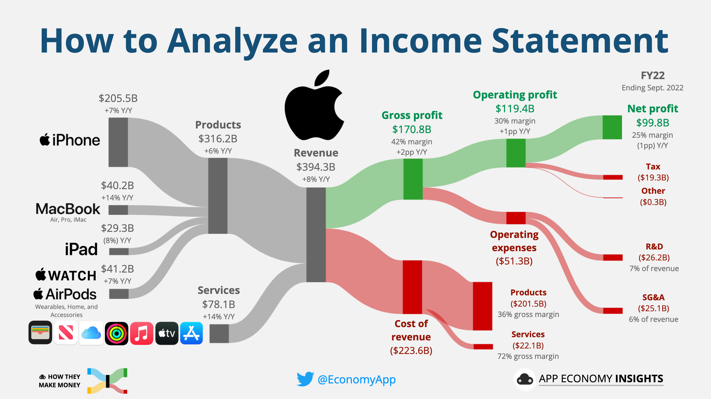

## Table of Contents

## What is an income statement?

An income statement is a financial report that shows how much money a company made and spent over a certain period, usually a year or a quarter. It starts with the money the company earned from selling its products or services, called revenue. Then, it subtracts the costs of running the business, like the cost of goods sold and operating expenses. The result is either a profit, if the company made more money than it spent, or a loss, if it spent more than it made.

The income statement is important because it helps business owners, investors, and other people understand how well a company is doing financially. By looking at the income statement, they can see if the company is making money or losing it, and how its performance is changing over time. This information can help them make decisions about investing in the company, lending it money, or managing its operations.

## What are the main components of an income statement?

The main components of an income statement are revenue, cost of goods sold, and operating expenses. Revenue is the money a company earns from selling its products or services. It's the starting point of the income statement and shows how much money the company brought in before any costs are taken out. Cost of goods sold, or COGS, is the direct cost of making or buying the products the company sells. This includes things like raw materials and labor costs. Operating expenses are the costs of running the business that aren't directly tied to making the product, like rent, utilities, and salaries for employees who aren't involved in production.

After these main components, the income statement also includes other important items like gross profit, operating income, and net income. Gross profit is what's left after subtracting the cost of goods sold from revenue. It shows how much money the company makes from its core business before other expenses are taken out. Operating income, or operating profit, is what's left after subtracting operating expenses from gross profit. It shows how much money the company makes from its operations. Finally, net income is the bottom line of the income statement. It's what's left after all expenses, including taxes and interest, are subtracted from revenue. Net income shows whether the company made a profit or a loss during the period.

## How does revenue differ from net income on an income statement?

Revenue is the total amount of money a company earns from selling its products or services. It's like the starting point on an income statement, showing how much money came into the company before any costs are taken out. Think of it as the money the company makes from its sales, before it has to pay for anything.

Net income, on the other hand, is what's left after all the costs and expenses are subtracted from the revenue. This includes the cost of making the products, operating expenses like rent and salaries, taxes, and any other costs the company has. Net income tells you if the company made a profit or a loss after everything is paid for. So, while revenue shows the total money coming in, net income shows the actual profit or loss at the end of the day.

## What is the difference between gross profit and operating profit?

Gross profit is the money a company makes after it pays for the things it needs to make its products. This is like the cost of the materials and the labor to make the product. If a company sells a toy for $20 and it costs $10 to make it, the gross profit is $10. Gross profit shows how much money the company has left from its sales before it has to pay for other things like rent and salaries.

Operating profit, on the other hand, is what's left after the company pays for all the costs of running the business, not just making the product. This includes things like rent, utilities, and salaries for people who aren't making the product. Using the toy example, if the company also has to pay $5 for rent and utilities, the operating profit would be $5 ($10 gross profit minus $5 operating expenses). Operating profit shows how much money the company makes from its main business activities after all these costs are paid.

## How can you calculate the gross profit margin from an income statement?

To calculate the gross profit margin, you need to know the gross profit and the revenue from the income statement. Gross profit is what's left after you subtract the cost of making the products from the revenue. Revenue is the total money the company gets from selling its products or services. Once you have these numbers, you can find the gross profit margin by dividing the gross profit by the revenue and then multiplying by 100 to turn it into a percentage.

For example, if a company's revenue is $100,000 and the cost of making the products is $60,000, the gross profit is $40,000 ($100,000 - $60,000). To find the gross profit margin, you divide $40,000 by $100,000, which gives you 0.4. Then, you multiply 0.4 by 100 to get a gross profit margin of 40%. This percentage tells you how much of each dollar of revenue is left after paying for the costs of making the products.

## What are operating expenses and how do they affect net income?

Operating expenses are the costs a company pays to keep its business running, but they're not directly tied to making the product. This includes things like rent for the office, salaries for employees who aren't making the product, and the cost of utilities like electricity and water. These expenses are important because they help the company do things like sell its products, manage its finances, and keep its operations going smoothly.

Operating expenses affect net income because they're subtracted from the gross profit to find the operating income. If a company has high operating expenses, it will have less money left over as operating income, which can lower the net income. For example, if a company makes $100,000 in revenue and spends $60,000 to make the product, it has a gross profit of $40,000. If it then spends $20,000 on operating expenses, the operating income is $20,000. After other costs like taxes and interest are subtracted, the net income will be even lower. So, keeping operating expenses under control can help a company have a higher net income.

## How do non-operating items impact the bottom line of an income statement?

Non-operating items are things on the income statement that don't come from the main business activities. They can include things like interest income from money the company has in the bank, interest expense from loans the company has, and gains or losses from selling things that aren't part of the main business, like a piece of land. These items are important because they affect the bottom line, or the net income, of the company.

When you add up all the money from the main business activities, you get the operating income. But to find the net income, you have to add or subtract the non-operating items. For example, if a company makes $50,000 from its main business but has to pay $5,000 in interest on a loan, the net income will be $45,000. So, non-operating items can make the net income higher or lower, depending on whether they are gains or losses.

## What is EBITDA and how is it derived from the income statement?

EBITDA stands for Earnings Before Interest, Taxes, Depreciation, and Amortization. It's a way to measure how well a company is doing by looking at its profits before taking away some costs that aren't related to the main business. These costs include interest on loans, taxes, and the wear and tear on things like machines and buildings, which is called depreciation and amortization. By looking at EBITDA, people can see how much money the company is making from its main business activities without worrying about how it's financed or how old its equipment is.

To find EBITDA from an income statement, you start with the operating income, which is the money left after paying for the costs of making and selling the products and running the business. Then, you add back the money set aside for depreciation and amortization because these are non-cash expenses that don't affect the actual money the company has right now. So, if a company's operating income is $100,000 and it has $20,000 in depreciation and amortization, its EBITDA would be $120,000. This number helps investors and business owners understand the company's performance in a simpler way.

## How can one assess a company's profitability by analyzing trends in its income statement over time?

You can assess a company's profitability by looking at its income statements over time to see if it's making more money or less. Start by looking at the revenue to see if it's going up or down. If the revenue is growing, that's a good sign because it means the company is selling more products or services. Then, check the gross profit and the gross profit margin. If these numbers are getting bigger, it means the company is keeping more money from each sale after paying for the costs of making the product. This is important because it shows how well the company is doing at its core business.

Next, look at the operating income and the operating profit margin. If these are increasing, it means the company is managing its operating expenses well and making more money from its main business activities. Finally, check the net income and the net profit margin. If these numbers are going up over time, it's a strong sign that the company is becoming more profitable. By comparing these numbers from one year to the next, you can see trends and understand if the company is getting better at making money or if it's facing challenges.

## What are some common financial ratios derived from the income statement that can help in financial analysis?

Financial ratios help you understand a company's health by looking at numbers from the income statement. One common ratio is the gross profit margin, which shows how much money is left from sales after paying for the cost of making the product. You find it by dividing the gross profit by the revenue and multiplying by 100 to get a percentage. A higher gross profit margin means the company keeps more money from each sale, which is good. Another important ratio is the operating profit margin, which tells you how much money the company makes after paying for all the costs of running the business. You calculate it by dividing the operating income by the revenue and multiplying by 100. A higher operating profit margin means the company is good at managing its operating expenses.

Another useful ratio is the net profit margin, which shows how much money the company has left after all expenses, including taxes and interest, are paid. You find it by dividing the net income by the revenue and multiplying by 100. A higher net profit margin means the company is more profitable overall. The return on sales (ROS) ratio is similar to the net profit margin and is calculated the same way. It helps you see how much profit the company makes for each dollar of sales. Finally, the earnings per share (EPS) ratio shows how much money the company makes for each share of its stock. You find it by dividing the net income by the number of shares. A higher EPS means the company is more profitable for its shareholders.

## How do adjustments for non-recurring items affect the comparability of income statements year over year?

Adjustments for non-recurring items can make it easier to compare income statements from one year to the next. Non-recurring items are things that don't happen every year, like selling a piece of land or paying for a big lawsuit. When these items are taken out of the income statement, it gives a clearer picture of how the company is doing from its regular business. This way, you can see if the company is getting better or worse at making money without being confused by one-time events.

However, if these adjustments are not done the same way every year, it can make comparing income statements harder. For example, if one year a company includes a big one-time expense and the next year it doesn't, the numbers might look very different even if the company's regular business is doing the same. So, it's important for companies to be clear about what they're adjusting and why, so people can understand the real trends in the company's performance.

## What advanced techniques can be used to forecast future income statements based on historical data?

To forecast future income statements based on historical data, one advanced technique is to use trend analysis. This means looking at how revenue, expenses, and profits have changed over the past few years and using that information to guess what might happen next. For example, if a company's revenue has been growing by 5% each year, you might predict it will keep growing at that rate. You can also look at trends in the industry or the economy to help make your predictions more accurate. By using computers and special software, you can create models that show different possible futures based on these trends.

Another technique is regression analysis, which is a bit more complicated. It involves using math to find out how different things, like sales or costs, are related to each other. For example, you might find that every time the company spends more on advertising, its revenue goes up. With regression analysis, you can make a formula that predicts future revenue based on how much the company plans to spend on advertising. This method can help you see how different decisions might affect the company's future income statements. By combining trend analysis and regression analysis, you can make more accurate forecasts and help the company plan for the future.

## What is the understanding of the Income Statement?

The income statement is a fundamental component of financial reporting, providing a comprehensive overview of a company's financial performance over a specific period. It is essential for stakeholders, including investors, managers, and analysts, to understand the various aspects of an income statement to assess a company’s profitability and operational efficiency.

### Components of the Income Statement

An income statement typically comprises several key components:

1. **Revenue (or Sales)**: This constitutes the total income generated from the sale of goods or services before any expenses are deducted. Revenue is a critical indicator of a company's market demand and operational scale.

2. **Expenses**: These are the costs incurred in the process of earning revenue. Expenses can be categorized into various types, including:
   - **Cost of Goods Sold (COGS)**: Direct costs attributable to the production of the goods sold by a company.
   - **Operating Expenses**: These include selling, general, and administrative expenses (SG&A), which are not directly tied to production.
   - **Interest and Tax Expenses**: Costs related to borrowing and income tax obligations.

3. **Gains and Losses**: These reflect financial transactions outside primary business operations. Gains might arise from selling an asset above its book value, while losses might occur from events such as asset write-downs.

### Transformation of Net Revenue into Net Earnings

The process of transforming net revenue into net earnings, also known as the bottom line, involves subtracting total expenses from total revenue. The formula can be expressed as:

$$
\text{Net Earnings} = \text{Total Revenue} - \text{Total Expenses}
$$

This calculation indicates the residual income that remains after all expenses are accounted for, signifying a company's profitability.

### Distinction between Cash and Non-Cash Transactions

A critical aspect of interpreting an income statement is distinguishing between cash and non-cash transactions. Cash transactions involve direct cash inflows or outflows, whereas non-cash transactions, such as depreciation and amortization, do not directly impact cash flow. Despite these differences, both types of transactions are crucial for understanding a company's financial health. For instance, while depreciation does not involve cash, it affects the net earnings and allows for tax benefits, impacting long-term financial strategies.

### Relevance of Accurate Income Statement Interpretation

Accurate interpretation of an income statement is indispensable for evaluating a company's financial performance. It facilitates critical analysis, enabling stakeholders to assess profitability trends, cost management efficiency, and potential areas of financial concern. This understanding is foundational for making informed decisions regarding investment, operational adjustments, and strategic planning.

In conclusion, the income statement encapsulates a company's financial activity and requires careful examination to inform effective decision-making. Understanding its components and transformations enables stakeholders to measure and predict operational success accurately.

## How can analyzing the income statement provide financial insights?

Income statements play a crucial role for investors, managers, and creditors in making informed decisions. They provide a snapshot of a company's financial performance over a specific period, detailing revenues, expenses, profits, and losses. This section explores how these stakeholders utilize income statements and the key metrics employed to assess profitability.

### Utilization by Stakeholders

**Investors** examine income statements to evaluate a company's profitability and growth potential. By analyzing the trends in revenues and profits, they assess the viability of their investments. A consistent increase in income suggests a healthy and expanding company, whereas irregularities may signal financial instability.

**Managers** use income statements to formulate strategic plans, control costs, and enhance operational efficiency. By scrutinizing the expenses, they can identify areas for cost reduction and resource allocation to optimize production processes.

**Creditors** rely on income statements to determine the creditworthiness of a business. The ability of a company to generate consistent profits and maintain cash flow assures creditors of timely debt repayment.

### Key Metrics to Assess Profitability

1. **Net Profit Margin**: This metric indicates the percentage of revenue that turns into profit, after all expenses, including taxes and interest, are deducted. It is calculated as:
$$
   \text{Net Profit Margin} = \frac{\text{Net Income}}{\text{Total Revenue}} \times 100

$$

   A higher net profit margin suggests efficient cost management and strong profitability.

2. **Gross Margin**: This measures the percentage of revenue exceeding the cost of goods sold (COGS). It is calculated as:
$$
   \text{Gross Margin} = \frac{\text{Revenue} - \text{COGS}}{\text{Revenue}} \times 100

$$

   Gross margin reflects a company's production efficiency and product pricing strategy.

3. **Operating Profit Margin**: This metric indicates the proportion of revenue left after covering operating expenses. It is derived as:
$$
   \text{Operating Profit Margin} = \frac{\text{Operating Income}}{\text{Revenue}} \times 100

$$

   It provides insight into the core business operations' profitability, excluding non-operating income and expenses.

### Trends and Consistency

Analyzing trends over multiple periods is vital for understanding a company's financial health. Consistent improvement in key metrics signals stability and growth potential, while fluctuations may indicate underlying problems that need addressing. Trends enable stakeholders to predict future performance and assess management's effectiveness in executing business strategies.

### Comparative Analysis

Comparative analysis involves benchmarking a company's financial performance against industry peers or past performances. This is crucial in providing context to the figures in the income statement. For instance, a company may have a lower gross margin, but if it operates in an industry with typically low margins, it might still be competitive. Comparative analysis helps in identifying strengths, weaknesses, and areas of opportunity relative to the broader market.

In conclusion, income statements serve as a fundamental tool for understanding a company's financial narrative. By focusing on profitability metrics, assessing trends, and leveraging comparative analysis, stakeholders can derive valuable insights that guide decision-making and strategic planning.

## What role do income statements play in algorithmic trading?

Income statements play a crucial role in refining [algorithmic trading](/wiki/algorithmic-trading) strategies by providing essential financial data used to create predictive models and develop systematic trading approaches. By integrating income statement information, traders can enhance the robustness of their algorithms, ensuring that their strategies reflect the financial health and operational efficiency of the companies involved.

Incorporating income statement data into financial models involves analyzing key components such as revenues, expenses, and net earnings to assess a company's profitability and growth potential. This data can be used to calculate financial ratios and metrics, which serve as vital signals in trading algorithms. For instance, the profit margin, defined as

$$
\text{Profit Margin} = \frac{\text{Net Income}}{\text{Revenue}}
$$

enables traders to compare profitability across companies or industries and make informed trading decisions.

Using Python for income statement analysis and strategy development further enhances the effectiveness of algorithmic trading. Python, with its libraries such as Pandas and NumPy, provides tools for handling and analyzing financial data efficiently. For example, traders can utilize Pandas to load and preprocess income statement data, perform calculations, and visualize trends:

```python
import pandas as pd

# Load income statement data
data = pd.read_csv('income_statement.csv')

# Calculate profit margin
data['Profit Margin'] = data['Net Income'] / data['Revenue']

# Visualize the profit margin trend
data['Profit Margin'].plot(title='Profit Margin Trend Over Time')
```

The advantages of algorithmic trading in leveraging financial data are manifold. Algorithms can process vast amounts of data quickly and consistently, minimizing human errors and biases. They can also backtest strategies against historical income statement data to evaluate effectiveness and optimize parameters, ensuring better predictive accuracy. Moreover, algorithmic trading allows for the integration of real-time financial data, enabling traders to react swiftly to market changes and capitalize on opportunities.

Incorporating income statements into algorithmic strategies represents a data-driven approach that refines decision-making processes, potentially leading to increased profitability and reduced risk exposure in trading activities.

## References & Further Reading

For those seeking to deepen their understanding of income statements and their application in financial analysis and algorithmic trading, here is a curated list of scholarly articles, resources, and tools that provide comprehensive insights:

1. **Scholarly Articles and Books:**
   - Penman, S. H. (2010). *Financial Statement Analysis and Security Valuation.* This book is a thorough guide to analyzing financial statements, offering insights into valuation processes.
   - Damodaran, A. (2002). *Investment Valuation: Tools and Techniques for Determining the Value of any Asset.* Provides a comprehensive approach to understanding asset valuation using financial statements.
   - Brealey, R. A., Myers, S. C., & Allen, F. (2011). *Principles of Corporate Finance.* A classic textbook explaining the principles governing corporate finance, including the utility of income statements.

2. **Websites and Tools for Practical Application:**
   - [Investopedia](https://www.investopedia.com) provides extensive articles and tutorials on financial statements and trading strategies.
   - [Khan Academy](https://www.khanacademy.org) offers free video tutorials on understanding financial statements and their components.
   - [Python Pandas Documentation](https://pandas.pydata.org/docs/) for learning how to manipulate and analyze financial data using Python.
   - [Yahoo Finance](https://finance.yahoo.com) and [Bloomberg](https://www.bloomberg.com) for accessing real-time financial reports and market data.

3. **Encouragement for Continued Learning:**
   - Engaging in online courses through platforms like [Coursera](https://www.coursera.org) and [edX](https://www.edx.org) on financial analysis and algorithmic trading can keep traders updated with the latest methodologies.
   - Participating in financial forums such as [The Bogleheads Forum](https://www.bogleheads.org/forum/) and [Reddit's r/investing](https://www.reddit.com/r/investing/) to exchange ideas and stay informed about current trends and insights.

By leveraging these resources, individuals can enhance their understanding of income statements and apply these insights to optimize their financial analysis and trading strategies. The rapidly evolving financial landscape necessitates a commitment to continual learning and adaptation, ensuring precision in predictive trading models and risk management.

