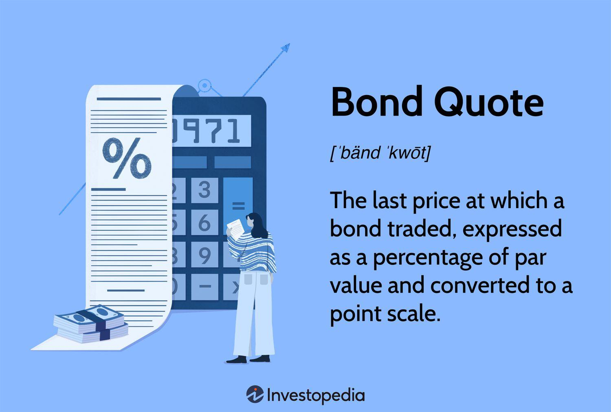

The world of bond trading offers a plethora of opportunities for investors seeking fixed income securities. Bonds represent a fundamental component of the financial world, providing a stable form of income to investors while allowing governments and corporations to raise capital. They are considered less volatile compared to equities, which makes them particularly appealing during periods of economic uncertainty.

To navigate this landscape effectively, understanding bond quotes is crucial. Bond quotes provide vital information regarding the price, yield, and overall market perception of a bond. These quotes are often expressed as a percentage of the bond's face value, offering insights into whether a bond is trading at a premium or a discount. Ability to read and interpret these quotes empowers investors to assess a bond’s market value in comparison to its par value, thereby aiding in the evaluation of investment opportunities.



This article provides an in-depth exploration of bond quotes, the art of trading bonds, and the role of algorithmic trading in this domain. The bond market is continuously evolving, with algorithmic trading playing an increasingly significant role by leveraging vast amounts of data and improved computational capabilities to enhance trading strategies. Algorithms can efficiently process information to identify trading opportunities and are pivotal in improving market liquidity and trading efficiency.

By the end of this article, you'll be equipped with the knowledge to make informed bond trading decisions. Understanding the nuances of bond quotes and the factors influencing their fluctuations will allow you to develop robust strategies tailored to your investment goals. Additionally, appreciating the implications of algorithmic trading can open up new avenues for optimizing your bond trading practices.

## Table of Contents

## What Are Bond Quotes?

A bond quote provides the current market price at which a bond is trading. These quotes are crucial for investors and traders who are looking to evaluate a bond's current worth relative to its face or par value. Typically, bond quotes are expressed as a percentage of the bond's face value. For instance, a bond trading at a quote of 105 is priced at 105% of its face value, meaning it trades at a premium.

Understanding bond quotes is integral for assessing the market value vis-a-vis the par value. By analyzing the components of a bond quote, investors can make informed trading decisions. Key components of a bond quote include the ticker, price, yield, and credit rating.

The ticker symbol is a unique identifier used to distinguish a specific bond in the market. It usually includes details about the issuer and the maturity date of the bond. This helps to quickly ascertain which exact bond is being traded.

The price of a bond is quoted as a percentage of its face value. For example, a bond quoted at 98 signifies it trades at 98% of its face value, representing a discount if the face value is par.

Yield, another essential element of bond quotes, is an indication of the expected return on the bond investment. It is usually expressed as an annual percentage. Yield calculation often considers the coupon rate, purchase price, and time to maturity. The formula for current yield is:

$$
\text{Current Yield} = \frac{\text{Annual Coupon Payment}}{\text{Current Market Price}}
$$

Besides, the yield to maturity (YTM) is a more comprehensive measure, as it accounts for the total return expected if the bond is held until maturity, considering both interest payments received and any gain or loss if the bond is bought at a price other than par value.

Credit rating is a critical component that assesses the bond issuer's ability to meet its financial obligations. Ratings are provided by credit rating agencies such as Moody’s, Standard & Poor’s, and Fitch. The ratings range from high-grade bonds (low risk) to junk bonds (high risk), significantly influencing the bond's yield and price. Generally, higher-rated bonds yield less compared to lower-rated ones due to perceived lower risk.

By thoroughly understanding each component of bond quotes, investors can better appraise market conditions and assess the potential risks and returns associated with bond investments. This knowledge is foundational for engaging with the market effectively and making prudent investment choices.

## How to Read Bond Quotes

Reading a bond quote involves understanding several key components that provide insights into the bond's market value and risk profile. Let's break down the essential parts of a bond quote, providing a clear illustration of each component.

### Ticker Symbol
The ticker symbol is a unique series of letters assigned to a bond, facilitating its identification and trading in the market. Like stock tickers, these symbols help traders quickly find information about a particular bond without ambiguity.

### Price
The price of a bond quote is usually represented as a percentage of its face value, also known as par value. For instance, if a bond with a face value of $1,000 is quoted at 98, it means the bond is currently trading at 98% of its face value, or $980. Understanding the bond price is crucial, as it helps determine the premium or discount a bond is trading at relative to its face value.

### Yield
Yield is a critical measure in bond quotes, representing the return an investor can expect from holding the bond until maturity. There are different types of yield, such as the current yield, yield to maturity (YTM), and yield to call (YTC), each providing distinct insights into the bond's potential income. Yield is inversely related to price; as bond prices fall, yields rise, and vice versa.

### Example Calculation
To calculate the current yield of a bond, you can use the formula:

$$
\text{Current Yield} = \frac{\text{Annual Coupon Payment}}{\text{Current Market Price}}
$$

For a bond with an annual coupon payment of $50 and a current market price of $980, the current yield would be:

$$
\text{Current Yield} = \frac{50}{980} \approx 0.051 \text{ or } 5.1\%
$$

### Maturity Date
The maturity date is when the bond issuer is obliged to repay the bond's face value to the holder. This date is essential as it informs investors about the bond's term and how long they can expect to receive interest payments before the principal is returned.

### Coupon Rate
The coupon rate is the annual [interest rate](/wiki/interest-rate-trading-strategies) paid on a bond's face value. For instance, a bond with a face value of $1,000 and a coupon rate of 5% pays $50 in interest annually. This fixed rate determines the income an investor will receive each year until the bond matures.

### Credit Rating
A bond's credit rating provides an assessment of its creditworthiness, indicating the likelihood of the issuer defaulting on its payments. Ratings are typically provided by credit rating agencies such as Moody's, S&P, and Fitch, using letters (such as AAA, AA, A, BBB) to signify the bond's risk level. Higher credit ratings generally imply lower perceived risk, allowing investors to make informed decisions about the bond's potential for default.

Understanding these components of a bond quote empowers investors to evaluate the bond's value, anticipate its return, and assess the associated risk effectively. Armed with this knowledge, navigating the complexities of bond trading becomes more approachable and informed.

## Different Types of Bond Quotes

Bond quotes can vary significantly depending on the type of bond in question, each offering a unique lens through which to assess the bond's market value. Key types of bond quotes include face value quotes, yield quotes, spread quotes, and pure price quotes. Each of these quotes provides investors with distinct insights that can be leveraged for comparative analysis and informed decision-making.

### Face Value Quotes
Face value quotes, also known as par value quotes, represent the bond's price as a percentage of its principal or face value. Typically set at $100 or $1,000, the face value is the amount the issuer agrees to pay back at maturity. Bonds quoted at 100 are trading at par. For example, a quote of 105 suggests the bond is trading at 105% of its face value, indicating a premium.

### Yield Quotes
Yield quotes provide information about the annual return an investor can expect from a bond. The most commonly quoted yield is the yield to maturity (YTM), which reflects the total return anticipated if the bond is held until it matures, accounting for interest payments and any gain or loss if purchased at a price differing from the face value. The formula for YTM assumes reinvestment of coupons at the bond's current yield, and solving it often requires numerical methods or financial calculators due to its complexity:

$$
YTM = \frac{C + \frac{F-P}{n}}{\frac{F+P}{2}}
$$

where $C$ is the annual coupon payment, $F$ is the face value, $P$ is the price, and $n$ is the years to maturity.

### Spread Quotes
Spread quotes compare the yield of a bond to a benchmark yield, often that of government bonds like U.S. Treasuries. The spread, usually expressed in basis points (1/100th of a percentage point), reflects the additional yield an investor demands to compensate for the higher risk relative to the benchmark. A higher spread indicates greater perceived risk and thus higher yield required by investors.

### Pure Price Quotes
Pure price quotes, often seen with zero-coupon bonds and Treasury bills, show the price at which the bond is trading without reference to yield or spread. These quotes help investors focus purely on the bond's market price relative to face value, providing a straightforward way to gauge market sentiment or [liquidity](/wiki/liquidity-risk-premium) changes.

### Comparative Analysis
Each type of bond quote offers different perspectives for evaluating a bond's value:

1. **Face Value Quotes** reveal how the bond is performing relative to its initial issuance value.
2. **Yield Quotes** help investors compare expected returns across different bonds with similar maturities.
3. **Spread Quotes** assist in assessing risk levels compared to standard benchmarks, essential for risk-adjusted return evaluation.
4. **Pure Price Quotes** enable straightforward valuation without the complexity of yield calculations.

By understanding and leveraging these different types of bond quotes, investors can gain a comprehensive view of the bond's market positioning and make more informed trading decisions.

## The Role of Algorithmic Trading in Bond Markets

Algorithmic trading, commonly known as algo trading, has significantly transformed the bond markets by leveraging advanced computational algorithms to identify profitable trading opportunities. These algorithms, equipped with the capability to process vast amounts of market data, execute trades at speeds and efficiencies unattainable by human traders.

### Data Analysis and Trading Opportunities

At the core of [algorithmic trading](/wiki/algorithmic-trading) is the capacity to analyze extensive datasets in real-time. Algorithms employ statistical and mathematical models to forecast market movements and derive trading signals. For instance, algorithms can track interest rate fluctuations, economic indicators, and geopolitical events to predict changes in bond prices. An example of a simple algorithmic trading strategy could be the following Python code, illustrating a moving average crossover strategy:

```python
def moving_average(data, window_size):
    return data.rolling(window=window_size).mean()

def trading_signal(prices, short_window, long_window):
    short_mavg = moving_average(prices, short_window)
    long_mavg = moving_average(prices, long_window)
    return short_mavg > long_mavg

# Example usage with a Pandas DataFrame 'df' containing bond prices
buy_signal = trading_signal(df['price'], short_window=40, long_window=100)
```

In this example, the algorithm generates a buy signal when a short-term moving average exceeds a long-term moving average, suggesting an upward price trend.

### Enhancing Liquidity and Trading Efficiency

Algorithmic trading enhances market liquidity by increasing the frequency and [volume](/wiki/volume-trading-strategy) of trades. Liquidity is crucial in bond markets, where many securities are traded over-the-counter (OTC) with varying levels of buyer and seller interest. Algorithms facilitate rapid execution of large orders with minimal market impact, thereby narrowing bid-ask spreads and improving price discovery.

Moreover, algorithms contribute to trading efficiency by automating tasks such as order placement, execution, and portfolio rebalancing. This automation reduces transaction costs and minimizes human errors, making trading more cost-effective and precise.

### Benefits and Challenges

While the advantages of algorithmic trading are clear, including speed, precision, and reduced costs, challenges remain. The complexity of developing sophisticated algorithms requires advanced technical expertise and computational resources. Furthermore, the potential for systemic risk is heightened, as demonstrated by events like the 2010 Flash Crash, where algorithmic trading exacerbated market [volatility](/wiki/volatility-trading-strategies).

Regulatory scrutiny is also a key consideration, as regulators aim to mitigate risks associated with high-frequency and algorithmic trading practices. Implementing robust risk management and compliance measures is vital for firms engaged in algo trading.

In summary, algorithmic trading is a powerful tool that reshapes the bond trading landscape by improving speed, liquidity, and efficiency. However, it requires careful implementation and oversight to address potential risks and ensure market stability.

## Factors Influencing Bond Quotes

Bond quotes are primarily influenced by several interconnected factors, including prevailing interest rates, credit ratings, and general market conditions, each playing a crucial role in determining a bond's market value. Understanding these elements is key for investors to assess how bond prices may fluctuate and to make informed investment decisions.

Interest rates hold a particularly significant influence over bond prices. The relationship between interest rates and bond prices is inverse. This means that as interest rates rise, the prices of existing bonds typically fall, and conversely, as interest rates decrease, bond prices tend to rise. This phenomenon occurs because new bonds are generally issued with yields that reflect current interest rates. Therefore, when new bonds offer higher yields due to rising interest rates, existing bonds with lower rates become less attractive unless their prices decrease to offer a comparable yield. A simplified formula representing this inverse relationship is:

$$
P = \frac{C}{r}
$$

where $P$ is the current bond price, $C$ is the coupon payment, and $r$ is the prevailing market interest rate. The formula indicates that as $r$ increases, $P$ decreases, assuming $C$ remains constant.

Credit ratings also significantly impact bond quotes. These ratings, issued by credit rating agencies such as Moody's, Standard & Poor's, and Fitch, assess the creditworthiness of the bond issuer. Bonds with high credit ratings (e.g., AAA) are perceived as lower risk and typically enjoy lower yields, while bonds with lower ratings (e.g., BB or below) are seen as higher risk and must offer higher yields to attract investors. A bond's credit rating influences its pricing by affecting investor perception of risk; a downgrade, for example, may lead to a price drop as the perceived risk increases.

Market conditions also play a substantial role in determining bond prices. Factors such as economic expansion or contraction, geopolitical events, and changes in monetary policy can influence investor demand for bonds, thereby affecting prices. During periods of economic uncertainty or market volatility, investors may flock to bonds as a safe-haven investment, driving up prices. Conversely, in a stable economic environment with attractive alternative investment options, demand for bonds may decline, leading to lower prices.

Investors should closely monitor these factors—interest rates, credit ratings, and market conditions—to better anticipate how bond quotes might change and adjust their investment strategies accordingly. By understanding these influences, investors can gain insights into the broader economic environment and how it might impact their fixed-income investments.

## Practical Strategies for Trading Bonds

To navigate the bond trading landscape effectively, investors should employ a variety of strategies tailored to their specific goals and risk profiles. Three popular strategies include laddering, diversification, and using Exchange-Traded Funds (ETFs) for bond exposure. Each of these approaches serves to optimize returns while managing risk.

### Laddering
Laddering is a strategy that involves purchasing bonds with staggered maturities. This approach provides a balance of risk and return by diversifying the time horizons of the investments. For example, an investor might purchase bonds with maturities of one, three, and five years. As each bond matures, the proceeds can be reinvested in a new bond with a maturity that extends the ladder. This method helps investors benefit from changing interest rates; as rates rise, the maturing bonds can be reinvested at higher yields. Conversely, if rates fall, the investor still holds bonds with higher yields from prior investments.

The structure of a ladder can be simple or complex, depending on the investor's needs and market conditions. Python can be used to model a basic laddering strategy:

```python
import numpy as np

def calculate_ladder(maturities, initial_investment):
    # proportional investment in each maturity
    equal_investment = initial_investment / len(maturities)

    # Calculate returns based on hypothetical interest rates
    interest_rates = np.array([0.02, 0.025, 0.03, 0.035, 0.04])  # Example interest rates
    returns = equal_investment * (1 + interest_rates) ** maturities
    return returns

maturities = np.array([1, 2, 3, 4, 5])  # in years
initial_investment = 10000  # total investment
ladder_returns = calculate_ladder(maturities, initial_investment)
```

This code models a simple bond ladder using hypothetical interest rates, calculating the returns for each bond in the ladder.

### Diversification
Diversification reduces risk by spreading investments across various bonds with different characteristics, such as duration, credit quality, and sectors. By investing in a mix of government, corporate, and municipal bonds, investors can mitigate the impact of localized financial events. For instance, municipal bonds might offer tax advantages under certain conditions, while corporate bonds can provide higher yields, albeit with additional risk.

### Using ETFs
Bond ETFs provide investors with a means to gain exposure to a wide array of bonds without having to purchase individual bonds directly. These funds aggregate multiple bonds, offering diversification and liquidity. ETFs trade on exchanges like stocks, and they can be bought and sold throughout the trading day. This feature makes bond ETFs an attractive option for investors seeking flexibility and ease of access. Additionally, ETFs can target specific sectors or regions, allowing for a tailored investment strategy based on the investor's market outlook.

Understanding your investment horizon and risk tolerance is fundamental when selecting bonds or bond strategies. Short-term investors might prioritize liquidity and lower risk, favoring high-quality, short-duration bonds, or bond ETFs. Conversely, long-term investors with a higher risk tolerance may opt for higher-yield bonds with longer maturities or those with lower credit ratings. Ultimately, aligning bond choices with your investment objectives and risk appetite ensures a well-constructed portfolio.

## Conclusion

Bond trading requires a sophisticated understanding of both bond quotes and the prevailing market dynamics. This article has walked you through the essential components of bond quotes, including how to read and interpret them, different types of quotes, and the factors influencing them. A bond quote is a vital indicator of a bond's market price and potential yield, acting as a barometer for investors to assess and compare the value of different fixed income securities.

In addition to traditional quote analysis, the integration of algorithmic trading has become increasingly prominent in the bond markets. Algorithms parse vast datasets to uncover trading opportunities, improving market liquidity and operational efficiency. This technological advancement provides an additional layer of strategy and execution for investors who aim to optimize their bond trading strategies.

Equipped with the knowledge from this article, you can confidently navigate the complex world of bond trading. The ability to understand and efficiently utilize bond quotes positions you advantageously, allowing you to make informed decisions and explore advanced trading strategies. As you explore these opportunities, consider how the incorporation of algorithmic trading might bolster your portfolio's performance, offering innovative ways to manage risk and capture market movements.

## References & Further Reading

[1]: Fabozzi, F. J. (2007). ["Fixed Income Analysis."](https://www.amazon.com/Fixed-Income-Analysis-Frank-Fabozzi/dp/047005221X) John Wiley & Sons.

[2]: Hull, J. C. (2018). ["Options, Futures, and Other Derivatives."](https://www.semanticscholar.org/paper/Options%2C-Futures%2C-and-Other-Derivatives-Hull/89bdee500c8623864fc9eb7a471546aa713acc44) Pearson.

[3]: Lopez de Prado, M. (2018). ["Advances in Financial Machine Learning."](https://www.amazon.com/Advances-Financial-Machine-Learning-Marcos/dp/1119482089) Wiley.

[4]: Fabozzi, F. J., Modigliani, F., & Jones, F. J. (2014). ["Foundations of Financial Markets and Institutions."](https://archive.org/details/foundationsoffin00fran) Pearson.

[5]: ["Algorithmic Trading: Winning Strategies and Their Rationale"](https://www.amazon.com/Algorithmic-Trading-Winning-Strategies-Rationale-ebook/dp/B00CY5HC0U) by Ernest P. Chan.