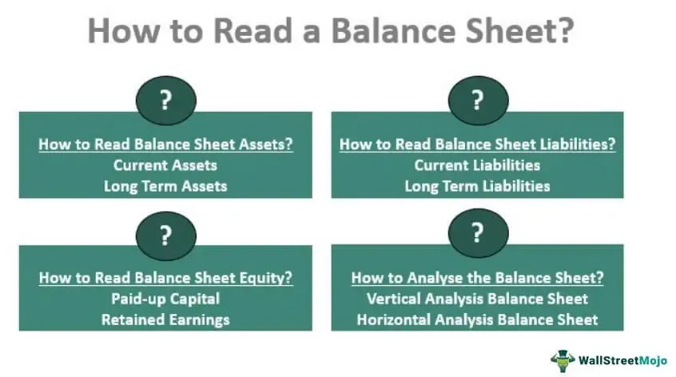

In an ever-evolving financial landscape, understanding the nuances of financial statements and their relevance in different sectors is crucial. Among these financial statements, the balance sheet stands out as a central pillar. It provides an organized snapshot of an organization's financial position at a specific point in time. By detailing assets, liabilities, and shareholders' equity, a balance sheet offers a clear picture of what an organization owns, what it owes, and the net amount invested by shareholders.

In the financial world, the balance sheet serves multiple functions beyond its primary role of reflecting financial health. One significant area where balance sheets exert considerable influence is algorithmic trading. In this high-stakes domain, the balance sheet offers key insights that enhance decision-making. Algorithmic traders rely on the meticulous data provided by balance sheets to develop models that predict market movements, identify investment opportunities, and execute trades with precision. By analyzing components of the balance sheet, such as liquidity ratios and debt levels, traders can determine the stability and potential risks associated with an investment, which, in turn, informs their trading algorithms.

Furthermore, balance sheets are essential for understanding the financial health of an organization—a factor that heavily influences investor confidence. For investors and financial professionals, a solid grasp of balance sheet metrics empowers them to assess an organization's performance, gauge its potential growth, and make informed decisions. To fully appreciate how balance sheets aid in algorithmic trading and other financial domains, it is important to explore their foundational elements. Analyzing the structure of balance sheets and their implications for various stakeholders reveals their importance as a tool for strategic financial analysis.

In this article, we will explore how balance sheets influence algorithmic trading by providing comprehensive financial data that guide investment decisions. By understanding the structure and purpose of balance sheets, investors and professionals can better interpret financial statements, making them indispensable tools in today's financial landscape.

## Table of Contents

## Understanding the Balance Sheet

A balance sheet, formally known as a statement of financial position, is a fundamental financial document that provides a detailed snapshot of a company's financial standing at a specific moment in time. This financial statement is pivotal because it succinctly outlines what the company owns (assets), what it owes (liabilities), and the residual interest of the shareholders (equity). 

The balance sheet is divided into three main sections, each offering critical insights into the financial health and operational efficiency of a company:

1. **Assets**: Assets are resources owned and controlled by the company that are expected to bring future economic benefits. They are broadly categorized into current and non-current assets. 

   - **Current Assets**: These are assets that are expected to be converted into cash or consumed within one year. Common examples include cash and cash equivalents, accounts receivable, inventory, and short-term investments.

   - **Non-Current Assets**: These are assets with a useful life extending beyond one year and include long-term investments, property, plant, equipment, intangible assets like patents, and goodwill.

2. **Liabilities**: Liabilities represent the company's financial obligations or debts, which arise during business operations and are resolved over time through the transfer of economic benefits. They are similarly divided into short-term and long-term liabilities.

   - **Short-Term Liabilities**: Also known as current liabilities, these are obligations due to be settled within one year. Examples include accounts payable, short-term debt, and other accrued liabilities.

   - **Long-Term Liabilities**: These extend beyond one year, such as long-term loans, deferred tax liabilities, and bonds payable.

3. **Shareholders' Equity**: Also referred to as net assets, shareholders' equity represents the residual interest in the assets of a company after deducting liabilities. It includes share capital, retained earnings, and sometimes treasury stock and other reserves.

The foundational equation governing the balance sheet is:

$$
\text{Assets} = \text{Liabilities} + \text{Shareholders' Equity}
$$

This equation must always be balanced, meaning the total value of assets must equal the combined total of liabilities and shareholders' equity. This balance reflects the company's financial stability and underpins its ability to manage debts, invest in new opportunities, and deliver returns to shareholders.

Understanding the components and structure of a balance sheet is essential for assessing a company's financial health, informing investment decisions, and predicting future performance. This insight helps stakeholders, including investors, creditors, and management, to evaluate the company's operational efficacy, financial flexibility, and strategic positioning in its industry.

## Applications in Financial Statement Accounting

The balance sheet is indispensable in financial statement accounting, serving as a foundational tool for assessing a company's financial condition. It provides a comprehensive view of a company's assets, liabilities, and shareholders' equity at a specific point in time. This financial snapshot is critical for informed business decision-making and strategic planning.

### Importance of Ratio Analysis

Financial analysts leverage the balance sheet to perform ratio analysis, which is vital for evaluating a company's [liquidity](/wiki/liquidity-risk-premium), solvency, and overall financial health. **Liquidity ratios**, such as the current ratio and quick ratio, help assess a company's ability to meet short-term obligations. The **current ratio** is calculated as follows:

$$
\text{Current Ratio} = \frac{\text{Current Assets}}{\text{Current Liabilities}}
$$

**Solvency ratios**, like the debt-to-equity ratio, provide insights into long-term financial stability, calculated as:

$$
\text{Debt-to-Equity Ratio} = \frac{\text{Total Liabilities}}{\text{Shareholders' Equity}}
$$

These metrics are integral to understanding financial leverage and risk, empowering analysts to make predictions about the company's future performance and sustainability.

### Interrelationship with Other Financial Statements

Balance sheets also play a crucial role in the preparation and analysis of the income statement and cash flow statement. While the income statement provides a summary of revenue, expenses, and profits over a period, and the cash flow statement focuses on cash inflows and outflows, both rely on balance sheet data for accurate accounting.

For example, changes in assets and liabilities seen on the balance sheet directly influence the cash flow from operations within the cash flow statement. This interplay ensures consistency and precision across all financial statements, allowing analysts to present a coherent and realistic view of the company's financial activities.

### Common Practices in Financial Accounting

Accurate balance sheet assessments are fundamental in many common accounting practices. Accountants utilize balance sheet data for **auditing**, ensuring that reported figures are consistent with underlying financial records. This process helps in maintaining the reliability and integrity of financial reports.

Moreover, balance sheet analysis aids in **budgeting and forecasting** by providing a solid financial foundation from which future financial plans and allocations can be made. Companies use historical balance sheet data to project future asset, liability, and equity levels, informing strategies for growth and investment.

In summary, the balance sheet is an essential tool that underpins various aspects of financial statement accounting. Through ratio analysis, it offers critical insights into financial health and stability, influencing the preparation and accuracy of other financial statements and supporting everyday financial operations within companies.

## Role of Balance Sheets in Algorithmic Trading

In [algorithmic trading](/wiki/algorithmic-trading), balance sheets play a pivotal role by providing comprehensive financial data integral to the development of various trading strategies. Traders build algorithms that incorporate financial ratios and balance sheet metrics to forecast stock price movements and make well-informed trading decisions.

Financial ratios such as the current ratio, quick ratio, and debt-to-equity ratio, derived from balance sheet components, are used extensively to gauge a company's financial health. Algorithms employ these ratios to evaluate liquidity, solvency, and capital structure, enabling traders to anticipate price trends and market behavior.

Back-testing strategies also depend significantly on balance sheet data. By historical analysis of balance sheets, traders can simulate algorithmic strategies across different market conditions. This retrospective testing helps in fine-tuning algorithms to ensure reliability and performance ahead of live market deployment.

Some common algorithms that leverage financial statement analysis include mean reversion and statistical [arbitrage](/wiki/arbitrage) strategies. These strategies often require detailed balance sheet analysis to identify discrepancies in asset pricing or potential misvaluations. By systematically examining financial statements, algorithms can identify profitable opportunities without human intervention.

Understanding these mechanisms is crucial for traders developing adaptive strategies. Comprehensive balance sheet analysis equips algorithmic traders with the insights needed to endure and capitalize on market fluctuations, thereby enhancing potential profitability. Proficient integration of balance sheet data into trading algorithms can thus provide a competitive edge in the fast-paced world of algorithmic trading.

## Analyzing a Balance Sheet: A Practical Guide

Analyzing a balance sheet is a critical skill in financial analysis, providing insights into a company's economic health. It involves calculating and interpreting various financial ratios and benchmarks. These ratios help assess the company's liquidity, solvency, efficiency, and profitability. Understanding these metrics enables stakeholders to make informed decisions.

### Key Financial Ratios

1. **Debt-to-Equity Ratio**: This ratio is calculated as:
$$
   \text{Debt-to-Equity Ratio} = \frac{\text{Total Liabilities}}{\text{Shareholders' Equity}}

$$
   It measures a company's financial leverage and indicates the proportion of debt and equity used to finance assets. A higher ratio suggests increased risk as the company relies heavily on debt.

2. **Current Ratio**: Defined as the ratio of current assets to current liabilities, it evaluates the company's ability to pay short-term obligations:
$$
   \text{Current Ratio} = \frac{\text{Current Assets}}{\text{Current Liabilities}}

$$
   A ratio above 1 indicates good short-term financial health, whereas a ratio below 1 suggests potential liquidity issues.

3. **Asset Turnover Ratio**: This ratio measures the efficiency of a company's use of its assets to generate sales:
$$
   \text{Asset Turnover Ratio} = \frac{\text{Net Sales}}{\text{Average Total Assets}}

$$
   Higher values imply effective use of assets in generating revenue.

### Example: Analyzing Walmart's Balance Sheet

To illustrate, consider Walmart, a leading multinational retail corporation. Examining their balance sheet, we can calculate these key ratios:

- **Debt-to-Equity Ratio**: Walmart reports total liabilities of $63 billion and shareholders' equity of $89 billion. Therefore:
$$
  \frac{63}{89} \approx 0.71

$$
  This suggests Walmart uses a balanced approach between debt and equity.

- **Current Ratio**: With current assets of $75 billion and current liabilities of $65 billion:
$$
  \frac{75}{65} \approx 1.15

$$
  This indicates Walmart's strong liquidity position, signaling its capability to cover short-term liabilities.

- **Asset Turnover Ratio**: Assuming Walmart has net sales of $500 billion and average total assets of $200 billion in a fiscal year:
$$
  \frac{500}{200} = 2.5

$$
  This high ratio suggests effective utilization of assets in generating substantial sales.

### Step-by-Step Analysis

To perform a comprehensive balance sheet analysis:

1. **Gather Data**: Obtain the company's latest balance sheet, ensuring all figures are up-to-date.

2. **Calculate Ratios**: Using the formulas provided, calculate the key financial ratios, focusing on areas most pertinent to your analysis needs.

3. **Interpret Results**: Compare these ratios against industry benchmarks and historical company data to evaluate financial performance.

4. **Consider Qualitative Factors**: Analyze any qualitative aspects, such as market conditions, regulatory environment, and management strategies, that could impact future financial stability.

By following this guide, analysts can develop a well-rounded view of a corporation's financial health, enabling strategic decision-making. Understanding balance sheets through this analytical lens enhances the ability to predict performance and adapt strategies accordingly.

## Conclusion

The balance sheet is a fundamental element of financial analysis, providing essential insights that underpin various practices, including algorithmic trading. Its structured presentation of assets, liabilities, and shareholders' equity delivers a clear view of a company's financial position. By understanding the composition and implications of balance sheets, investors and financial professionals can significantly enhance their decision-making processes. This analytical skill is pivotal in strategic financial planning, enabling stakeholders to assess a company's stability and growth potential effectively.

Integrating balance sheet analytics into broader investment strategies is increasingly vital as technology continues to evolve. The merging of conventional financial accounting with advanced algorithmic techniques is reshaping the trading landscape, offering new avenues for enhancing profitability and managing risk. In algorithmic trading, for instance, balance sheets serve as critical data sources for developing algorithms that predict market trends, optimize trades, and improve overall trading outcomes. The capacity to analyze and interpret balance sheet metrics can lead to more informed and precise trading strategies.

Future advancements in financial technology promise to further leverage balance sheet data, necessitating that finance professionals engage in continuous learning and adaptation. As algorithms become more sophisticated and data-driven decision-making more prevalent, the ability to expertly analyze financial statements will be even more critical. This ongoing evolution will demand that stakeholders not only stay abreast of technological changes but also maintain a strong foundational understanding of financial principles to navigate the complexities of modern trading environments effectively.

## FAQs

### FAQs

**What is the main purpose of a balance sheet in financial statements?**

The primary purpose of a balance sheet is to present a clear picture of a company's financial position at a specific moment. It details the company's assets, liabilities, and shareholders' equity, which helps stakeholders assess the organization's financial stability and liquidity. This snapshot allows investors, creditors, and management to understand what the company owns, owes, and the amount invested by shareholders, forming a basis for informed financial decisions.

**How do balance sheets differ from income statements and cash flow statements?**

While the balance sheet provides a snapshot of a company's financial standing, the income statement and cash flow statement offer insights into its financial performance over a period. The income statement highlights revenues, expenses, and profits, showing how much money the company made or lost during a specific timeframe. In contrast, the cash flow statement tracks the inflow and outflow of cash, helping evaluate the company's liquidity and financial flexibility. Together, all three statements provide a comprehensive view of an organization's financial health.

**Why is the balance sheet critical in algorithmic trading strategies?**

In algorithmic trading, balance sheet data is crucial for designing algorithms that can evaluate a company's financial health and predict stock movements. Traders develop strategies using key balance sheet metrics, such as financial ratios, to make informed predictions about market trends and execution decisions. The integration of balance sheet data in algorithmic trading enhances the accuracy of forecasts and the potential for profitable trade outcomes.

**What are some common financial ratios derived from balance sheets?**

Several essential financial ratios derived from balance sheets include:

- **Debt-to-Equity Ratio**: $\text{Debt-to-Equity Ratio} = \frac{\text{Total Liabilities}}{\text{Shareholders' Equity}}$

- **Current Ratio**: $\text{Current Ratio} = \frac{\text{Current Assets}}{\text{Current Liabilities}}$

- **Quick Ratio**: $\text{Quick Ratio} = \frac{\text{Current Assets} - \text{Inventory}}{\text{Current Liabilities}}$

- **Return on Assets (ROA)**: $\text{ROA} = \frac{\text{Net Income}}{\text{Total Assets}}$

These ratios provide insights into a company's liquidity, solvency, and overall financial health, enabling more accurate financial analysis.

**How can balance sheet analysis improve investment strategies?**

Balance sheet analysis equips investors with insights into a company's financial condition, guiding them in selecting viable investment opportunities. By evaluating financial ratios and balance indicators like liquidity, asset utilization, and leverage, investors can better predict a company's potential for growth and profitability. Additionally, an understanding of current asset and liability management can help anticipate a company's ability to weather economic fluctuations, thus optimizing investment strategies for mitigating risks and maximizing returns.

## References & Further Reading

[1]: ["Advances in Financial Machine Learning"](https://www.amazon.com/Advances-Financial-Machine-Learning-Marcos/dp/1119482089) by Marcos Lopez de Prado

[2]: ["Financial Statement Analysis and Security Valuation"](https://www.mheducation.com/highered/product/financial-statement-analysis-security-valuation-penman/M9780078025310.html) by Stephen H. Penman

[3]: ["Machine Learning for Algorithmic Trading"](https://github.com/PacktPublishing/Machine-Learning-for-Algorithmic-Trading-Second-Edition) by Stefan Jansen

[4]: ["Quantitative Trading: How to Build Your Own Algorithmic Trading Business"](https://books.google.com/books/about/Quantitative_Trading.html?id=j70yEAAAQBAJ) by Ernest P. Chan

[5]: ["Evidence-Based Technical Analysis: Applying the Scientific Method and Statistical Inference to Trading Signals"](https://www.amazon.com/Evidence-Based-Technical-Analysis-Scientific-Statistical/dp/0470008741) by David Aronson