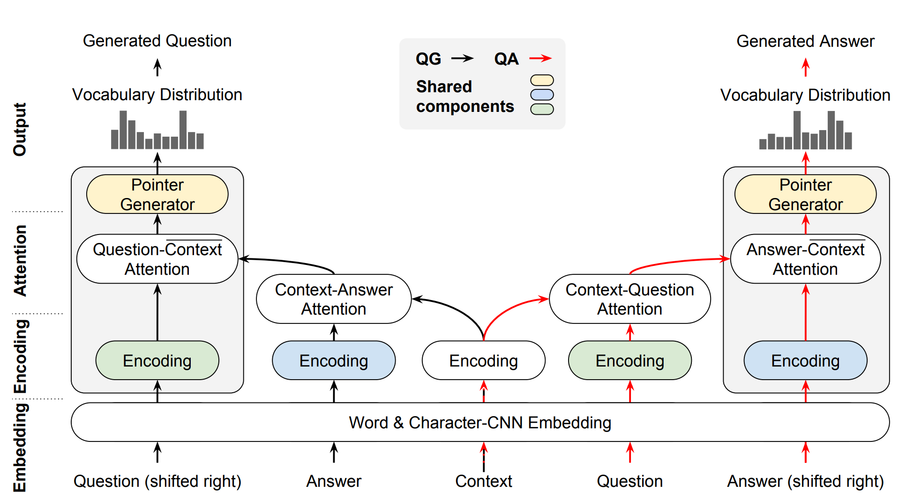

## Table of Contents

## What is reading comprehension in the context of machine learning?

Reading comprehension in the context of machine learning refers to the ability of a computer model to understand and answer questions about a given text. This is a challenging task because it requires the model to not only recognize words and their meanings but also to grasp the context, infer relationships, and draw conclusions from the information provided. Machine learning models, particularly those using natural language processing (NLP), are trained on large datasets of text to improve their ability to comprehend and respond to queries accurately.

To achieve reading comprehension, machine learning models often use techniques such as transformer architectures, which are designed to handle sequential data like text. These models learn to predict the next word in a sentence or to answer questions about a passage by analyzing patterns in the training data. For example, a model might be trained on a dataset where it reads a paragraph and then answers questions about it, gradually improving its performance through adjustments based on its errors. This process helps the model to better understand the nuances of language and context, making it more effective at reading comprehension tasks.

## How do reading comprehension models work?

Reading comprehension models in machine learning work by learning from lots of text examples. They use special computer programs called neural networks, which are good at understanding patterns in data. When these models read a piece of text, they break it down into smaller parts and try to understand what each part means. They then use this understanding to answer questions about the text. The models get better over time by comparing their answers to the correct answers and adjusting their understanding accordingly.

One common type of [neural network](/wiki/neural-network) used for reading comprehension is called a transformer. Transformers are good at understanding the order of words in a sentence and how they relate to each other. They do this by paying attention to different parts of the text at the same time, which helps them understand the context better. When a transformer model reads a paragraph and is asked a question, it looks at the whole paragraph to find the information needed to answer the question correctly. This process of learning and adjusting helps the model improve its reading comprehension skills.

## What is the role of LSTM in reading comprehension models?

LSTM, which stands for Long Short-Term Memory, is a type of neural network that is good at remembering things over a long time. In reading comprehension models, LSTM helps the computer understand the order of words in a sentence and how they relate to each other. When the model reads a paragraph, the LSTM keeps track of what it has read so far. This helps the model understand the context and meaning of the text better, which is important for answering questions correctly.

For example, if a paragraph talks about a person going to the store and then coming back home, the LSTM remembers that the person went to the store first. This memory helps the model understand that when it reads "coming back home," it is talking about the same person who went to the store. By keeping track of these details, the LSTM helps the reading comprehension model give better answers to questions about the text.

## What are the key components of the Deep LSTM Reader model?

The Deep LSTM Reader model is a type of neural network used for reading comprehension. It uses Long Short-Term Memory (LSTM) units, which are good at remembering things over a long time. The key components of this model include an input layer, multiple LSTM layers, and an output layer. The input layer takes in the text, like a paragraph or a passage. The LSTM layers then process this text, keeping track of what has been read so far. This helps the model understand the context and meaning of the text. Finally, the output layer uses this understanding to answer questions about the text.

The model works by first encoding the text into a format that the LSTM layers can understand. This is done by turning each word into a number, which is called an embedding. The LSTM layers then read these numbers one by one, updating their memory at each step. This process helps the model remember important details from earlier in the text, which is crucial for understanding the whole passage. When a question is asked, the model uses its memory to find the right answer. The output layer then turns this understanding into a final answer, which could be a word or a phrase from the text.

## How does the Deep LSTM Reader model process input text?

The Deep LSTM Reader model starts by taking in the text, like a paragraph or a passage. It turns each word into a number, which is called an embedding. This helps the model understand the words better. The model then uses these numbers as input for its LSTM layers. LSTM stands for Long Short-Term Memory, which is good at remembering things over a long time. The LSTM layers read the numbers one by one, updating their memory at each step. This process helps the model remember important details from earlier in the text.

As the model reads through the text, it keeps track of what it has read so far. This memory helps the model understand the context and meaning of the text. For example, if the text talks about a person going to the store and then coming back home, the model remembers that the person went to the store first. This helps the model understand that when it reads "coming back home," it is talking about the same person who went to the store. By keeping track of these details, the Deep LSTM Reader model can better answer questions about the text.

## What are the typical datasets used to train reading comprehension models?

Reading comprehension models are often trained on datasets that contain pairs of text passages and questions about those passages. Some common datasets include SQuAD (Stanford Question Answering Dataset), which has questions about Wikipedia articles, and RACE (ReAding Comprehension from Examinations), which uses English exams from Chinese middle and high schools. These datasets help the models learn how to understand and answer questions about different types of text.

Another popular dataset is the CNN/DailyMail dataset, which uses news articles and their summaries to train models. This dataset helps models learn to understand news stories and answer questions about them. By using these datasets, reading comprehension models can improve their ability to understand and respond to a wide variety of texts.

## How is the performance of reading comprehension models evaluated?

The performance of reading comprehension models is evaluated using specific metrics that measure how well the models understand and answer questions about texts. One common metric is exact match (EM), which checks if the model's answer exactly matches the correct answer. Another important metric is the F1 score, which measures the overlap between the model's answer and the correct answer. The F1 score is calculated by taking the harmonic mean of precision and recall. Precision measures how many of the model's words are correct, and recall measures how many of the correct words the model included. The formula for the F1 score is $$ F1 = 2 \times \frac{\text{precision} \times \text{recall}}{\text{precision} + \text{recall}} $$. These metrics help researchers see how well the model is doing and where it needs to improve.

To evaluate the models, researchers use test sets from datasets like SQuAD or RACE. These test sets contain passages and questions that the model has not seen during training. The model reads the passage and tries to answer the questions, and its answers are then compared to the correct answers using the EM and F1 metrics. This process helps to ensure that the model can generalize its understanding to new texts and questions. By looking at the results, researchers can tell if the model needs more training or if it is ready for real-world use.

## What are the challenges faced when training reading comprehension models?

Training reading comprehension models can be hard because understanding language is tricky. The models need to learn not just the words, but also how they fit together and what they mean in different situations. For example, the word "bank" can mean a place to keep money or the side of a river. The model needs to figure out which meaning is correct based on the rest of the text. This requires a lot of data and a lot of computing power to train the model properly.

Another challenge is making sure the model can handle different kinds of texts and questions. The model might be good at answering questions about news articles but struggle with stories or school exams. This means the training data needs to be diverse, covering many types of texts and questions. Also, the model needs to learn to answer questions that are not exactly the same as the ones it saw during training. This is called generalization, and it's hard to achieve. Researchers use metrics like exact match (EM) and F1 score to see how well the model is doing. The F1 score is calculated by $$ F1 = 2 \times \frac{\text{precision} \times \text{recall}}{\text{precision} + \text{recall}} $$, where precision is how many of the model's words are correct, and recall is how many of the correct words the model included.

## How can the Deep LSTM Reader model be improved or modified for better performance?

To make the Deep LSTM Reader model work better, you can try using more data for training. The more different kinds of texts and questions the model sees, the better it can understand and answer them. Another way to improve the model is by using a technique called attention. Attention helps the model focus on the most important parts of the text when answering a question. This can make the model's answers more accurate. You can also try using a different kind of neural network, like a transformer, which is good at understanding the order of words and how they relate to each other. Transformers are often better at reading comprehension tasks than LSTMs.

Another way to improve the Deep LSTM Reader model is by changing how it learns. You can use a method called fine-tuning, where you train the model a bit more on specific types of texts or questions. This can help the model do better on those specific tasks. Also, you can try using different ways to turn words into numbers, called embeddings. Better embeddings can help the model understand the words better. Finally, you can use different metrics to see how well the model is doing. For example, you can use the F1 score, which is calculated by $$ F1 = 2 \times \frac{\text{precision} \times \text{recall}}{\text{precision} + \text{recall}} $$. This can help you see where the model needs to improve and make it better over time.

## What are some advanced techniques used in state-of-the-art reading comprehension models?

State-of-the-art reading comprehension models often use advanced techniques like transformer architectures. Transformers are good at understanding the order of words and how they relate to each other. They use a method called attention, which helps the model focus on the most important parts of the text when answering a question. This makes the model's answers more accurate. Another technique is pre-training on large amounts of text data. This helps the model learn about language in general before it is fine-tuned on specific reading comprehension tasks. Pre-training can be done using models like BERT (Bidirectional Encoder Representations from Transformers), which learns to predict missing words in a sentence. This helps the model understand the context better.

Another advanced technique is multi-task learning, where the model is trained to do more than one thing at the same time. For example, the model might learn to answer questions and also to summarize text. This can help the model understand the text better and give better answers. Some models also use techniques like ensemble methods, where several models work together to give the best answer. This can make the model's performance better. To measure how well these models are doing, researchers use metrics like the F1 score, which is calculated by $$ F1 = 2 \times \frac{\text{precision} \times \text{recall}}{\text{precision} + \text{recall}} $$. This helps them see where the model needs to improve and make it better over time.

## How do reading comprehension models compare to human performance in understanding text?

Reading comprehension models are getting better at understanding text, but they still have a long way to go to match human performance. Humans can understand the meaning of words, the context of a story, and even the emotions behind the text. We can also use our knowledge of the world to understand things that are not directly said in the text. On the other hand, reading comprehension models rely on patterns they have learned from data. They can be very good at answering specific types of questions, but they often struggle with understanding complex ideas or subtle meanings in the text.

State-of-the-art models, like those using transformer architectures, are closing the gap with human performance. These models use techniques like attention to focus on important parts of the text and pre-training on large amounts of data to learn about language. Even with these advances, the best models still do not reach the level of understanding that humans have. For example, on datasets like SQuAD, the best models might achieve an F1 score of around 90, calculated by $$ F1 = 2 \times \frac{\text{precision} \times \text{recall}}{\text{precision} + \text{recall}} $$, while humans can often get perfect scores. This shows that while reading comprehension models are improving, they still have room to grow to match the nuanced understanding of humans.

## What are the future directions for research in reading comprehension models?

Future research in reading comprehension models will focus on making them understand text more like humans do. This means they will need to get better at understanding not just the words, but also the context, emotions, and even things that are not directly said in the text. Researchers will work on making models use common sense and knowledge about the world to understand texts better. They will also try to make models that can answer more complex questions and understand longer texts. Techniques like transformer architectures and attention mechanisms will be improved to help models focus on the most important parts of the text.

Another important direction for future research is making reading comprehension models work better with less data. Right now, these models need a lot of text to learn from, but in the future, researchers want them to learn from smaller amounts of data. This will make it easier to use these models in more situations. Also, researchers will work on making models that can understand and answer questions in many languages, not just one. They will use metrics like the F1 score, calculated by $$ F1 = 2 \times \frac{\text{precision} \times \text{recall}}{\text{precision} + \text{recall}} $$, to see how well the models are doing and where they need to improve.