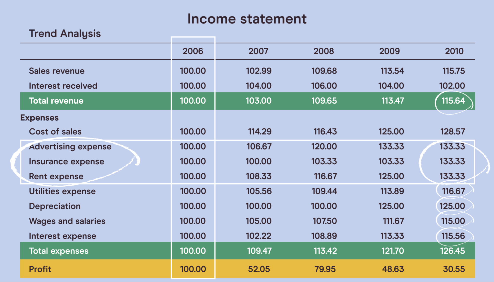

## Table of Contents

## What is a financial analysis report?

A financial analysis report is a document that looks at a company's money matters. It helps people understand how well a business is doing financially. The report uses numbers from the company's financial statements, like the income statement, balance sheet, and cash flow statement. These numbers help to see if the company is making money, how much it owes, and where its money is coming from and going to.

The report often includes different ways to measure the company's financial health, like ratios and trends. For example, it might show how quickly the company can pay its bills or how much profit it makes compared to its costs. This information is useful for business owners, investors, and managers. They use it to make decisions about investing more money, cutting costs, or planning for the future. By looking at the financial analysis report, they can see if the company is on the right track or if changes need to be made.

## Why is it important to read financial analysis reports?

Reading financial analysis reports is important because they give you a clear picture of a company's financial health. These reports tell you if a company is making money, how much debt it has, and how it's managing its cash. This information is crucial for anyone who wants to invest in the company, work there, or do business with it. By understanding the financial situation, you can make smarter decisions about whether to buy stocks, lend money, or even join the company as an employee.

Moreover, financial analysis reports help you spot trends and potential problems early. If a company's profits are going down or its debts are piling up, the report will show these warning signs. This allows investors and managers to take action before things get worse. For example, they might decide to cut costs, change their business strategy, or look for new ways to make money. By keeping an eye on these reports, you can stay ahead of changes and make the best choices for your financial future.

## What are the key components of a financial analysis report?

A financial analysis report has several important parts that help you understand a company's money situation. The first part is the financial statements, which include the income statement, balance sheet, and cash flow statement. The income statement shows how much money the company made and spent over a period of time. The balance sheet tells you what the company owns and owes at a specific time. The cash flow statement shows where the company's money is coming from and going to.

Another key part is the financial ratios. These are numbers that help you see how well the company is doing in different areas. For example, the liquidity ratio shows if the company can pay its bills on time. The profitability ratio tells you how much profit the company is making compared to its costs. The debt ratio shows how much the company owes compared to what it owns. These ratios help you compare the company to others and see if it's doing well or not.

Lastly, the report often includes a section on trends and forecasts. This part looks at how the company's financial numbers have changed over time and tries to predict what might happen in the future. It might show if the company's profits are going up or down, or if it's getting more or less debt. This information helps you understand where the company is headed and make better decisions about investing or working with it.

## How can a beginner start reading and understanding financial analysis reports?

Starting to read and understand financial analysis reports can seem hard at first, but it gets easier with practice. Begin by looking at the basic financial statements: the income statement, balance sheet, and cash flow statement. The income statement shows how much money the company made and spent over a period of time. The balance sheet tells you what the company owns and owes at a specific time. The cash flow statement shows where the company's money is coming from and going to. Try to understand these three statements first because they are the building blocks of the financial analysis report.

Next, focus on the financial ratios. These are numbers that help you see how well the company is doing in different areas. For example, the liquidity ratio shows if the company can pay its bills on time. The profitability ratio tells you how much profit the company is making compared to its costs. The debt ratio shows how much the company owes compared to what it owns. Don't worry if you don't understand all the ratios at first. Start with a few key ones and learn them well. Over time, you can learn more ratios and get a better understanding of the company's financial health.

Finally, pay attention to the trends and forecasts section of the report. This part looks at how the company's financial numbers have changed over time and tries to predict what might happen in the future. It might show if the company's profits are going up or down, or if it's getting more or less debt. This information helps you understand where the company is headed. As you read more reports, you'll get better at spotting important trends and making sense of the forecasts. Remember, the key is to start simple and build your knowledge gradually.

## What are the common financial ratios used in these reports?

Financial ratios are important tools used in financial analysis reports to help understand a company's financial health. Some common ratios include the current ratio, which shows if a company can pay its short-term bills by comparing its current assets to its current liabilities. The quick ratio is similar but only includes the most liquid assets, like cash and accounts receivable, to see if the company can pay its bills quickly. The debt-to-equity ratio tells you how much the company is borrowing compared to what the owners have invested. A high ratio means the company relies more on debt, which can be risky.

Another set of ratios focuses on profitability. The gross profit margin shows how much money is left after paying for the cost of goods sold. The net profit margin tells you how much profit is left after all expenses are paid. The return on assets (ROA) measures how well the company uses its assets to make a profit, while the return on equity (ROE) shows how much profit the company makes for its shareholders. These ratios help investors and managers see if the company is making enough money to cover its costs and grow.

Lastly, efficiency ratios help you understand how well the company is using its resources. The inventory turnover ratio shows how quickly the company sells its inventory. A high ratio means the company is selling its products quickly. The accounts receivable turnover ratio tells you how fast the company collects money from its customers. The asset turnover ratio measures how efficiently the company uses its assets to generate sales. By looking at these ratios, you can see if the company is managing its resources well and if there are areas where it could improve.

## How do you interpret the income statement in a financial analysis report?

The income statement is like a report card that shows how much money a company made and spent over a certain time, like a month or a year. It starts with the company's total revenue, which is all the money it got from selling things or services. Then, it subtracts the costs of making or buying those things, which is called the cost of goods sold. The difference between revenue and cost of goods sold is the gross profit. After that, the income statement lists other expenses like rent, salaries, and advertising. These are subtracted from the gross profit to find the operating profit. Finally, it subtracts taxes and any other costs to get the net profit, which is the money the company has left after paying all its bills. This number tells you if the company made money or lost money during that time.

Looking at the income statement helps you understand how well the company is doing. If the net profit is positive and growing, it means the company is making more money and doing well. But if the net profit is shrinking or negative, it might mean the company is spending too much or not making enough money. You can also compare different parts of the income statement to see where the company might need to improve. For example, if the cost of goods sold is going up faster than revenue, the company might need to find cheaper ways to make or buy things. By reading the income statement carefully, you can get a good idea of the company's financial health and where it might be headed in the future.

## What insights can be gained from the balance sheet in financial analysis?

The balance sheet shows what a company owns and owes at a specific time. It's like a snapshot of the company's financial health. On one side, you have the company's assets, which are things like cash, buildings, and equipment. On the other side, you have liabilities, which are the company's debts, like loans and bills it needs to pay. The difference between assets and liabilities is called equity, which is the money that belongs to the owners or shareholders. By looking at the balance sheet, you can see if the company has enough assets to cover its debts. If the assets are much bigger than the liabilities, it's a good sign that the company is financially strong.

You can also learn a lot about the company's strategy by looking at the balance sheet. For example, if the company has a lot of cash, it might be planning to buy new things or invest in growing the business. If it has a lot of debt, it might be using loans to help the business grow, but it also means the company has to pay back that money with interest. By comparing the balance sheet over time, you can see if the company is getting stronger or weaker. If the assets are growing and the liabilities are staying the same or getting smaller, it's a good sign. But if the liabilities are growing faster than the assets, it might mean the company is taking on too much debt and could be in trouble.

## How does the cash flow statement contribute to financial analysis?

The cash flow statement is really important because it shows how money moves in and out of a company. It's split into three parts: operating activities, investing activities, and financing activities. Operating activities are about the day-to-day stuff, like selling products or paying salaries. Investing activities show if the company is buying or selling things like buildings or equipment. Financing activities tell you if the company is getting money from loans or paying back investors. By looking at the cash flow statement, you can see if the company is making enough money from its main business to keep going, or if it's relying on loans or selling assets to stay afloat.

Understanding the cash flow statement helps you see the real picture of a company's financial health. Even if a company looks good on the income statement because it's making a profit, the cash flow statement might show that it's not actually getting enough cash to pay its bills. For example, if a company is selling a lot of things but its customers are slow to pay, the company might run out of cash even though it's making sales. By looking at the cash flow statement, you can spot these problems early and see if the company needs to change how it manages its money. This can help investors and managers make better decisions about the company's future.

## What are some advanced techniques for analyzing financial reports?

One advanced technique for analyzing financial reports is using trend analysis. This means looking at the financial numbers over several years to see if they are going up or down. For example, you might look at the company's profits or debts over the last five years. By doing this, you can spot patterns and predict what might happen next. If the profits are growing steadily, it's a good sign that the company is doing well. But if the debts are growing faster than the profits, it might mean the company is taking on too much risk. Trend analysis helps you see the bigger picture and make better decisions about the company's future.

Another technique is ratio analysis, but at a more advanced level. Instead of just looking at one ratio at a time, you can compare different ratios to get a fuller understanding of the company's financial health. For example, you might look at the debt-to-equity ratio and the interest coverage ratio together. The debt-to-equity ratio shows how much the company is borrowing compared to what the owners have invested, while the interest coverage ratio tells you if the company can pay the interest on its loans. By looking at both, you can see if the company is borrowing too much and if it can handle the costs. This deeper look at the numbers helps you understand the risks and opportunities better.

A third advanced technique is using financial modeling. This means creating a computer model that predicts how the company's finances will change in the future based on different scenarios. For example, you might create a model to see what would happen if the company's sales grew by 10% next year or if interest rates went up. Financial modeling helps you test different possibilities and see how they might affect the company's profits, debts, and cash flow. This can be really useful for planning and making strategic decisions. By using these advanced techniques, you can get a much clearer and more detailed picture of the company's financial situation.

## How can financial analysis reports be used for investment decisions?

Financial analysis reports are very useful for making investment decisions because they show you how well a company is doing financially. When you read these reports, you can see if the company is making money, how much debt it has, and how it's managing its cash. This information helps you decide if it's a good idea to buy the company's stocks or bonds. For example, if the report shows that the company's profits are growing and it has enough cash to pay its bills, it might be a good investment. But if the report shows that the company is losing money or has a lot of debt, it might be riskier to invest in it.

By looking at the financial analysis report, you can also compare different companies and see which one might be a better investment. You can check their financial ratios, like the profitability ratio or the debt-to-equity ratio, to see how they stack up against each other. If one company has a higher profitability ratio and a lower debt-to-equity ratio than another, it might be a safer and more profitable investment. This way, you can make smarter choices about where to put your money and avoid companies that might not do well in the future.

## What are the limitations and potential biases in financial analysis reports?

Financial analysis reports can be really helpful, but they have some limits and can be biased sometimes. One big problem is that these reports use numbers from the past. They show what happened before, but they can't tell you for sure what will happen next. Things like the economy, new laws, or even a new boss can change a company's future in ways that the report can't predict. Also, the numbers in the report can be affected by how the company decides to count things. For example, they might decide to spread out the cost of a big machine over many years instead of counting it all at once. This can make the company look more profitable than it really is.

Another issue is that people who make these reports might have their own reasons for showing the numbers in a certain way. They might want to make the company look good to get more investors or to keep their jobs. This can lead to bias, where the report doesn't give a full or honest picture of the company's financial health. Also, not everyone knows how to read these reports well. If you don't understand what the numbers mean, you might make a wrong decision about investing in the company. So, it's important to be careful and maybe get help from someone who knows a lot about financial reports before making big decisions based on them.

## How can one stay updated with the latest trends and methodologies in financial analysis?

Staying updated with the latest trends and methodologies in financial analysis can be done by regularly reading financial news and industry publications. Websites like Bloomberg, Reuters, and The Financial Times often have articles and reports on new financial analysis techniques and changes in the industry. You can also subscribe to newsletters from financial analysis firms or professional organizations like the CFA Institute, which share updates and insights on the latest trends. Joining online forums and social media groups focused on finance and investing can also help you stay in the loop, as members often discuss and share new ideas and methodologies.

Another way to keep up with financial analysis trends is by taking courses and attending webinars or conferences. Many universities and online platforms like Coursera, Udemy, and edX offer courses on advanced financial analysis techniques. These courses can help you learn about new methodologies and tools used in the industry. Attending industry conferences, either in person or virtually, is also a great way to hear from experts and learn about the latest developments. By combining these resources, you can stay informed and improve your skills in financial analysis.

## What are the Financial Analysis Techniques for Informed Decision-Making?

Financial analysis techniques are crucial for informed investment decision-making, providing investors with tools to assess a company's performance and potential for future growth. Two foundational methods are ratio analysis and cash flow analysis.

**Ratio Analysis**

Ratio analysis involves evaluating financial statements to derive ratios that elucidate various aspects of a company's operations. Key ratios include:

1. **Liquidity Ratios**: These assess a company's ability to meet short-term obligations. The current ratio, calculated as current assets divided by current liabilities, gauges short-term financial health.

2. **Profitability Ratios**: Metrics like return on equity (ROE) and return on assets (ROA) measure how effectively a company generates profit from shareholders' equity and assets, respectively. ROE is given by:
$$
   \text{ROE} = \frac{\text{Net Income}}{\text{Shareholder's Equity}}

$$

3. **Efficiency Ratios**: These indicate how well a company uses its assets. The asset turnover ratio, which divides net sales by total assets, reflects revenue generation efficiency.

By analyzing these ratios, investors can evaluate operational efficiency, profitability, and [liquidity](/wiki/liquidity-risk-premium), forming a clearer view of the company’s current performance and future potential.

**Cash Flow Analysis**

Cash flow analysis focuses on assessing a company's cash inflows and outflows. The three primary cash flow categories are from operations, investing, and financing activities. This analysis aids investors in understanding a company’s cash generation capabilities, critical for sustainability and growth.

For instance, positive cash flow from operations might indicate healthy core business performance. A simple python snippet to calculate cash from operations could involve:

```python
cash_from_operations = net_income + adjustments_for_non_cash_items - changes_in_working_capital
```

This analysis ensures investors comprehend where and how cash is being generated and utilized within the company.

**Quantitative and Qualitative Analyses**

Quantitative analysis leverages numerical data and statistical techniques, while qualitative analysis examines non-quantifiable factors such as management expertise, brand strength, and competitive positioning. A well-rounded financial picture necessitates integrating both approaches. For example, while quantitative metrics might reveal profitability, qualitative insights into market reputation can signal sustainability.

**Benchmarking and Trend Analysis**

Benchmarking involves comparing a company's performance against industry standards or competitors to identify relative strengths or weaknesses. Meanwhile, trend analysis examines financial data over time to identify patterns, aiding in forecasting future performance.

Consider an investor assessing Company A’s financials. By benchmarking Company A’s ROE against the industry average, they can determine its competitiveness. Trend analysis might reveal a consistent increase in revenue, suggesting growth potential.

**Illustrative Examples**

Suppose an investor examines two tech firms, Firm X and Firm Y, using ratio and cash flow analysis. Firm X might have a higher ROA, indicating efficient asset use, but Firm Y’s robust cash flow from operations could suggest better cash management and stability.

By employing these techniques, investors gain insights into not only current financial health but also prospects for growth, enabling more informed and strategic investment decisions. These methods highlight the dynamic interplay between qualitative and quantitative factors, underscoring the multifaceted nature of effective financial analysis.

## References & Further Reading

[1]: Bergstra, J., Bardenet, R., Bengio, Y., & Kégl, B. (2011). ["Algorithms for Hyper-Parameter Optimization."](https://dl.acm.org/doi/10.5555/2986459.2986743) Advances in Neural Information Processing Systems 24.

[2]: ["Advances in Financial Machine Learning"](https://www.amazon.com/Advances-Financial-Machine-Learning-Marcos/dp/1119482089) by Marcos Lopez de Prado

[3]: ["Evidence-Based Technical Analysis: Applying the Scientific Method and Statistical Inference to Trading Signals"](https://books.google.com/books/about/Evidence_Based_Technical_Analysis.html?id=jbD47VkOHAEC) by David Aronson

[4]: ["Machine Learning for Algorithmic Trading"](https://github.com/stefan-jansen/machine-learning-for-trading) by Stefan Jansen

[5]: ["Quantitative Trading: How to Build Your Own Algorithmic Trading Business"](https://www.amazon.com/Quantitative-Trading-Build-Algorithmic-Business-ebook/dp/B097QGPVND) by Ernest P. Chan