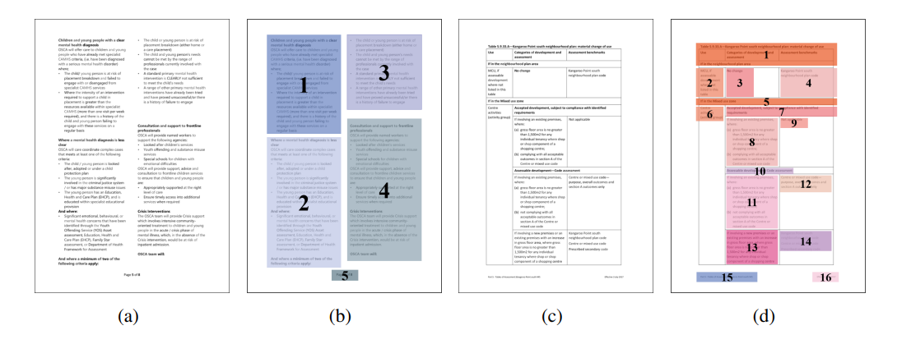

## Table of Contents

## What is a Reading Order Detection Model in machine learning?

A Reading Order Detection Model in machine learning is a type of algorithm designed to understand and replicate the way humans read text on a page. This is particularly important in document analysis and optical character recognition (OCR) systems, where the model needs to determine the correct sequence of text blocks, such as paragraphs, sentences, or even individual lines, to make the extracted text readable and coherent. By analyzing the spatial arrangement and content of text elements, the model can predict the natural reading flow, which is typically from left to right and top to bottom in languages like English.

These models often use a combination of visual features, such as the position and size of text blocks, and contextual information to determine the reading order. Techniques like deep learning, specifically convolutional neural networks (CNNs) and recurrent neural networks (RNNs), are commonly employed to process the complex patterns in document layouts. By training on large datasets of annotated documents, the model learns to recognize and predict the correct reading sequence, improving the accuracy of document digitization and making it easier for users to extract meaningful information from scanned or photographed documents.

## Why is reading order detection important in document analysis?

Reading order detection is important in document analysis because it helps machines understand how humans read a page. When we read, we naturally go from left to right and top to bottom, but machines need to be taught this. Without knowing the correct reading order, the text that a machine extracts from a document can be jumbled and hard to understand. This makes it difficult for people to use the information from the document.

For example, if a machine reads a newspaper article and gets the order wrong, the story might not make sense. By using reading order detection, the machine can put the text in the right order, making it easier for people to read and understand the document. This is especially useful for things like [books](/wiki/algo-trading-books), reports, and legal documents where the order of the text is very important.

## What are the basic components of a Reading Order Detection Model?

The basic components of a Reading Order Detection Model include a feature extraction module and a sequence prediction module. The feature extraction module is responsible for analyzing the visual and spatial characteristics of the text blocks on a page. This can involve looking at the position, size, and layout of the text to understand how it is arranged. The model uses this information to create a representation of the document that can be processed further.

The sequence prediction module then takes the extracted features and uses them to determine the correct reading order. This part of the model often uses [machine learning](/wiki/machine-learning) algorithms, like neural networks, to learn from examples of correctly ordered documents. By training on these examples, the model can predict the natural flow of reading, ensuring that the text is extracted in the right sequence. Together, these components help the model to accurately replicate the way humans read a document, making the extracted text coherent and useful.

## How does LayoutReader work to detect reading order?

LayoutReader is a tool that helps computers understand how to read a page the way humans do. It looks at a document and figures out the best order to read the text, from left to right and top to bottom. To do this, LayoutReader uses a special kind of computer program called a [neural network](/wiki/neural-network). This neural network is trained on lots of examples of documents where the reading order is already known. By studying these examples, the neural network learns to recognize patterns and predict the correct reading order for new documents.

When LayoutReader looks at a new document, it first breaks the page into smaller parts, like paragraphs or lines of text. It then uses the neural network to analyze the position and layout of these parts. The neural network looks at how close the parts are to each other and where they are on the page. Based on this information, it decides the best way to read the text. This helps make sure that when the text is extracted from the document, it is in the right order and easy for people to understand.

## What types of documents are typically processed by Reading Order Detection Models?

Reading Order Detection Models are used to process many different kinds of documents. These include books, newspapers, magazines, and reports. These models help make sure the text from these documents is read in the right order, which is important for understanding the content. For example, when you read a book, you start at the top left of the page and move down and to the right. The model helps the computer do the same thing.

These models are also useful for legal documents, academic papers, and business reports. In these cases, the order of the text is very important because it can change the meaning of the document. If a machine reads a legal contract out of order, it could miss important details or misunderstand the agreement. By using Reading Order Detection Models, the computer can make sure it reads these documents correctly, just like a person would.

## What are the common challenges faced in reading order detection?

Reading order detection can be tricky because documents come in all shapes and sizes. Sometimes, text is arranged in columns, like in newspapers, and the model has to figure out which column to read first and how to move from one column to the next. Other times, there are images or tables mixed in with the text, which can confuse the model about where the reading should continue. If the document is handwritten or has a messy layout, it becomes even harder for the model to understand the correct order.

Another challenge is dealing with different languages and writing systems. For example, some languages read from right to left or top to bottom, which is different from the usual left-to-right and top-to-bottom way of reading in English. The model needs to be trained to recognize these different patterns. Also, if the document is scanned poorly or has parts that are hard to read, the model might make mistakes in figuring out the reading order. All these challenges make it important for reading order detection models to be very smart and flexible.

## How can the performance of a Reading Order Detection Model be evaluated?

To check how well a Reading Order Detection Model works, we look at how accurately it puts text in the right order. One common way to do this is by using a measure called the F1 score. The F1 score is a number between 0 and 1 that shows how good the model is at getting the reading order right. A higher F1 score means the model is doing a better job. To find the F1 score, we compare the order the model predicts with the correct order we know from the document. If the model gets a lot of the order right, its F1 score will be high.

Another way to see how well the model is doing is by looking at how it handles different kinds of documents. We can test it on newspapers, books, and reports to see if it can read them correctly. If the model does well on all these different types of documents, it means it is good at figuring out reading order no matter what the document looks like. By testing the model on many different documents and using the F1 score, we can tell if it is working well and where it might need to improve.

## What are the differences between rule-based and machine learning approaches in reading order detection?

Rule-based approaches to reading order detection rely on predefined rules to determine how text should be read. These rules might include things like reading from left to right and top to bottom, or jumping to the next column when reaching the bottom of a page. While these methods can be effective for simple and well-structured documents, they struggle with more complex layouts, such as newspapers or magazines with multiple columns and images. Rule-based systems are easier to understand and implement but often fail when documents do not follow the expected patterns, leading to incorrect reading orders.

Machine learning approaches, on the other hand, use algorithms to learn from examples of correctly ordered documents. These models, often using neural networks, can handle a wider variety of document layouts because they can recognize patterns and adapt to different styles. By training on large datasets, machine learning models can predict the reading order more accurately, even for documents with complex structures. However, these models require a lot of data to train and can be harder to interpret and adjust compared to rule-based systems. Despite this, their ability to generalize across different document types makes them more versatile and effective in many cases.

## How does LayoutReader compare to other reading order detection models?

LayoutReader is a tool that helps computers read documents the way humans do. It uses a special kind of computer program called a neural network to figure out the right order to read text. This neural network learns from lots of examples of documents where the reading order is already known. By studying these examples, LayoutReader can predict the correct reading order for new documents, even if they have tricky layouts like newspapers or magazines. This makes it very good at handling different types of documents and getting the reading order right.

Compared to other reading order detection models, LayoutReader stands out because it can handle complex layouts better. Some other models might use simple rules to decide the reading order, which works well for straightforward documents but can fail with more complicated ones. LayoutReader's use of machine learning allows it to adapt to different document styles and still get the order correct. This makes it more flexible and accurate than many other models, especially when dealing with documents that don't follow a simple left-to-right, top-to-bottom pattern.

## What are the latest advancements in Reading Order Detection Models?

Recent advancements in Reading Order Detection Models have focused on improving their ability to handle complex document layouts. One significant development is the use of more advanced neural network architectures, such as Transformer models. These models can better understand the relationships between different parts of a document, making them more effective at determining the correct reading order. Researchers have also started using larger and more diverse datasets to train these models, which helps them perform well on a wider variety of document types, from simple text pages to complex layouts with images and tables.

Another important advancement is the integration of multimodal learning, where models not only analyze the text but also consider visual elements like images and diagrams. This helps the model understand the context better and make more accurate predictions about the reading order. For example, if there's an image with a caption, the model can learn to read the caption right after the image, just like a human would. These improvements are making Reading Order Detection Models more reliable and versatile, helping them to process documents more like how a person would read them.

## How can Reading Order Detection Models be integrated into larger document processing systems?

Reading Order Detection Models can be integrated into larger document processing systems to help them understand how to read text the right way. These models can be added to the system as a step that happens after the text is found on the page but before it is put into a final format. For example, once the system scans a document and picks out all the words, the Reading Order Detection Model can look at where the words are and decide the best order to read them. This helps make sure the final document is easy to read and understand, just like how a person would read it.

To include a Reading Order Detection Model in a larger system, you need to connect it with other parts that handle tasks like finding text and turning it into a digital format. The model can be trained to work well with these other parts by using data that shows how the whole system should work together. Once it is working well, the Reading Order Detection Model can make the whole document processing system better at understanding and organizing text from different kinds of documents, like books, newspapers, and reports.

## What future developments are expected in the field of reading order detection?

Future developments in reading order detection are expected to focus on making models even better at understanding complex document layouts. Researchers are working on using more advanced types of neural networks, like Transformer models, which can learn from a lot of data and understand how different parts of a document fit together. These models will be trained on bigger and more varied sets of documents, so they can handle all kinds of layouts, from simple text pages to tricky ones with lots of images and tables. This will help the models read documents more like how a person would, making them more accurate and useful.

Another area of future development is the use of multimodal learning, where models not only look at the text but also pay attention to pictures and other visual elements on the page. By understanding both the text and the visuals, the models can figure out the reading order more accurately. For example, if there's a picture with a caption, the model can learn to read the caption right after the picture, just like a person would. These improvements will make reading order detection models more reliable and versatile, helping them process documents in a way that feels natural to human readers.