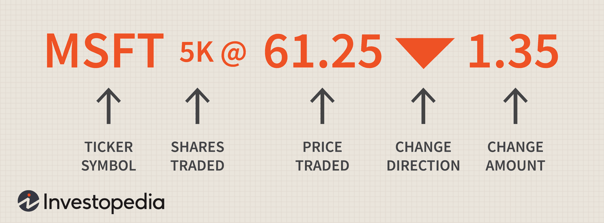

Stock tickers are fundamental in the financial markets, serving as the shorthand notation for trading securities. A stock ticker represents an issuer listed on a stock exchange and includes dynamic data such as price, volume, and price changes, which are critical for traders and investors. The essential purpose of a stock ticker is to provide real-time updates about market movements, thereby supporting informed trading decisions.

In recent years, algorithmic trading has revolutionized financial markets by leveraging technology and quantitative methods to execute trades swiftly and efficiently. Algorithmic trading depends on real-time data, including ticker information, to function properly. Algorithms use this data to identify market trends, trigger trades, and manage risks. The reliance on sophisticated algorithms allows for rapid decision-making, which human traders cannot match. Consequently, this has increased market sophistication, efficiency, and liquidity.



This article will cover several aspects central to understanding and utilizing stock tickers. It starts with defining stock tickers and examining their historical development and components. Additionally, it will guide reading and interpreting ticker tape information, including understanding symbols and color codes. Algorithmic trading will be explored in depth, with particular attention to how algorithms use ticker data in trading strategies. Factors influencing ticker selections, and the development of ticker-based trading strategies, will also be discussed. Finally, the role of machine learning in analyzing ticker data will be considered, along with the associated risks and challenges of relying heavily on real-time data for trading.

## Table of Contents

## Understanding Stock Tickers

Stock tickers play a crucial role in the stock exchange, serving as a shorthand method for identifying publicly traded companies. A stock ticker provides a succinct representation of essential trading information, facilitating swift communication among investors and traders. Typically, a stock ticker consists of a unique symbol assigned to each publicly listed company, alongside real-time updates on critical trading metrics such as price, volume, and change direction.

The concept of stock tickers can trace its origins back to the 19th century with the invention of ticker tapes. Introduced in 1867 by Edward A. Calahan, ticker tape machines were revolutionary. They used telegraph technology to transmit stock price information over long distances, printing these details on narrow strips of paper known as ticker tapes. This innovation significantly increased the speed at which stock information could be disseminated, compared to the slower methods of physical communication and manual updates. Over time, the mechanical ticker tape evolved. Digital displays have replaced paper tapes, providing even faster and more precise updates, culminating in today's electronic ticker systems displayed on various platforms.

The fundamental components of a stock ticker are its ticker symbol, price, volume, and change direction. The ticker symbol is an abbreviation—often comprising letters—that uniquely identifies a specific company on a stock exchange. For example, Apple Inc. is identified by the symbol AAPL on the NASDAQ stock exchange.

Price represents the current trading price per share of the stock in question. It is continuously updated in real time as trades occur. Volume indicates the number of shares traded within a given time frame and is often used as a measure of market activity or [liquidity](/wiki/liquidity-risk-premium) for the stock. The change direction shows whether the stock price is increasing or decreasing compared to its last known price, usually displayed with arrows or color codes: green for an increase and red for a decrease.

Understanding these components and their interplay helps traders and investors make informed decisions. As technology continues to advance, the accuracy and accessibility of ticker information improve, enabling more efficient and effective trading strategies.

## Reading the Ticker Tape

Stock ticker tapes are essential tools for traders and investors, as they convey real-time information about stock prices, volumes, and market movements. To effectively interpret this data, understanding the various components presented on a ticker tape is crucial.

A typical stock ticker displays several key pieces of information: 

1. **Ticker Symbol**: This is a unique series of letters assigned to a particular security for identification purposes. For instance, 'AAPL' represents Apple Inc.

2. **Last Traded Price**: This figure indicates the most recent price at which a stock was traded.

3. **Volume**: Displayed as the number of shares or contracts traded during the current session.

4. **Price Change**: This shows the difference in the stock price compared to the previous trading day’s close, often alongside a percentage change.

5. **Direction Indicator**: Symbols such as arrows or plus/minus signs often accompany the price change to indicate whether the price has gone up or down.

Color codes in stock tickers convey additional information. Most commonly, green is used to indicate an increase in the stock's price, red to indicate a decrease, and white or yellow for no change. These visual cues allow traders to quickly assess market conditions and make informed decisions.

Stock tickers are displayed on various platforms, ranging from traditional stock exchanges to digital outlets. On trading floors, electronic ticker display boards provide continuous updates. Online, brokerage websites and financial news platforms like CNBC or Bloomberg offer live tickers as part of their service. Mobile applications also present ticker information, allowing traders to keep track of market trends from any location.

By understanding and interpreting stock tickers, investors can make timely decisions, utilizing the real-time data for strategic trading operations. The clarity and conciseness of ticker tapes ensure that essential market information is communicated effectively to all stakeholders.

## Algorithmic Trading and Stock Tickers

Algorithmic trading, also known as automated trading, utilizes computer algorithms to make trading decisions, relying heavily on real-time data such as stock ticker information. This style of trading has grown in prominence due to its ability to process large volumes of data at speeds and accuracies that surpass human capabilities. 

Stock tickers provide essential information including the price and [volume](/wiki/volume-trading-strategy) of transactions for financial instruments, such as stocks, in real-time. Algorithms leverage this information to identify trading opportunities and execute buy or sell orders. They are capable of assessing market conditions, detecting trends, and executing trades within milliseconds. In essence, the quicker an algorithm can process ticker data and react, the more competitive it is in dynamic markets.

Algorithmic trading strategies employ various models and techniques, often grounded in [machine learning](/wiki/machine-learning) to parse historical and current ticker data effectively. Machine learning models are particularly advantageous due to their ability to identify complex patterns and relationships in data that human traders might overlook. For instance, a supervised learning model, like logistic regression, can be trained to predict the probability of a stock price going up or down based on historical ticker data. Here is a simple illustration of how logistic regression might be used:

```python
from sklearn.model_selection import train_test_split
from sklearn.linear_model import LogisticRegression
from sklearn.metrics import accuracy_score
import numpy as np
import pandas as pd

# Assuming 'df' is a DataFrame containing historical stock ticker data with features and 'target' as the price movement (1 for up, 0 for down)
features = df.drop('target', axis=1)
target = df['target']

# Split the data into training and testing sets
X_train, X_test, y_train, y_test = train_test_split(features, target, test_size=0.2, random_state=42)

# Initialize logistic regression model
model = LogisticRegression()

# Train the model
model.fit(X_train, y_train)

# Make predictions on the test set
predictions = model.predict(X_test)

# Calculate accuracy
accuracy = accuracy_score(y_test, predictions)
print(f"Accuracy: {accuracy:.2f}")
```

In the algorithm above, historical data is split into training and test datasets to train a logistic regression model and evalutate its prediction accuracy. Through back-testing various algorithms on historical ticker data, traders can refine their strategies before implementing them in live markets.

Machine learning models tap into regression analysis, neural networks, and clustering, among other techniques, each presenting unique strengths. However, challenges such as data overfitting, the model's response to unforeseen market [volatility](/wiki/volatility-trading-strategies), and computational costs underline the complexities of deploying machine learning in trading. Thus, while machine learning can significantly enhance [algorithmic trading](/wiki/algorithmic-trading) by providing sophisticated predictive and pattern recognition capabilities, it necessitates careful model selection and ongoing refinement to mitigate risks and adapt to changing market dynamics.

## Priority and Selection of Ticker Information

### Priority and Selection of Ticker Information

The selection of stock ticker information is driven by various factors, which determine the prominence and frequency of certain stocks on ticker tapes. Ticker tapes display a real-time summary of trading activities and are crucial for investors who require up-to-date financial information. This section explores the key factors determining which stocks make it to the ticker tapes, the importance of transaction volume, price changes, and significant news events, as well as the technology that enables real-time data exchanges.

#### Factors Influencing Stock Appearance on Ticker Tapes

1. **Transaction Volume**: Transaction volume is a primary determinant of which stocks appear on ticker tapes. High-volume stocks are typically included because they signify significant investor interest and liquidity. The formula for transaction volume $V$ is:

   \[ 
   V = \sum_{i=1}^{n} q_i 

$$

   where $q_i$ is the quantity of shares traded in a given transaction, and $n$ is the total number of transactions over a specific period.

2. **Price Change**: Stocks that experience substantial price fluctuations are likely to be highlighted on ticker tapes. Investors pay attention to price changes as they can indicate market sentiment or reaction to external stimuli. The price change $\Delta P$ is given by:

   \[ 
   \Delta P = P_{\text{close}} - P_{\text{open}} 

$$

   where $P_{\text{close}}$ and $P_{\text{open}}$ represent the closing and opening prices of the stock for the trading session.

3. **News Events**: Significant news, such as company earnings, mergers, or macroeconomic announcements, can cause stocks to appear more frequently on ticker tapes. Algorithms track various news sources and correlate the sentiment to potential impacts on stock prices. This process often involves natural language processing (NLP) techniques to extract relevant information.

#### Technology Behind Real-Time Data Exchanges

The dissemination of real-time ticker information hinges on sophisticated data exchange technologies. These systems ensure that data is rapidly processed and accurately delivered to platforms where investors can access it.

- **Market Data Feeds**: Stock exchanges provide data feeds that push information instantly as trades occur. These feeds include aggregated data such as bid/ask prices, transaction volumes, and executed transactions. 

- **Data Transmission Protocols**: Protocols like TCP/IP (Transmission Control Protocol/Internet Protocol) are employed to transmit ticker data efficiently. They ensure that data packets are sent in the correct order and are complete upon arrival, minimizing latency.

- **API Integration**: Application Programming Interfaces (APIs) allow trading platforms and financial applications to pull real-time ticker data. APIs provide standardized access to the data exchanges, offering endpoints for specific stock information requests.

Here's a simple Python example illustrating how financial data might be pulled via an API:

```python
import requests

def fetch_ticker_data(api_url, stock_symbol):
    try:
        response = requests.get(f"{api_url}/ticker/{stock_symbol}")
        data = response.json()
        return data
    except Exception as e:
        print(f"An error occurred: {e}")

api_url = "https://api.example.com/v1"
stock_symbol = "AAPL"
ticker_data = fetch_ticker_data(api_url, stock_symbol)

print(ticker_data)
```

This Python example demonstrates basic API interaction to retrieve ticker data using a GET request.

The prioritization and selection of ticker information not only depend on intrinsic stock characteristics like transaction volumes and price changes but are also greatly influenced by external news events and the technology that broadcasts these in real-time. Understanding the intricacies involved in this selection process allows investors and traders to make more informed decisions based on the most relevant and current information.

## Developing a Ticker-Based Trading Strategy

Developing a ticker-based trading strategy involves a systematic approach to leveraging stock ticker information for making informed trading decisions. This process is grounded in several key steps, beginning with the analysis of historical ticker data and followed by back-testing strategies before practical implementation.

**Steps to Create a Trading Strategy Using Ticker Information:**

1. **Data Collection and Preparation:** 
   The first step involves gathering historical ticker data, which includes ticker symbols, prices, volumes, and price changes over time. Data sources can range from stock exchanges to financial data APIs. This data needs to be cleaned and structured, ensuring it is free from inaccuracies and formatted for analysis.

2. **Data Analysis and Pattern Recognition:**
   Once the data is prepared, the next step is to analyze historical patterns. This involves statistical analysis and possibly the application of techniques like moving averages, relative strength index (RSI), and other technical indicators. The goal is to identify recurring trends or anomalies that could indicate prospective trading opportunities.

   For example, a moving average crossover strategy might use a formula such as:
$$
   MA_t = \frac{1}{n}\sum_{i=0}^{n-1}P_{t-i}

$$
   where $MA_t$ is the moving average at time $t$, $n$ is the number of periods, and $P_{t-i}$ is the price at time $t-i$.

3. **Strategy Development:**
   Using insights from data analysis, traders can develop hypotheses for trading strategies. For instance, if historical data shows a significant price movement following a certain pattern in the ticker data, a strategy may be designed to enter trades when this pattern is detected.

4. **Back-Testing Strategies:**
   Before actual trading, strategies must be tested against historical data to evaluate their potential profitability and risk. This process, known as back-testing, simulates the strategy in a past market scenario to assess its performance. Key metrics here include return on investment, drawdown, and win/loss ratio.

   In Python, a basic back-testing structure might look like this:
   ```python
   import pandas as pd

   def backtest_strategy(data, strategy_function):
       initial_balance = 100000  # Starting capital
       balance = initial_balance
       positions = []

       for index, row in data.iterrows():
           action = strategy_function(row)
           if action == "buy":
               positions.append(row['Price'])
               balance -= row['Price']
           elif action == "sell" and positions:
               balance += positions.pop(0)

       return balance - initial_balance

   # Example strategy function
   def crossover_strategy(row):
       if row['Short_MA'] > row['Long_MA']:
           return "buy"
       elif row['Short_MA'] < row['Long_MA']:
           return "sell"
       else:
           return "hold"
   ```

5. **Iterative Refinement:**
   Trading strategies need continuous refinement and optimization. After testing, strategies may be adjusted based on performance metrics to improve outcomes.

Analyzing historical ticker data and back-testing provide a structured path to developing robust trading strategies that leverage real-time data. Continuous learning and adaptation to market conditions ensure the strategies remain effective and competitive.

## Machine Learning in Ticker-Based Trading

Machine learning has become an integral component of modern trading strategies, especially when analyzing stock ticker data to forecast market movements. Several machine learning models are applied in trading, each with its unique approach to handling financial data like ticker information.

One common machine learning model employed in trading is logistic regression. Despite its simplicity, logistic regression is a powerful tool used to predict binary outcomes, such as whether a stock's price will go up or down. The logistic regression model predicts the probability that a given input point belongs to a particular category. In the context of stock movements, the model can be formulated as:

$$

P(y=1|X) = \frac{1}{1 + e^{-(\beta_0 + \beta_1 X_1 + \beta_2 X_2 + \cdots + \beta_n X_n)}} 
$$

where:
- $P(y=1|X)$ is the probability of the stock price increasing,
- $X_1, X_2, \ldots, X_n$ are the features derived from ticker data (e.g., previous price changes, trading volume),
- $\beta_0, \beta_1, \ldots, \beta_n$ are the coefficients learned from the training data.

A simple Python implementation could involve using libraries like scikit-learn:

```python
from sklearn.model_selection import train_test_split
from sklearn.linear_model import LogisticRegression

# Assuming data is preprocessed and divided into features (X) and labels (y)
X_train, X_test, y_train, y_test = train_test_split(X, y, test_size=0.2, random_state=42)

model = LogisticRegression()
model.fit(X_train, y_train)

predictions = model.predict(X_test)
```

Logistic regression's strength lies in its interpretability. It provides clear insights into feature importance, helping traders understand which factors most strongly influence stock price movements. Its simplicity also makes it less prone to overfitting compared to more complex models.

However, logistic regression might not capture complex relationships in the data, especially in volatile markets where non-linear patterns are prevalent. This limitation necessitates the use of more advanced models like Random Forests or neural networks that can model intricate data relationships.

Overall, machine learning models in trading bring several strengths, including the ability to process vast amounts of data swiftly and recognize patterns beyond human capability. Yet, they also come with weaknesses, such as susceptibility to overfitting and reliance on high-quality data. Moreover, during unpredictable market conditions, the predictive power of these models can diminish, necessitating a combination of human insight and machine intelligence for effective trading strategies.

## Risks and Challenges

Relying solely on ticker data for trading poses several potential risks. Ticker data, which includes information about stock prices, transaction volumes, and price changes, is crucial for making informed trading decisions. However, depending exclusively on this real-time information without considering broader market contexts or fundamental data can lead to biased or incomplete decision-making.

One primary risk involves the interpretation of ticker data during market anomalies or unusual price movements. In such scenarios, ticker data might not reflect the underlying factors driving these changes, leading traders astray if they fail to incorporate other analyses. For instance, a sudden spike in a stock's volume or price could be due to external news, such as a geopolitical event or regulatory announcement, which the ticker data alone does not convey. Traders who are unaware of these external factors might misinterpret the data, resulting in suboptimal trades.

Algorithmic trading faces distinct challenges in volatile market conditions. Algorithms, which depend heavily on real-time ticker data, may struggle to adapt to rapid and unpredictable market fluctuations. Volatility can lead to increased error rates in predictions made by these algorithms, as the historical data they rely on may not account for the current market dynamics. For example, during a market sell-off, algorithms programmed to buy when prices are low might execute trades more aggressively, only to see prices continue falling, exacerbating losses.

Moreover, the limitations of real-time data accuracy pose significant challenges. Data latency, the time it takes for data to travel from the point of origin to its destination, can introduce discrepancies. Even microsecond delays can result in differences in the perceived market state, affecting the decisions made by high-frequency trading algorithms. Data accuracy can also be compromised by erroneous data entries or glitches in data transmission, potentially leading to costly trading errors.

In parallel, changes in market microstructure, such as alterations in trading halts or shifts in liquidity, can further impact the reliability of ticker data. Algorithms that are not programmed to identify and adapt to these structural changes might make erroneous trading decisions, undermining their effectiveness.

To address these limitations, traders and algorithm developers should encompass a diverse set of data sources and analytical techniques. Integrating sentiment analysis from news articles or social media, alongside ticker data, can provide a more holistic view of the market. Additionally, ensuring robust testing of algorithms against historical data from various market conditions can help to mitigate the risks associated with volatile environments. This approach enhances the algorithm's ability to generalize across different scenarios, reducing the chances of overfitting to previous market conditions that may not represent future trends.

## Conclusion

In this article, we have explored the multifaceted role of stock tickers within the financial markets and their integration with emerging technologies. Stock tickers, once merely streams of numbers on paper, have evolved into dynamic tools vital for real-time trading decisions. As algorithmic trading continues to rise, the demand for rapid and accurate ticker information increases, underscoring its critical impact on market operations. Such data fuels complex models that facilitate swift trading decisions, revealing the sophisticated interplay between technology and financial market dynamics.

Looking ahead, the future of stock trading will likely be shaped by further technological advancements. Developments in [artificial intelligence](/wiki/ai-artificial-intelligence) (AI) and machine learning are poised to refine trading strategies, enhance data processing, and ensure greater accuracy in predictive modeling. As AI algorithms become more adept at handling vast amounts of data, we can expect more nuanced and efficient market interactions.

Nonetheless, while algorithms offer impressive computational power and speed, they cannot entirely replace the value of human insight. Successful trading strategies of the future will leverage a hybrid approach, combining the analytical prowess of machines with the contextual understanding of experienced human traders. This synergy will enable more balanced and informed decision-making, ultimately leading to a more robust financial market ecosystem. As technology evolves, maintaining this harmonious combination will be crucial in navigating the complexities of modern stock trading.

## References & Further Reading

[1]: Bergstra, J., Bardenet, R., Bengio, Y., & Kégl, B. (2011). ["Algorithms for Hyper-Parameter Optimization."](https://papers.nips.cc/paper/4443-algorithms-for-hyper-parameter-optimization) Advances in Neural Information Processing Systems 24.

[2]: ["Advances in Financial Machine Learning"](https://www.amazon.com/Advances-Financial-Machine-Learning-Marcos/dp/1119482089) by Marcos Lopez de Prado

[3]: ["Evidence-Based Technical Analysis: Applying the Scientific Method and Statistical Inference to Trading Signals"](https://www.amazon.com/Evidence-Based-Technical-Analysis-Scientific-Statistical/dp/0470008741) by David Aronson

[4]: ["Machine Learning for Algorithmic Trading"](https://github.com/stefan-jansen/machine-learning-for-trading) by Stefan Jansen

[5]: ["Quantitative Trading: How to Build Your Own Algorithmic Trading Business"](https://www.amazon.com/Quantitative-Trading-Build-Algorithmic-Business/dp/1119800064) by Ernest P. Chan