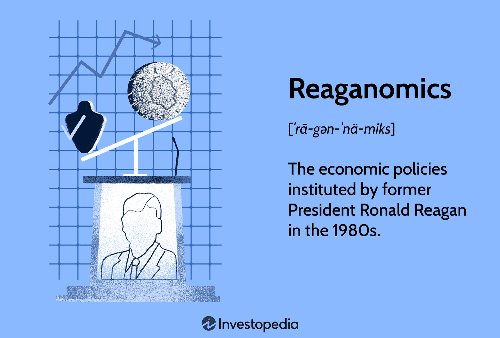

The intersection of economic theories and technological advancements has undeniably captured the attention of economists and market participants through time. Economic policies and technological strides frequently shape the dynamics of financial markets, offering new opportunities and challenges. An illustrative case of this phenomenon is found in the 1980s with the emergence of Reaganomics and algorithmic trading.

Reaganomics, named after U.S. President Ronald Reagan, signified a marked shift in economic policy during the 1980s. Characterized by tax cuts, deregulation, reduced social spending, and increased defense expenditure, this economic framework was grounded in supply-side economics and the trickle-down theory. The policies aimed to invigorate the American economy by incentivizing production and encouraging investment from both individuals and corporations.



Concurrently, the decade witnessed the nascent stages of algorithmic trading, a transformative force in financial markets. As computational power grew and markets became more complicated, algorithmic trading surfaced as a methodology to automate trading processes. It represented a paradigm shift from traditional market practices, offering speed and precision beyond the capabilities of manual trade execution.

The interplay between Reaganomics and the rise of algorithmic trading in the financial markets is a topic that intrigues scholars and practitioners alike. This article examines how Reaganomics influenced economic growth and innovation in the financial sector, subsequently fostering the environment necessary for developments like algorithmic trading to thrive. Understanding this historical context is pivotal to comprehending how past economic policies continue to influence present-day market dynamics.

## Table of Contents

## Overview of Reaganomics

Reaganomics refers to the set of economic policies implemented during President Ronald Reagan's administration in the 1980s. These policies prioritized tax reductions, deregulation, decreased expenditures on social programs, and increased defense spending. Reaganomics is fundamentally rooted in supply-side economics, which posits that economic growth can be most effectively fostered by lowering barriers for producers, such as reducing taxes and deregulating industries. The concept is closely tied to the "trickle-down theory," which suggests that benefits provided to the wealthy and businesses will "trickle down" to the lower economic strata through increased investment and job creation.

A cornerstone of Reaganomics was the Economic Recovery Tax Act of 1981, which significantly reduced income tax rates for individuals. The top marginal tax rate was lowered from 70% to 50%, and the lowest tax rate went from 14% to 11%. Corporate tax rates were also addressed through measures like the Accelerated Cost Recovery System, which allowed businesses to rapidly depreciate assets, thus reducing taxable income and encouraging capital investment.

Deregulation was another pivotal aspect of Reaganomics. Key sectors, including finance, telecommunications, and transportation, witnessed substantial deregulation intended to remove government constraints and allow for greater competition. This was based on the belief that free market competition would lead to efficiency and innovation.

Investment in military and defense was significantly amplified under Reaganomics. The administration justified increased defense spending as crucial for national security during the Cold War, leading to a substantial rise in the federal budget allocated to defense.

While these policies aimed to spur economic growth, debates persist on their efficacy and impacts, including discussions on increased national debt and income inequality. Reaganomics thus remains a topic of interest and debate among economists and policymakers.

## Impact of Reaganomics on the Economy

Reaganomics significantly influenced the U.S. economy throughout the 1980s, characterized by substantial economic growth and job creation. One of the central achievements of Reaganomics was the reduction in inflation. At the start of Reagan’s presidency in 1981, inflation rates were high due to the monetary policies of the previous decade. The Reagan administration adopted monetary policies focused on controlling inflation, resulting in a decline from a peak of 13.5% in 1980 to around 4.1% by 1988, according to data from the U.S. Bureau of Labor Statistics.

The decrease in inflation was accompanied by a notable reduction in unemployment. The highest unemployment rate during the Reagan years was approximately 10.8% in late 1982, but it had fallen to 5.4% by 1988. This decline can be attributed to the economic stimulus provided by tax cuts and deregulation, which encouraged business investments and expansions, thus creating more jobs.

While these economic policies improved growth and lowered inflation and unemployment rates, they also led to an increase in national debt. The tax cuts significantly reduced federal government revenue, while expenditures, particularly in defense, were increased. As a result, the national debt nearly tripled, growing from $997 billion in 1981 to about $2.85 trillion in 1989, according to the U.S. Department of the Treasury.

Furthermore, Reaganomics contributed to a greater wealth disparity. By focusing on tax cuts for higher income brackets and corporations, wealth distribution became more uneven. According to data from the Congressional Budget Office, the after-tax income for the top 1% of earners increased by more than 50% from 1980 to 1989, while middle and lower income brackets saw much smaller increases. This growing gap in wealth distribution was a controversial aspect of Reaganomics, raising questions about equity and long-term economic sustainability.

Overall, Reaganomics left a complex legacy, achieving significant economic growth and reducing inflation and unemployment, yet also contributing to increased national debt and wealth inequality.

## The Evolution of Algorithmic Trading

Algorithmic trading, or algo trading, represents a paradigm shift in the way financial markets operate, leveraging the power of computers and sophisticated algorithms to execute trades with speed and precision beyond human capability. The advent of [algorithmic trading](/wiki/algorithmic-trading) coincided with significant technological advancements and the evolution of global financial markets, creating new opportunities and challenges for traders and institutions.

The concept of using algorithms in trading can be traced back to the growing computational capabilities in the 1970s and 1980s. During this period, financial markets began embracing technology to handle the increasing complexity and [volume](/wiki/volume-trading-strategy) of trades. The early stages of algorithmic trading involved simple rule-based programs that automatically executed trades under predefined conditions.

One of the primary advantages of algorithmic trading is its ability to process vast amounts of data in real-time, allowing traders to identify and exploit market opportunities with unmatched speed. By automating the trading process, traders can eliminate emotional biases and human errors, leading to more consistent and reliable outcomes. In addition, algorithmic systems can operate continuously, executing trades outside of typical trading hours when markets are open globally.

During the 1980s, significant developments in market infrastructure facilitated the rise of algorithmic trading. The deregulation of financial markets, particularly in the United States and the United Kingdom, provided the necessary environment for increased competition and innovation. Trading platforms became more accessible, and electronic communication networks (ECNs) emerged, offering an alternative to traditional stock exchanges and enabling direct trading of securities.

The technological infrastructure for algorithmic trading continued to evolve rapidly, with the introduction of high-frequency trading ([HFT](/wiki/high-frequency-trading-strategies)) strategies in the 1990s and 2000s. HFT, a subset of algorithmic trading, involves placing multiple orders at extremely high speeds and aims to capture small price discrepancies within fractions of a second. These strategies require substantial investments in technology, including high-speed internet connections and cutting-edge computing power.

The rise of algorithmic trading has not been without its challenges. Concerns about market stability, transparency, and fairness have led regulators to scrutinize these practices and implement safeguards to prevent market abuse. Risk management has become a critical component of algorithmic trading, with firms employing sophisticated models to monitor and mitigate potential risks.

In summary, algorithmic trading has fundamentally transformed financial markets, combining the principles of technology and economics to enhance trading efficiency and market dynamics. The continued advancement of computational technologies and data analytics promises to further shape the future of algorithmic trading, pushing the boundaries of what is possible in global financial markets.

## Connection Between Reaganomics and Algo Trading

The economic policies known as Reaganomics, characterized by deregulation and lowered taxes, created a fertile environment for financial innovation throughout the 1980s. Deregulation, one of the cornerstones of Reaganomics, played a pivotal role in expanding financial markets. By removing numerous regulatory constraints, these policies facilitated more fluid capital flows and incentivized firms to explore new financial instruments and strategies. This deregulated landscape proved advantageous for algorithmic trading, a burgeoning field that leveraged computational power to enhance trading efficiency.

Deregulation allowed for increased market competition and innovation, driving advancements in technology and trading strategies. With fewer restrictions, financial markets could expand, thus providing ample opportunities for the growth and adoption of algorithmic trading. Algorithmic trading, which utilizes sophisticated mathematical models and computational algorithms to execute trades at speeds far surpassing human capabilities, began to flourish in this liberalized market environment. The increased market complexity and volume necessitated more efficient trading systems, and algorithmic trading filled this niche effectively.

Moreover, the tax cuts instituted under Reaganomics contributed to an atmosphere of economic buoyancy. Lowered corporate taxes increased capital availability, enabling greater investment in technology and innovation within the financial sector. This infusion of capital was critical in the development of the technology infrastructure required for algorithmic trading. By facilitating the growth of capital markets and reducing barriers to entry, Reaganomics inadvertently accelerated the uptake of computer-assisted trading strategies.

The connection between Reaganomics and algorithmic trading is indicative of how economic policies can influence technological advancements within financial markets. The deregulation and tax policies of the 1980s laid foundational elements that not only transformed the financial sector at the time but also set the stage for future innovations. As algorithmic trading continued to evolve, it capitalized on the groundwork established during this era, ultimately becoming a dominant force in modern trading practices.

## Advantages and Disadvantages of Reaganomics for Financial Markets

Reaganomics, a term associated with the economic policies of President Ronald Reagan, had significant implications for financial markets during the 1980s. These policies aimed to stimulate economic growth through various measures, notably tax cuts and deregulation. One of the primary advantages of Reaganomics was the reduction in corporate taxes, which created robust opportunities for capital investments. By lowering the tax burden on companies, these policies aimed to enhance business profitability and incentivize reinvestment into the economy, thus fostering growth.

Deregulation, a hallmark of Reaganomics, further promoted a competitive and innovative financial sector. The relaxation of regulatory constraints allowed financial institutions to explore new opportunities and engage in innovative financial practices. This deregulation enabled the financial markets to expand and evolve, laying groundwork that facilitated the growth of technologies such as algorithmic trading. The competitive environment encouraged by Reaganomics spurred advancements and efficiencies within the sector that aligned with technological progress.

However, the deregulation aspect of Reaganomics also presented potential drawbacks, particularly with regards to market stability. The easing of regulations permitted a more aggressive pursuit of profits, sometimes at the expense of prudent risk management. This environment contributed to certain financial excesses and vulnerabilities, exemplified by the Savings and Loan Crisis of the late 1980s and early 1990s, where lax regulatory oversight led to significant financial distress and eventual bailout costs borne by taxpayers. This crisis highlighted the inherent risks associated with deregulation when not balanced by sufficient oversight and risk mitigation measures. 

Thus, while Reaganomics catalyzed a period of financial innovation and economic expansion, it also underscored the need for balanced regulation to prevent instability and protect the broader economy. Understanding the advantages and disadvantages of these policies provides valuable insights into the complexities of economic management and the intricate interplay between regulation, innovation, and market stability.

## Long-Term Implications on Modern Trading

Today, algorithmic trading is a significant force within global financial markets, a reflection of regulatory and economic transformations initiated during the 1980s. The foundational policies of Reaganomics, with their emphasis on deregulation and tax reductions, created a fertile ground for technological advancement and innovation, particularly within the financial sector.

The shift towards deregulation, a hallmark of Reaganomics, directly appealed to burgeoning technological innovations by removing barriers that had previously restricted market dynamics. This deregulated environment, paired with tax incentives, encouraged increased investment in technology and catalyzed the development of sophisticated trading systems. These moves effectively paved the way for the automation witnessed in today's trading environments.

Algorithmic trading itself benefits from the increased efficiency and speed provided by technological advancements. The employment of algorithms allows traders to execute orders at optimal prices by analyzing vast datasets and responding to market movements with precision beyond human capability. Python and other programming languages have become essential tools in crafting these algorithms, as they offer robust libraries for data analysis and modeling.

```python
import numpy as np
import pandas as pd
import matplotlib.pyplot as plt

# Example of a simple moving average crossover strategy
def moving_average_strategy(prices, short_window=40, long_window=100):
    signals = pd.DataFrame(index=prices.index)
    signals['price'] = prices
    signals['short_mavg'] = prices.rolling(window=short_window, min_periods=1, center=False).mean()
    signals['long_mavg'] = prices.rolling(window=long_window, min_periods=1, center=False).mean()
    signals['signal'] = 0.0
    signals['signal'][short_window:] = np.where(signals['short_mavg'][short_window:] > signals['long_mavg'][short_window:], 1.0, 0.0)   
    signals['positions'] = signals['signal'].diff()
    return signals

# Sample data and visualization
sample_prices = pd.Series([100, 102, 104, 103, 105, 107, 108, 110, 112, 113])
signals = moving_average_strategy(sample_prices)

plt.figure(figsize=(10, 5))
plt.plot(sample_prices, label='Price')
plt.plot(signals['short_mavg'], label='40-day MA')
plt.plot(signals['long_mavg'], label='100-day MA')
plt.legend()
plt.title('Moving Average Crossover Strategy')
plt.show()
```

Algorithmic trading's dominance illustrates the lasting influence of 1980s policies on modern economic landscapes. With contemporary markets increasingly driven by technology, the importance of balancing regulatory oversight and innovation becomes paramount. The lessons derived from Reaganomics' deregulation are essential in navigating present and future economic policies to harness technology's potential while mitigating risks, such as increased market [volatility](/wiki/volatility-trading-strategies). Understanding this balance remains crucial as financial markets continue to evolve amidst rapid technological advancements.

## Conclusion

Reaganomics played a pivotal role in reshaping the economic landscape of the 1980s and its influence extends well into contemporary financial practices. The core tenets of Reaganomics—tax cuts, deregulation, and a focus on supply-side economics—facilitated a financial revolution that reverberates through modern economic systems. By substantially reducing taxes for individuals and corporations, these policies sought to invigorate capital investments, stimulating production and economic growth. Such fiscal reforms, coupled with significant deregulation, fostered an environment ripe for innovation and competitiveness in the financial sector.

The deregulation measures notably contributed to the expansion of financial markets, which laid the groundwork for technological advancements such as algorithmic trading. As a product of this new competitive realm, algorithmic trading arose from the intersection of liberated market conditions and advancements in computing technology, offering unprecedented efficiency and speed in financial transactions. This technological evolution underscores a transformation in trading practices, where algorithms now dominate a significant portion of market trading activities.

The broader implications of Reaganomics underscore vital lessons about the balance between regulation and free-market innovation. While the deregulatory approach spurred growth and facilitated technological advancements, it also served as a cautionary tale of potential market instability, exemplified by crises such as the Savings and Loan debacle. Contemporary economic policies continue to grapple with these historical dynamics, striving to maintain a balance that fosters innovation while averting financial instability.

Understanding these connections is essential for recognizing how past economic strategies continue to influence current market dynamics. As algorithmic trading and other financial technologies evolve, they highlight the enduring impact of Reagan-era policies on today's economic landscape, illustrating an ongoing dialogue between historical economic frameworks and modern financial innovations.

## References & Further Reading

[1]: Niskanen, W. A. (1988). ["Reaganomics: An Insider's Account of the Policies and the People."](https://archive.org/details/reaganomicsinsid00nisk) Oxford University Press.

[2]: ["Reaganomics and Its Legacy"](https://link.springer.com/content/pdf/10.1057/9780230616196_7.pdf) by Alice M. Rivlin, The Brookings Institution.

[3]: Jovanovic, F., & Le Gall, P. (2001). ["Does God Practice a Random Walk? The 'Financial Physics' of a Nineteenth-Century Forerunner, Jules Regnault"](https://spip.teluq.ca/fjovanovic/IMG/pdf/ejhet2001_version_publiee.pdf). The European Journal of the History of Economic Thought.

[4]: John F. Cogan, John B. Taylor, "What the 1980s Can Teach Us About Growth", Policy Review, Stanford University, Hoover Institution Press, 2012.

[5]: ["Algorithmic Trading and DMA - An Introduction to Direct Access Trading Strategies"](https://www.semanticscholar.org/paper/Algorithmic-trading-%26-DMA-%3A-an-introduction-to-Johnson/aa5de1ab883d5e23b6651faa7c1807586d688e4b) by Barry Johnson.

[6]: U.S. Department of the Treasury. ["Historical Debt Outstanding - Annual 1950-1999"](https://fiscaldata.treasury.gov/datasets/historical-debt-outstanding/).

[7]: Mark Garrison, "The Partnership: The Making of Goldman Sachs," Penguin Books, 2008.

[8]: Congressional Budget Office. ["Historical Data on Federal Debt, U.S. Revenues & Outlays, 1962–2019" (April 2019).](https://www.cbo.gov/data/budget-economic-data)

[9]: Andersen, T. G., Bollerslev, T., Christoffersen, P. F., & Diebold, F. X. (2010). ["Parametric and Nonparametric Volatility Measurement."](https://www.nber.org/papers/w8160) Review of Financial Studies.