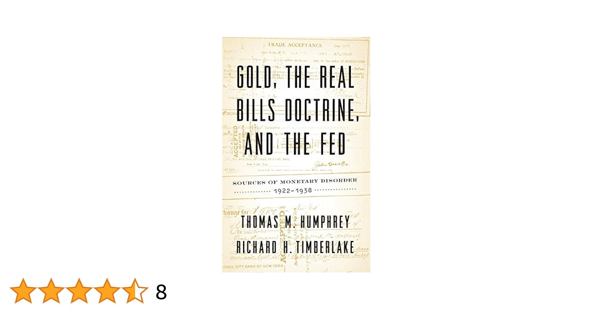

In economics and finance, understanding core theories is crucial for navigating the complexities of modern marketplaces. Economists and financial strategists have long focused on various theoretical frameworks to grasp how market forces interact and influence economic phenomena. Among the essential theories in this domain are Monetary Theory, the Real Bills Doctrine, and Algorithmic Trading.

Monetary Theory is foundational in analyzing how money supply affects inflation, employment, and economic growth. It provides insights into the mechanisms that central banks and governmental bodies utilize to manage economic cycles. Within this theory lies a significant discourse, including approaches like the Real Bills Doctrine, which historically contended that money should be issued in exchange for short-term commercial credit, thereby linking money supply to productive economic activity. This doctrine contrasts with more modern, abstract monetary policies that often separate money creation from direct economic assets.



The Real Bills Doctrine, predominantly discussed in the context of 18th and 19th-century economic thought, continues to offer valuable insights into monetary policy's evolution and its implications on economic stability. Its historical significance stems from its impact on shaping the policies meant to avoid inflationary spirals and its critiques provide a lens to evaluate speculative lending and its risks.

Algorithmic Trading emerges as a pivotal development that bridges economics and technology, redefining trading efficiency and market dynamics. By employing sophisticated mathematical models and computer algorithms, it can execute trades at speeds beyond human capabilities. This technological innovation has altered how financial theories are applied, impacting market liquidity and volatility.

In summary, this article examines how these concepts—Monetary Theory, the Real Bills Doctrine, and Algorithmic Trading—interconnect and influence both economic stability and financial strategies. Understanding these relationships is vital for devising effective policies and strategies in today’s digital age, aiming for a balanced and resilient economic system.

## Table of Contents

## Understanding Monetary Theory

Monetary theory provides a foundational understanding of how money influences economic conditions, including inflation, employment, and growth. Central to monetary theory is the debate between the Quantity Theory of Money and alternative approaches, such as the Real Bills Doctrine.

The Quantity Theory of Money emphasizes the relationship between the money supply and the general price level of goods and services. It is often expressed by the equation of exchange, articulated as $MV = PQ$, where $M$ represents the money supply, $V$ is the velocity of money, $P$ is the price level, and $Q$ is the real output. This theory, foundational in classical and monetarist economic thought, suggests that changes in the money supply directly influence price levels, thereby impacting inflation. When the money supply grows faster than the economy's ability to produce goods and services, it usually leads to inflation, which can erode purchasing power and disrupt economic stability.

Contrastingly, the Real Bills Doctrine posits that as long as money is issued in exchange for short-term, self-liquidating commercial loans, it will not lead to inflation. This approach argues that money issuance tied to real economic activity, such as legitimate commercial transactions, fosters stable price levels. However, critics argue that without stringent controls, this doctrine can lead to inflationary spirals if speculative lending is mistaken for genuine commercial activities.

Understanding these theories provides a comprehensive theoretical backbone for monetary policy decisions. Policymakers utilize these insights to navigate complex economic landscapes, balancing money supply management with the goals of promoting economic growth, maintaining employment rates, and controlling inflation. The choice between these theories influences central banks' strategies worldwide, including their open market operations, [interest rate](/wiki/interest-rate-trading-strategies) settings, and regulatory oversight.

Overall, examining the underlying principles of monetary theory not only aids in grasping the mechanisms behind money supply and demand but also elucidates the broader economic policies that shape markets and affect everyday economic experiences.

## The Real Bills Doctrine Explained

The Real Bills Doctrine emerged as a significant concept in economic thought during the 18th century. It posits that money creation should be directly tied to the issuance of credit backed by short-term commercial assets. These assets are often self-liquidating in nature, meaning they are expected to convert into cash within a short period through the process of sales and collections, thus theoretically avoiding inflationary pressures. By aligning money supply with on-demand credit grounded in actual economic transactions, this doctrine aimed to ensure that the money supply directly correlated with economic activity, thereby maintaining price stability.

However, critics argue that the Real Bills Doctrine can inadvertently lead to inflation, particularly if there is a lack of clear distinction between credit issued for productive purposes and speculative lending. In scenarios where credit is extended beyond the value of real economic goods or when it finances speculative bubbles, the system may experience excess money creation, leading to inflationary spirals. The fundamental criticism hinges on the potential for what is termed a 'feedback loop' of inflation, where increasing prices lead to higher demand for credit, thus initiating a cycle of excessive money supply.

Despite its challenges and controversies, the Real Bills Doctrine remains influential in the historical context of banking and economic policy. Its implications have been referenced in various economic debates, including discussions related to the policies of central banks and their role in managing economic stability. While many modern economists and policymakers have moved toward other monetary theories and frameworks, the Real Bills Doctrine continues to serve as a point of reference for understanding historical monetary policy decisions.

## Economic Implications of the Real Bills Doctrine

The Real Bills Doctrine has played a key role in shaping economic policies, particularly during the early 20th century. It suggests that money supply should be closely linked to short-term, real economic transactions — specifically commercial assets like real bills — to maintain a stable and inflation-free economy. This doctrine gained attention during the Great Depression, influencing central bank policies.

During the Great Depression, policymakers referenced the Real Bills Doctrine to justify monetary expansion. They believed that if money creation was secured against short-term, self-liquidating commercial loans, inflationary pressures would not escalate. However, the doctrine faced criticism for failing to address speculative excesses and the importance of controlling the overall money supply, which many argue contributed to prolonged economic instability.

This historical application highlights potential flaws in economic policies grounded solely on the Real Bills Doctrine. Critics like Irving Fisher pointed out the doctrine’s limitations in adjusting for broader economic variables beyond commercial credit, thus highlighting the importance of quantitative control over the money supply. Fisher’s work emphasized the significance of understanding nominal versus real interest rates and the purchasing power of money in effectively managing economic stability.

In modern contexts, central banks must weigh the implications of historical doctrines such as the Real Bills Doctrine when formulating monetary policies. Incorporating lessons learned from past economic events, such as those during the Great Depression, central banks strive to balance [liquidity](/wiki/liquidity-risk-premium) provision with stringent regulatory frameworks to prevent speculative lending practices that could destabilize markets. For example, contemporary monetary policy often incorporates a broader macroeconomic perspective, including inflation targeting and quantitative easing, to enhance economic resilience.

The Real Bills Doctrine’s historical significance underscores the necessity for adaptable financial frameworks that integrate both traditional and modern economic insights. By analyzing the limitations and impacts of past economic doctrines, policymakers can devise robust strategies that address current financial challenges, ensuring stability and growth within the complex global economy today.

## Algorithmic Trading: Bridging Economics and Technology

Algorithmic trading is a sophisticated method that uses advanced mathematical models and high-speed computational power to automate transactions in financial markets. This approach has fundamentally transformed trading by allowing rapid execution and minimizing human error, leading to increased market liquidity and efficiency. The core of [algorithmic trading](/wiki/algorithmic-trading) lies in the integration of technology with financial theories, notably those from monetary theory and the Real Bills Doctrine.

Monetary theory provides insights into how money supply influences economic variables such as inflation and employment. Algorithmic trading systems leverage these insights by executing trades that consider existing monetary conditions, thus aligning with broader economic strategies. For example, if an algorithm detects inflationary trends based on monetary data, it can adjust trading strategies to mitigate risks or exploit potential opportunities.

Similarly, the Real Bills Doctrine, which advocates money creation backed by short-term commercial assets, finds a modern application in algorithmic trading. Algorithms can monitor the issuance of commercial papers or short-term credit to make informed trading decisions, ensuring trades are backed by tangible commercial assets, thereby potentially reducing speculation and stabilizing markets.

The operation of algorithms based on these financial theories can be illustrated through a simple Python example that simulates trading decisions based on inflation indicators:

```python
def make_trade_decision(inflation_rate, asset_value):
    if inflation_rate > 2.0:  # Assuming 2.0 is the target rate
        return "Sell"  # Inflation above target, reducing exposure
    elif inflation_rate < 2.0:
        return "Buy"  # Inflation below target, increasing exposure
    return "Hold"

# Example usage
inflation_rate = 2.5  # Current inflation rate
asset_value = 1000  # Value of the current asset
trade_action = make_trade_decision(inflation_rate, asset_value)
print(f"Trade action based on inflation rate {inflation_rate}: {trade_action}")
```

The convergence of algorithmic trading with financial theory is crucial in modern market dynamics, enabling systems to act swiftly on economic information. This synergy has implications for financial stability, offering tools for managing economic fluctuations and potential crises. As algorithmic trading continues to evolve, understanding its foundation in economic theory is vital for leveraging its full potential in today's financial markets.

## The Role of Algorithmic Trading in Monetary Policy

Algorithmic trading has become an integral component of financial markets, offering increased speed and efficiency in executing trades compared to traditional human trading. These systems are designed to process vast amounts of financial data quickly and execute orders at speeds that can stabilize or destabilize markets. The incorporation of algorithmic trading into monetary policy mechanisms reflects both the opportunities and challenges inherent in this technological advancement.

One of the primary benefits of algorithmic trading in the context of monetary policy is its ability to enhance market liquidity. Algorithms can be programmed to manage large volumes of trades, ensuring that markets remain liquid even during periods of significant [volatility](/wiki/volatility-trading-strategies). This liquidity provision is crucial for the effective transmission of monetary policy since it helps stabilize asset prices and borrowing costs, thus facilitating smoother economic conditions.

Algorithmic trading systems also enhance the precision of monetary policy implementation. Central banks can employ these systems to execute transactions that align with their policy goals, such as maintaining target interest rates or adjusting currency supplies. These automated strategies can be more precisely calibrated than human trading tactics, allowing for a more nuanced approach to managing economic stability.

However, the speed and scale of algorithmic trading can also introduce risks. The potential for these systems to exacerbate market volatility is present, particularly if algorithms react to market signals in a manner that amplifies price fluctuations. Such reactions can lead to a phenomenon known as a "flash crash," where market prices drop precipitously within minutes. The interaction between numerous trading algorithms can create feedback loops that magnify market disturbances, challenging monetary authorities in maintaining financial stability.

The influence of algorithmic trading on market dynamics necessitates careful monitoring and regulation. Policymakers must understand how algorithms interact with market conditions and incorporate this understanding into their economic governance frameworks. This involves ensuring transparency in algorithmic operations, setting regulations to mitigate systemic risks, and fostering collaboration between technological innovators and regulatory bodies.

Despite the challenges, algorithmic trading offers a promising avenue for enhancing the effectiveness of monetary policy. By allowing for the rapid processing of information and the swift execution of strategies, these systems can support central banks in achieving their economic mandates. As financial markets continue to evolve with technological advancements, the careful integration of algorithmic trading into monetary policy frameworks will be essential for sustaining economic stability.

## Conclusion: Integrating Theory with Practice

The integration of monetary theory, economic doctrines, and algorithmic trading provides a nuanced framework for understanding financial markets today. By examining how these theories influence real-world financial practices, economists and investors can improve their ability to predict and react to market fluctuations. This is crucial as the modern financial ecosystem becomes increasingly complex and interdependent.

Monetary theory lays the groundwork by analyzing how money affects economic variables such as inflation and employment. Historically, the debates within this theory, such as those between the quantity theory of money and the Real Bills Doctrine, have shaped monetary policy. Modern algorithms in trading apply these foundational principles to enhance decision-making processes. For example, an algorithm might leverage the quantity theory of money to predict inflationary trends, supplementing traditional economic forecasts with real-time data analysis.

Economic doctrines like the Real Bills Doctrine historically influenced banking and economic policies, offering insights into managing currency supply and preventing inflation. Although controversial, its principles can still inform current economic strategies, especially when integrated into advanced computational models. Algorithmic trading serves as a bridge, enabling the application of these economic principles in a rapidly evolving market environment.

Algorithmic trading has revolutionized financial markets by automating trades using complex models and computational power. This technology can execute trades at speeds and scales beyond human capability, potentially stabilizing or destabilizing markets. It is therefore critical to understand how these technologies interact with monetary policies to mitigate risks and leverage opportunities.

As financial markets continue to evolve, the successful fusion of theoretical frameworks with technological advancements could dictate the future of economic stability. By integrating monetary theory, traditional economic doctrines, and emergent technologies like algorithmic trading, a more resilient and adaptable financial system can be achieved. Consequently, a comprehensive approach that unites theory with practice is essential for navigating and sustaining the complexities of modern financial markets.

## References & Further Reading

[1]: Humphrey, T. M. (1982). ["The Real Bills Doctrine."](https://www.richmondfed.org/-/media/richmondfedorg/publications/research/economic_review/1982/pdf/er680501.pdf) Federal Reserve Bank of Richmond Economic Review.

[2]: Friedman, M., & Schwartz, A. J. (1963). ["A Monetary History of the United States, 1867-1960."](https://www.jstor.org/stable/j.ctt7s1vp) Princeton University Press.

[3]: Fisher, I. (1930). ["The Theory of Interest."](https://oll.libertyfund.org/titles/fisher-the-theory-of-interest) Macmillan.

[4]: Lopez de Prado, M. (2018). ["Advances in Financial Machine Learning."](https://www.amazon.com/Advances-Financial-Machine-Learning-Marcos/dp/1119482089) Wiley.

[5]: Smith, V. C. (1936). ["The Rationale of Central Banking and the Free Banking Alternative."](https://archive.org/details/in.ernet.dli.2015.89887) Liberty Fund Inc.

[6]: Chan, E. (2009). ["Quantitative Trading: How to Build Your Own Algorithmic Trading Business."](https://github.com/ftvision/quant_trading_echan_book) Wiley.

[7]: Aronson, D. R. (2006). ["Evidence-Based Technical Analysis: Applying the Scientific Method and Statistical Inference to Trading Signals."](https://www.amazon.com/Evidence-Based-Technical-Analysis-Scientific-Statistical/dp/0470008741) Wiley.

[8]: Jansen, S. (2020). ["Machine Learning for Algorithmic Trading."](https://github.com/stefan-jansen/machine-learning-for-trading) Packt Publishing.