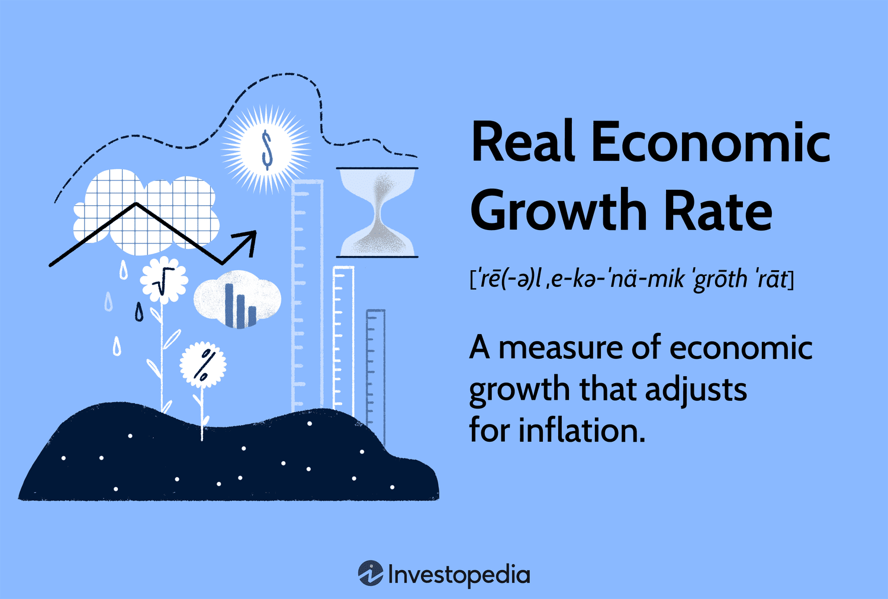

In finance and economics, understanding the key drivers of economic growth and the implications of economic indicators is crucial. Economic growth is a fundamental measure of a country's economic health, reflecting its capacity to produce goods and services. Key metrics such as Gross Domestic Product (GDP), employment rates, and inflation are essential economic indicators that provide insights into an economy's performance and future direction.

This article explores the intricate relationship between economic indicators, economic growth, growth rates, and the emerging role of algorithmic trading. Changes in these indicators can significantly influence growth rates, affecting decisions by policymakers and investors. For instance, an increase in GDP typically signals economic expansion, potentially leading to higher investment levels and consumer spending. Conversely, rising inflation may signify overheating economies, prompting monetary interventions.



Understanding how economic indicators influence growth rates is essential for assessing economic conditions and informing investment strategies. The real economic growth rate, which adjusts for inflation, provides a clearer view of an economy's genuine growth potential, helping to compare historical performance and across different economies.

In addition to traditional methods of economic analysis, algorithmic trading has emerged as a powerful tool for financial professionals to respond to market movements influenced by economic indicators. Firms utilize sophisticated algorithms to analyze vast datasets, making rapid, informed trading decisions based on current economic data. This represents a convergence of statistical analysis and economic theory, enabling traders to forecast market trends and optimize investment outcomes.

In conclusion, understanding these concepts not only aids in grasping the bigger economic picture but also in leveraging technology for better investment decisions. As we continue to navigate a data-driven financial landscape, the ability to interpret economic indicators and their influence on growth rates will remain pivotal for investors and economic planners.

## Table of Contents

## Understanding Economic Indicators

Economic indicators are critical quantitative metrics used to gauge the current state and forecast the future trajectory of an economy. These indicators provide invaluable insights for economists, policymakers, and investors, allowing them to assess economic health and make data-driven decisions. The core economic indicators include Gross Domestic Product (GDP), employment rates, inflation, and consumer confidence indices, each playing a distinct role in painting a comprehensive picture of economic conditions.

GDP is one of the most prominent indicators, representing the total value of all goods and services produced within a country's borders over a specified period. It serves as a comprehensive measure of economic activity and is often examined in real terms to account for inflation—real GDP. The formula for GDP is generally expressed as:

$$
\text{GDP} = C + I + G + (X - M)
$$

where $C$ stands for consumer spending, $I$ is investment by businesses, $G$ denotes government spending, and $(X - M)$ is the net exports, calculated as exports minus imports.

Employment rates, another vital indicator, reflect the percentage of the labor force that is employed. High employment rates typically indicate robust economic activity, whereas increasing unemployment can signal economic distress or the onset of a recession.

Inflation, measured by indices such as the Consumer Price Index (CPI) and the Producer Price Index (PPI), tracks the rate at which the general price level of goods and services rises. Persistent inflation affects purchasing power and can lead to significant adjustments in monetary policy.

Consumer confidence indices provide insights into individuals' sentiments regarding the current and future state of the economy. High consumer confidence boosts spending, driving economic activity, while low confidence can restrain it.

Economic indicators are categorized into three types: leading, coincident, and lagging indicators. Leading indicators, such as stock market returns or business investment levels, tend to predict future economic activity. Coincident indicators, like GDP and employment figures, provide real-time analysis of economic performance. In contrast, lagging indicators, such as unemployment rates or corporate profits, confirm trends evident after they occur.

For investors and businesses, staying informed about these indicators is crucial. They influence everything from stock prices and interest rates to fiscal and monetary policies. A keen understanding of economic indicators can drive strategic business and investment decisions, ultimately impacting profitability and economic resilience.

## Economic Growth and Growth Rates

Economic growth is defined as the increase in the production of goods and services in an economy over a given time period. This increase is commonly quantified using growth rates, particularly the real economic growth rate. The real economic growth rate is expressed as a percentage and indicates the year-over-year expansion of an economy, adjusting for inflation. This adjustment is crucial for providing an accurate measure of an economy's performance, as it accounts for the erosion of purchasing power due to rising prices.

$$
\text{Real Economic Growth Rate} = \frac{\text{GDP}_{\text{current}} - \text{GDP}_{\text{previous}}}{\text{GDP}_{\text{previous}}} \times 100
$$

where $\text{GDP}_{\text{current}}$ and $\text{GDP}_{\text{previous}}$ represent the current and previous year's real Gross Domestic Product, respectively.

Grasping growth rates is essential for economists and investors as they evaluate the performance and overall health of an economy. These rates provide a comparative framework for assessing progress relative to prior periods and benchmarking against other economies globally. A positive growth rate suggests an expanding economy, which can correlate with rising employment rates, increasing consumer confidence, and greater levels of investment.

Growth rates have a significant influence on both fiscal and monetary policy decisions. For instance, central banks may adjust interest rates based on expected economic expansion or contraction as indicated by growth rates. A higher growth rate might lead to increased interest rates to prevent inflation, while a lower growth rate might prompt cuts to encourage borrowing and investment. Similarly, governments might alter public spending strategies to stimulate or rein in economic activities in response to these indicators.

Maintaining a stable growth rate is pivotal for ensuring sustainable economic development and fostering a climate of investor confidence. An economy that grows too quickly might overheat, leading to inflationary pressures and potential financial instability. Conversely, an economy plagued by slow or negative growth might face challenges such as unemployment and reduced consumer spending.

In summary, understanding economic growth rates allows stakeholders to make informed decisions that promote economic stability and growth, reinforcing confidence among investors and ensuring sound economic management.

## Algorithmic Trading and Economic Indicators

Algorithmic trading employs sophisticated algorithms to execute trading decisions informed by real-time data, including vital economic indicators. The practice has gained prominence due to its ability to analyze extensive datasets swiftly and implement trades with precision and speed that surpass human capability. Key players like Renaissance Technologies and Two Sigma leverage economic indicators, such as GDP growth rates, unemployment figures, inflation rates, and consumer sentiment indices, to refine their algorithmic strategies and enhance performance.

By incorporating economic data, [algorithmic trading](/wiki/algorithmic-trading) platforms can quickly adapt to market dynamics, utilizing economic trends to maximize profitability. For instance, a strong GDP report might indicate a robust economy, prompting algorithms to increase allocations in equity markets. Conversely, a spike in inflation may trigger algorithms to shift investments towards assets that typically hedge against inflationary pressures, such as commodities or inflation-protected securities.

These algorithms function by evaluating large swathes of economic data sets to project potential market movements. They employ various statistical methods and [machine learning](/wiki/machine-learning) techniques to identify patterns and trends which might not be apparent through conventional analysis. For example, a basic model might use linear regression to predict the impact of unemployment data on stock market indices:

```python
from sklearn.linear_model import LinearRegression
import numpy as np

# Example data
unemployment_rate = np.array([3.5, 4.0, 4.5, 5.0, 5.5]).reshape(-1, 1)
stock_index_performance = np.array([10, 8, 7, 5, 3])

# Linear Regression Model
model = LinearRegression().fit(unemployment_rate, stock_index_performance)

# Predict future stock index performance when unemployment rate is 6.0
predicted_performance = model.predict(np.array([[6.0]]))
print(predicted_performance)
```

The integration of economic indicators into algorithmic trading models exemplifies the fusion of economic theories with technological advancements. This intersection allows for sophisticated data-driven strategies, enabling traders and firms to make well-informed decisions with a heightened level of accuracy. As the tempos of financial markets continue to accelerate, the sophistication of these algorithms is expected to increase, making them indispensable tools in modern trading and finance. The ongoing enhancements in computation and data analysis capabilities promise even greater precision in incorporating economic indicator data, advancing the strategic landscape of algorithmic trading.

## Impact of Economic Indicators on Financial Markets

Economic indicators play a pivotal role in shaping financial market dynamics. They provide insights into the current and future economic landscape, thereby influencing investor behavior and market trends. Positive economic indicators, such as an increase in Gross Domestic Product (GDP) or higher employment rates, typically enhance investor confidence. This confidence often manifests in bullish markets, where asset prices rise as demand increases. Investors anticipate improved corporate earnings and economic stability, prompting increased investment activities.

In contrast, negative indicators, such as unexpected inflation spikes or rising unemployment, may precipitate market corrections or bearish trends. For example, inflation reduces purchasing power, leading to increased production costs and potential profit margin compression for companies. When investors perceive these risks, they may reduce their exposure to equities, driving prices lower. Additionally, central banks may raise interest rates to combat inflation, increasing the cost of borrowing and potentially slowing economic growth.

The timing and impact of economic indicators are crucial for making informed investment decisions. For instance, a forecasted GDP growth rate that is subsequently revised downward may lead to a repricing of stocks, as market participants adjust their expectations. Hence, staying informed about the release schedules and the expected versus actual outcomes of these indicators is vital for financial market strategists and individual investors alike.

Economic indicators are not only passive signals but also active tools in algorithmic trading. Traders and financial institutions deploy sophisticated algorithms that rapidly process real-time economic data to anticipate market movements. By integrating relevant economic indicators into their models, these algorithms enable traders to swiftly respond to shifts in market sentiment and economic forecasts. This integration allows algorithmic trading systems to execute trades with precision, capitalizing on opportunities before traditional market participants can react.

In conclusion, the predictive power of economic indicators ensures their critical influence on financial markets. They serve as valuable tools for understanding market conditions, constructing trading strategies, and optimizing investment portfolios. Consequently, a thorough grasp of economic indicators and their potential impact is indispensable for navigating the complexities of today's financial environment.

## Conclusion

Economic indicators, growth rates, and algorithmic trading represent critical facets of the contemporary financial landscape. These elements are intrinsically linked, with the interpretation of economic indicators serving as a pivotal skill for devising effective investment strategies. A clear understanding of how these indicators—such as GDP, employment rates, and inflation—affect growth rates is crucial for making informed financial decisions. By evaluating these connections, investors can better assess the economic health and future prospects, ensuring strategies are aligned with macroeconomic realities.

Algorithmic trading embodies the synergy between statistical analysis and economic theory, providing a framework for optimized trading decisions. It leverages quantitative models to interpret vast datasets, including economic indicators, allowing traders to execute decisions with greater precision and speed. This method relies on algorithms that can process real-time economic data efficiently, contributing to more nuanced market analyses. Python and other programming languages play a crucial role in developing these algorithms, enhancing their ability to respond to market dynamics.

The technological advancements in algorithmic trading are making the integration of economic indicators even more sophisticated. As computational power and data analytics improve, the algorithms become more adept at capturing subtle market signals influenced by these indicators. This evolving complexity forecasts a future where algorithmic trading is not just more widespread but also deeply integrated with high-level economic analytics, offering unprecedented opportunities for traders.

For anyone engaged in economic planning or investment activities, staying informed about economic indicators, growth rates, and the advancements in algorithmic trading technology is vital. This continuous learning process ensures the adaptation to the rapid changes in the financial ecosystem, allowing individuals and institutions to maintain a competitive edge in a tech-driven market.

## References & Further Reading

[1]: Bergstra, J., Bardenet, R., Bengio, Y., & Kégl, B. (2011). ["Algorithms for Hyper-Parameter Optimization."](https://papers.nips.cc/paper/4443-algorithms-for-hyper-parameter-optimization) Advances in Neural Information Processing Systems 24.

[2]: ["Advances in Financial Machine Learning"](https://www.amazon.com/Advances-Financial-Machine-Learning-Marcos/dp/1119482089) by Marcos Lopez de Prado

[3]: ["Evidence-Based Technical Analysis: Applying the Scientific Method and Statistical Inference to Trading Signals"](https://www.amazon.com/Evidence-Based-Technical-Analysis-Scientific-Statistical/dp/0470008741) by David Aronson

[4]: ["Machine Learning for Algorithmic Trading"](https://github.com/PacktPublishing/Machine-Learning-for-Algorithmic-Trading-Second-Edition) by Stefan Jansen

[5]: ["Quantitative Trading: How to Build Your Own Algorithmic Trading Business"](https://www.amazon.com/Quantitative-Trading-Build-Algorithmic-Business/dp/1119800064) by Ernest P. Chan