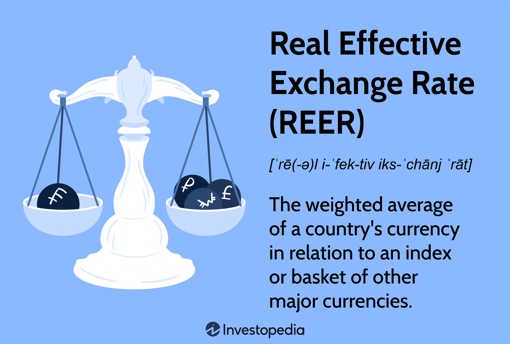

The Real Effective Exchange Rate (REER) serves as a pivotal economic indicator, instrumental in assessing a nation's currency strength relative to its principal trading partners. Unlike nominal exchange rates, which simply reflect the price of a currency in terms of another currency, the REER offers a more comprehensive perspective. It incorporates multiple bilateral exchange rates, adjusting for inflation disparities among countries, thereby providing a realistic evaluation of currency value over time. This adjustment for inflation differences means that the REER can highlight whether a currency is becoming more or less competitive in international markets.

Mathematically, the REER is a weighted average of bilateral real exchange rates, often expressed in the formula:



$$

REER = \prod_{i=1}^{n} \left( \frac{E_i}{P_i} \right)^{w_i}
$$

where $E_i$ represents the nominal exchange rate with trading partner $i$, $P_i$ is the relative price index (capturing inflation effects), and $w_i$ denotes the trade weight of partner $i$. These weights are primarily derived from the trade volumes between the domestic country and each of its trading partners, ensuring that the REER accurately mirrors the economic interactions influencing currency value.

The REER is crucial in economic analysis as it provides insights into a nation's trade competitiveness. An increasing REER may indicate that a country's goods are becoming more expensive in international markets, potentially reducing export competitiveness. Conversely, a declining REER suggests enhanced competitiveness as domestic goods become relatively cheaper for foreign buyers. Policymakers and economists utilize REER to forecast economic conditions and formulate strategies aimed at bolstering economic growth by improving trade balances.

Moreover, in algorithmic trading, understanding and leveraging the nuances of REER can be advantageous. Traders use shifts and trends in REER to anticipate currency movements and adjust their trading strategies for optimized results. As such, knowledge of REER becomes an essential component for building robust trading algorithms that seek to exploit inefficiencies in currency markets.

This article aims to elucidate the intricacies of the REER formula, explore its vital role in assessing economic performance, and examine practical applications in algorithmic trading. Through this examination, it is evident that mastering REER is fundamental for making informed decisions in international economics and financial markets.

## Table of Contents

## Understanding the REER Formula

The Real Effective Exchange Rate (REER) formula involves a comprehensive calculation that reflects a country's currency value against a basket of currencies from its trading partners, adjusted for inflation. The formula is designed to provide a real measure of currency strength rather than a nominal one, offering a more nuanced insight into trade competitiveness and economic standing.

**Mathematical Representation:**

The REER is computed by taking a weighted average of the real exchange rates between the home country and its partners. The general formula is as follows:

$$

\text{REER} = \prod_{i=1}^n \left(\frac{E_i \times P}{P_i}\right)^{w_i} 
$$

Where:
- $E_i$ is the nominal exchange rate between the domestic currency and currency $i$.
- $P$ is the price level (typically a consumer price index) in the home country.
- $P_i$ is the price level in country $i$.
- $w_i$ is the trade weight of country $i$, indicating the significance of that country in the home country's trade portfolio.
- $n$ represents the number of trading partner countries.

**Components Breakdown:**

1. **Nominal Exchange Rate Adjustments ($E_i$):** Each bilateral exchange rate reflects the value of one currency relative to another. The nominal rates are adjusted to real rates by accounting for price level differences, ensuring that the analysis reflects genuine purchasing power.

2. **Inflation Differentials ($\frac{P}{P_i}$):** By incorporating the price levels of the domestic and foreign countries, the formula eliminates the effects of inflation, offering a 'real' exchange rate. This adjustment is crucial for comparing purchasing powers and understanding the actual competitiveness of goods in different markets.

3. **Trade Weights ($w_i$):** Weights are assigned based on the proportion of trade with each partner, reflecting the relative importance of each partner in the home country's economy. This weighted average ensures that more significant trading relationships have a larger impact on the REER.

Understanding the REER involves recognizing how these components interact to provide a clearer picture of exchange rates beyond nominal values. The calculation is critical for economic analysis, allowing policymakers and financial analysts to assess how inflation and trade relations impact a country's currency value and competitiveness on the global stage. This nuanced approach makes REER a valuable tool for understanding currency health beyond mere exchange rate fluctuations.

## Significance of REER in Economic Analysis

The Real Effective Exchange Rate (REER) plays a pivotal role in evaluating a country's trade capabilities and competitiveness by reflecting changes in exchange rates and inflation differentials among trading partners. It goes beyond nominal exchange rates by providing a comprehensive view of a currency's value, adjusted for inflation and trade weights, to present a more realistic picture of a country’s foreign exchange position.

An increasing REER indicates that a country's currency has appreciated after accounting for inflation, resulting in a potentially weaker competitive edge in international markets. This appreciation can make exports less competitive due to higher prices in foreign markets, ultimately reducing a country's share in global trade. Conversely, a decreasing REER suggests a depreciation of the currency in real terms, enhancing trade competitiveness by making exports cheaper and imports more expensive when compared to goods produced domestically.

In policy-making, REER serves as a critical tool for shaping economic strategy and decisions. Policymakers use REER as a gauge for setting appropriate monetary and fiscal policies. For instance, if a country experiences a sustained increase in its REER, indicating dwindling competitiveness, it might opt for measures that reduce production costs or engage in monetary interventions to stabilize the currency. This proactive approach aids in maintaining a balanced trade environment and ensures long-term economic stability.

REER also significantly contributes to economic forecasting by enabling analysts to predict trade balance adjustments and gauge potential economic shifts. By examining trends in REER, forecasters can infer how changes in competitiveness might influence economic growth, employment, and inflation rates. The insights derived from REER trends can also inform industrial and sectoral adjustments needed to respond to global economic conditions.

Furthermore, changes in REER are studied to anticipate shifts in investment flows. An appreciating REER might deter foreign investment in export-driven sectors, while a depreciating REER could attract investments aiming to capitalize on cheaper export opportunities. Thus, REER is an essential component of comprehensive economic analysis, aiding nations in navigating the complexities of global economic interactions and enhancing decision-making processes with informed insights.

## Calculating REER: A Step-by-Step Guide

Calculating the Real Effective Exchange Rate (REER) involves multiple steps, incorporating various factors like bilateral exchange rates, trade weights, and inflation differentials. Here’s a simplified but comprehensive guide to understanding this calculation.

### Step-by-Step Calculation Process

1. **Determine Trade Weights:**
   Each trading partner's weight is determined based on the significance of the trade relationship. If Country A trades predominantly with Countries B and C, the trade weights $w_B$ and $w_C$ would be calculated as follows:
$$
   w_B = \frac{\text{Trade with Country B}}{\text{Total Trade}}

$$
$$
   w_C = \frac{\text{Trade with Country C}}{\text{Total Trade}}

$$

   **Example:** If Country A trades $60 million with Country B and $40 million with Country C out of a total trade of $100 million, then $w_B = 0.6$ and $w_C = 0.4$.

2. **Adjust for Inflation:**
   Adjust each exchange rate by the respective inflation rates to reflect the real purchasing power. The inflation-adjusted exchange rate between two countries can be modeled using:
$$
   R_{AB} = E_{AB} \times \frac{P_B}{P_A}

$$
   Where $R_{AB}$ represents the real exchange rate, $E_{AB}$ is the nominal exchange rate, and $P_A$ and $P_B$ are the price levels in Country A and Country B, respectively.

   **Example:** Suppose the nominal exchange rate $E_{AB}$ is 1.5, with inflation rates leading to $P_A = 1.02$ and $P_B = 1.03$.

3. **Calculate Bilateral Real Exchange Rates:**
   For each trading partner, calculate the bilateral real exchange rate using the formula from Step 2.

4. **Compute the REER:**
   The REER is a weighted average of the bilateral real exchange rates. The formula is given by:
$$
   \text{REER} = \prod_{i=1}^{n} (R_{Ai})^{w_i}

$$
   Where $R_{Ai}$ indicates the adjusted real exchange rate between Country A and each trading partner, and $w_i$ represents the trade weight.

   **Example:** Given $R_{AB} = 1.51$ and $R_{AC} = 1.02$, where $w_B = 0.6$ and $w_C = 0.4$:
$$
   \text{REER} = (1.51)^{0.6} \times (1.02)^{0.4} \approx 1.32

$$

### Interpretation of Results

The resulting REER value provides insights into a country's trade competitiveness. A REER value above the benchmark (often set as 100 or 1 for comparative analysis) indicates a loss in trade competitiveness due to a strong currency making exports more expensive and imports cheaper. Conversely, a REER below the benchmark suggests improved competitiveness, highlighting a weaker currency that makes exports cheaper and imports more expensive.

In the example provided, if the calculated REER is 1.32, it indicates that Country A’s trade competitiveness might be declining as its currency is stronger relative to its trading partners after adjusting for inflation differentials.

In summary, the REER is a crucial indicator that can highlight shifts in a country's economic landscape, assisting policymakers and economists in assessing trade strategies and economic policies effectively.

## REER vs. Spot Exchange Rate

The Real Effective Exchange Rate (REER) and the spot exchange rate serve distinct purposes in financial markets and macroeconomic policy, offering different insights into currency valuation.

A spot exchange rate represents the current price at which one currency can be immediately exchanged for another. It reflects the prevailing demand and supply conditions for a currency pair, capturing market sentiment and geopolitical events, which can cause rapid fluctuations. Traders and investors utilize spot rates for immediate transactions, making them crucial for short-term financial decisions, foreign exchange trading, and [arbitrage](/wiki/arbitrage). For instance, if an import-export business needs to settle transactions swiftly, spot rates serve as the go-to measure.

In contrast, the REER presents a more comprehensive economic assessment by considering a currency’s value against a basket of foreign currencies from the country's significant trading partners. The REER adjusts spot exchange rates by the relative price indices or inflation rates, providing a "real" measure of currency competitiveness over time. The formula for REER is usually expressed as:

$$
\text{REER} = \left( \prod_{i=1}^{n} \left( \frac{E_i}{P \times P_i^*} \right)^{w_i} \right) \times 100
$$

where $E_i$ is the nominal exchange rate with trade partner $i$, $P$ is the domestic price level, $P_i^*$ is the international price level of partner $i$, and $w_i$ is the trade weight corresponding to partner $i$. This formula integrates multiple bilateral rates and inflation differentials, providing a weighted average exchange rate that reflects trade relations and price competitiveness.

The REER's broader focus makes it vital for long-term macroeconomic analysis and policy-making. It helps determine a country's trade competitiveness, inflationary pressures, and potential adjustments needed in exchange rate policies. For instance, a rise in the REER might indicate a loss of competitiveness due to an appreciated currency, prompting policymakers to consider interventions.

In the financial markets, while spot rates are instrumental for executing trades, the REER assists in understanding underlying economic trends and forecasting currency movements. Both metrics are integral, with the spot exchange rate providing immediate actionable data for traders, and the REER offering strategic insights into a country's economic health, essential for shaping monetary and fiscal policies.

Overall, the REER and spot exchange rate, though interconnected, cater to varied analytical needs, from offering instant trading quotes to forming the backbone of comprehensive economic evaluations.

## Limitations of REER

The Real Effective Exchange Rate (REER) is a sophisticated tool for evaluating a country's currency strength, and while it provides valuable insights into trade competitiveness, it is not without its limitations. One primary limitation of REER is its sensitivity to factors beyond mere trade. For example, tariffs imposed by trading partners can significantly impact trade balances and, consequently, the REER. Tariffs increase the cost of imported goods, which can lead to a distorted view of a currency's competitive position. 

Moreover, market interest rates play a crucial role. Fluctuations in interest rates can affect capital flows, influencing demand for a currency independently of its trade performance. Higher interest rates often attract foreign capital, leading to currency appreciation, which may be reflected in an elevated REER that does not necessarily correspond to improved trade competitiveness.

Given these potential distortions, relying exclusively on REER as an economic performance measure can be misleading. It is essential to exercise caution and consider REER alongside a range of other economic indicators. For example, analyzing the balance of trade [statistics](/wiki/bayesian-statistics), GDP growth rates, and foreign direct investment trends can offer a more comprehensive picture of a nation's economic health. 

In economic analysis, metrics such as the Consumer Price Index (CPI) and Producer Price Index (PPI) provide insights into inflationary pressures that might not be fully captured by REER. Similarly, examining fiscal and monetary policy frameworks can shed light on economic stability and growth prospects. 

By integrating REER with these diverse indicators, policymakers and analysts can avoid overreliance on a single measure and instead derive well-rounded insights into a country's economic performance and currency dynamics.

## Algorithmic Trading Strategies Using REER

Real Effective Exchange Rate (REER) can be a valuable metric in [algorithmic trading](/wiki/algorithmic-trading) models to predict currency movements and optimize trading strategies. By incorporating REER data, traders can gain insights into a currency's real value relative to its trade-weighted competitors, adjusting for inflation differences. Understanding these dynamics helps traders identify potential overvaluation or undervaluation, thereby guiding investment decisions.

### Quantitative Methods and Algorithms Utilizing REER

Algorithmic trading strategies often rely on quantitative models that integrate various economic indicators. REER can be used to enhance these models, particularly by employing time-series analysis and [machine learning](/wiki/machine-learning) techniques. For instance, traders can use autoregressive models such as ARIMA (AutoRegressive Integrated Moving Average) to predict future REER values based on historical data. This can be particularly powerful when combined with other macroeconomic indicators in a multiple regression framework.

Consider a simplified example using Python and the ARIMA model:

```python
import pandas as pd
from statsmodels.tsa.arima.model import ARIMA

# Load historical REER data
reer_data = pd.read_csv('reer_data.csv', index_col='Date', parse_dates=True)

# Fit the ARIMA model
model = ARIMA(reer_data, order=(5,1,0))
model_fit = model.fit(disp=0)

# Forecast future REER values
forecast = model_fit.forecast(steps=12)
print(forecast)
```

This code snippet forecasts the REER for the next 12 periods, helping traders anticipate shifts in currency competitiveness. Machine learning algorithms, like neural networks, can also process REER data alongside other variables to identify complex patterns and enhance predictive accuracy.

### Case Studies and Historical Applications

REER's role in algorithmic trading has been highlighted in several case studies. For example, during the 2008 financial crisis, countries like China utilized REER data to adjust their currency policies, which influenced currency markets significantly. If trading algorithms had incorporated REER insights, they might have better predicted the renminbi's movements.

Another instance is the Asian financial crisis of 1997-1998, where a rapid change in REER indicated currency overvaluation in several Asian countries. Algorithms that monitored REER trends during this period could have provided early warning signals, prompting timely market exits or strategic hedging.

In practice, successful trading models often integrate REER data with additional inputs, such as [interest rate](/wiki/interest-rate-trading-strategies) differentials, political events, and market sentiment indicators. This multi-[factor](/wiki/factor-investing) approach enhances robustness and can lead to more informed decision-making processes.

In conclusion, incorporating REER into algorithmic trading strategies provides traders with a potent tool to gauge currency values' real competitiveness. By leveraging quantitative methods and examining historical case studies, traders can develop models that capitalize on REER data to execute strategic trades in the foreign exchange market.

## Conclusion

The Real Effective Exchange Rate (REER) stands out as a significant economic indicator that holds immense value in both economic analysis and trading. Its ability to measure a currency's strength adjusted for inflation and weighted by trade volumes provides unique insights into a nation's trade competitiveness and economic position. A deep understanding of REER equips policymakers, analysts, and traders with an essential tool for evaluating a country's trade dynamics and making informed decisions about currency markets.

One of the primary advantages of REER in currency trading is its comprehensive nature, which incorporates multiple bilateral exchange rates and inflation differentials. This helps in assessing the real value of a currency rather than its nominal spot price, offering a more accurate picture that can be pivotal in trading strategies. By utilizing REER, traders gain a strategic edge, as it reflects shifts in competitiveness and economic conditions that might not be apparent through conventional currency exchange rates alone. This deeper insight can guide the timing and direction of trades, especially in algorithmic trading models where fine margins can lead to significant returns.

However, REER is not without its limitations. It is influenced by factors such as tariffs and market interest rates that may distort its reflection of actual economic conditions. Thus, relying solely on REER can result in incomplete analysis. Its efficacy increases when used alongside other economic indicators, ensuring a well-rounded approach to evaluating market trends and potential risks. This holistic view is crucial as it mitigates the effects of external distortions and encapsulates a broader spectrum of economic variables.

In conclusion, understanding REER is vital for effective economic analysis and a sophisticated approach to trading. While it provides a robust framework for evaluating currency strength and competitiveness, it should be integrated with a broader set of analytical tools to ensure balanced decision-making. Continuous learning and the application of comprehensive data analysis are encouraged in the ever-evolving landscape of financial markets, which is essential for maintaining a competitive edge. Embracing such extensive strategies in trading practices promises greater adaptability and more informed decision-making in navigating the complex currency market dynamics.

## References & Further Reading

[1]: Turner, P., Van't dack, J., & International Monetary Fund. (1993). ["Measuring international price and cost competitiveness."](https://www.bis.org/publ/econ39.htm) Finance & Development, 93(007).

[2]: MacDonald, R. (2000). ["Concepts to calculate equilibrium exchange rates: An overview."](https://papers.ssrn.com/sol3/papers.cfm?abstract_id=2785109) Economic Papers, 20(4), 392-435.

[3]: Biswas, R. (2012). ["Exchange Rate Regimes and the Real Effective Exchange Rate."](https://direct.mit.edu/books/monograph/2536/Exchange-Rate-RegimesChoices-and-Consequences) An Economic Journal, 23(11), 3-15. 

[4]: ["Real Effective Exchange Rates for 178 Countries: A New Database"](https://www.bruegel.org/publications/datasets/real-effective-exchange-rates-for-178-countries-a-new-database) by Franziska L. B. Bordon, Franziska Stoeckli, and Yasin Kursat Onder.

[5]: ["Exchange Rate Determination: Models and Strategies for Exchange Rate Forecasting"](https://archive.org/details/exchangeratedete0000rose) by Michael Rosenberg.