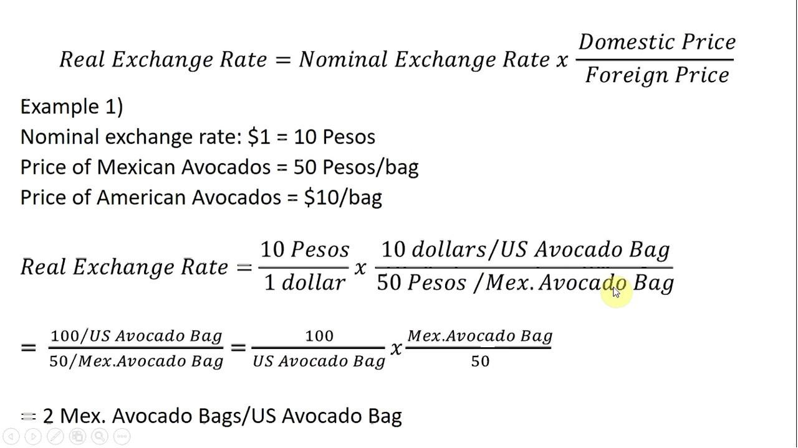

## Table of Contents

## What is the Real Effective Exchange Rate (REER)?

The Real Effective Exchange Rate (REER) is a measure that helps us understand how a country's currency is doing compared to other countries' currencies. It takes into account not just the exchange rates between currencies, but also the prices of goods and services in those countries. This makes REER a more complete picture of a currency's value because it considers both the exchange rate and the cost of living in different places.

REER is useful for figuring out if a country's products are becoming more or less competitive on the world market. If a country's REER goes up, it means its currency is getting stronger compared to others. This can make the country's exports more expensive and less attractive to foreign buyers. On the other hand, if the REER goes down, the currency is weaker, which can make exports cheaper and more competitive. Economists and policymakers use REER to make decisions about trade and economic policies.

## Why is the REER important for economies?

The Real Effective Exchange Rate (REER) is important for economies because it shows how competitive a country's products are in the global market. When a country's REER goes up, it means its currency is getting stronger compared to other countries. This can make the country's exports more expensive. If other countries find the products too pricey, they might buy less, which can hurt the economy. On the other hand, if the REER goes down, the currency gets weaker, making exports cheaper and possibly more attractive to foreign buyers. This can help boost the economy by increasing demand for the country's goods.

REER also helps policymakers make smart decisions about trade and economic policies. By looking at the REER, they can see if their currency is too strong or too weak and adjust their policies accordingly. For example, if the REER is too high, they might try to make their currency weaker to help their exports. If it's too low, they might want to strengthen their currency to make imports cheaper. Understanding the REER helps countries keep their economies balanced and healthy, which is good for everyone living there.

## How does the REER differ from the nominal effective exchange rate?

The Real Effective Exchange Rate (REER) and the Nominal Effective Exchange Rate (NEER) are both ways to measure how a country's currency is doing compared to other countries' currencies, but they look at different things. The NEER only looks at the exchange rates between currencies. It's a simple average of a country's currency against a basket of other currencies, without considering the price levels in those countries.

On the other hand, the REER goes a step further by taking into account not just the exchange rates, but also the price levels of goods and services in different countries. This makes the REER a more complete picture of a currency's value because it adjusts for inflation and other price changes. So, while the NEER gives you a basic idea of currency strength, the REER tells you how competitive a country's products are in the global market, considering both exchange rates and the cost of living.

## What are the main components needed to calculate the REER?

To calculate the Real Effective Exchange Rate (REER), you need two main things: the nominal exchange rates and the price levels of different countries. The nominal exchange rate is just how much one country's currency is worth compared to another country's currency. You take a bunch of these rates and average them to get what's called the Nominal Effective Exchange Rate (NEER). This part of the calculation is all about the exchange rates between currencies.

The second part involves looking at the price levels in different countries. This means checking how much things cost in each country. To do this, you use something called the Consumer Price Index (CPI) or another measure of inflation. You compare these price levels to see how much more or less expensive things are in one country compared to others. Once you have the NEER and the price level data, you combine them to adjust the NEER for these price differences. This gives you the REER, which shows how competitive a country's products are in the global market, taking into account both exchange rates and the cost of living.

## Can you explain the basic formula for calculating the REER?

The basic formula for calculating the Real Effective Exchange Rate (REER) is pretty straightforward but involves a few steps. First, you need to find the Nominal Effective Exchange Rate (NEER). This is done by taking the average of a country's currency against a basket of other currencies. Each currency in the basket is weighted based on how much trade the country does with the countries using those currencies. Once you have the NEER, you're halfway there.

The next step is to adjust the NEER for price differences between countries. You do this by using the Consumer Price Index (CPI) or another measure of inflation from the countries in the basket. You compare the CPI of your country to the CPI of the other countries to see how much more or less expensive things are. Then, you use these price differences to adjust the NEER. The formula for REER is basically NEER times the ratio of the foreign CPI to your country's CPI. This gives you the REER, which shows how competitive your country's products are in the global market, taking into account both exchange rates and the cost of living.

## How do trade weights factor into the REER calculation?

Trade weights are super important when figuring out the Real Effective Exchange Rate (REER). They help us decide how much each country's currency should matter in the calculation. Imagine you're mixing a smoothie and you need to know how much of each fruit to put in. Trade weights are like the recipe for your smoothie. They tell you to use more of the currency from countries you trade a lot with and less from countries you don't trade with as much. This way, the REER shows a more accurate picture of how your country's currency is doing compared to others, based on how much you actually trade with them.

When you calculate the REER, you start with the Nominal Effective Exchange Rate (NEER). This is just the average of your country's currency against a bunch of other currencies. But you don't treat all those currencies the same. You use trade weights to give more importance to the currencies of countries that you do a lot of business with. So, if you trade a lot with Japan, the Japanese yen will have a bigger say in your REER than, say, the currency of a country you hardly trade with at all. This makes the REER a better tool for understanding how competitive your country's products are in the world market because it reflects the real trade relationships your country has.

## What role does inflation play in adjusting the REER?

Inflation plays a big role in figuring out the Real Effective Exchange Rate (REER) because it helps us understand how prices are changing in different countries. When we calculate the REER, we start with the Nominal Effective Exchange Rate (NEER), which is just about how much one country's money is worth compared to other countries' money. But that's not enough because prices can go up or down over time. So, we use something called the Consumer Price Index (CPI) to see how much things cost in each country. The CPI is like a shopping list that tells us if prices are going up (inflation) or down (deflation).

Once we know the CPI for our country and the other countries, we can adjust the NEER to account for these price changes. If our country's prices are going up faster than in other countries, our currency might seem stronger than it really is, making our stuff more expensive for others to buy. By comparing our CPI to the CPI of other countries, we can make the NEER more accurate. This gives us the REER, which shows how competitive our products are in the world market, taking into account both the exchange rates and the cost of living. So, inflation is key because it helps us see the real value of our currency, not just the numbers on the exchange rate board.

## How frequently should the REER be calculated and why?

The Real Effective Exchange Rate (REER) should be calculated regularly, like every month or every quarter. This helps us keep up with changes in the economy. Since exchange rates and prices can change quickly, looking at the REER often gives us a good picture of how competitive a country's products are in the world market at any given time.

Calculating the REER frequently is important because it helps policymakers make smart decisions. If they see the REER going up or down a lot, they might need to change their economic policies to keep things balanced. For example, if the REER is too high, making exports expensive, they might try to make the currency weaker to help businesses sell more abroad. So, keeping an eye on the REER regularly helps keep the economy healthy and competitive.

## What are some common methods used to adjust for price level differences in REER?

To adjust for price level differences when calculating the Real Effective Exchange Rate (REER), one common method is using the Consumer Price Index (CPI). The CPI is like a shopping list that shows how much prices have changed over time. By comparing the CPI of your country to the CPI of other countries, you can see if things are getting more or less expensive in your country compared to others. This helps adjust the Nominal Effective Exchange Rate (NEER) to account for inflation, giving you a better idea of how competitive your country's products are in the global market.

Another method is using the Producer Price Index (PPI), which looks at the prices businesses pay for goods and services they use to make their products. The PPI can be useful because it focuses on the costs of production, which can directly affect how much things cost to make and sell. By comparing the PPI across countries, you can adjust the NEER to reflect these production costs, making the REER more accurate. Both the CPI and PPI help make sure the REER shows a true picture of currency value, considering how prices are changing in different places.

## How can changes in the REER affect a country's competitiveness?

When the Real Effective Exchange Rate (REER) changes, it can really affect how well a country's products do in the world market. If the REER goes up, it means the country's currency is getting stronger compared to other countries. This can make the country's exports more expensive. When things cost more, other countries might buy less of them. This can hurt businesses that sell stuff abroad because they might not make as much money. So, a higher REER can make a country's products less competitive.

On the other hand, if the REER goes down, the country's currency gets weaker. This makes exports cheaper for other countries to buy. When things are cheaper, more people might want to buy them, which can help businesses sell more and make more money. A lower REER can make a country's products more competitive in the global market. This is why countries keep an eye on their REER and sometimes try to change it to help their economy.

## What are the limitations and criticisms of using the REER as an economic indicator?

While the Real Effective Exchange Rate (REER) is a useful tool, it has some limitations. One big problem is that it can be hard to get accurate and up-to-date information on prices and exchange rates from all the countries you need to compare. If the data isn't right, the REER won't give a true picture of how competitive a country's products are. Also, the REER uses trade weights to figure out how important each country's currency is, but these weights can change over time. If they don't get updated often enough, the REER might not reflect the real trade relationships between countries.

Another criticism of the REER is that it doesn't always show the whole story about a country's competitiveness. For example, it might not take into account things like how good a country's products are, how much it costs to make them, or how well the country can get its products to other places. These things can be just as important as the price and exchange rate when it comes to selling stuff abroad. So, while the REER can give a good idea of how a country's currency is doing, it's not perfect and should be used with other measures to get a full picture of an economy's health.

## How do advanced statistical methods enhance the accuracy of REER calculations?

Advanced statistical methods can make the Real Effective Exchange Rate (REER) calculations more accurate by helping to deal with the tricky parts of the data. For example, these methods can smooth out short-term changes in exchange rates and prices that might not show the real long-term trends. They can also help figure out the best trade weights to use, which are super important because they show how much each country's currency matters in the calculation. By using fancy math, these methods can make sure the REER reflects the real trade relationships between countries more accurately.

Another way advanced statistical methods help is by dealing with missing or not-so-great data. Sometimes, it's hard to get all the information you need from every country, and the data might not be up to date. These methods can fill in the gaps and make the best guesses about what the missing numbers might be. This makes the REER more reliable because it's based on a fuller set of data. So, by using these smart math tricks, we can get a better idea of how competitive a country's products are in the world market.

## What is the REER Formula and how is it understood?

The Real Effective Exchange Rate (REER) formula involves a comprehensive calculation that reflects a country's currency value against a basket of currencies from its trading partners, adjusted for inflation. The formula is designed to provide a real measure of currency strength rather than a nominal one, offering a more nuanced insight into trade competitiveness and economic standing.

**Mathematical Representation:**

The REER is computed by taking a weighted average of the real exchange rates between the home country and its partners. The general formula is as follows:

$$

\text{REER} = \prod_{i=1}^n \left(\frac{E_i \times P}{P_i}\right)^{w_i} 
$$

Where:
- $E_i$ is the nominal exchange rate between the domestic currency and currency $i$.
- $P$ is the price level (typically a consumer price index) in the home country.
- $P_i$ is the price level in country $i$.
- $w_i$ is the trade weight of country $i$, indicating the significance of that country in the home country's trade portfolio.
- $n$ represents the number of trading partner countries.

**Components Breakdown:**

1. **Nominal Exchange Rate Adjustments ($E_i$):** Each bilateral exchange rate reflects the value of one currency relative to another. The nominal rates are adjusted to real rates by accounting for price level differences, ensuring that the analysis reflects genuine purchasing power.

2. **Inflation Differentials ($\frac{P}{P_i}$):** By incorporating the price levels of the domestic and foreign countries, the formula eliminates the effects of inflation, offering a 'real' exchange rate. This adjustment is crucial for comparing purchasing powers and understanding the actual competitiveness of goods in different markets.

3. **Trade Weights ($w_i$):** Weights are assigned based on the proportion of trade with each partner, reflecting the relative importance of each partner in the home country's economy. This weighted average ensures that more significant trading relationships have a larger impact on the REER.

Understanding the REER involves recognizing how these components interact to provide a clearer picture of exchange rates beyond nominal values. The calculation is critical for economic analysis, allowing policymakers and financial analysts to assess how inflation and trade relations impact a country's currency value and competitiveness on the global stage. This nuanced approach makes REER a valuable tool for understanding currency health beyond mere exchange rate fluctuations.

## How do you calculate REER: A Step-by-Step Guide?

Calculating the Real Effective Exchange Rate (REER) involves multiple steps, incorporating various factors like bilateral exchange rates, trade weights, and inflation differentials. Here’s a simplified but comprehensive guide to understanding this calculation.

### Step-by-Step Calculation Process

1. **Determine Trade Weights:**
   Each trading partner's weight is determined based on the significance of the trade relationship. If Country A trades predominantly with Countries B and C, the trade weights $w_B$ and $w_C$ would be calculated as follows:
$$
   w_B = \frac{\text{Trade with Country B}}{\text{Total Trade}}

$$
$$
   w_C = \frac{\text{Trade with Country C}}{\text{Total Trade}}

$$

   **Example:** If Country A trades $60 million with Country B and $40 million with Country C out of a total trade of $100 million, then $w_B = 0.6$ and $w_C = 0.4$.

2. **Adjust for Inflation:**
   Adjust each exchange rate by the respective inflation rates to reflect the real purchasing power. The inflation-adjusted exchange rate between two countries can be modeled using:
$$
   R_{AB} = E_{AB} \times \frac{P_B}{P_A}

$$
   Where $R_{AB}$ represents the real exchange rate, $E_{AB}$ is the nominal exchange rate, and $P_A$ and $P_B$ are the price levels in Country A and Country B, respectively.

   **Example:** Suppose the nominal exchange rate $E_{AB}$ is 1.5, with inflation rates leading to $P_A = 1.02$ and $P_B = 1.03$.

3. **Calculate Bilateral Real Exchange Rates:**
   For each trading partner, calculate the bilateral real exchange rate using the formula from Step 2.

4. **Compute the REER:**
   The REER is a weighted average of the bilateral real exchange rates. The formula is given by:
$$
   \text{REER} = \prod_{i=1}^{n} (R_{Ai})^{w_i}

$$
   Where $R_{Ai}$ indicates the adjusted real exchange rate between Country A and each trading partner, and $w_i$ represents the trade weight.

   **Example:** Given $R_{AB} = 1.51$ and $R_{AC} = 1.02$, where $w_B = 0.6$ and $w_C = 0.4$:
$$
   \text{REER} = (1.51)^{0.6} \times (1.02)^{0.4} \approx 1.32

$$

### Interpretation of Results

The resulting REER value provides insights into a country's trade competitiveness. A REER value above the benchmark (often set as 100 or 1 for comparative analysis) indicates a loss in trade competitiveness due to a strong currency making exports more expensive and imports cheaper. Conversely, a REER below the benchmark suggests improved competitiveness, highlighting a weaker currency that makes exports cheaper and imports more expensive.

In the example provided, if the calculated REER is 1.32, it indicates that Country A’s trade competitiveness might be declining as its currency is stronger relative to its trading partners after adjusting for inflation differentials.

In summary, the REER is a crucial indicator that can highlight shifts in a country's economic landscape, assisting policymakers and economists in assessing trade strategies and economic policies effectively.

## What is the difference between REER and Spot Exchange Rate?

The Real Effective Exchange Rate (REER) and the spot exchange rate serve distinct purposes in financial markets and macroeconomic policy, offering different insights into currency valuation.

A spot exchange rate represents the current price at which one currency can be immediately exchanged for another. It reflects the prevailing demand and supply conditions for a currency pair, capturing market sentiment and geopolitical events, which can cause rapid fluctuations. Traders and investors utilize spot rates for immediate transactions, making them crucial for short-term financial decisions, foreign exchange trading, and [arbitrage](/wiki/arbitrage). For instance, if an import-export business needs to settle transactions swiftly, spot rates serve as the go-to measure.

In contrast, the REER presents a more comprehensive economic assessment by considering a currency’s value against a basket of foreign currencies from the country's significant trading partners. The REER adjusts spot exchange rates by the relative price indices or inflation rates, providing a "real" measure of currency competitiveness over time. The formula for REER is usually expressed as:

$$
\text{REER} = \left( \prod_{i=1}^{n} \left( \frac{E_i}{P \times P_i^*} \right)^{w_i} \right) \times 100
$$

where $E_i$ is the nominal exchange rate with trade partner $i$, $P$ is the domestic price level, $P_i^*$ is the international price level of partner $i$, and $w_i$ is the trade weight corresponding to partner $i$. This formula integrates multiple bilateral rates and inflation differentials, providing a weighted average exchange rate that reflects trade relations and price competitiveness.

The REER's broader focus makes it vital for long-term macroeconomic analysis and policy-making. It helps determine a country's trade competitiveness, inflationary pressures, and potential adjustments needed in exchange rate policies. For instance, a rise in the REER might indicate a loss of competitiveness due to an appreciated currency, prompting policymakers to consider interventions.

In the financial markets, while spot rates are instrumental for executing trades, the REER assists in understanding underlying economic trends and forecasting currency movements. Both metrics are integral, with the spot exchange rate providing immediate actionable data for traders, and the REER offering strategic insights into a country's economic health, essential for shaping monetary and fiscal policies.

Overall, the REER and spot exchange rate, though interconnected, cater to varied analytical needs, from offering instant trading quotes to forming the backbone of comprehensive economic evaluations.

## References & Further Reading

[1]: Turner, P., Van't dack, J., & International Monetary Fund. (1993). ["Measuring international price and cost competitiveness."](https://www.bis.org/publ/econ39.htm) Finance & Development, 93(007).

[2]: MacDonald, R. (2000). ["Concepts to calculate equilibrium exchange rates: An overview."](https://papers.ssrn.com/sol3/papers.cfm?abstract_id=2785109) Economic Papers, 20(4), 392-435.

[3]: Biswas, R. (2012). ["Exchange Rate Regimes and the Real Effective Exchange Rate."](https://direct.mit.edu/books/monograph/2536/Exchange-Rate-RegimesChoices-and-Consequences) An Economic Journal, 23(11), 3-15. 

[4]: ["Real Effective Exchange Rates for 178 Countries: A New Database"](https://www.bruegel.org/publications/datasets/real-effective-exchange-rates-for-178-countries-a-new-database) by Franziska L. B. Bordon, Franziska Stoeckli, and Yasin Kursat Onder.

[5]: ["Exchange Rate Determination: Models and Strategies for Exchange Rate Forecasting"](https://archive.org/details/exchangeratedete0000rose) by Michael Rosenberg.